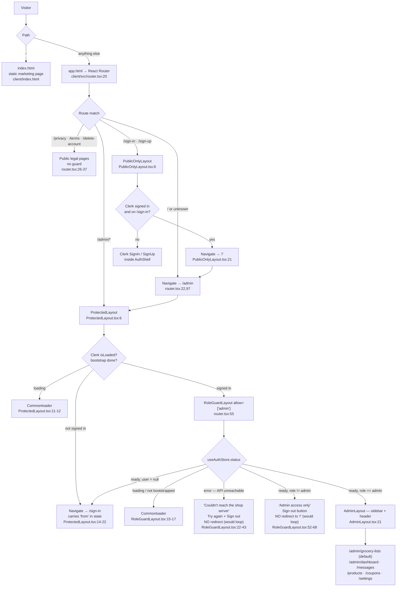

# sKirana admin web app — developer reference

Everything in this document is traceable to code. Paths are relative to the
repo root (the folder holding `client/`, `server/`, `mobile/`, `docs/`).
Anything I could not verify from code is marked **[unverified]**.

---

## 1. Orientation — what this app is

`client/` is a **React 19 + Vite single-page app** whose only live purpose is
the **shopkeeper's admin panel**. It also ships a small, plain-HTML public
homepage and two public legal pages.

It was grown out of a generic MERN e-commerce template, and a large amount of
that template is still on disk. The router is the authority on what is alive:

```
client/src/router.tsx:20-101
```

Everything the router can reach:

| Path | Element | Guarded by | Alive? |
|---|---|---|---|
| `/` | `<Navigate to="/admin">` | — | yes (`router.tsx:22-24`) |
| `/privacy` | `PrivacyPage` | none | yes (`router.tsx:26-29`) |
| `/terms` | `PrivacyPage` (same component) | none | yes (`router.tsx:30-33`) |
| `/delete-account` | `DeleteAccountPage` | none | yes (`router.tsx:34-37`) |
| `/sign-in/*` | Clerk `<SignIn>` | `PublicOnlyLayout` | yes (`router.tsx:41-44`) |
| `/sign-up/*` | Clerk `<SignUp>` | `PublicOnlyLayout` | yes (`router.tsx:45-48`) |
| `/admin` | redirect → `/admin/grocery-lists` | Protected + RoleGuard | yes (`router.tsx:61-66`) |
| `/admin/grocery-lists` | `GroceryLists` | Protected + RoleGuard | yes (`router.tsx:79-82`) |
| `/admin/dashboard` | `Dashboard` | ″ | yes (`router.tsx:67-70`) |
| `/admin/messages` | `Messages` | ″ | yes (`router.tsx:83-86`) |
| `/admin/products` | `Products` | ″ | yes (`router.tsx:71-74`) |
| `/admin/coupons` | `Promos` | ″ | yes (`router.tsx:75-78`) |
| `/admin/settings` | `Settings` (home banners) | ″ | yes (`router.tsx:87-90`) |
| `*` | `<Navigate to="/admin">` | — | yes (`router.tsx:97-100`) |

### Dead weight (compiled, shipped, never reachable)

These files still typecheck and are bundled, but **no route renders them**.
Verified by grepping every import of them outside their own directories — the
only hit is the file's own declaration:

- **The whole customer storefront**: `client/src/pages/customer/*` (Home,
  Collections, Collection-Details, Order-Sucess) and
  `client/src/components/customer/**` (cart drawer, navbars, product cards,
  wishlist, profile, filters). `client/src/components/layout/CustomerLayout.tsx:4`
  is exported and imported by nothing.
- **`client/src/features/customer/**`** — carts, wishlist, Razorpay checkout,
  guest-cart `localStorage` (`client/src/features/customer/cart-and-checkout/store.ts:130-152`).
  Customers use the Expo mobile app instead; the panel itself says so
  (`client/src/components/auth/RoleGuardLayout.tsx:58-62`,
  `client/src/components/auth/AuthShell.tsx:49-50`).
- **`client/src/pages/admin/Orders.tsx`** — a complete legacy-order table with
  placed/shipped/delivered statuses. It is **not imported by `router.tsx`** and
  there is **no sidebar entry** for it (`client/src/components/admin/common/sidebar.tsx:21-28`).
  Its backend (`GET /admin/orders`, `PATCH /admin/orders/:orderId/status`) is
  still mounted (`server/src/server.ts:93`, `server/src/routes/admin/orders.routes.ts:38,69`),
  so re-adding the route would work — but nothing produces those `Order`
  documents any more.
- **`client/src/features/admin/products/constants.ts:14-16`** says this in as
  many words: `SIZE_OPTIONS` is "Legacy (cloth era): only referenced by the old,
  no-longer-routed customer web pages."
- **The Razorpay checkout script** is still loaded on every admin page
  (`client/app.html:8-11`). The only code that touches `window.Razorpay` is the
  dead customer cart store (`client/src/features/customer/cart-and-checkout/store.ts:97-115`).

### Partly-legacy, still routed

- **`/admin/coupons` (Promos)** and **`/admin/products`** are live pages with
  live server routes, but the *mobile* app's core flow is "customer writes a
  free-text grocery list; shop prices it", which never consults a Product or a
  Promo. Products/categories do feed the mobile app's Shop tab and the banner
  link picker (`client/src/components/admin/settings/banner-edit-dialog.tsx:22`),
  so products are not dead — coupons have no consumer I could find in this repo
  **[unverified: whether the mobile app applies promo codes]**.
- **`/admin/dashboard`** is live, and its numbers come from grocery lists, not
  legacy orders — the server comment says "Orders are grocery lists now"
  (`server/src/routes/admin/dashboard.routes.ts:21-22`).

**The one screen that matters daily is `/admin/grocery-lists`.** The router
redirects `/admin` straight to it with the comment "Grocery lists is the shop's
most-used page" (`client/src/router.tsx:62-65`).

---

## 2. The two-page setup: homepage vs SPA

There are **two HTML entry points**, built as two Vite inputs:

```ts
// client/vite.config.ts:48-56
build: {
  rolldownOptions: {
    input: {
      home: path.resolve(__dirname, "index.html"),
      app:  path.resolve(__dirname, "app.html"),
    },
  },
}
```

- **`client/index.html`** — a hand-written, **zero-JavaScript** marketing
  homepage (362 lines, all CSS inline). The comment explains why: "this page
  must load fast on any phone and be readable by crawlers (Google's app
  verification reads it) without running the admin panel's JavaScript"
  (`client/index.html:25-27`). It links to the Play Store listing
  (`client/index.html:216`), `/privacy`, `/terms`, `/delete-account`, and
  `/admin` labelled **"Shop login"** (`client/index.html:353-357`).
- **`client/app.html`** — the React shell: `<div id="root">` plus
  `/src/main.tsx` (`client/app.html:13-15`), title "sKirana Admin"
  (`client/app.html:7`).

### Rewrites

Production (Vercel):

```json
// client/vercel.json:2
{ "rewrites": [{ "source": "/(.*)", "destination": "/app.html" }] }
```

Vercel applies `rewrites` **after** the static-file check, which is why `/`
still serves the built `index.html` and only unmatched paths fall through to
`app.html`. Dev server and `vite preview` don't do that on their own, so
`vite.config.ts` adds a middleware plugin that mimics it
(`client/vite.config.ts:12-38`); it explicitly exempts `/` and `/index.html`
(`:16`) and anything with a file extension or a Vite internal prefix (`:17-21`).

### What a visitor actually gets

| URL | Served | Then |
|---|---|---|
| `skirana.com/` | static `index.html` | plain marketing page, no React |
| `skirana.com/app` | rewritten to `app.html` | React boots, no route matches `/app`, the `*` catch-all sends you to `/admin` (`client/src/router.tsx:97-100`) → sign-in if signed out |
| `skirana.com/admin` | rewritten to `app.html` | the panel (or sign-in) |
| `skirana.com/privacy` | rewritten to `app.html` | React renders `PrivacyPage` |
| `skirana.com/anything-else` | rewritten to `app.html` | catch-all → `/admin` |

So **`/app` is not a meaningful URL** — it is just the build artifact's name.
The app's front door is `/admin`.

---

## 3. Routing and guards



### How the role check works

1. `App` calls `useBootstrapAuth()` once at mount
   (`client/src/App.tsx:6`, `client/src/features/auth/useBootstrapAuth.ts:7`).
2. It installs a token getter so every axios request carries the Clerk JWT
   (`client/src/features/auth/useBootstrapAuth.ts:11-16`,
   `client/src/lib/api.ts:16-27`).
3. When Clerk reports signed in, it calls `POST /auth/sync` then `GET /auth/me`
   and stores the returned `AppUser` (with its `role`) in a zustand store
   (`client/src/features/auth/useBootstrapAuth.ts:28-38`,
   `client/src/features/auth/api.ts:4-10`,
   `client/src/features/auth/store.ts:18-47`).
4. `RoleGuardLayout` reads only that store — never Clerk metadata
   (`client/src/components/auth/RoleGuardLayout.tsx:13`).

**When the API is unreachable** the store lands in `status === "error"`
(`client/src/features/auth/store.ts:35-40`) and the guard renders a dedicated
error screen rather than redirecting. The code says why:

> "Signed in with Clerk, but our server couldn't load the account (it's down,
> or it blocked this site's address). Sending them to /sign-in here would loop:
> that page sees a signed-in user and sends them straight back."
> — `client/src/components/auth/RoleGuardLayout.tsx:19-22`

The same reasoning guards the non-admin case
(`client/src/components/auth/RoleGuardLayout.tsx:49-51`): `/` now points at
`/admin`, so redirecting there would bounce back into the guard forever.

---

## 4. Auth

**Clerk** is mounted at the React root, outside the router:

```tsx
// client/src/main.tsx:11-18
<ClerkProvider
  publishableKey={import.meta.env.VITE_CLERK_PUBLISHABLE_KEY!}
  afterSignOutUrl="/sign-in"
  appearance={clerkAppearance}
>
```

`afterSignOutUrl="/sign-in"` is deliberate — `/` is the static marketing page,
so signing out would otherwise leave the panel entirely
(`client/src/main.tsx:9-10`).

- **Sign-in / sign-up pages** are Clerk's own `<SignIn>` / `<SignUp>` wrapped in
  a brand frame (`client/src/pages/auth/Sign-in.tsx:1-9`,
  `client/src/pages/auth/Sign-up.tsx:1-9`).
- **`AuthShell`** (`client/src/components/auth/AuthShell.tsx:12-72`) is that
  frame: a teal panel on `lg+` with three selling points
  (`:4-8`), the logo, a "For shop staff only. Customers use the sKirana mobile
  app." footnote (`:49`), and a "Back to skirana.com" link (`:64-70`).
  Note those links point at `/`, i.e. the static homepage, not the SPA.
- **Appearance** is set in code, not the Clerk dashboard, "so the development
  and production instances always look the same"
  (`client/src/lib/clerk-appearance.ts:1-7`). It pins brand colours
  (`:9-22`), logo and legal URLs under `options` (`:23-31`), and patches four
  Clerk elements (`:34-45`) — including a note that the admin theme sets
  `--radius: 0`, so every radius there is an explicit pixel value (`:32-33`).
- **`UserButton`** (Clerk's account menu) sits in the admin header
  (`client/src/components/layout/AdminLayout.tsx:64`).

### Admin rights are granted by the server, not the client

The client never decides. `POST /auth/sync` runs the decision:

```ts
// server/src/services/user-sync.ts:31-38
function adminEmails() {
  return new Set((process.env.ADMIN_EMAILS || "").split(",")
    .map(item => item.trim().toLowerCase()).filter(Boolean));
}
```

```ts
// server/src/services/user-sync.ts:68-70
const shouldBeAdmin = identity.email ? adminEmails().has(identity.email) : false;
```

The role is written in three places — new user
(`server/src/services/user-sync.ts:126`), existing user promoted
(`:92-95`), re-linked user (`:111`). **It promotes but never demotes**: removing
an address from `ADMIN_EMAILS` does not take admin away from an existing record
(`server/src/services/user-sync.ts:92-95`).

Every `/admin/*` request is independently gated server-side by `requireAdmin`
(`server/src/middleware/auth.ts:39-49`), which re-syncs the DB user if missing
(`server/src/middleware/auth.ts:20-34`). So the client guard is UX only — the
real enforcement is `server/src/middleware/auth.ts:46-48`
(`403 "Admin access only"`).

`ADMIN_EMAILS` is set on the Vercel **server** project
(`docs/PRODUCTION-SETUP.md:55`).

---

## 5. The admin pages

Shell for all of them: `AdminLayout` — a `280px` sidebar on `lg+`
(`client/src/components/admin/common/sidebar.tsx:30-31,77-89`), a slide-over
`Sheet` below `lg` (`client/src/components/layout/AdminLayout.tsx:33-55`), and a
sticky header holding `AdminPushBell` + Clerk's `UserButton`
(`client/src/components/layout/AdminLayout.tsx:62-65`). Nav order is
deliberately "grocery lists first"
(`client/src/components/admin/common/sidebar.tsx:19-28`).

All API calls go through `client/src/lib/api.ts`, which unwraps the server's
`{ status, data, errors }` envelope and throws `errors[0].message`
(`client/src/lib/api.ts:43-124`, envelope type at `client/src/lib/types.ts:16-21`).
Base URL: `VITE_BACKEND_URL`, defaulting to `http://localhost:5000`
(`client/src/lib/env.ts:2`).

---

### 5.1 Grocery lists — `/admin/grocery-lists` (the daily screen)

Page: `client/src/pages/admin/GroceryLists.tsx`.
Card: `client/src/components/admin/grocery-lists/grocery-list-card.tsx`.
Hook: `client/src/features/admin/grocery-lists/use-admin-grocery-lists.ts`.

#### Page-level controls

- **Status tabs** — Active / Completed / Cancelled with counts
  (`client/src/pages/admin/GroceryLists.tsx:44-83`). "Active" means
  `received · priced · packing · packed · ready`
  (`client/src/features/admin/grocery-lists/use-admin-grocery-lists.ts:24-28`).
- **"Payment received?" amount matcher** — the shopkeeper types the rupee amount
  they just got on UPI and the list narrows to **unpaid** orders whose total
  rounds to that amount (`client/src/pages/admin/GroceryLists.tsx:85-118`, filter
  at `use-admin-grocery-lists.ts:88-97`, helper count at `:127-135`).
- **Search** by code, customer name, email or phone
  (`client/src/pages/admin/GroceryLists.tsx:120-125`, filter at
  `use-admin-grocery-lists.ts:99-108`).

#### The card, in detail

**Header** (`grocery-list-card.tsx:233-287`): `List #<code> — <customerName>`,
a tappable `tel:` link for the phone (`:238-248`), email, item count, the
`updatedAt ?? createdAt` timestamp, and — when the list was edited on a later
day — a "first sent" line (`:256-262`). On the right: a status badge
(`:266`, labels at `:43-51`), a payment badge shown only once priced
(`:267-275`), and **Share** (`:276-285`).

**Pricing.** Each item row has two number inputs
(`grocery-list-card.tsx:449-479`):

- **Rate** (price per unit). Typing here auto-fills the line total as
  `round(rate × leadingNumberOf(quantity))`, falling back to `×1` when the
  free-text quantity has no number
  (`use-admin-grocery-lists.ts:166-177`).
- **Total** (the line price), editable directly
  (`use-admin-grocery-lists.ts:145-154`).
- A **calculator popover** per row
  (`client/src/components/admin/grocery-lists/price-calculator.tsx`). It is a
  hand-written precedence parser, *not* `eval`
  (`price-calculator.tsx:12-52`), and it pre-seeds the expression with the
  quantity's leading number plus `×` — "9 items at ₹30 → opens as `9×`, type 30
  → 270" (`price-calculator.tsx:59-65`, seeding at `:99-105`).

Drafts live **only in the hook**, keyed by list id
(`use-admin-grocery-lists.ts:30-31,42-44`), seeded from whatever the server
already holds (`:138-143`, `:157-162`). Because `getDraft` prefers the draft
over the server value, the 15-second poll does not clobber half-typed prices.
The running total is the sum of the drafts (`:179-184`), rendered at
`grocery-list-card.tsx:569-572`.

**Per-item availability.** "Out of stock" / "Restore" toggles immediately
against the server (`grocery-list-card.tsx:495-512` →
`use-admin-grocery-lists.ts:288-305` → `PATCH .../items/:index/availability`).
Unavailable rows hide their price inputs and show "Out of stock"
(`grocery-list-card.tsx:444-448`); the server forces such a line to price 0
(`server/src/routes/admin/grocery-list.routes.ts:169`) and pushes the customer,
but only when marking *unavailable*
(`server/src/routes/admin/grocery-list.routes.ts:358-366`).

**Adding / editing items.** The shop can add an item the customer mentioned
later (`grocery-list-card.tsx:526-565`) and edit an existing name/quantity
inline (`:332-383`). Both strip characters outside a Unicode allowlist that
keeps Devanagari matras — `\p{M}` is included on purpose
(`grocery-list-card.tsx:20-28`), mirroring the server allowlist. Minimum name
length 2 (`:25`, enforced `:126,132`).

**Packing checklist — localStorage only.** Each item has a tick box; ticked
items go line-through and a counter shows `n/total packed` / "✓ All packed"
(`grocery-list-card.tsx:292-308,328,386-405`). State is a `Set<number>` stored
under `grocery-packed:<listId>`
(`grocery-list-card.tsx:144-166`). The comment is explicit that this is "a
personal packing aid on the shop's own device". **It never reaches the server,
so it is invisible on any other device or browser, and a `localStorage` failure
is swallowed silently (`:161-164`).**

**Hindi + English toggle.** A per-card switch fetches both the Hindi and the
English form of every item name and shows them inline after the original
(`grocery-list-card.tsx:178-204,310-324,417-435`). Translation is
dictionary-free, via Google's free translate endpoint called straight from the
browser, memoised in a module-level `Map`, and falls back to the original text
on any failure (`client/src/lib/translate.ts:13-48`). When the toggle is on,
Share uses the translated names too (`grocery-list-card.tsx:208-221`).

**Status flow buttons** (`grocery-list-card.tsx:56-78,574-621`):

```
(received) --Send prices--> priced --> packing --> packed --> ready --> completed
```

- The primary button reads **"Send prices to customer"** before pricing and
  **"Update prices"** after (`:575-577`; `isPriced = totalAmount > 0` at `:137`).
- **Only the immediate next step is clickable** — earlier steps render as
  `✓ <label>` and later steps are disabled (`:589-608`). The comment explains
  that this replaced buttons that "looked like they toggled" (`:53-55`).
- **Mark as paid** appears only when priced and unpaid (`:579-587`).
- **Cancel order** is available at any non-closed stage, including an unpriced
  `received` list (`:610-620`).
- `completed` and `cancelled` are terminal — `isClosed` disables pricing, item
  add and the flow (`:227`).

**Chat.** Every card embeds `GroceryListChat`
(`grocery-list-card.tsx:623-626`). Collapsed by default; opening it loads
messages and starts a **5-second** poll that stops on close
(`grocery-list-chat.tsx:15,57-63`). Sending clears the input optimistically and
restores the text plus a toast if the send fails
(`grocery-list-chat.tsx:73-90`). Scroll is pinned to the bottom of the chat box
only — a note records that the old `scrollIntoView` "scrolled the whole admin
page on every 5s poll" (`grocery-list-chat.tsx:65-71`).

**Share.** `navigator.share` where available, else `wa.me` with the text
pre-filled (`client/src/lib/share-list.ts:38-59`). The message is
`🛒 Order #code`, customer line, numbered items with quantity and price, and the
total (`client/src/lib/share-list.ts:7-33`).

#### API calls made by this page

All under `client/src/features/admin/grocery-lists/api.ts`:

| Client fn | Request | Server |
|---|---|---|
| `getAdminGroceryLists` (`:12-14`) | `GET /admin/grocery-lists` | `server/src/routes/admin/grocery-list.routes.ts:116` |
| `setAdminGroceryListPrices` (`:16-24`) | `PATCH /admin/grocery-lists/:id/prices` | `…:129` |
| `updateAdminGroceryListStatus` (`:26-34`) | `PATCH …/status` | `…:213` |
| `markAdminGroceryListPaid` (`:36-40`) | `PATCH …/mark-paid` | `…:271` |
| `setAdminGroceryListItemAvailability` (`:42-51`) | `PATCH …/items/:index/availability` | `…:320` |
| `updateAdminGroceryListItem` (`:53-62`) | `PATCH …/items/:index` | `…:375` |
| `addAdminGroceryListItem` (`:64-72`) | `POST …/items` | `…:427` |
| `getAdminConversations` (`:74-78`) | `GET /admin/grocery-lists/conversations` | `…:484` |
| `getAdminGroceryListMessages` (`:80-84`) | `GET …/messages` | `…:537` |
| `sendAdminGroceryListMessage` (`:86-91`) | `POST …/messages` | `…:556` |

Every mutating call returns the **full refreshed list array**, which the hook
substitutes wholesale — there is no per-item patching
(`use-admin-grocery-lists.ts:200,225,257,271,282,301`).

---

### 5.2 Products — `/admin/products`

Page `client/src/pages/admin/Products.tsx`; hook
`client/src/features/admin/products/use-admin-products.ts`.

- Table of products with cover image, title, brand, category, unit, status,
  stock (`client/src/components/admin/products/products-table.tsx:50-58`); cover
  picked by `isCover` else first image
  (`client/src/features/admin/products/use-product-form.ts:34-36`).
- Search is **server-side and debounced 250 ms**
  (`use-admin-products.ts:55-61` → `GET /admin/products?search=…`,
  `client/src/features/admin/products/api.ts:59-65`).
- **Product dialog** (`client/src/components/admin/products/product-dialog.tsx`)
  drives `useProductForm`: create, update, delete, images, cover selection
  (`use-product-form.ts:56-234`). Validation mirrors the server and runs
  client-side first (`:132-142`). Delete is behind a `window.confirm`
  (`:202-206`).
- Products and categories are sent as **multipart form-data**
  (`client/src/features/admin/products/api.ts:71-115` and `:18-30`).
- **Categories** are managed in a separate dialog, with its own search filter,
  inline edit, and delete-with-confirm
  (`client/src/components/admin/products/category-dialog.tsx:53-303`). The
  server refuses to delete a category that still has products, and the dialog
  surfaces that message verbatim (`category-dialog.tsx:144-147`).
- **Image picker** offers "Choose from gallery" and "Take photo" with
  `capture="environment"`, which opens the rear camera directly on a phone
  (`client/src/components/admin/products/image-picker.tsx:87-101`). Object URLs
  are revoked on unmount (`:62-66`).

API: `GET/POST /admin/categories`, `PUT/DELETE /admin/categories/:id`,
`GET /admin/products[?search]`, `GET /admin/products/:id`,
`POST /admin/products`, `PUT /admin/products/:id`,
`DELETE /admin/products/:id` (`client/src/features/admin/products/api.ts:12-119`).

Local-only state: the debounce timer, dialog open flags, and `editingProduct`
(`use-admin-products.ts:6-12`).

---

### 5.3 Coupons / Promos — `/admin/coupons`

Page `client/src/pages/admin/Promos.tsx`; hook
`client/src/features/admin/promo/use-admin-promo.ts`.

- Table of code, percentage, count, minimum order value, start/end
  (`client/src/features/admin/promo/types.ts:1-10`,
  `client/src/components/admin/promos/promos-table.tsx`).
- Search is **client-side**, on `code` only
  (`use-admin-promo.ts:34-40`).
- Create/edit through `PromoDialog`; delete behind `window.confirm`
  (`use-admin-promo.ts:72-85`) — note the confirm text has a typo, "Are you want
  to delete this promo" (`use-admin-promo.ts:73`).
- API: `GET/POST /admin/promos`, `PATCH /admin/promos/:id`,
  `DELETE /admin/promos/:id` (`client/src/features/admin/promo/api.ts:4-21`).
  Every mutation returns the full list and replaces state (`use-admin-promo.ts:65,81`).

No polling. Nav label is "Coupons", page title is "Promos"
(`client/src/components/admin/common/sidebar.tsx:26` vs
`client/src/pages/admin/Promos.tsx:37`).

---

### 5.4 Home banners — `/admin/settings`

Page `client/src/pages/admin/Settings.tsx`; hook
`client/src/features/admin/settings/use-admin-banners.ts`.

This controls the picture strip at the top of the **mobile app's** Home screen
(`client/src/pages/admin/Settings.tsx:15-17`).

- **Uploader** (`client/src/components/admin/settings/banner-uploader.tsx`):
  drag-and-drop or click, up to 10 files (`:21`). Each file is inspected
  client-side before upload — wrong type or over 5 MB is a blocking error
  (`:36-41`), wrong aspect ratio or width under 1000 px is only a warning
  because "the app crops to fit" (`:42-50`). Target shape is
  `1600 × 736` (`client/src/features/admin/settings/banner-status.ts:4-8`).
- **Status computation** is local and mirrors what the app will show:
  `hidden | scheduled | ended | live | overLimit`, where "live beyond the
  carousel limit" is reported as `overLimit`
  (`client/src/features/admin/settings/banner-status.ts:12-21`). The header
  summarises live / hidden / scheduled counts
  (`client/src/pages/admin/Settings.tsx:23-27,39-45`).
- **Reorder** is the one optimistic mutation in the app: the swap is applied
  locally, then sent; on failure the previous order is restored
  (`use-admin-banners.ts:88-107`).
- **Edit dialog** sets title, link target and a schedule. Link types are
  `none | writeList | shop | category | product`
  (`client/src/features/admin/settings/types.ts:2`); picking a product runs a
  **300 ms debounced** `GET /admin/products?search=` and shows the top 8
  (`client/src/components/admin/settings/banner-edit-dialog.tsx:48-66`).
  `datetime-local` values are converted to/from ISO
  (`banner-status.ts:56-65`).
- **Phone preview** renders the live banners as the app would
  (`client/src/components/admin/settings/banner-phone-preview.tsx`).
- API (`client/src/features/admin/settings/api.ts:4-26`):
  `GET/POST /admin/settings/banners`, `PUT /admin/settings/banners/order`,
  `PATCH /admin/settings/banners/:id`, `DELETE /admin/settings/banners/:id`
  — server at `server/src/routes/admin/settings.routes.ts:178-295`.
- The carousel `limit` comes from the server on every response
  (`HOME_BANNER_LIMIT = 8`, `server/src/models/Banner.ts:73`), with `8` as the
  client fallback (`use-admin-banners.ts:13,31-33`). **The server does not
  enforce that limit on insert** — it is advisory, which is exactly what
  `overLimit` is for.

Local-only state: `editing` (which banner's dialog is open,
`client/src/pages/admin/Settings.tsx:21`), and the uploader's picked-file list
with its object URLs (`banner-uploader.tsx:65,70-74`).

---

### 5.5 Messages — `/admin/messages`

`client/src/pages/admin/Messages.tsx` — every customer conversation in one
place "so the shop can reply without hunting through orders" (`:8-9`).

- One `GET /admin/grocery-lists/conversations` on mount, then a **15-second**
  poll; a failed poll deliberately leaves the previous list in place
  (`Messages.tsx:15-31`).
- Each row shows customer, order code, phone, the last message (prefixed
  `You: ` when it was staff), the timestamp, and a **"reply"** pill when the
  last message came from the customer (`Messages.tsx:50-84`).
- Expanding a row mounts the same `GroceryListChat` with `startOpen`
  (`Messages.tsx:85-93`), so it inherits the 5-second message poll.

Local-only state: `openId` — which conversation is expanded (`Messages.tsx:13`).

---

### 5.6 Dashboard — `/admin/dashboard`

`client/src/pages/admin/Dashboard.tsx` + `dashboard-charts.tsx`.

- Six stat cards: total orders, pending (to price), completed orders, total
  sales, total products, total categories (`Dashboard.tsx:16-47`), from
  `GET /admin/dashboard/lite`
  (`client/src/features/admin/dashboard/api.ts:4-6`).
- **The "orders" here are grocery lists, not legacy `Order` documents**
  (`server/src/routes/admin/dashboard.routes.ts:21-22,33-39`). Specifically
  `pendingOrders` counts only `status: "received"` — un-priced lists — not every
  open list (`server/src/routes/admin/dashboard.routes.ts:34`).
- Charts fetch `GET /admin/dashboard/daily`
  (`client/src/features/admin/dashboard/api.ts:8-10`), seven days bucketed by
  **IST calendar day** server-side
  (`server/src/routes/admin/dashboard.routes.ts:57-60,83-104`).
- The store fetches **once per browser session**: `fetchDashboard` is skipped
  when `hasLoaded` is true (`Dashboard.tsx:68-72`,
  `client/src/features/admin/dashboard/store.ts:26-44`). There is no refresh
  button — navigating away and back shows the same numbers until a reload.
- Chart colours are hard-coded hex, not CSS variables, with a comment explaining
  that recharts renders SVG attributes where `var()` does not resolve
  (`dashboard-charts.tsx:19-23`).

---

### 5.7 Orders — `/admin/orders` **(not routed)**

`client/src/pages/admin/Orders.tsx` exists in full: a table with payment badges
and a placed→shipped→delivered status select, gated so only paid, non-final
orders can be advanced (`Orders.tsx:67-80,139-167`), backed by
`client/src/features/admin/orders/store.ts` (the app's only other optimistic
update: it patches the single changed row rather than refetching, `:47-58`).

**It is unreachable** — no `router.tsx` import, no sidebar entry. The backend
still answers (`server/src/routes/admin/orders.routes.ts:38,69`, mounted at
`server/src/server.ts:93`). Treat it as reference material for the legacy
order model.

---

## 6. The feature/hook layer (`client/src/features/**`)

| Owner | File | Owns | Poll | Optimistic? |
|---|---|---|---|---|
| Auth | `features/auth/store.ts:18-47` | `status`, `isBootstrapped`, `user`, `error` | none | n/a |
| Auth | `features/auth/useBootstrapAuth.ts:7-43` | installs the axios token getter; runs sync + me on Clerk state change | none | n/a |
| Grocery lists | `features/admin/grocery-lists/use-admin-grocery-lists.ts` | lists, filters, tabs, price/rate drafts, `savingListId`, new-order detection | **15 s** (`:19,74-80`) | **No** — every mutation awaits the server and replaces the whole array (`:200,225,257,271,282,301`) |
| Chat | `components/admin/grocery-lists/grocery-list-chat.tsx` | one conversation's messages | **5 s, only while open** (`:15,57-63`) | Partial: clears the input before the send resolves, restores on failure (`:77-88`) |
| Messages | `pages/admin/Messages.tsx:15-31` | conversation list | **15 s** (`:29`) | No |
| Products | `features/admin/products/use-admin-products.ts` | products, categories, dialog flags, 250 ms search debounce (`:55-61`) | none | No — `refreshAll` refetches both (`:47-49`) |
| Product form | `features/admin/products/use-product-form.ts` | form state, image compression + 1 MB gate, validation, save/delete | none | No |
| Promos | `features/admin/promo/use-admin-promo.ts` | promos, client-side search, dialog, `saving`/`deletingPromoId` | none | No |
| Banners | `features/admin/settings/use-admin-banners.ts` | banner list, `limit`, `uploading`, `busyId` | none | **Yes, reorder only** — swap locally, roll back on error (`:88-107`) |
| Dashboard | `features/admin/dashboard/store.ts` | six stats, `hasLoaded` one-shot guard | none | n/a |
| Orders (dead) | `features/admin/orders/store.ts` | legacy orders | none | Yes — patches the one row (`:47-58`) |
| Push | `features/admin/notifications/use-admin-push.ts` | FCM permission + token registration | none | n/a |

### New-order alerting

The grocery-lists poll keeps a `Set` of known list ids. On a poll that returns
an id it has not seen — and only after the first, seeding poll
(`use-admin-grocery-lists.ts:46-48,59-66`) — it calls `notifyNewOrders`, which:

1. plays a two-tone Web Audio "ding-dong" (`client/src/lib/order-alert.ts:31-53`),
   with the audio context unlocked on the first pointer/key event because
   browsers block audio until a gesture (`:18-29`);
2. flashes the browser tab title until the tab regains focus (`:55-85`);
3. shows an 8-second toast (`:87-98`).

### Browser push (separate mechanism)

`useAdminPush` registers `public/firebase-messaging-sw.js` — passing the public
Firebase config in the registration query string so the worker needn't duplicate
it (`client/src/lib/firebase.ts:51-79`) — asks permission, gets an FCM token and
`POST`s it to `/admin/push-token`
(`client/src/features/admin/notifications/api.ts:3-8`). Foreground messages
become toasts (`use-admin-push.ts:43-47`); background ones become OS
notifications that focus or open `/admin/grocery-lists`
(`public/firebase-messaging-sw.js:25-49`). The bell hides itself entirely when
push is unconfigured or unsupported
(`client/src/components/admin/AdminPushBell.tsx:11`,
`client/src/lib/firebase.ts:24-37`). Server side, admin push is FCM
(`server/src/utils/webPush.ts:80`) while **customer** push is Expo
(`server/src/utils/push.ts:4,27-75`).

---

## 7. Image handling on upload

`client/src/lib/image.ts` shrinks pictures **in the browser, before they ever
hit the network**. The header comment states the problem it solves:

> "Phone-camera photos are often 3–12 MB, which blows past request-body limits
> on most hosting platforms (~4.5 MB) — the edge rejects the upload with a 413
> that carries no CORS headers, so the browser reports a bare 'Network Error'."
> — `client/src/lib/image.ts:3-6`

How it works (`client/src/lib/image.ts:20-63`):

1. Non-images and GIFs are passed through untouched (`:26-28`).
2. `createImageBitmap` → canvas, scaled so the longest side is **1600 px**
   (`:8,31-46`).
3. Re-encoded as **JPEG at quality 0.8** (`:9,49-51`); the extension is
   rewritten to `.jpg` (`:57-58`).
4. If the result is *larger* than the original, the original is kept (`:55`).
5. Any failure — a format the browser can't decode, no 2D context — returns the
   original file rather than throwing (`:44,52,59-62`).

Its limits, in order:

- **It is best-effort, never a guarantee.** All three fallback paths above
  return an uncompressed file.
- **GIFs and non-raster images bypass it entirely** (`:26-28`).
- It requires `createImageBitmap` and `canvas.toBlob`; without them the `catch`
  returns the original (`:59-62`). **[unverified: which browsers in use lack them]**
- It always re-encodes to lossy JPEG — transparency in a PNG is lost.

**The hard gate is separate.** `MAX_IMAGE_BYTES = 1 MB`
(`client/src/lib/image.ts:13`). After compression:

- product images over 1 MB are rejected per-file with a toast, and the rest are
  still accepted (`client/src/features/admin/products/use-product-form.ts:78-89`);
- a category image over 1 MB is rejected with an inline error and cleared
  (`client/src/components/admin/products/category-dialog.tsx:80-92`).

**Banners do not use this path at all.** `BannerUploader` validates but does not
compress: JPEG/PNG/WebP only, 5 MB ceiling, max 10 files
(`client/src/components/admin/settings/banner-uploader.tsx:36-41`,
`client/src/features/admin/settings/banner-status.ts:7-8`).

### How it meets the server's caps

| Path | Client cap | Server cap |
|---|---|---|
| Product / category images | 1 MB per file after compression (`client/src/lib/image.ts:13`) | **No per-file byte cap and no MIME filter** — multer is configured with `fieldSize` (the *text-field* limit), not `fileSize`: `server/src/routes/admin/product.routes.ts:27-33`. Only `files: 10` actually constrains uploads. |
| Banners | 5 MB, 10 files, 3 MIME types (`banner-uploader.tsx:36-41`) | Matches exactly: `MAX_FILE_BYTES = 5 * 1024 * 1024`, `MAX_FILES = 10`, `ALLOWED_TYPES` — `server/src/routes/admin/settings.routes.ts:44-56`; multer errors mapped to 400 at `:59-72` |
| JSON bodies (prices, statuses, chat) | — | `express.json({ limit: "100kb" })`, `server/src/server.ts:47-49` |

So for products the client-side 1 MB rule is the *only* size defence, and the
client-side MIME check is the only type defence. Anything that bypasses the UI
(a script, a modified page) is unconstrained on size and type for
`/admin/products` and `/admin/categories`. Server MIME is taken from the
client-declared `file.mimetype`, with no magic-byte sniffing, even for banners
(`server/src/routes/admin/settings.routes.ts:46,52-55`).

---

## 8. Sequence: a list arrives, the shopkeeper prices it, the customer hears back

```mermaid
sequenceDiagram
    autonumber
    participant C as "Customer (mobile app)"
    participant S as "Server (Express, /admin/*)"
    participant SW as "Admin service worker<br/>firebase-messaging-sw.js"
    participant A as "Admin SPA<br/>use-admin-grocery-lists.ts"
    participant K as "Shopkeeper"

    C->>S: "POST customer grocery list"
    S->>SW: "notifyAdmins via FCM<br/>server/src/routes/customer/grocery-list.routes.ts:219"
    SW-->>K: "OS notification (tab backgrounded)<br/>public/firebase-messaging-sw.js:25-36"

    loop "every 15 s while the page is open"
        A->>S: "GET /admin/grocery-lists<br/>use-admin-grocery-lists.ts:19,77"
        S-->>A: "{ items: AdminGroceryList[] }"
    end

    A->>A: "id not in knownIds → notifyNewOrders<br/>use-admin-grocery-lists.ts:59-66"
    A-->>K: "beep + tab-title flash + toast<br/>client/src/lib/order-alert.ts:87-98"

    K->>A: "types Rate per row"
    A->>A: "price = round(rate × qty)<br/>use-admin-grocery-lists.ts:166-177"
    Note over A: "drafts are local only<br/>priceDrafts / rateDrafts :42-44"

    opt "item not in stock"
        K->>A: "click 'Out of stock'"
        A->>S: "PATCH …/items/:index/availability"
        S->>C: "Expo push — item unavailable<br/>server/…/admin/grocery-list.routes.ts:358-366"
        S-->>A: "full refreshed list"
    end

    K->>A: "click 'Send prices to customer'<br/>grocery-list-card.tsx:575"
    A->>S: "PATCH /admin/grocery-lists/:id/prices<br/>{ items: [{price, rate}] }"
    S->>S: "status = 'priced', pricedAt = now,<br/>seenByCustomer = false<br/>server/…:186-188"
    S->>C: "await notifyUser('Your list is priced',<br/>'List #… — total ₹N')<br/>server/…:195-202 → utils/push.ts:60-75 (Expo)"
    S-->>A: "{ items: [...] } — whole list"
    A->>A: "setLists(...); drop this list's drafts<br/>use-admin-grocery-lists.ts:200-210"
    A-->>K: "badge → 'Priced — sent to customer'"
    C-->>K: "customer sees the total and replies in chat"

    K->>A: "Start packing → Mark packed → Ready → Completed"
    A->>S: "PATCH …/status (one step at a time)"
    S->>C: "Expo push per step<br/>server/…:254-259"
```

Two details worth knowing:

- The push to the customer is **awaited**, not fire-and-forget, because the
  serverless function freezes after responding
  (`server/src/routes/admin/grocery-list.routes.ts:192-194`).
- Pricing **hard-sets** the status to `priced`
  (`server/src/routes/admin/grocery-list.routes.ts:186`) — see traps.

---

## 9. Build and deploy

```bash
cd client
npm install
npm run dev        # Vite dev server, with the app.html fallback plugin
npm run build      # tsc -b && vite build  → dist/index.html + dist/app.html
npm run preview    # serves dist with the same fallback
npm run lint
```

(`client/package.json:6-11`)

- **Two Vercel projects** (`docs/PRODUCTION-SETUP.md:14`):
  `type-script-project-jtdk` = the server API,
  `type-script-project-eight` = **this app**, serving homepage + admin on
  `skirana.com` / `www.skirana.com` (`docs/PRODUCTION-SETUP.md:22-23`).
- SPA routing comes from `client/vercel.json:2`.

### Environment variables (names only — never commit values)

Read by this app (`grep import.meta.env client/src`):

| Name | Used at | Effect if missing |
|---|---|---|
| `VITE_CLERK_PUBLISHABLE_KEY` | `client/src/main.tsx:12` | Clerk cannot boot; no sign-in |
| `VITE_BACKEND_URL` | `client/src/lib/env.ts:2` | falls back to `http://localhost:5000` — in production that means every API call fails |
| `VITE_FIREBASE_API_KEY` | `client/src/lib/firebase.ts:14` | push disabled |
| `VITE_FIREBASE_AUTH_DOMAIN` | `client/src/lib/firebase.ts:15` | ″ |
| `VITE_FIREBASE_PROJECT_ID` | `client/src/lib/firebase.ts:16` | ″ |
| `VITE_FIREBASE_MESSAGING_SENDER_ID` | `client/src/lib/firebase.ts:17` | ″ |
| `VITE_FIREBASE_APP_ID` | `client/src/lib/firebase.ts:18` | ″ |
| `VITE_FIREBASE_VAPID_KEY` | `client/src/lib/firebase.ts:22` | ″ |

Any missing Firebase value makes `isPushConfigured()` false
(`client/src/lib/firebase.ts:24-32`) and the bell renders `null`
(`client/src/components/admin/AdminPushBell.tsx:11`) — silently, no error.

`client/.env` currently defines only `VITE_BACKEND_URL` and
`VITE_CLERK_PUBLISHABLE_KEY`, so **browser push does not work in local
development** unless you add the six Firebase names yourself.

Server-side names this app depends on (set on the *server* Vercel project, not
here): `CORS_ORIGINS`, `ADMIN_EMAILS`, `CLERK_SECRET_KEY`,
`CLERK_PUBLISHABLE_KEY`, `MONGO_URI`, `CLOUDINARY_CLOUD_NAME`,
`CLOUDINARY_API_KEY`, `CLOUDINARY_API_SECRET`, `FIREBASE_PROJECT_ID`,
`FIREBASE_CLIENT_EMAIL`, `FIREBASE_PRIVATE_KEY`
(`server/src/server.ts:35`, `server/src/services/user-sync.ts:33`,
`server/src/utils/cloudinary.ts:10-12`, `server/src/utils/webPush.ts:20-22`).

### `VITE_` values are baked in at build time

Vite performs a **textual substitution of `import.meta.env.VITE_*` during the
build**. The values become string literals in `dist/assets/*.js`. Nothing reads
them at runtime.

Therefore: **changing any `VITE_` variable in Vercel does nothing until you
redeploy this project.** The production runbook records exactly that lesson:

> "Vercel values apply only after **Redeploy**; `VITE_` values are baked into
> the admin build." — `docs/PRODUCTION-SETUP.md:82`

and the corollary for key rotation:

> "Switch app, admin and server keys **together**; mismatched keys = login
> fails." — `docs/PRODUCTION-SETUP.md:85`

---

## 10. Traps

Things that have bitten, with the code that records or guards them.

### 10.1 CORS — a blocked origin looks like "Network Error"

`server/src/server.ts:35-45` builds the allowlist from `CORS_ORIGINS`
(comma-separated), defaulting to `http://localhost:3000` **only**. The `cors`
package with an array origin does not reject the request — it simply omits the
`Access-Control-Allow-Origin` header, and the *browser* discards the response.
The axios wrapper then surfaces `error.message`
(`client/src/lib/api.ts:29-41`), which is the opaque string `"Network Error"`.

Matching is exact: scheme, host and port, no wildcards, no trailing slash. A
new preview or custom domain needs `CORS_ORIGINS` updated **and the server
project redeployed** (`docs/PRODUCTION-SETUP.md:24`).

Downstream effect: bootstrap fails → `useAuthStore.status === "error"` →
`RoleGuardLayout` shows "Couldn't reach the shop server"
(`client/src/components/auth/RoleGuardLayout.tsx:22-43`). That screen is the
usual symptom of a CORS problem, not of a signed-out user.

### 10.2 The redirect loops the role layout guards

Two loops are deliberately prevented and **must not be "simplified" back into
redirects**:

- `client/src/components/auth/RoleGuardLayout.tsx:19-22` — on API error, do
  **not** send to `/sign-in`: that page sees a signed-in Clerk session and sends
  you straight back.
- `client/src/components/auth/RoleGuardLayout.tsx:49-51` — on a non-admin user,
  do **not** send to `/`: root is `<Navigate to="/admin">`
  (`client/src/router.tsx:22-24`), which re-enters this guard.

### 10.3 Two real bugs in `PublicOnlyLayout`

```tsx
// client/src/components/auth/PublicOnlyLayout.tsx:11
if (!isLoaded) null;            // a no-op statement — nothing is returned
```

```tsx
// client/src/components/auth/PublicOnlyLayout.tsx:19
location.pathname === "/sign-in" || location.pathname === "sign-up"
//                                                        ^ missing leading slash
```

A signed-in user landing on `/sign-up` is therefore *not* redirected away.
Both are harmless today because `ProtectedLayout` catches the real cases, but
they are traps for anyone reading the guard as written.

### 10.4 `VITE_` values are frozen into the bundle

See §9. A rotated Clerk key, a changed API URL or new Firebase credentials
require a **redeploy of `type-script-project-eight`**, not just an env-var edit
(`docs/PRODUCTION-SETUP.md:82`, `client/src/lib/env.ts:2`,
`client/src/main.tsx:12`).

### 10.5 The packing checklist lives only in that browser

`grocery-packed:<listId>` in `localStorage`
(`client/src/components/admin/grocery-lists/grocery-list-card.tsx:144-166`).
Consequences:

- The counter shows `0/n packed` on a second device, a second browser, or after
  clearing site data — even though the order really is packed.
- Two staff packing the same order see different checklists.
- Write failures (private mode, storage full) are swallowed
  (`:161-164`), so the tick simply stops persisting with no message.
- Entries are keyed by list id and are **never cleaned up**, so they accumulate
  for every order the device has ever handled.

If the checklist ever needs to be shared, it has to move to the server — there
is no existing field for it in `AdminGroceryListItem`
(`client/src/features/admin/grocery-lists/types.ts:13-19`).

### 10.6 Re-pricing knocks a list backwards

`PATCH .../prices` sets `status = "priced"` unconditionally
(`server/src/routes/admin/grocery-list.routes.ts:186`). If the shopkeeper
presses **"Update prices"** on a list already at `packed` or `ready`
(the button stays enabled whenever `!isClosed`,
`client/src/components/admin/grocery-lists/grocery-list-card.tsx:575`), the
list drops back to `priced`, the flow buttons reset, and the customer gets
another "your list is priced" push
(`server/src/routes/admin/grocery-list.routes.ts:195-202`).

### 10.7 Product uploads have no server-side size or type check

`server/src/routes/admin/product.routes.ts:27-33` configures multer with
`fieldSize`, not `fileSize`, and no `fileFilter`. The 1 MB limit and the
`accept="image/*"` attribute exist only in the client
(`client/src/lib/image.ts:13`,
`client/src/features/admin/products/use-product-form.ts:78-89`). Banners are
the correctly-gated path
(`server/src/routes/admin/settings.routes.ts:44-56`); products are not. If you
raise the client limit, add a server limit at the same time.

### 10.8 Translation calls a third-party endpoint from the browser

`client/src/lib/translate.ts:26-29` fetches
`translate.googleapis.com/translate_a/single` directly, per item name, on every
toggle. Rate-limiting, offline use or a CORS change makes it fail; the code
falls back to the original text silently (`:45-47`) and the in-memory cache
(`:13`) dies on reload. The "Show हिंदी + English" toggle therefore degrades to
"shows nothing extra" with no error. **[unverified: whether this endpoint is
rate-limited in production usage]**

### 10.9 Push: two silent-failure surfaces

- Missing `VITE_FIREBASE_*` → `isPushConfigured()` false → bell renders `null`
  (`client/src/lib/firebase.ts:24-32`,
  `client/src/components/admin/AdminPushBell.tsx:11`). There is no "push is not
  configured" message anywhere.
- `public/firebase-messaging-sw.js:30-31` points notifications at
  `/icon-192.png` and `/icon-192.png` as badge, but `client/public/` contains
  only `favicon.svg`, `icons.svg`, `skirana-logo.png` and the worker itself —
  **the icon 404s**.

### 10.10 The Dashboard caches for the whole session

`hasLoaded` short-circuits every refetch
(`client/src/pages/admin/Dashboard.tsx:68-72`,
`client/src/features/admin/dashboard/store.ts:26-44`), and the store also
swallows fetch errors into zeroed stats (`store.ts:37-43`). "All sixes are 0"
therefore means either a genuinely empty shop **or** a failed request — the two
are indistinguishable in the UI.

### 10.11 Razorpay's script loads on every admin page

`client/app.html:8-11` loads `checkout.razorpay.com/v1/checkout.js` on the SPA
shell. Only dead customer code uses it. It costs a third-party request on every
admin page load, and it is the kind of thing a CSP or ad-blocker will flag. It
also carries a bogus `strategy="beforeInteractive"` attribute — that is a
Next.js prop, meaningless on a plain `<script>`.

### 10.12 Adding a new static HTML page needs two edits

`client/vercel.json:2` rewrites `/(.*)` to `app.html`. A new page must be added
to the Vite `input` map (`client/vite.config.ts:48-55`) *and* will be served
only because Vercel checks the filesystem before applying rewrites. The dev
server does not share that behaviour automatically — `adminAppFallback` hard-codes
the `/` and `/index.html` exemption (`client/vite.config.ts:16`), so a new page
needs a matching exemption there too or it will render the SPA in `npm run dev`.

### 10.13 `savePrices` always sends a rate

`client/src/features/admin/grocery-lists/use-admin-grocery-lists.ts:193-198`
sends `rate: Number(rate[i]) || 0` for every line, so an untouched rate field
persists as `0` rather than staying absent — even though `rate` is optional in
the type (`client/src/features/admin/grocery-lists/types.ts:17`).

---

## Appendix — file map

```
client/
  index.html                         static homepage, no JS
  app.html                           SPA shell (+ Razorpay script)
  vite.config.ts                     2 inputs + dev/preview SPA fallback
  vercel.json                        /(.*) → /app.html
  public/firebase-messaging-sw.js    FCM background handler
  src/
    main.tsx                         ClerkProvider + Toaster
    App.tsx                          useBootstrapAuth + RouterProvider
    router.tsx                       ← the authority on what is alive
    components/
      auth/                          ProtectedLayout, PublicOnlyLayout,
                                     RoleGuardLayout, AuthShell
      layout/AdminLayout.tsx         sidebar + header shell
      layout/CustomerLayout.tsx      DEAD
      admin/grocery-lists/           card, chat, price calculator
      admin/products/                table, toolbar, product + category dialogs,
                                     image picker
      admin/promos/                  table, toolbar, dialog
      admin/settings/                banner uploader, list, edit dialog, preview
      admin/dashboard/               recharts cards
      admin/common/sidebar.tsx       nav definition
      customer/**                    DEAD (template leftovers)
      ui/**                          shadcn primitives
    features/
      auth/                          store + bootstrap
      admin/grocery-lists/           the main hook (15 s poll)
      admin/products/                list hook + form hook
      admin/promo/ · admin/settings/ · admin/dashboard/
      admin/notifications/           FCM token registration
      admin/orders/                  DEAD (legacy order store)
      customer/**                    DEAD
    lib/
      api.ts        axios + Clerk bearer + envelope unwrap
      env.ts        VITE_BACKEND_URL
      image.ts      browser-side compression, 1 MB cap
      firebase.ts   FCM setup
      order-alert.ts beep + title flash + toast
      share-list.ts WhatsApp / native share text
      translate.ts  Google translate endpoint, cached, fail-soft
      clerk-appearance.ts
    pages/
      admin/GroceryLists · Dashboard · Messages · Products · Promos · Settings
      admin/Orders.tsx               DEAD (not routed)
      auth/Sign-in · Sign-up
      legal/Privacy · DeleteAccount
      customer/**                    DEAD
```
