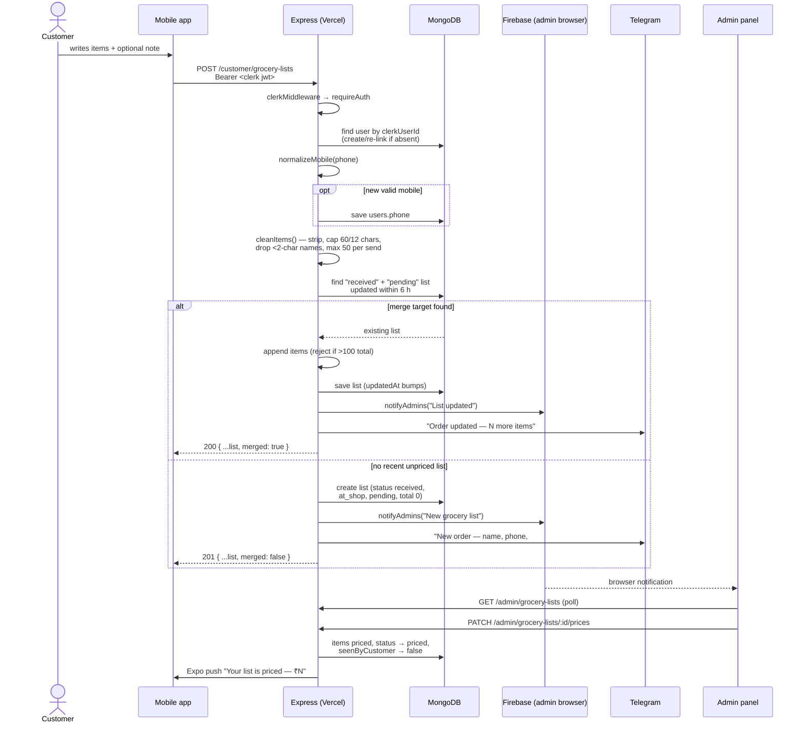
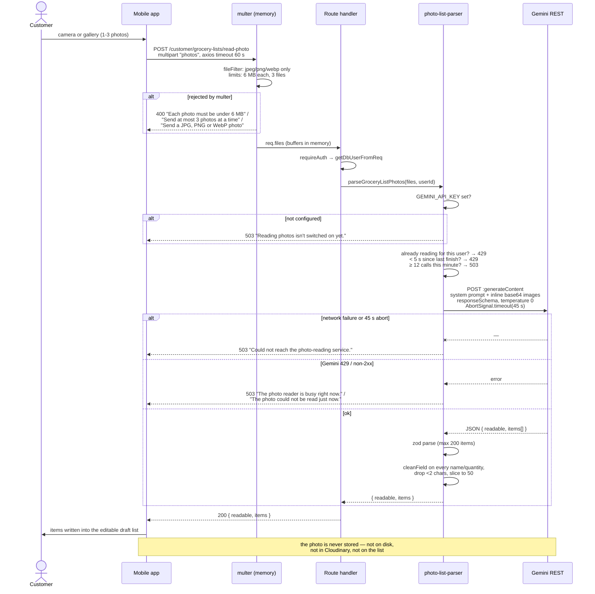

# sKirana — API reference

Every endpoint the server exposes, documented from the code. Written for someone
integrating with this API or debugging it in production.

Source of truth: `server/src/server.ts` (mounting order and middleware) and every
router under `server/src/routes/**`. Each endpoint below cites `file:line`.
Nothing here is invented; anything inferred rather than read is marked
**[unverified]**.

Companion documents: [ARCHITECTURE.md](ARCHITECTURE.md) ·
[PRODUCTION-SETUP.md](PRODUCTION-SETUP.md)

---

## 1. The basics

### 1.1 Base URL

| Environment | Base URL | Where it is set |
|---|---|---|
| Production (mobile app) | `https://type-script-project-jtdk.vercel.app` | `mobile/.env` → `EXPO_PUBLIC_BACKEND_URL` |
| Production (admin web) | same | Vercel admin project → `VITE_BACKEND_URL` |
| Local development | `http://localhost:5000` | `client/.env` → `VITE_BACKEND_URL`; `mobile/src/lib/env.ts:2` falls back to this |

The port is `process.env.PORT || 5000` (`server/src/server.ts:100`). There is no
`/api` prefix and no version prefix — routers mount straight onto `/auth`,
`/customer` and `/admin` (`server/src/server.ts:73-95`).

### 1.2 Global middleware, in order

`server/src/server.ts:40-51`, applied before any route:

1. **CORS** (`:40`) — origins from `CORS_ORIGINS` (comma-separated), default
   `http://localhost:3000`, `credentials: true`. An origin not on the list gets a
   browser-side CORS failure, not a JSON error.
2. **`express.json({ limit: "100kb" })`** (`:49`) — JSON bodies only. A body over
   100 kB is rejected by body-parser; see § 7 for what the caller actually sees.
3. **`morgan("dev")`** (`:50`) — request logging.
4. **`clerkMiddleware()`** (`:51`) — verifies the `Authorization: Bearer <JWT>`
   header and attaches the Clerk auth state. It never rejects a request by
   itself; unauthenticated requests simply carry no `userId`.

Then `notFound` (`:97`) and `errorHandler` (`:98`) close the chain.

Multipart bodies bypass `express.json` and are parsed per-route by `multer`
(see § 4).

### 1.3 The response envelope

`server/src/utils/envelope.ts:1-13`.

```ts
type ApiEnvelope<T> = {
  status: "success" | "error";
  data: T | null;
  meta?: Record<string, unknown>;
  errors?: Array<{ message: string; code?: string }>;
};
```

Success (`ok()`, `envelope.ts:8`):

```json
{ "status": "success", "data": { "...": "..." } }
```

`meta` is never populated by any route in this codebase — every call site passes
only `data`, so the key is omitted from the JSON.

Failure (`fail()`, `envelope.ts:12`):

```json
{ "status": "error", "data": null, "errors": [{ "message": "List not found", "code": "APP_ERROR" }] }
```

The mobile client unwraps this in one place (`mobile/src/lib/api.ts:64-86`) and
treats `status === "error"` **or a falsy `data`** as a thrown error — so an
endpoint that legitimately returned `data: null` or `data: {}` would surface in
the app as "Request failed".

### 1.4 Errors and status codes

`server/src/middleware/errorhandler.ts:5-18`:

| Thrown | Status | Body `errors[0]` |
|---|---|---|
| `AppError(statusCode, message)` (`utils/AppError.ts:1`) | `err.statusCode` | `{ message, code: "APP_ERROR" }` |
| Anything else (Mongoose `CastError`, `ValidationError`, duplicate key, body-parser 413, a bug) | `500` | `{ message: "Internal server error", code: "INTERNAL" }` — the real error is only in the server log (`errorhandler.ts:15`) |
| No route matched (`middleware/notFound.ts:4`) | `404` | `{ message: "Route not found GET" }` — the **method**, not the path, and no `code` |

Status codes actually produced by route code: **200**, **201**, **400**, **401**,
**403**, **404**, **409**, **429**, **500**, **503**. There is no 422 and no 502.

Async route handlers are wrapped in `asyncHandler` (`utils/asyncHandler.ts:3`),
so a rejected promise reaches `errorHandler` rather than hanging the request.

Three small helpers produce most 400/404s (`utils/helpers.ts`):

- `requireText(value, message, statusCode = 400)` — throws when
  `String(value || "").trim()` is empty.
- `requireNumber(value, message, statusCode = 400)` — throws only when the value
  is `NaN`. It does **not** reject negatives or non-numbers that coerce.
- `requireFound(value, message, statusCode = 404)` — throws when falsy, returns
  the value otherwise.

### 1.5 Authentication

`server/src/middleware/auth.ts`.

Send a Clerk session JWT:

```
Authorization: Bearer <clerk session token>
```

| Guard | Code | Behaviour |
|---|---|---|
| none | — | Public. `/health`, `/app-version`, `/customer/home`, `/customer/categories`, `/customer/products`, `/customer/products/:id`. |
| customer | `requireAuth` (`auth.ts:8`) | 401 `"User is not logged in. Means unauth user! !"` when Clerk gives no `userId`. Applied **router-wide** via `router.use(requireAuth)` on every customer router that needs it. |
| admin | `requireAdmin` (`auth.ts:39`) | Resolves the DB user, then 403 `"Admin access only"` if `role !== "admin"`. An unauthenticated request hits the 401 from `getDbUserFromReq` first. Applied router-wide on every admin router. |

Admin-ness is not set through the API. `syncDbUser` promotes a user to `admin`
when their Clerk email is listed in the `ADMIN_EMAILS` env var
(`services/user-sync.ts:31-38`, `:92`, `:111`, `:126`).

The mobile client gives Clerk 8 seconds to produce a token and then sends the
request **without** one (`mobile/src/lib/api.ts:29-38`), so a slow Clerk turns
protected calls into 401s rather than hangs.

### 1.6 How a DB user is resolved or created

Every authenticated handler calls `getDbUserFromReq(req)` (`auth.ts:20-34`):

1. `getAuth(req)` → `userId`; no `userId` → 401.
2. `User.findOne({ clerkUserId: userId })` → return it if found.
3. Otherwise `syncDbUser(userId)` — create or re-link the record now, so a
   signed-in customer always has one.

`syncDbUser` (`services/user-sync.ts:66-141`) reads the Clerk profile
(`clerkClient.users.getUser`, `:41`) and then:

- **Known Clerk id** (`:75`) — refresh email (only if not taken by another
  record), fill `name` if empty, promote to admin if the email is in
  `ADMIN_EMAILS`. Saves only if something changed.
- **Same *verified* email under an older Clerk id** (`:103`) — re-link the
  existing record to the new Clerk id, case-insensitively
  (`collation({ locale: "en", strength: 2 })`, `:61`). This exists because moving
  Clerk from test to production gave every returning customer a new id while the
  `users` collection has a unique index on `email`.
- **New customer** (`:122`) — `User.create`. On duplicate-key (11000) it retries
  the `clerkUserId` lookup (a concurrent request won the race); if that also
  fails it throws **409** `"This email is already used by another sKirana account.
  Please contact the shop."`

Consequence for callers: **any** authenticated endpoint can return 401, and (very
rarely) 409 from this path, or 500 if Clerk itself is unreachable.

`POST /auth/sync` calls `syncDbUser` directly and is what the apps call right
after login.

---

## 2. Every endpoint

Auth column: **none** = public · **customer** = `requireAuth` · **admin** =
`requireAdmin`.

### Root

| Method | Path | Auth | Purpose | Code |
|---|---|---|---|---|
| GET | `/health` | none | Liveness probe. | `server.ts:53` |
| GET | `/app-version` | none | Latest / minimum Play Store version for the update prompt. | `server.ts:62` |

### Auth

| Method | Path | Auth | Purpose | Code |
|---|---|---|---|---|
| POST | `/auth/sync` | customer | Create, re-link or refresh the DB user after login. | `routes/auth/auth.routes.ts:33` |
| GET | `/auth/me` | customer | The caller's own user record. | `routes/auth/auth.routes.ts:48` |

### Customer — catalogue (public)

| Method | Path | Auth | Purpose | Code |
|---|---|---|---|---|
| GET | `/customer/home` | none | Home screen payload: banners, categories, 4 newest products, 4 live coupons. | `routes/customer/home.routes.ts:92` |
| GET | `/customer/categories` | none | All categories, A→Z. | `routes/customer/product.routes.ts:23` |
| GET | `/customer/products` | none | Active products, filtered and searched. | `routes/customer/product.routes.ts:33` |
| GET | `/customer/products/:id` | none | One active product plus up to 4 related. | `routes/customer/product.routes.ts:81` |

### Customer — grocery lists

| Method | Path | Auth | Purpose | Code |
|---|---|---|---|---|
| POST | `/customer/grocery-lists/read-photo` | customer | Read photos of a handwritten list into items (Gemini). Stores nothing. | `routes/customer/grocery-list.routes.ts:112` |
| POST | `/customer/grocery-lists` | customer | Send a list; merges into an unpriced list from the last 6 h. | `:135` |
| GET | `/customer/grocery-lists` | customer | All of my lists, newest first, plus badge count and shop UPI details. | `:272` |
| PATCH | `/customer/grocery-lists/:listId/seen` | customer | Clear the badge for one list. | `:299` |
| PATCH | `/customer/grocery-lists/:listId/remove-item` | customer | Remove one item before packing starts. | `:324` |
| PATCH | `/customer/grocery-lists/:listId/pay-at-shop` | customer | Choose to pay at the counter. | `:377` |
| POST | `/customer/grocery-lists/:listId/pay-online` | customer | Create a Razorpay order for the list. | `:400` |
| POST | `/customer/grocery-lists/:listId/confirm-payment` | customer | Verify the Razorpay signature and mark paid. | `:444` |
| GET | `/customer/grocery-lists/:listId/messages` | customer | Read the chat on one of my lists. | `:490` |
| POST | `/customer/grocery-lists/:listId/messages` | customer | Send a chat message to the shop. | `:510` |

### Customer — profile, addresses, devices

| Method | Path | Auth | Purpose | Code |
|---|---|---|---|---|
| GET | `/customer/profile` | customer | My name, email, phone. | `routes/customer/profile.routes.ts:32` |
| PATCH | `/customer/profile` | customer | Update name and/or mobile; pushes them onto open lists. | `:43` |
| GET | `/customer/addresses` | customer | My addresses, default first. | `routes/customer/address.routes.ts:33` |
| POST | `/customer/addresses` | customer | Add an address. | `:52` |
| PATCH | `/customer/addresses/:addressId` | customer | Replace one address's fields. | `:99` |
| DELETE | `/customer/addresses/:addressId` | customer | Delete an address. | `:160` |
| POST | `/customer/push-token` | customer | Register this device for Expo push. | `routes/customer/push-token.routes.ts:14` |
| DELETE | `/customer/push-token` | customer | Unregister on sign-out. | `:32` |

### Customer — cart, wishlist, promo, checkout, orders

| Method | Path | Auth | Purpose | Code |
|---|---|---|---|---|
| GET | `/customer/cart` | customer | My cart. | `routes/customer/cart-wishlist.routes.ts:152` |
| POST | `/customer/cart/items` | customer | Add a product (with variant) to the cart. | `:161` |
| PATCH | `/customer/cart/items/:productId/increase` | customer | +1, capped by stock. | `:236` |
| PATCH | `/customer/cart/items/:productId/decrease` | customer | −1, removing the row at 0. | `:285` |
| DELETE | `/customer/cart/items/:productId` | customer | Remove one cart row. | `:331` |
| POST | `/customer/cart/sync` | customer | Merge a guest cart into the server cart. | `:370` |
| GET | `/customer/wishlist` | customer | My wishlist. | `:444` |
| POST | `/customer/wishlist/items` | customer | Add a product to the wishlist. | `:453` |
| DELETE | `/customer/wishlist/items/:productId` | customer | Remove from the wishlist. | `:490` |
| POST | `/customer/promos/apply` | customer | Validate a promo code against an order value. | `routes/customer/promo.routes.ts:13` |
| POST | `/customer/checkout/create-session` | customer | Price the cart, create an Order + Razorpay order. | `routes/customer/checkout.routes.ts:61` |
| POST | `/customer/checkout/confirm` | customer | Verify signature, decrement stock, empty the cart. | `:217` |
| GET | `/customer/checkout/points` | customer | My points balance. | `routes/customer/checkout-with-points.routes.ts:60` |
| POST | `/customer/checkout/pay-with-points` | customer | Pay for the cart entirely with points. | `:79` |
| GET | `/customer/orders` | customer | My orders (the Order collection, not grocery lists). | `routes/customer/orders.routes.ts:28` |
| PATCH | `/customer/orders/:orderId/return` | customer | Return a delivered order within 7 days. | `:59` |

### Admin — grocery lists and chat

| Method | Path | Auth | Purpose | Code |
|---|---|---|---|---|
| GET | `/admin/grocery-lists` | admin | Every list, most recently active first. | `routes/admin/grocery-list.routes.ts:116` |
| PATCH | `/admin/grocery-lists/:listId/prices` | admin | Price every line; status → `priced`. | `:129` |
| PATCH | `/admin/grocery-lists/:listId/status` | admin | Move a list along `packing → … → completed`, or cancel. | `:213` |
| PATCH | `/admin/grocery-lists/:listId/mark-paid` | admin | Confirm a counter/UPI payment. | `:271` |
| PATCH | `/admin/grocery-lists/:listId/items/:index/availability` | admin | Mark one line in/out of stock. | `:320` |
| PATCH | `/admin/grocery-lists/:listId/items/:index` | admin | Edit one line's name/quantity. | `:375` |
| POST | `/admin/grocery-lists/:listId/items` | admin | Add a line to an open list. | `:427` |
| GET | `/admin/grocery-lists/conversations` | admin | Last message per list, newest first, max 100. | `:484` |
| GET | `/admin/grocery-lists/:listId/messages` | admin | Read one list's chat. | `:537` |
| POST | `/admin/grocery-lists/:listId/messages` | admin | Reply to the customer. | `:556` |

### Admin — catalogue

| Method | Path | Auth | Purpose | Code |
|---|---|---|---|---|
| GET | `/admin/categories` | admin | All categories. | `routes/admin/product.routes.ts:39` |
| POST | `/admin/categories` | admin | Create a category (optional image). | `:50` |
| PUT | `/admin/categories/:id` | admin | Rename / re-image a category. | `:76` |
| DELETE | `/admin/categories/:id` | admin | Delete an empty category. | `:105` |
| GET | `/admin/products` | admin | All products (any status), optional title search. | `:135` |
| GET | `/admin/products/:id` | admin | One product. | `:154` |
| POST | `/admin/products` | admin | Create a product with 1–10 images. | `:170` |
| PUT | `/admin/products/:id` | admin | Update a product; add/remove/re-cover images. | `:240` |
| DELETE | `/admin/products/:id` | admin | Delete a product. | `:373` |

### Admin — banners, promos, orders, dashboard, devices

| Method | Path | Auth | Purpose | Code |
|---|---|---|---|---|
| GET | `/admin/settings/banners` | admin | Every banner in carousel order. | `routes/admin/settings.routes.ts:178` |
| POST | `/admin/settings/banners` | admin | Upload 1–10 images as banners. | `:186` |
| PUT | `/admin/settings/banners/order` | admin | Reorder the whole carousel. | `:220` |
| PATCH | `/admin/settings/banners/:bannerId` | admin | Edit title, visibility, tap action, schedule. | `:247` |
| DELETE | `/admin/settings/banners/:bannerId` | admin | Delete a banner and its Cloudinary image. | `:276` |
| GET | `/admin/promos` | admin | All promo codes. | `routes/admin/promo.routes.ts:89` |
| POST | `/admin/promos` | admin | Create a promo code. | `:101` |
| PATCH | `/admin/promos/:promoId` | admin | Update a promo code. | `:123` |
| DELETE | `/admin/promos/:promoId` | admin | Delete a promo code. | `:161` |
| GET | `/admin/orders` | admin | All Orders. | `routes/admin/orders.routes.ts:38` |
| PATCH | `/admin/orders/:orderId/status` | admin | Change an Order's status. | `:69` |
| GET | `/admin/dashboard/lite` | admin | Headline counters. | `routes/admin/dashboard.routes.ts:18` |
| GET | `/admin/dashboard/daily` | admin | Last 7 IST days: orders and sales. | `:70` |
| POST | `/admin/push-token` | admin | Register an admin browser for FCM web push. | `routes/admin/push-token.routes.ts:13` |
| DELETE | `/admin/push-token` | admin | Unregister an admin browser. | `:30` |

**76 endpoints in total.**

---

## 3. Endpoint detail

Throughout: "401" means the standard `"User is not logged in. Means unauth
user! !"`, "403" means `"Admin access only"`, and every endpoint can return the
generic 500 described in § 1.4.

---

### 3.1 Root

#### `GET /health`
`server/src/server.ts:53`

No parameters, no auth.

```json
{ "status": "success", "data": { "message": "Server is healthy/in running state" } }
```

Side effects: none. Note the server only starts listening after `connectDB()`
resolves (`server.ts:31`), so a 200 here also implies Mongo connected **at boot**
— not that it is reachable right now.

#### `GET /app-version`
`server/src/server.ts:62`

No parameters, no auth. Entirely env-driven, so publishing a Play release needs
an env change and no deploy.

```json
{
  "status": "success",
  "data": {
    "latestVersion": "1.0.2",
    "minVersion": "1.0.0",
    "androidPackage": "com.skirana.app"
  }
}
```

`latestVersion` ← `APP_LATEST_VERSION` (default `""`), `minVersion` ←
`APP_MIN_VERSION` (default `""`, below which the app treats the update as
mandatory), `androidPackage` ← `ANDROID_PACKAGE` (default `"com.skirana.app"`).

Errors: none. Side effects: none. Caller: `mobile/src/components/StoreUpdatePrompt.tsx`.

---

### 3.2 Auth

#### `POST /auth/sync`
`server/src/routes/auth/auth.routes.ts:33`

Body: none read. Called by both apps immediately after login.

```json
{
  "status": "success",
  "data": {
    "user": {
      "id": "6703f1a2b9c4d5e6f7a8b9c0",
      "clerkUserId": "user_2xAbCdEfGhIjKlMnOpQrStUv",
      "email": "customer@example.com",
      "name": "Rohit Sharma",
      "role": "user"
    }
  }
}
```

Mapper: `toPayload` (`auth.routes.ts:19`). `email` and `name` are omitted when
absent on the record.

Errors: **401**; **409** `"This email is already used by another sKirana account.
Please contact the shop."` (`user-sync.ts:136`); **500** if Clerk is unreachable.

Side effects: **DB write** — may create a `users` document, re-link an existing
one to a new `clerkUserId`, update `email`/`name`, or promote `role` to `admin`
(`user-sync.ts:75-140`). Calls the **Clerk Backend API** (`users.getUser`).

#### `GET /auth/me`
`server/src/routes/auth/auth.routes.ts:48`

Same response shape as `/auth/sync`. Resolves through `getDbUserFromReq`, so it
too can create or re-link a record when none exists.

Errors: **401**, **409**, **500**. Side effects: possible DB write via the
create-on-demand path.

---

### 3.3 Customer — catalogue (public)

#### `GET /customer/home`
`server/src/routes/customer/home.routes.ts:92`

No parameters. Four queries in parallel (`:97-116`):

- banners — `liveBannerFilter(now)` (`models/Banner.ts:62`: `isActive !== false`
  and inside any `startsAt`/`endsAt` window), sorted `sortOrder` then newest,
  limited to `HOME_BANNER_LIMIT` = **8**.
- categories — all, A→Z.
- recentProducts — `status: "active"`, newest **4**.
- coupons — promos live now with `count > 0`, **4**.

Banner tap targets are resolved and downgraded to `{ "type": "none" }` when the
category or product they point at is gone or inactive (`resolveBannerLinks`, `:26-60`).

```json
{
  "status": "success",
  "data": {
    "banners": [
      {
        "_id": "670b1c2d3e4f5a6b7c8d9e01",
        "imageUrl": "https://res.cloudinary.com/dnlqyxhpg/image/upload/f_webp,q_auto,c_limit,w_1200/v1712345678/ecommerce-monster-video/banners/diwali.jpg",
        "title": "diwali offer",
        "link": { "type": "category", "targetId": "670b1c2d3e4f5a6b7c8d9e02" },
        "createdAt": "2026-09-01T06:12:44.000Z"
      }
    ],
    "categories": [
      {
        "_id": "670b1c2d3e4f5a6b7c8d9e02",
        "name": "Atta / आटा",
        "imageUrl": "https://res.cloudinary.com/dnlqyxhpg/image/upload/f_webp,q_auto,c_limit,w_200/v1712345678/ecommerce-monster-video/categories/atta.jpg"
      }
    ],
    "recentProducts": [
      {
        "_id": "670b1c2d3e4f5a6b7c8d9e03",
        "title": "Aashirvaad Multigrain Atta 5 kg",
        "brand": "Aashirvaad",
        "image": "https://res.cloudinary.com/dnlqyxhpg/image/upload/f_webp,q_auto,c_limit,w_500/v1712345678/ecommerce-monster-video/products/atta5.jpg",
        "unit": "kg",
        "unitValue": 5,
        "createAt": "2026-09-14T11:02:00.000Z"
      }
    ],
    "coupons": [
      {
        "_id": "670b1c2d3e4f5a6b7c8d9e04",
        "code": "DIWALI10",
        "percentage": 10,
        "count": 50,
        "minimumOrderValue": 500,
        "endsAt": "2026-11-05T18:29:59.000Z"
      }
    ]
  }
}
```

Note the product key is **`createAt`** (missing "e") — `home.routes.ts:141`. It is
a mapper key, not a DB field; the DB field is `createdAt`.

Image URLs are rewritten by `cdnImage` (`utils/cloudinary.ts:117`) to
`f_webp,q_auto,c_limit,w_<variant>`: banners 1200 px, categories 200 px
(`thumb`), products 500 px (`card`). Non-Cloudinary URLs pass through untouched.

Errors: only the generic 500. Side effects: none (reads only).

#### `GET /customer/categories`
`server/src/routes/customer/product.routes.ts:23`

No parameters. Returns raw Mongoose documents, **not** a mapper — so `data` is a
bare array including `imagePublicId` and `__v`, and `imageUrl` is **not**
CDN-resized here (unlike `/customer/home`).

```json
{
  "status": "success",
  "data": [
    {
      "_id": "670b1c2d3e4f5a6b7c8d9e02",
      "name": "Atta / आटा",
      "imageUrl": "https://res.cloudinary.com/dnlqyxhpg/image/upload/v1712345678/ecommerce-monster-video/categories/atta.jpg",
      "imagePublicId": "ecommerce-monster-video/categories/atta",
      "createdAt": "2026-08-02T09:00:00.000Z",
      "updatedAt": "2026-08-02T09:00:00.000Z",
      "__v": 0
    }
  ]
}
```

Errors: generic 500 only. Side effects: none.

#### `GET /customer/products`
`server/src/routes/customer/product.routes.ts:33`

Query parameters (all optional, all trimmed — `:41-45`):

| Name | Type | Effect |
|---|---|---|
| `category` | ObjectId string | `category` equals this. A malformed id throws a Mongoose `CastError` → **500**. |
| `brand` | string | exact `brand` match |
| `color` | string | matches a member of `colors` |
| `size` | `S`/`M`/`L`/`XL` | matches a member of `sizes` |
| `search` | string | case-insensitive `title` regex, escaped by `escapeRegex` (`utils/regex.ts:6`) so `(`, `*`, `+` are literal |
| `sort` | `recent`/`price-low`/`price-high` | **accepted in the type but ignored** — `sortOption` is hard-coded to `{ createdAt: -1 }` (`:70`) |

`status: "active"` is always applied (`:48`). No pagination, no limit.

```json
{
  "status": "success",
  "data": [
    {
      "_id": "670b1c2d3e4f5a6b7c8d9e03",
      "title": "Aashirvaad Multigrain Atta 5 kg",
      "description": "Multigrain atta, 5 kg pack.",
      "category": { "_id": "670b1c2d3e4f5a6b7c8d9e02", "name": "Atta / आटा" },
      "brand": "Aashirvaad",
      "stock": 12,
      "images": [
        {
          "url": "https://res.cloudinary.com/dnlqyxhpg/image/upload/f_webp,q_auto,c_limit,w_500/v1712345678/ecommerce-monster-video/products/atta5.jpg",
          "publicId": "ecommerce-monster-video/products/atta5",
          "isCover": true
        }
      ],
      "colors": [],
      "sizes": [],
      "unit": "kg",
      "unitValue": 5,
      "status": "active",
      "createdBy": "6703f1a2b9c4d5e6f7a8b9c0",
      "createdAt": "2026-09-14T11:02:00.000Z",
      "updatedAt": "2026-09-14T11:02:00.000Z",
      "__v": 0
    }
  ]
}
```

Mapper: `sizedProduct(product, "card")` (`utils/productImages.ts:10`) — the whole
document, with only image URLs rewritten to the 500 px variant.

Errors: **500** on a malformed `category` id (CastError). Side effects: none.

#### `GET /customer/products/:id`
`server/src/routes/customer/product.routes.ts:81`

Path parameter: `id` — product ObjectId.

Looks up `{ _id: id, status: "active" }`, then up to 4 other active products in
the same category, newest first (`:94-101`).

```json
{
  "status": "success",
  "data": {
    "product": { "...": "sizedProduct(..., \"detail\") — images at w_900" },
    "relatedProducts": [ { "...": "sizedProduct(..., \"card\") — images at w_500" } ]
  }
}
```

Errors: **404** `"Product not found"` (`:92`, also for an inactive product);
**500** if `id` is not a valid ObjectId (CastError). Side effects: none.

---

### 3.4 Customer — grocery lists

Router guard: `requireAuth` on every route (`grocery-list.routes.ts:72`).

Shared mapper `mapGroceryList` (`:33-58`) — used by every list endpoint below:

```json
{
  "_id": "670c9f1a2b3c4d5e6f708192",
  "code": "6F708192",
  "items": [
    { "name": "Aashirvaad Atta", "quantity": "5 kg", "rate": 60, "price": 300, "available": true }
  ],
  "totalItems": 1,
  "totalAmount": 300,
  "status": "priced",
  "paymentMethod": "at_shop",
  "paymentStatus": "pending",
  "seenByCustomer": false,
  "note": "please pack in a cloth bag",
  "pricedAt": "2026-09-18T07:40:12.000Z",
  "packedAt": null,
  "readyAt": null,
  "completedAt": null,
  "paidAt": null,
  "createdAt": "2026-09-18T07:20:00.000Z"
}
```

`code` is the last 8 hex characters of `_id`, uppercased — the human reference
used in notifications, Telegram and chat.

#### `POST /customer/grocery-lists/read-photo`
`server/src/routes/customer/grocery-list.routes.ts:112` — **multipart**, see § 4.1.

Body: `multipart/form-data`, field **`photos`**, 1–3 files, each ≤ 6 MB, MIME
`image/jpeg` · `image/png` · `image/webp`.

Success:

```json
{
  "status": "success",
  "data": {
    "readable": true,
    "items": [
      { "name": "आटा", "quantity": "5 kg", "confidence": "high" },
      { "name": "surf chota", "quantity": "", "confidence": "medium" }
    ]
  }
}
```

`readable` is `parsed.readable && items.length > 0`
(`services/photo-list-parser.ts:278`) — so an unreadable photo returns
`{ "readable": false, "items": [] }` with HTTP **200**, not an error.

Errors:

| Status | Message | Where |
|---|---|---|
| 400 | `Send a JPG, PNG or WebP photo` | `grocery-list.routes.ts:87` (fileFilter) |
| 400 | `Each photo must be under 6 MB` | `:99` (multer `LIMIT_FILE_SIZE`) |
| 400 | `Send at most 3 photos at a time` | `:100` (any other MulterError) |
| 400 | `Choose at least one photo` | `:120` |
| 401 | not signed in | `auth.ts:13` |
| 429 | `Your photo is still being read — one moment.` | `photo-list-parser.ts:142` (same customer, request in flight) |
| 429 | `Just a moment before the next photo.` | `:147` (< 5 s since that customer's last read **finished**) |
| 503 | `Reading photos isn't switched on yet. Please type the items instead.` | `:134` (`GEMINI_API_KEY` unset) |
| 503 | `A lot of lists are being read right now. Try again in a minute, or type the items.` | `:156` (≥ 12 calls in the current minute, per instance) |
| 503 | `Could not reach the photo-reading service. Check the internet and try again.` | `:224` (fetch failed or the 45 s abort fired) |
| 503 | `The photo reader is busy right now. Try again in a minute, or type the items.` | `:231` (Gemini returned 429) |
| 503 | `The photo could not be read just now. Try again, or type the items.` | `:240` (Gemini non-2xx) and `:258` (output failed zod validation) |

Side effects: **Gemini** `generateContent` call (§ 6). **No DB write. No
Cloudinary. No storage of the photo at all** — the bytes live in process memory
for the request and are gone with the response (`grocery-list.routes.ts:74-77`).
One log line per successful read (`photo-list-parser.ts:274`).

#### `POST /customer/grocery-lists`
`server/src/routes/customer/grocery-list.routes.ts:135`

Request body:

| Field | Type | Rules |
|---|---|---|
| `items` | array | Required in practice. Passed to `cleanItems` (`utils/sanitizeItem.ts:74`). |
| `items[].name` | string | `cleanField(..., 60, true)`: control/zero-width/bidi characters stripped, then everything outside `\p{L} \p{M} \p{N} whitespace . , & ' - / ( ) % ×` removed, whitespace collapsed, trimmed, cut to **60** chars. Rows shorter than **2** chars after cleaning are silently **dropped**. |
| `items[].quantity` | string | Same cleaning, cut to **12** chars. Optional. |
| `note` | string | `cleanField(..., 300)` — control characters stripped but special characters kept. |
| `phone` | string | `normalizeMobile` (`utils/phone.ts:3`): digits only, strips `+91`/leading `0`, must match `^[6-9]\d{9}$`. An invalid value is silently ignored (no error). |

Non-string values (objects, arrays — e.g. a `{ "$gt": "" }` injection payload)
collapse to `""` rather than reaching the query or the DB
(`sanitizeItem.ts:55-70`).

Behaviour (`:174-267`):

1. If `phone` normalises and differs from the stored one, it is saved on the user.
2. `cleanItems` runs. `> 500` raw rows → 400; `> 50` surviving rows → 400.
3. If the customer has a list with `status: "received"`,
   `paymentStatus: "pending"` and `updatedAt` within **6 hours**, the new items
   are **appended to it** instead of creating a new list. Merged total > **100**
   items → 400.
4. Otherwise a new list is created with `status: "received"`,
   `paymentMethod: "at_shop"`, `paymentStatus: "pending"`,
   `seenByCustomer: true`, `totalAmount: 0`, and `customerName` falling back to
   the user's email.

Success: **201** for a new list, **200** for a merge. Body is `mapGroceryList`
plus a `merged` boolean:

```json
{
  "status": "success",
  "data": {
    "_id": "670c9f1a2b3c4d5e6f708192",
    "code": "6F708192",
    "items": [{ "name": "Aashirvaad Atta", "quantity": "5 kg", "rate": 0, "price": 0, "available": true }],
    "totalItems": 1,
    "totalAmount": 0,
    "status": "received",
    "paymentMethod": "at_shop",
    "paymentStatus": "pending",
    "seenByCustomer": true,
    "note": "",
    "pricedAt": null, "packedAt": null, "readyAt": null, "completedAt": null, "paidAt": null,
    "createdAt": "2026-09-18T07:20:00.000Z",
    "merged": false
  }
}
```

Errors: **400** `Too many items in one request` (`sanitizeItem.ts:81`); **400**
`A list can have at most 50 items per send` (`:96`); **400** `Add at least one
item` (`grocery-list.routes.ts:165`); **400** `This list already has too many
items (max 100).` (`:198`); **401**.

Side effects: **DB writes** — possibly `users.phone`; either a new `grocerylists`
document or an update to an existing one. **Web push** to every admin browser via
`notifyAdmins` (`utils/webPush.ts:80`) — `"New grocery list"` or `"List updated"`.
**Telegram** message to every configured chat id (`utils/telegram.ts:7`). Both are
awaited because Vercel freezes the function once the response is sent, and both
swallow their own failures.

#### `GET /customer/grocery-lists`
`server/src/routes/customer/grocery-list.routes.ts:272`

No parameters. All of the caller's lists, newest first. No pagination.

```json
{
  "status": "success",
  "data": {
    "items": [ { "...": "mapGroceryList" } ],
    "unseenCount": 2,
    "upi": { "id": "shop@upi", "name": "sKirana" },
    "customerPhone": "9876543210"
  }
}
```

`unseenCount` counts lists with `seenByCustomer === false` and drives the tab-bar
badge. `upi.id` ← `SHOP_UPI_ID` (default `""`), `upi.name` ← `SHOP_NAME`
(default `"sKirana"`); the app builds a UPI deep link from these.

Errors: **401**. Side effects: none beyond the possible user create-on-demand.

#### `PATCH /customer/grocery-lists/:listId/seen`
`:299`

Path parameter `listId`. No body. Sets `seenByCustomer = true` on a list the
caller owns.

Response: `mapGroceryList` of the updated list.

Errors: **400** `List id is required`; **404** `List not found` (also when the
list belongs to someone else — the query is scoped by `user`); **401**; **500**
on a malformed `listId` (CastError).

Side effects: one DB write.

#### `PATCH /customer/grocery-lists/:listId/remove-item`
`:324`

Path parameter `listId`. Body: `{ "index": 0 }` — must be an integer ≥ 0.

Guards, in order (`:333-357`): valid index → `paymentStatus !== "paid"` → status
in `["received", "priced"]` → index within range → more than one item remains.
Then the list is rewritten and `totalAmount` recomputed as the sum of remaining
`price` values (`:365`).

Response: `mapGroceryList`.

Errors: **400** `Valid item index is required`; **400** `List id is required`;
**400** `This list is already paid`; **400** `Items can only be removed before the
shop starts packing`; **404** `Item not found in this list`; **400** `A list needs
at least one item`; **404** `List not found`; **401**.

Side effects: one DB write. **No notification to the shop** — the shopkeeper only
sees the change on their next poll.

#### `PATCH /customer/grocery-lists/:listId/pay-at-shop`
`:377`

Path parameter `listId`. No body. Sets `paymentMethod = "at_shop"`.

Response: `mapGroceryList`.

Errors: **400** `List id is required`; **400** `This list is already paid`;
**404** `List not found`; **401**.

Side effects: one DB write.

#### `POST /customer/grocery-lists/:listId/pay-online`
`:400`

Path parameter `listId`. No body fields read.

Creates a Razorpay order for `totalAmount` (rupees → paise via `toSubUnits`,
`utils/razorpay.ts:18`), receipt `GroceryList_<id>`, then stores
`razorpayOrderId` and sets `paymentMethod = "online"`.

```json
{
  "status": "success",
  "data": {
    "razorpay": {
      "keyId": "rzp_live_xxxxxxxx",
      "orderId": "order_PqRsTuVwXyZ123",
      "amount": 30000,
      "currency": "INR"
    },
    "list": { "...": "mapGroceryList" }
  }
}
```

Errors: **400** `List id is required`; **400** `This list is already paid`;
**400** `The shop has not priced this list yet` (when `totalAmount < 1`); **404**
`List not found`; **401**; **500** if the Razorpay API call fails (the SDK error
is not an `AppError`).

Side effects: **Razorpay order created** (external); one DB write. Note the
server boots only if `RAZORPAY_KEY_ID` and `RAZORPAY_KEY_SECRET` are set —
`utils/razorpay.ts:3` throws at module load otherwise.

#### `POST /customer/grocery-lists/:listId/confirm-payment`
`:444`

Path parameter `listId`. Body — all required, all trimmed:

| Field | Type |
|---|---|
| `razorpay_payment_id` | string |
| `razorpay_order_id` | string |
| `razorpay_signature` | string |

Verifies `HMAC-SHA256(razorpay_order_id + "|" + razorpay_payment_id)` with
`RAZORPAY_KEY_SECRET` (`:470`). An already-paid list returns **200** with the list
unchanged (idempotent, `:461`).

Response: `mapGroceryList` with `paymentStatus: "paid"`, `paymentMethod:
"online"`, `paymentId` and `paidAt` set.

Errors: **400** for each missing field (`List id is required`,
`razorpayPaymentId is needed`, `razorpayOrderId is needed`,
`razorpaySignature is needed`); **400** `Order id mismatch`; **400** `Invalid
payment signature`; **404** `List not found`; **401**.

Side effects: one DB write. **No push, no Telegram** — the shop is not told the
list was paid online.

#### `GET /customer/grocery-lists/:listId/messages`
`:490`

Path parameter `listId`. Ownership is checked before reading (`:498`). All
messages for the list, oldest first. No pagination.

```json
{
  "status": "success",
  "data": {
    "messages": [
      {
        "_id": "670cabc1d2e3f4a5b6c7d8e9",
        "sender": "customer",
        "senderName": "Rohit Sharma",
        "text": "Please add 1 kg sugar",
        "createdAt": "2026-09-18T07:25:00.000Z"
      }
    ]
  }
}
```

Messages are auto-deleted by MongoDB **30 days** after they are written
(TTL index, `models/Message.ts:59`), so an old order's chat comes back empty.

Errors: **400** `List id is required`; **404** `List not found`; **401**.

Side effects: none.

#### `POST /customer/grocery-lists/:listId/messages`
`:510`

Path parameter `listId`. Body: `{ "text": "..." }` — trimmed, non-empty, ≤ 1000
characters (`:519`; the schema enforces the same cap at `models/Message.ts:46`).

`senderName` is the user's name, else email, else `"Customer"` (`:526`).

Success: **201**, body is `mapMessage` (same shape as above).

Errors: **400** `List id is required`; **400** `Message cannot be empty`; **400**
`Message is too long`; **404** `List not found`; **401**.

Side effects: **DB write** (`messages`). **Web push** to admin browsers
(`"New message · #CODE"`). **Telegram** message. Both awaited, both swallow
failures.

---

### 3.5 Customer — profile, addresses, devices

#### `GET /customer/profile`
`server/src/routes/customer/profile.routes.ts:32`

```json
{ "status": "success", "data": { "name": "Rohit Sharma", "email": "customer@example.com", "phone": "9876543210" } }
```

Missing values come back as `""`, never `null` (`mapProfile`, `:20`).

Errors: **401**. Side effects: none beyond create-on-demand.

#### `PATCH /customer/profile`
`server/src/routes/customer/profile.routes.ts:43`

Body — both fields optional; only the keys present are touched (`:48`, `:56`):

| Field | Rules |
|---|---|
| `name` | `cleanField(value, 50, true)` — same allowlist as grocery items, capped at **50** characters (`profile.routes.ts:12`). Empty after cleaning → 400. |
| `phone` | `normalizeMobile` — must yield a valid 10-digit Indian mobile. |

Response: `mapProfile` of the saved user.

Errors: **400** `Please enter your name`; **400** `Enter a valid 10-digit mobile
number`; **401**.

Side effects: **two DB writes** — the user document, then a `GroceryList.updateMany`
that pushes the corrected `customerName`/`customerPhone` onto every list of theirs
whose status is not `completed` or `cancelled` (`:70-81`). Finished and cancelled
lists deliberately keep their historical snapshot.

#### `GET /customer/addresses`
`server/src/routes/customer/address.routes.ts:33`

```json
{
  "status": "success",
  "data": {
    "items": [
      {
        "_id": "670cdd01e2f3a4b5c6d7e8f9",
        "fullName": "Rohit Sharma",
        "address": "12, MG Road",
        "state": "Karnataka",
        "postalCode": "560001",
        "isDefault": true
      }
    ]
  }
}
```

Sorted default-first (`:44`). Mapper: `mapAddress` (`:18`).

Errors: **404** `User not found` (`:40`); **401**.

#### `POST /customer/addresses`
`:52`

Body — all four required and trimmed; **no length limits and no sanitiser** on
these fields:

| Field | Rule |
|---|---|
| `fullName` | non-empty → else 400 `Full name is required` |
| `address` | non-empty → else 400 `Address is required` |
| `state` | non-empty → else 400 `State is required` |
| `postalCode` | non-empty → else 400 `postal code is required` (lower-case "postal" is the actual message) |
| `isDefault` | optional boolean; `true` — or being the first address — clears `isDefault` on all others |

Response: the full `{ items: [...] }` list, default first (**200**, not 201).

Errors: the four 400s above; **404** `User not found`; **401**.

Side effects: one DB write on the user document.

#### `PATCH /customer/addresses/:addressId`
`:99`

Path parameter `addressId` (the embedded sub-document `_id`). Body: the same four
required fields as POST — this is a **full replacement of those fields**, not a
partial patch. `isDefault: true` promotes this address and demotes the rest;
`false` is ignored (the flag is never cleared here — `:146`).

Response: `{ items: [...] }`.

Errors: **400** `Address id is required`; the four field 400s; **404** `Address
not found`; **404** `User not found`; **401**.

#### `DELETE /customer/addresses/:addressId`
`:160`

Path parameter `addressId`. No body. If the deleted address was the default and
others remain, the first survivor becomes the default (`:187-193`).

Response: `{ items: [...] }`.

Errors: **400** `Address id is required`; **404** `Address not found`; **404**
`User not found`; **401**.

#### `POST /customer/push-token` · `DELETE /customer/push-token`
`server/src/routes/customer/push-token.routes.ts:14` and `:32`

Body for both: `{ "token": "ExponentPushToken[xxxxxxxx]" }` — trimmed, non-empty.
POST does `$addToSet` and DELETE does `$pull` on `users.pushTokens`. **DELETE
carries a JSON body**, which some HTTP clients strip — the mobile client sends it
via axios, which does not.

Response: `{ "registered": true }` / `{ "registered": false }`.

Errors: **400** `Push token is required`; **401**.

Side effects: one DB write. Tokens are only used by `notifyUser`
(`utils/push.ts:60`), which filters to strings starting `ExponentPushToken[` or
`ExpoPushToken[` (`:14`) — any other token is stored but never sent to.

---

### 3.6 Customer — cart, wishlist, promo, checkout, orders

> Every endpoint in this section is **unreachable from the shipped clients** — see
> § 7.2. They are documented because they are live on the server.

Shared response shapes (`cart-wishlist.routes.ts:56-100`):

```json
{
  "status": "success",
  "data": {
    "items": [
      {
        "productId": "670b1c2d3e4f5a6b7c8d9e03",
        "title": "Aashirvaad Multigrain Atta 5 kg",
        "brand": "Aashirvaad",
        "image": "https://res.cloudinary.com/.../f_webp,q_auto,c_limit,w_500/...jpg",
        "quantity": 2,
        "color": "red",
        "size": "M"
      }
    ],
    "totalQuantity": 2
  }
}
```

Wishlist responses are the same without `quantity`, `color`, `size` and
`totalQuantity`. Cart/wishlist rows whose product was deleted are dropped from
the response rather than returned as `null` (`:64-75`, `:93-97`).

Variant rules (`getSelectedvariant`, `:102`): if the product has any `colors`, a
`color` is **required** and must be one of them; likewise `sizes`. Products with
empty `colors`/`sizes` ignore those inputs.

#### `GET /customer/cart` — `:152`
No parameters. Response as above. Errors: **401**.

#### `POST /customer/cart/items` — `:161`

| Field | Rules |
|---|---|
| `productId` | required, trimmed |
| `quantity` | number, default 1, must be ≥ 1 |
| `color`, `size` | required when the product defines them |

Creates the cart if absent (`:199`). Errors: **400** `Product id is required`;
**400** `Quantity must be at least 1`; **404** `Product not found` (also when
`status !== "active"`); **400** `Color is required` / `Selected color is invalid`
/ `Size is required` / `Selected size is invalid`; **400** `Quantity is more than
the stock of this product`; **401**.

Side effects: one DB write. **Known bug:** the "already in cart" branch tests
`itemIndex > 0` (`:210`) instead of `>= 0`, so re-adding the **first** row pushes
a duplicate row rather than incrementing it.

#### `PATCH /customer/cart/items/:productId/increase` — `:236`
Path parameter `productId`. **Query** parameters `color`, `size` (not body —
`:241`). Adds 1, refusing to exceed stock.

Errors: **400** `Product id is required`; **404** `Cart not found`; **404**
`Product not found`; the four variant 400s; **400** `Cart item not found here`;
**400** `Quantity is more than the stock of this product`; **401**.

#### `PATCH /customer/cart/items/:productId/decrease` — `:285`
Same parameters. Subtracts 1 and splices the row out at 0 (`:321`).

Errors: as above minus the stock error.

#### `DELETE /customer/cart/items/:productId` — `:331`
Path parameter `productId`; query `color`, `size`. With no cart at all it returns
`{ "items": [], "totalQuantity": 0 }` (**200**, `:344`).

Errors: **400** `Product id is required`; **404** `Product not found`; the variant
400s; **401**.

#### `POST /customer/cart/sync` — `:370`
Body: `{ "items": [{ "productId", "quantity", "color", "size" }] }`. Rows that are
invalid, reference a missing/inactive product, or have `stock < 1` are skipped
silently (`:394-405`); quantities are clamped to stock.

**Two defects make this endpoint unusable as written:** with no existing cart it
calls `cart.create(...)` on a `null` (`:382`) → TypeError → **500**; and both
`cart.save()` and `res.json()` sit **inside** the per-item loop (`:437-439`), so a
two-item sync writes the response twice (Express logs `ERR_HTTP_HEADERS_SENT`) and
an empty `items` array sends **no response at all** until the client times out.

#### `GET /customer/wishlist` — `:444`
No parameters. Response `{ "items": [...] }`. Errors: **401**.

#### `POST /customer/wishlist/items` — `:453`
Body `{ "productId": "..." }`. Creates the wishlist if absent; adding twice is a
no-op. Errors: **400** `Product id is required`; **404** `Product not found`;
**401**.

#### `DELETE /customer/wishlist/items/:productId` — `:490`
Path parameter `productId`. With no wishlist returns `{ "items": [] }` (**200**).
Errors: **400** `Product id is required`; **401**. Note this route does **not**
verify the product exists, so a stale id is removed cleanly.

#### `POST /customer/promos/apply`
`server/src/routes/customer/promo.routes.ts:13`

Body: `{ "code": "DIWALI10", "orderValue": 750 }`. `code` is upper-cased;
`orderValue` defaults to 0 and must be a non-negative number.

```json
{ "status": "success", "data": { "code": "DIWALI10", "percentage": 10, "count": 50, "minimumOrderValue": 500 } }
```

This only **validates** — it does not reserve or decrement the promo.

Errors: **400** `Promo code is required`; **400** `Valid order value is
required!`; **404** `Promo not found`; **400** `Promo code is not activated`;
**400** `Promo code is expired`; **400** `Promo code limit is already excedded`
(sic); **400** `Minimum order value for this promo is <n>`; **401**.

Side effects: none.

#### `POST /customer/checkout/create-session`
`server/src/routes/customer/checkout.routes.ts:61`

Body: `{ "addressId": "...", "promoCode": "DIWALI10" }` — `addressId` required,
`promoCode` optional and upper-cased.

Prices the cart server-side from the current product records, applying
`salePercentage` (`:121`), validates the promo, creates a Razorpay order and an
`Order` document with `paymentStatus: "pending"`, `orderStatus: "placed"`.

```json
{
  "status": "success",
  "data": {
    "razorpay": { "keyId": "rzp_live_xxxxxxxx", "orderId": "order_Pq...", "amount": 67500, "currency": "INR" },
    "order": { "_id": "670ce0112233445566778899", "totalItems": 3, "discountAmount": 75, "totalAmount": 675 }
  }
}
```

Errors: **400** `Address is required`; **404** `user not found`; **404** `Cart not
found`; **400** `Cart is empty`; **404** `Address not found!!`; **400** `One or
more cart items are not avaibale` (sic); **400** `Cart items are out of stock`;
**404** `Promo not found`; **400** `promo code is not active`; **400** `Minimum
order value for this promo is not at the threesold` (sic); **401**; **500** if
Razorpay fails.

Side effects: **Razorpay order created**; an `orders` document written. Stock is
**not** reserved here — it is decremented at `/checkout/confirm`.

#### `POST /customer/checkout/confirm`
`:217`

Body: `orderId`, `razorpay_payment_id`, `razorpay_order_id`,
`razorpay_signature` — all required. Already-paid orders return **200** with
`{ "_id": "..." }` (idempotent, `:234`).

Response: `{ "status": "success", "data": { "_id": "670ce011..." } }`.

Errors: **400** for each missing field; **404** `Order not found`; **400** `Order
id mismatch`; **400** `Invalid payment signature`; **400** `One or more cart items
are out of stock`; **401**.

Side effects: per-item conditional `$inc` on `products.stock` (`:253`), promo
`count` decrement, the cart emptied, the order marked paid. **Not transactional:**
if the third of five items is out of stock, the first two have already been
decremented and the order stays `pending` (`:263`).

#### `GET /customer/checkout/points`
`server/src/routes/customer/checkout-with-points.routes.ts:60`

No parameters. `{ "status": "success", "data": { "points": 1200 } }`.

Errors: **404** `User not found`; **401**.

#### `POST /customer/checkout/pay-with-points`
`:79`

Body: `addressId` (required), `promoCode` (optional). Prices the cart exactly as
`create-session` does, then pays the whole total from `users.points`.

```json
{ "status": "success", "data": { "_id": "670ce0112233445566778899", "totalPoints": 525 } }
```

Errors: the same set as `create-session` (minus Razorpay), plus **400** `Not
enough points for this order` (`:187`, `:201`); **401**.

Side effects: conditional `$inc` deducting points (`:190`), stock decrements,
promo decrement, cart emptied, an `orders` document with `paymentStatus: "paid"`
and a synthetic `paymentId` of `points_<timestamp>`. On any failure after the
deduction the points are credited back in a `catch` (`:273-283`) — but stock
already decremented is **not** restored.

**Observation:** the balance is read with `.select("name email addresses")`
(`:94`), which does not include `points`, so `foundUser.points` is `undefined` and
the pre-check `totalAmount > foundUser.points` at `:186` is always false. The
only real guard is the conditional `updateOne` at `:190-198`, which does hold —
so the outcome is correct, but the friendly early error never fires.

#### `GET /customer/orders`
`server/src/routes/customer/orders.routes.ts:28`

No parameters. All of the caller's `Order` documents, newest first, no pagination.

```json
{
  "status": "success",
  "data": {
    "items": [
      {
        "_id": "670ce0112233445566778899",
        "code": "66778899",
        "totalItems": 3,
        "totalAmount": 675,
        "paymentStatus": "paid",
        "orderStatus": "delivered",
        "paidAt": "2026-09-10T10:00:00.000Z",
        "deliveredAt": "2026-09-12T09:30:00.000Z",
        "returnedAt": null,
        "createdAt": "2026-09-10T09:55:00.000Z"
      }
    ]
  }
}
```

Errors: **401**.

#### `PATCH /customer/orders/:orderId/return`
`:59`

Path parameter `orderId`. No body. Allowed only when `orderStatus ===
"delivered"` and within **7 days** of `deliveredAt` (`:75`).

```json
{ "status": "success", "data": { "_id": "670ce011...", "orderStatus": "returned", "returnedAt": "2026-09-19T05:00:00.000Z" } }
```

Errors: **400** `Order Id is required`; **404** `Order not found`; **400** `Only
delivered orders can be returned`; **400** `Return window expired`; **401**.

Side effects: stock restored per item, **`users.points` incremented by the full
`totalAmount`** (`:91`), the order marked `returned`. No idempotency guard beyond
the status check, and no notification.

---

### 3.7 Admin — grocery lists and chat

Router guard: `requireAdmin` (`admin/grocery-list.routes.ts:113`).

Seven of these ten endpoints answer with **the entire list collection**
(`getAllGroceryLists`, `:89`) rather than the one record you changed — the admin
panel treats each mutation as a full refresh. `mapGroceryList` here (`:51`) differs
from the customer one: it adds `customerName`, `customerEmail`, `customerPhone`
and `updatedAt`, and **omits `seenByCustomer`**.

```json
{
  "status": "success",
  "data": {
    "items": [
      {
        "_id": "670c9f1a2b3c4d5e6f708192",
        "code": "6F708192",
        "customerName": "Rohit Sharma",
        "customerEmail": "customer@example.com",
        "customerPhone": "9876543210",
        "items": [{ "name": "Aashirvaad Atta", "quantity": "5 kg", "rate": 60, "price": 300, "available": true }],
        "totalItems": 1,
        "totalAmount": 300,
        "status": "priced",
        "paymentMethod": "at_shop",
        "paymentStatus": "pending",
        "note": "",
        "pricedAt": "2026-09-18T07:40:12.000Z",
        "packedAt": null, "readyAt": null, "completedAt": null, "paidAt": null,
        "createdAt": "2026-09-18T07:20:00.000Z",
        "updatedAt": "2026-09-18T07:40:12.000Z"
      }
    ]
  }
}
```

Customer identity falls back through the populated `user` document
(`name` → `email`) for lists created before the snapshot fields existed (`:63-65`).
Sorting is by **`updatedAt`** descending, not `createdAt`, so a list that absorbed
a merge bubbles to the top (`:94`, with the reason at `:90-93`).

#### `GET /admin/grocery-lists` — `:116`
No parameters. Response as above. **Every list ever created**, unpaginated.
Errors: **401**, **403**.

#### `PATCH /admin/grocery-lists/:listId/prices` — `:129`

Path parameter `listId`. Body:

```json
{ "items": [ { "price": 300, "rate": 60 }, { "price": 45 } ] }
```

| Field | Rules |
|---|---|
| `items` | array, non-empty, and its **length must equal** the list's current item count (`:146`) |
| `items[].price` | number ≥ 0; rounded with `Math.round`; forced to `0` for an item already marked unavailable (`:169`) |
| `items[].rate` | optional number; kept only if finite and `> 0`, else `0` (`:167`) |

`name` and `quantity` sent by the shop are **ignored** — the customer's text stays
the source of truth (`:152-163`). The computed `totalAmount` must be ≥ 1.

Response: `{ items: [ ...every list... ] }`.

Errors: **400** `List id is required`; **400** `Items are required`; **404** `List
not found`; **400** `Item count does not match the customer's list`; **400** `Each
item price must be 0 or more`; **400** `Total must be greater than 0`; **401**;
**403**.

Side effects: one DB write (`items`, `totalAmount`, `status: "priced"`,
`pricedAt`, `seenByCustomer: false`). **Expo push** to the customer's devices:
`"Your list is priced"` / `"List #CODE — total ₹<n>. Tap to view."`
(`utils/push.ts:60`). Awaited, never throws.

#### `PATCH /admin/grocery-lists/:listId/status` — `:213`

Path parameter `listId`. Body: `{ "status": "packing" }`.

Allowed values (`:34`): `packing`, `packed`, `ready`, `completed`, `cancelled`.
`received` and `priced` are **not** settable here — pricing has its own endpoint,
and there is no way back to `received`.

An unpriced list (`totalAmount < 1`) can only be moved to `cancelled` (`:231`).
`packedAt`, `readyAt` and `completedAt` are stamped the first time each status is
reached (`:235-245`).

Response: `{ items: [ ...every list... ] }`.

Errors: **400** `List id is required`; **400** `Status is required`; **400**
`Invalid status`; **404** `List not found`; **400** `Price the list before moving
it forward`; **401**; **403**.

Side effects: one DB write (`seenByCustomer` forced to `false`). **Expo push**
with the per-status wording from `statusNotification` (`:25-31`), e.g.
`"Your order is ready — come and collect it!"`.

#### `PATCH /admin/grocery-lists/:listId/mark-paid` — `:271`

Path parameter `listId`. No body. For counter cash and direct UPI, which have no
automatic reconciliation.

Sets `paymentStatus: "paid"`, `paidAt`, and upgrades `paymentMethod` from
`at_shop` to `upi` (`:292`). An already-paid list returns **200** unchanged.

Response: `{ items: [...] }`.

Errors: **400** `List id is required`; **404** `List not found`; **400** `Price the
list before marking it paid`; **401**; **403**.

Side effects: one DB write. **Expo push** `"Payment received"`.

#### `PATCH /admin/grocery-lists/:listId/items/:index/availability` — `:320`

Path parameters: `listId`, `index` (integer ≥ 0). Body:
`{ "available": false }` — coerced with `Boolean(...)`, so any missing or falsy
value means "out of stock".

An unavailable item stays on the list (the customer sees it was requested) with
`price` forced to `0`, and `totalAmount` is recomputed from available items only
(`:345`, `:351`).

Response: `{ items: [...] }`.

Errors: **400** `List id is required`; **400** `Valid item index is required`;
**404** `List not found`; **404** `Item not found in this list`; **401**; **403**.

Side effects: one DB write. **Expo push** only when marking *unavailable*:
`"Item not available · #CODE"` (`:358-366`).

#### `PATCH /admin/grocery-lists/:listId/items/:index` — `:375`

Path parameters: `listId`, `index`. Body: `{ "name": "...", "quantity": "..." }` —
each optional; an omitted field keeps the existing value (`:397-402`). Both are
cleaned with the grocery allowlist: `name` ≤ **60** chars and ≥ **2** chars,
`quantity` ≤ **12** chars. `price`, `rate` and `available` are preserved.

Response: `{ items: [...] }`.

Errors: **400** `List id is required`; **400** `Valid item index is required`;
**404** `List not found`; **400** `This order is already closed` (status
`cancelled` or `completed`); **404** `Item not found in this list`; **400** `Item
name is required`; **400** `Item name is too short`; **401**; **403**.

Side effects: one DB write, `seenByCustomer: false`. **No push** — the customer
only sees the edit when they next open the list.

#### `POST /admin/grocery-lists/:listId/items` — `:427`

Path parameter `listId`. Body: `{ "name": "...", "quantity": "..." }`, same
cleaning and limits as above. The list must be open and hold fewer than **100**
items. The new line starts at `rate: 0, price: 0, available: true`.

Response: `{ items: [...] }` (**200**, not 201).

Errors: **400** `List id is required`; **400** `Item name is required`; **400**
`Item name is too short`; **404** `List not found`; **400** `This order is already
closed`; **400** `This list already has the maximum 100 items.`; **401**; **403**.

Side effects: one DB write. **Expo push** `"Item added · #CODE"`.

#### `GET /admin/grocery-lists/conversations` — `:484`

No parameters. An aggregation over `messages`: newest message per list, sorted by
that message's time, **capped at 100 conversations** (`:487-498`). Lists that no
longer exist are filtered out.

```json
{
  "status": "success",
  "data": {
    "conversations": [
      {
        "listId": "670c9f1a2b3c4d5e6f708192",
        "code": "6F708192",
        "customerName": "Rohit Sharma",
        "customerPhone": "9876543210",
        "status": "priced",
        "messageCount": 4,
        "lastMessage": {
          "text": "Please add 1 kg sugar",
          "sender": "customer",
          "createdAt": "2026-09-18T07:25:00.000Z"
        }
      }
    ]
  }
}
```

Because messages expire after 30 days, a conversation disappears from this list
once its last message ages out.

Errors: **401**, **403**. Side effects: none.

Route order note: this literal path is registered **before**
`GET /admin/grocery-lists/:listId/messages` (`:537`) and there is no
`GET /admin/grocery-lists/:listId`, so `conversations` is never swallowed by a
parameter route.

#### `GET /admin/grocery-lists/:listId/messages` — `:537`

Path parameter `listId`. Unlike the customer twin, there is no ownership scope —
an admin can read any list's chat. Same `{ messages: [...] }` shape.

Errors: **400** `List id is required`; **404** `List not found`; **401**; **403**.

#### `POST /admin/grocery-lists/:listId/messages` — `:556`

Path parameter `listId`. Body `{ "text": "..." }`, ≤ 1000 characters.
`sender: "staff"`, `senderName` from `SHOP_NAME` (default `"Shop"`).

Success: **201**, body is `mapMessage`.

Errors: **400** `List id is required`; **400** `Message cannot be empty`; **400**
`Message is too long`; **404** `List not found`; **401**; **403**.

Side effects: **DB write**. **Expo push** to the customer,
`"Message from the shop · #CODE"` with the message as the body.

---

### 3.8 Admin — catalogue

Router guard: `requireAdmin` (`admin/product.routes.ts:35`). Multipart details in
§ 4.2 and § 4.3.

#### `GET /admin/categories` — `:39`
No parameters. Raw category documents, A→Z, same shape as `/customer/categories`.
Errors: **401**, **403**.

#### `POST /admin/categories` — `:50`
`multipart/form-data`. Fields: `name` (required, trimmed), `image` (optional
single file, field name **`image`**).

Success: **201**, the created category document (not envelope-mapped, includes
`imagePublicId` and `__v`).

Errors: **400** `Category name is needed`; **401**; **403**; **500** if the
Cloudinary upload throws.

Side effects: **Cloudinary upload** to `ecommerce-monster-video/categories`,
shrunk to a 1600 px bounding box at `quality: auto:good`
(`utils/cloudinary.ts:19-37`); one DB insert.

#### `PUT /admin/categories/:id` — `:76`
Path parameter `id`. `multipart/form-data` with `name` (required) and an optional
`image`. A new image **replaces** the stored one; the old Cloudinary asset is
**not** deleted.

Response: the updated category document.

Errors: **400** `Category name is needed`; **404** `Category not found`; **401**;
**403**; **500** on a malformed id (CastError).

#### `DELETE /admin/categories/:id` — `:105`
Path parameter `id`. Refuses while products still reference the category
(`:115-126`).

Response: `{ "status": "success", "data": { "_id": "670b1c2d..." } }`.

Errors: **404** `Category not found`; **400** `This category still has N
product(s). Move or delete them first.`; **401**; **403**.

Side effects: one DB delete. The category's Cloudinary image is **not** removed.

#### `GET /admin/products` — `:135`
Query parameter `search` (optional) — escaped case-insensitive `title` regex.
Unlike the customer route this returns products of **any** status. Newest first,
unpaginated. Body is a bare array of `sizedProduct(..., "card")`.

Errors: **401**, **403**.

#### `GET /admin/products/:id` — `:154`
Path parameter `id`. One `sizedProduct(..., "card")` — note the **card** (500 px)
variant even though this is the edit view.

Errors: **404** `Product not found` (`:164` — via `requireText`, which happens to
work because a missing product stringifies to `""`); **401**; **403**; **500** on
a malformed id.

#### `POST /admin/products` — `:170`
`multipart/form-data`, files under field **`images`** (1–10). Fields:

| Field | Rules |
|---|---|
| `title` | required, trimmed |
| `description` | required, trimmed |
| `category` | required; must be an existing category `_id` |
| `brand` | required, trimmed |
| `stock` | required; `Number(...)` must not be `NaN`. Negative values pass this check and are then rejected by the schema (`min: 0`) as a **500** |
| `status` | optional, default `"active"`; only `active`/`inactive` are valid per schema |
| `unit` | optional, default `"piece"`; enum `kg,g,litre,ml,piece,dozen,pack` |
| `unitValue` | optional; kept only if finite and `> 0`, else `1` |
| `colors`, `sizes` | optional; taken verbatim from the multipart body. A single repeated field name yields an array; one occurrence yields a string **[unverified]** — how Mongoose casts that is not tested here |
| `images` | at least one file required |

The first uploaded image becomes the cover (`:211`).

Success: **201**, the created product **re-fetched with its category populated but
NOT passed through `sizedProduct`** (`:231-236`) — so image URLs come back at full
Cloudinary size here, unlike every other product response.

Errors: **400** `Title is required` / `Description is required` / `Category is
required` / `Brand is required`; **400** `Stock is required`; **404** `Category not
found`; **400** `Atleast one image is needed`; **401**; **403**; **500** if
Cloudinary fails or the document fails schema validation.

Side effects: **Cloudinary uploads** to `ecommerce-monster-video/products`; one DB
insert with `createdBy` set to the calling admin.

#### `PUT /admin/products/:id` — `:240`
Path parameter `id`. `multipart/form-data`, same fields as POST plus:

| Field | Rules |
|---|---|
| `existingImages` | JSON string — the array of images the client **kept**. Only `publicId` is read. Absent → keep everything currently stored; unparseable → treated as `[]`, which removes **all** existing images (`:301-322`) |
| `coverImagePublicId` | optional; when present, that image becomes the cover, otherwise the first image does |
| `images` | optional new files, appended after the kept ones |

Response: `sizedProduct(updatedProduct, "card")`.

Errors: the same field 400s as POST; **404** `Category not found`; **404**
`Product not found`; **400** `Atleast one img is needed` (when the merge leaves
nothing); **401**; **403**.

Side effects: **Cloudinary uploads** for new files and **Cloudinary deletes** for
every stored image no longer in `existingImages` (`:326-332`,
`deleteFromCloudinary` at `utils/cloudinary.ts:130`, which swallows failures).
Note the deletes run **before** the `mergedImages.length` check at `:336` — a
request that removes every image deletes the Cloudinary assets and *then* fails
with 400, leaving the product pointing at dead URLs.

#### `DELETE /admin/products/:id` — `:373`
Path parameter `id`. Response `{ "_id": "..." }`.

Errors: **404** `Product not found`; **401**; **403**.

Side effects: one DB delete. The product's **Cloudinary images are not deleted**
(`:381-383` explains only that carts/wishlists null-guard the missing reference).
Cart and wishlist rows keep the dangling id and are filtered out at read time.

---

### 3.9 Admin — banners

Router guard: `requireAdmin` (`admin/settings.routes.ts:176`). Multipart details
in § 4.4.

Every banner endpoint answers with the whole collection plus the carousel cap:

```json
{
  "status": "success",
  "data": {
    "items": [
      {
        "_id": "670b1c2d3e4f5a6b7c8d9e01",
        "imageUrl": "https://res.cloudinary.com/.../f_webp,q_auto,c_limit,w_1200/...diwali.jpg",
        "imagePublicId": "ecommerce-monster-video/banners/diwali",
        "title": "diwali offer",
        "isActive": true,
        "sortOrder": 0,
        "link": { "type": "category", "targetId": "670b1c2d3e4f5a6b7c8d9e02", "targetName": "Atta / आटा" },
        "startsAt": "2026-10-20T00:00:00.000Z",
        "endsAt": "2026-11-06T00:00:00.000Z",
        "createdAt": "2026-09-01T06:12:44.000Z"
      }
    ],
    "limit": 8
  }
}
```

`limit` is `HOME_BANNER_LIMIT` (8) — how many live banners the app's carousel
will show, not a cap on how many you may store.

#### `GET /admin/settings/banners` — `:178`
No parameters. Sorted by `sortOrder`, then newest.

**Side effect on a GET:** if two banners share a `sortOrder` (records created
before ordering existed), `listBanners` renumbers the **whole collection** with a
`bulkWrite` and re-reads it (`:127-142`).

Errors: **401**, **403**.

#### `POST /admin/settings/banners` — `:186`
`multipart/form-data`, field **`images`**, 1–10 files, each ≤ 5 MB, MIME
`image/jpeg` · `image/png` · `image/webp`.

Each file becomes a banner appended after the current highest `sortOrder`
(`:202-203`). The title is derived from the file name — extension dropped,
`-`/`_` → spaces, cleaned and cut to 80 characters (`titleFromFileName`, `:76`).

Response: the full banner list (**200**).

Errors: **400** `Only JPG, PNG or WebP images can be banners`; **400** `Each banner
image must be under 5 MB`; **400** `Upload at most 10 images at a time`; **400**
`Couldn't read the uploaded images`; **400** `Choose at least one image`; **401**;
**403**; **500** if Cloudinary fails.

Side effects: **Cloudinary uploads** to `ecommerce-monster-video/banners`; one
`insertMany`.

#### `PUT /admin/settings/banners/order` — `:220`
Body: `{ "ids": ["<id1>", "<id2>", ...] }` — must be **every** banner id, each
valid, each exactly once. Anything else is a conflict, not a validation error.

Response: the full banner list.

Errors: **400** `Send the banner ids in their new order` (not an array, or a
non-ObjectId member); **409** `The banner list changed - refresh and try again`
(duplicates, wrong count, or an unknown id); **401**; **403**.

Side effects: one `bulkWrite` setting `sortOrder` to the array index.

#### `PATCH /admin/settings/banners/:bannerId` — `:247`
Path parameter `bannerId`. Body — only the keys **present** are changed (`in`
checks at `:258-265`):

| Field | Rules |
|---|---|
| `title` | `cleanField(value, 80)` — may be emptied |
| `isActive` | must be a real boolean, else 400 `Invalid visibility` |
| `link` | object `{ type, targetId? }`. `type` ∈ `none`, `writeList`, `shop`, `category`, `product` (`models/Banner.ts:4`). For `category`/`product` a valid, **existing** `targetId` is required |
| `startsAt`, `endsAt` | ISO date string, or `null`/`""` to clear. `endsAt` must be after `startsAt` |

Response: the full banner list.

Errors: **404** `Banner not found` (invalid or unknown id); **400** `Invalid
visibility`; **400** `Choose what the banner opens`; **400** `Pick the
<category|product> this banner opens`; **400** `That <category|product> no longer
exists`; **400** `Invalid start date` / `Invalid end date`; **400** `The end date
must be after the start date`; **401**; **403**.

Side effects: one DB write.

#### `DELETE /admin/settings/banners/:bannerId` — `:276`
Path parameter `bannerId`. Response: the full banner list.

Errors: **404** `Banner not found`; **401**; **403**.

Side effects: one DB delete, then a **Cloudinary delete** of the banner image
wrapped in try/catch so a failed clean-up only logs and leaves an orphan file
(`:287-291`).

---

### 3.10 Admin — promos, orders, dashboard, devices

#### `GET /admin/promos` — `routes/admin/promo.routes.ts:89`
No parameters. Newest first, unpaginated.

```json
{
  "status": "success",
  "data": {
    "items": [
      {
        "_id": "670b1c2d3e4f5a6b7c8d9e04",
        "code": "DIWALI10",
        "percentage": 10,
        "count": 50,
        "minimumOrderValue": 500,
        "startsAt": "2026-10-20T00:00:00.000Z",
        "endsAt": "2026-11-05T18:29:59.000Z",
        "createdAt": "2026-09-01T06:00:00.000Z"
      }
    ]
  }
}
```

Errors: **401**, **403**.

#### `POST /admin/promos` — `:101` · `PATCH /admin/promos/:promoId` — `:123`

Both use `parsePromoPayload` (`:38`):

| Field | Rules |
|---|---|
| `code` | required, trimmed, upper-cased; must be unique |
| `percentage` | number, **1–100** |
| `count` | integer ≥ 1 |
| `minimumOrderValue` | number ≥ 0 |
| `startsAt`, `endsAt` | parseable dates; `endsAt` must be after `startsAt` |

Both respond **200** with the full `{ items: [...] }` list.

Errors: **400** `promo code is required`; **400** `Percentage must be between 1
and 10` (message says 10, the check is 1–100 — `:51`); **400** `Promo count must
be atleast 1`; **400** `Promo count must be atleast 0 or more` (this is the
`minimumOrderValue` message — `:59`); **400** `Valid start time is required`;
**400** `Valid end time is required`; **400** `End time should be after start
time`; **400** `Promo code already exists`; PATCH also **400** `Promo Id is needed
here` and **404** `Promo not found`; **401**; **403**.

Side effects: one DB insert/update.

#### `DELETE /admin/promos/:promoId` — `:161`
Path parameter `promoId`. Response: the full `{ items: [...] }` list.

Errors: **400** `Promo Id is needed here`; **404** `Promo not found`; **401**;
**403**.

#### `GET /admin/orders` — `routes/admin/orders.routes.ts:38`
No parameters. Every `Order`, newest first, unpaginated. Same row shape as
`/customer/orders` plus `customerName` and `customerEmail`.

Errors: **401**, **403**.

#### `PATCH /admin/orders/:orderId/status` — `:69`
Path parameter `orderId`. Body: `{ "orderStatus": "delivered" }` — one of
`placed`, `shipped`, `delivered`, `returned` (`:11`).

```json
{ "status": "success", "data": { "_id": "670ce011...", "orderStatus": "delivered", "deliveredAt": "2026-09-19T05:00:00.000Z", "returnedAt": null } }
```

Errors: **400** `Order Id is required`; **400** `orderStatus is required`; **400**
`Invalid order status`; **404** `Order not found`; **401**; **403**.

Side effects: moving to `returned` restores stock for every item (`:91-100`);
moving to `delivered` stamps `deliveredAt` once. Unlike the customer's own return,
this does **not** credit points. No notification is sent.

#### `GET /admin/dashboard/lite` — `routes/admin/dashboard.routes.ts:18`
No parameters. Counters are computed from **grocery lists**, not Orders.

```json
{
  "status": "success",
  "data": {
    "totalProducts": 84,
    "totalCategories": 12,
    "totalSales": 18750,
    "totalOrders": 96,
    "pendingOrders": 4,
    "completedOrders": 61
  }
}
```

`totalOrders` = lists not `cancelled`; `pendingOrders` = lists still `received`
(i.e. awaiting pricing); `completedOrders` = `completed`; `totalSales` = sum of
`totalAmount` over `paymentStatus: "paid"` lists.

Errors: **401**, **403**.

#### `GET /admin/dashboard/daily` — `:70`
No parameters. Seven IST calendar days ending today (`istDayKey`, `:58`, a fixed
+5:30 offset).

```json
{
  "status": "success",
  "data": {
    "days": [
      { "date": "2026-09-13", "label": "Sun, 13", "orders": 7, "sales": 2450 }
    ]
  }
}
```

`orders` counts non-cancelled lists by `createdAt`; `sales` sums `totalAmount` of
paid lists by `paidAt`. `label` is produced with
`toLocaleDateString("en-IN", ...)` on the **server's** locale data.

Errors: **401**, **403**.

#### `POST /admin/push-token` · `DELETE /admin/push-token`
`routes/admin/push-token.routes.ts:13` and `:30`

Body: `{ "token": "<FCM web-push registration token>" }`. `$addToSet` / `$pull` on
`users.webPushTokens` — a different array from the customer `pushTokens`, and read
by `notifyAdmins` (`utils/webPush.ts:86`).

Response: `{ "registered": true }` / `{ "registered": false }`.

Errors: **400** `Push token is required`; **401**; **403**.

---

## 4. Multipart endpoints

Four endpoints accept `multipart/form-data`. All use `multer.memoryStorage()` —
files never touch disk on the server.

### 4.1 `POST /customer/grocery-lists/read-photo` — reading a handwritten list

`server/src/routes/customer/grocery-list.routes.ts:78-132`

| Property | Value |
|---|---|
| Field name | **`photos`** (repeated) |
| Files | 1–3 (`MAX_PHOTOS_PER_READ`, `:79`) |
| Size | ≤ **6 MB** each (`MAX_PHOTO_BYTES`, `:78`) |
| Types | `image/jpeg`, `image/png`, `image/webp` (`:80`) — checked on the declared MIME type, not the bytes |
| Storage | memory only |

What happens to the file: the buffer is base64-encoded and sent **inline** in the
Gemini request (`services/photo-list-parser.ts:181-209`), then discarded when the
handler returns. It is never written to disk, never uploaded to Cloudinary, and no
reference to it is stored on the list — see the note at `grocery-list.routes.ts:74-77`
and `models/GroceryList.ts:26-28`. Multiple photos of the same list go in **one**
request so the model sees a list that runs onto a second page, and so it costs one
quota unit.

Client: `mobile/src/features/customer/grocery-list/api.ts` appends React Native
file descriptors as `photos` and raises the axios timeout to **60 s** for this one
call.

### 4.2 `POST` / `PUT /admin/categories[/:id]` — category image

`server/src/routes/admin/product.routes.ts:27-33`, `:52`, `:78`

| Property | Value |
|---|---|
| Field name | **`image`** (single) |
| Files | 0 or 1 |
| Size | **no per-file limit** — see the note below |
| Types | **not restricted** — any MIME type is accepted |
| Storage | memory, then Cloudinary folder `ecommerce-monster-video/categories` |

The multer config sets `limits: { fieldSize: 5 * 1024 * 1024, files: 10 }`
(`:29-32`). `fieldSize` caps **non-file text fields**, not uploads — the option
for uploads is `fileSize`. There is therefore no server-side size check on
category or product images; the only bound is whatever the platform enforces on
the request body (§ 6.3).

What happens to the file: uploaded to Cloudinary with `crop: "limit"` at
1600×1600 and `quality: auto:good` (`utils/cloudinary.ts:28-37`), so it is only
ever shrunk. The returned `secure_url` and `public_id` are stored on the category.
Replacing an image does **not** delete the previous Cloudinary asset.

### 4.3 `POST` / `PUT /admin/products[/:id]` — product images

`server/src/routes/admin/product.routes.ts:172`, `:242`

| Property | Value |
|---|---|
| Field name | **`images`** (repeated) |
| Files | up to **10** |
| Size | **no per-file limit** (same `fieldSize`/`fileSize` confusion as § 4.2) |
| Types | **not restricted** |
| Storage | memory, then Cloudinary folder `ecommerce-monster-video/products` |

On create, at least one file is required and the first becomes the cover. On
update, new files are appended to whatever `existingImages` says to keep, and the
cover is chosen by `coverImagePublicId`.

Neither route wraps multer's errors. Exceeding 10 files raises a `MulterError`
(`LIMIT_UNEXPECTED_FILE`) that is not an `AppError`, so the caller sees **500
"Internal server error"** rather than a 400 — unlike § 4.1 and § 4.4, which both
translate multer errors.

### 4.4 `POST /admin/settings/banners` — banner upload

`server/src/routes/admin/settings.routes.ts:44-72`, `:186`

| Property | Value |
|---|---|
| Field name | **`images`** (repeated) |
| Files | 1–10 (`MAX_FILES`, `:45`) |
| Size | ≤ **5 MB** each (`MAX_FILE_BYTES`, `:44`) |
| Types | `image/jpeg`, `image/png`, `image/webp` (`:46`) |
| Storage | memory, then Cloudinary folder `ecommerce-monster-video/banners` |

What happens to the file: uploaded to Cloudinary (shrunk to 1600 px as above),
then one `banners` document per file with `sortOrder` continuing from the current
maximum and a `title` guessed from the file name. Deleting a banner also deletes
its Cloudinary asset (best-effort).

---

## 5. The two important flows

### 5.1 A customer sends a grocery list



Both notification calls are **awaited** (`grocery-list.routes.ts:219`, `:226`,
`:252`, `:259`) because Vercel freezes the function the moment the response is
written; an un-awaited push would be killed in flight. Neither helper throws, so
neither can fail the customer's request.

### 5.2 A customer photographs a list and gets items back



The customer then edits the draft and sends it through flow 5.1. That correction
step is the point: a misread item would otherwise become a wrong bill.

---

## 6. Rate limits, timeouts and external services

### 6.1 The Gemini brake

`server/src/services/photo-list-parser.ts:38-42`, `:139-171`

| Control | Value | What the caller sees |
|---|---|---|
| Same customer, read already in flight | `readingNow` set (`:40`) | **429** `Your photo is still being read — one moment.` |
| Same customer, gap since the previous read **finished** | `USER_GAP_MS` = **5 s** (`:38`) | **429** `Just a moment before the next photo.` |
| Whole server, per rolling minute | `GLOBAL_LIMIT_PER_MIN` = **12** (`:39`) | **503** `A lot of lists are being read right now. Try again in a minute, or type the items.` |
| Model call | `MODEL_TIMEOUT_MS` = **45 s** via `AbortSignal.timeout` (`:26`, `:194`) | **503** `Could not reach the photo-reading service. Check the internet and try again.` |
| Gemini returns 429 | — | **503** `The photo reader is busy right now. Try again in a minute, or type the items.` |

The gap is measured from when the previous read **finished**, not when it started,
because a read takes roughly ten seconds and a start-relative gap would already
have elapsed by the time the customer could tap again (`:35-37`).

**These counters live in process memory.** Vercel runs several instances, each
with its own copy, so the effective ceiling is `12 × instances` per minute. The
code says so itself (`:33-34`): treat it as a brake, never as a security boundary.
`finishedAtByUser` is pruned once it exceeds 500 entries (`:46-51`).

Model: `GEMINI_MODEL` or `gemini-3.6-flash` (`:24`), called over plain REST with
`x-goog-api-key` — no SDK. Output is constrained by a `responseSchema` and then
re-validated with zod (`:67-78`); anything unparseable becomes a 503 rather than
reaching the customer's list.

No other endpoint in this API is rate-limited at all.

### 6.2 Client-side timeouts

`mobile/src/lib/api.ts`

| Timeout | Value | Effect |
|---|---|---|
| `REQUEST_TIMEOUT_MS` | **20 s** (`:13`) | axios aborts; the app throws `"timeout of 20000ms exceeded"` through `getErrorMsg` (`:48`) |
| `TOKEN_TIMEOUT_MS` | **8 s** (`:14`) | Clerk's `getToken()` is raced against this; on timeout the request goes out **unauthenticated**, so a protected endpoint answers 401 and the app reads it as "signed out" (`:29-38`) |
| Per-call override | **60 s** for `read-photo` (`mobile/src/features/customer/grocery-list/api.ts`) | the only call allowed to outlive the 20 s default |

Note the arithmetic: the server permits a 45 s Gemini call, the app waits 60 s —
but every *other* call gives up at 20 s.

### 6.3 Vercel platform limits **[unverified]**

There is **no `vercel.json` for the server** in this repository (the only one is
`client/vercel.json`, a static rewrite), so nothing here pins the plan, the
function memory or the duration. The values below are Vercel's platform defaults
as of writing and should be confirmed in the project dashboard before relying on
them.

| Limit | Typical value | What the caller sees when hit |
|---|---|---|
| Request body size | **4.5 MB** per serverless invocation | The platform rejects the upload before Express or multer runs — an HTML/plain `413`, **not** the JSON envelope. This is smaller than the route's own 6 MB photo cap (§ 4.1), so `"Each photo must be under 6 MB"` can never fire in production for a single large photo; three 2 MB photos also exceed it. |
| Response body size | **4.5 MB** | A `502`/`500` from the platform instead of JSON. Relevant to the unpaginated collection responses in § 7.1. |
| Function duration | **10–15 s default**, raisable per plan | The invocation is killed mid-flight; the caller sees a platform `504`. A 45 s Gemini call cannot complete under a 10 s cap, so `read-photo` requires the duration to have been raised. |
| Cold start | — | Adds `connectDB()` latency to the first request after idle (`server.ts:31`). |

### 6.4 External services and their failure modes

| Service | Used by | Configuration | If it fails |
|---|---|---|---|
| **Clerk** | every authenticated request | `CLERK_SECRET_KEY`, `CLERK_PUBLISHABLE_KEY` | Token verification fails → 401. `syncDbUser` calling `users.getUser` fails → **500** |
| **MongoDB Atlas** | everything | `MONGO_URI` | The server does not start (`server.ts:107`); at runtime a query error → **500** |
| **Cloudinary** | product, category, banner images | `CLOUDINARY_CLOUD_NAME`, `_API_KEY`, `_API_SECRET` | Upload throws → **500**. Deletes are best-effort and only log (`utils/cloudinary.ts:130`) |
| **Google Gemini** | `read-photo` only | `GEMINI_API_KEY`, `GEMINI_MODEL` | Every failure becomes a **503** with a plain sentence; the real cause is logged (`photo-list-parser.ts:220`, `:236`, `:254`) |
| **Expo push** | customer notifications | none (token-based) | `sendPushNotifications` swallows everything (`utils/push.ts:54`); the request still succeeds |
| **Firebase FCM (web push)** | admin browser alerts | `FIREBASE_PROJECT_ID`, `FIREBASE_CLIENT_EMAIL`, `FIREBASE_PRIVATE_KEY` | Unconfigured → silent no-op (`utils/webPush.ts:24-27`). Dead tokens are pruned from `users.webPushTokens` (`:97-102`) |
| **Telegram** | shop order alerts | `TELEGRAM_BOT_TOKEN`, `TELEGRAM_CHAT_ID` (comma-separated) | Unconfigured → silent no-op; send failures are swallowed (`utils/telegram.ts:29`) |
| **Razorpay** | online payment endpoints | `RAZORPAY_KEY_ID`, `RAZORPAY_KEY_SECRET` | **The module throws at import if either is missing** (`utils/razorpay.ts:6`), so the whole server fails to boot — not just the payment routes |

Other env vars that change responses: `SHOP_NAME`, `SHOP_UPI_ID`, `ADMIN_EMAILS`,
`CORS_ORIGINS`, `APP_LATEST_VERSION`, `APP_MIN_VERSION`, `ANDROID_PACKAGE`.

---

## 7. Known gaps

Observations with evidence. Nothing here has been changed.

### 7.1 No pagination anywhere

Not one endpoint accepts `page`, `limit`, `cursor` or `skip`. These return the
whole collection on every call:

| Endpoint | Returns | Evidence |
|---|---|---|
| `GET /admin/grocery-lists` | every list ever created, with all items | `admin/grocery-list.routes.ts:94` — `GroceryList.find()` with no limit |
| Seven admin list mutations | the **whole collection again** after each change | `:206`, `:262`, `:310`, `:368`, `:422`, `:478` all call `getAllGroceryLists()` |
| `GET /customer/grocery-lists` | all of one customer's lists | `customer/grocery-list.routes.ts:277` |
| `GET /customer/products`, `GET /admin/products` | every matching product | `customer/product.routes.ts:72`, `admin/product.routes.ts:146` |
| `GET /customer/orders`, `GET /admin/orders` | every order | `customer/orders.routes.ts:33`, `admin/orders.routes.ts:41` |
| `GET /admin/promos`, `GET /admin/settings/banners`, `GET /customer/categories`, `GET /admin/categories` | everything | respective `find()` calls |
| `*/grocery-lists/:listId/messages` | every message on the list | only bounded by the 30-day TTL (`models/Message.ts:59`) |

The only bounded reads are `/customer/home` (8 banners, 4 products, 4 coupons)
and `/admin/grocery-lists/conversations` (`$limit: 100`, `:498`). With a 4.5 MB
response cap (§ 6.3), `GET /admin/grocery-lists` is the first one likely to break:
its payload grows with every order ever placed, and it is re-sent after every
pricing, status change and item edit.

### 7.2 Endpoints no shipped client calls

The web client's router has **no customer routes** — only `/`, `/privacy`,
`/terms`, `/delete-account`, `/sign-in`, `/sign-up` and `/admin/*`
(`client/src/router.tsx:22-98`). The mobile app calls only: `/auth/me`,
`/auth/sync`, `/customer/home`, `/customer/categories`, `/customer/products[/:id]`,
`/customer/profile`, `/customer/push-token`, `/customer/wishlist[/items]` and the
`/customer/grocery-lists` family.

Never reachable from any shipped client:

| Endpoints | Note |
|---|---|
| `/customer/cart` (6 routes), `/customer/cart/sync` | `client/src/features/customer/cart-and-checkout/` still imports them but nothing routes to it |
| `/customer/checkout/create-session`, `/confirm`, `/points`, `/pay-with-points` | same; the whole Razorpay cart checkout is dead code |
| `/customer/addresses` (4 routes) | same |
| `/customer/promos/apply` | same |
| `/customer/orders`, `/customer/orders/:id/return` | the Order collection is superseded by grocery lists, which the dashboard counts instead (`admin/dashboard.routes.ts:21-22`) |
| `/admin/orders`, `/admin/orders/:id/status` | the admin router has no `orders` page (`client/src/router.tsx:68-88`) |
| `/customer/grocery-lists/:listId/pay-online`, `/confirm-payment` | grepping `mobile/src` and `client/src` for `pay-online` / `confirm-payment` finds nothing; the app offers pay-at-shop and a UPI deep link instead |

They are still live, still authenticated, and `/customer/checkout/*` still creates
real Razorpay orders and mutates stock and points. The `razorpay` module also
still gates server boot (§ 6.4).

`GET /admin/products/:id` is defined in the client's API module
(`getAdminProductById`) but no component calls it **[unverified — grep-based]**.

### 7.3 Behaviour that looks wrong

1. **A body over 100 kB returns 500, not 413.** `express.json({ limit: "100kb" })`
   (`server.ts:49`) makes body-parser throw a `PayloadTooLargeError` with
   `status: 413`, but `errorHandler` only special-cases `AppError`
   (`errorhandler.ts:11`) and turns everything else into
   `500 "Internal server error"`. The same applies to every Mongoose `CastError`
   — **any malformed ObjectId in a path parameter is a 500**, e.g.
   `GET /customer/grocery-lists/abc/messages`.

2. **`POST /customer/cart/items` duplicates the first cart row.** `:210` tests
   `if (itemIndex > 0)` where every other comparable check uses `>= 0`
   (`:266`, `:315`, `:418`). Re-adding the product at index 0 falls into the
   `else` branch and pushes a second identical row.

3. **`POST /customer/cart/sync` cannot work.** With no existing cart it calls
   `cart.create(...)` on the `null` it just checked for (`:382`) — a TypeError, so
   500. And `await cart.save()` and `res.json(...)` are both **inside** the
   per-item loop (`:437-439`): two items write the response twice
   (`ERR_HTTP_HEADERS_SENT`), and an empty `items` array writes no response at
   all, hanging until the client's 20 s timeout.

4. **The points pre-check is dead.** `pay-with-points` selects
   `"name email addresses"` (`:94`) but reads `foundUser.points` at `:186`, which
   is `undefined`; `totalAmount > undefined` is always `false`. The atomic
   `updateOne({ points: { $gte: totalAmount } })` at `:190` still protects the
   balance, so the outcome is right — only the friendly 400 is unreachable.

5. **Product images are uploaded with no size limit.** `admin/product.routes.ts:29-32`
   sets `fieldSize` (a cap on text fields) where `fileSize` was meant. Banners and
   list photos do set `fileSize` correctly (`settings.routes.ts:51`,
   `customer/grocery-list.routes.ts:84`).

6. **Product/category multipart errors surface as 500.** `read-photo` and banner
   upload translate `MulterError` into a clean 400 (`grocery-list.routes.ts:92-106`,
   `settings.routes.ts:59-72`); the product and category routes do not, so
   uploading an 11th file gives `Internal server error`.

7. **`PUT /admin/products/:id` deletes images before validating.** The Cloudinary
   deletes run at `:330-332`; the "at least one image" check is at `:336`. A
   request that removes every image destroys the assets and then fails with 400,
   leaving the product's stored URLs pointing at deleted files.

8. **Deleting a product or category leaves its Cloudinary images behind.**
   `admin/product.routes.ts:373-387` and `:105-132` do no image clean-up. Banner
   deletion does (`settings.routes.ts:287`).

9. **`GET /admin/settings/banners` writes to the database.** A read request
   renumbers every banner's `sortOrder` when duplicates exist
   (`settings.routes.ts:130-138`). Deliberate and self-limiting, but surprising in
   a GET.

10. **The `sort` query parameter on `/customer/products` does nothing.** It is
    typed at `customer/product.routes.ts:12-20` and then ignored: `sortOption` is
    hard-coded to `{ createdAt: -1 }` (`:70`).

11. **`/customer/home` sorts coupons by a field that does not exist.**
    `home.routes.ts:113` sorts by `createAt` (missing "e"); the schema field is
    `createdAt` (`models/Promo.ts:10`). Which four coupons you get is therefore
    unspecified. The same typo appears as an output key in `recentProducts`
    (`:141`), so clients read `createAt` there.

12. **Two promo validation messages are wrong.** `"Percentage must be between 1
    and 10"` guards a 1–100 range (`admin/promo.routes.ts:51`), and `"Promo count
    must be atleast 0 or more"` is the `minimumOrderValue` message (`:59`).

13. **`POST /admin/products` returns un-resized image URLs** (`:236`) while
    `PUT` returns `sizedProduct(..., "card")` (`:369`) — the same resource has two
    image-URL shapes depending on which verb produced it.

14. **`notFound` reports the method, not the path.**
    `` fail(`Route not found ${req.method}`) `` (`middleware/notFound.ts:5`) —
    every 404 from an unmatched route reads `"Route not found GET"`, which is not
    useful for debugging a typo'd path.

15. **Checkout is not transactional.** `/customer/checkout/confirm` decrements
    stock item by item and throws mid-loop on the first shortfall
    (`checkout.routes.ts:252-266`), leaving earlier items decremented and the
    order still `pending`. `pay-with-points` refunds points on failure
    (`:273-283`) but not stock.

16. **A customer removing an item does not notify the shop.**
    `/customer/grocery-lists/:listId/remove-item` writes the change and returns
    (`customer/grocery-list.routes.ts:370`) — no push, no Telegram — while every
    shop-side change pushes to the customer. The shopkeeper finds out on their
    next poll.

17. **`cleanItems` is imported but unused** in `admin/grocery-list.routes.ts:16`.
    Harmless, but it suggests an intended bulk-edit path that was never built.

18. **`DELETE` endpoints that require a JSON body.** `/customer/push-token` and
    `/admin/push-token` read `req.body.token` on a DELETE
    (`customer/push-token.routes.ts:36`, `admin/push-token.routes.ts:34`). axios
    sends it, but many HTTP clients, proxies and `fetch` implementations drop a
    DELETE body — a caller that does gets **400 "Push token is required"**.

19. **`requireText` is used for object presence checks.**
    `admin/product.routes.ts:164` and `:196` pass a Mongoose document to a helper
    that stringifies its argument. It works only because a missing document is
    `null` (→ `""` → throws) and a present one stringifies to `"[object Object]"`
    (truthy). It is correct by accident.

---

*Generated from the code at `server/src/` on the `main` branch. Every line
reference was read, not inferred; items marked **[unverified]** were not.*
