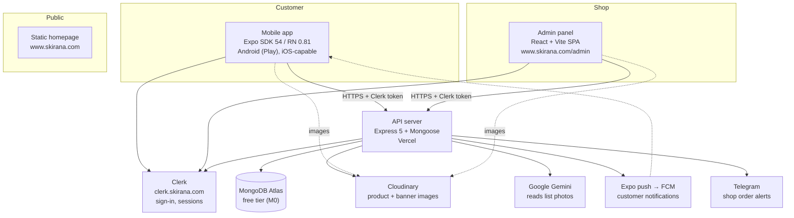
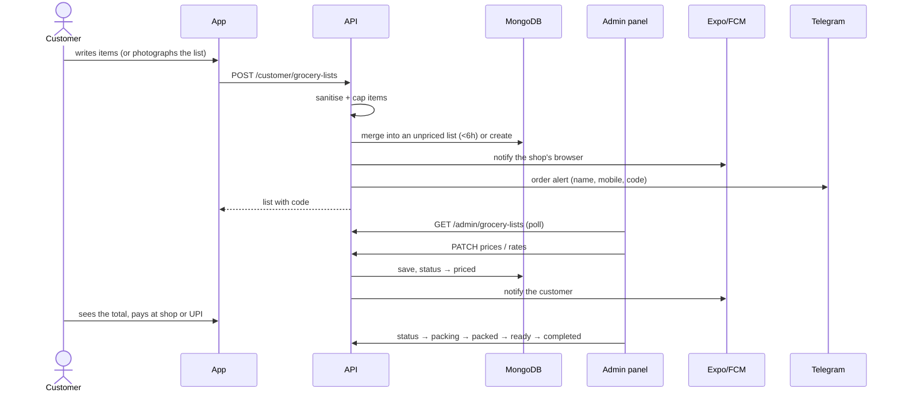
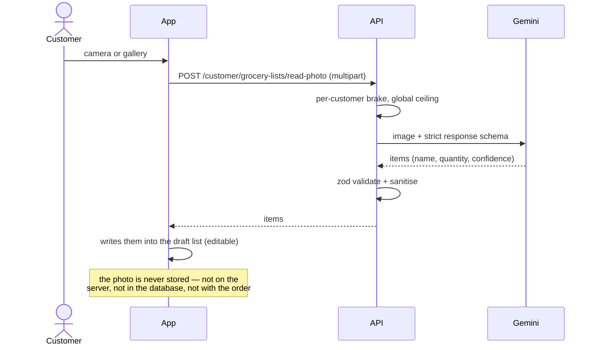
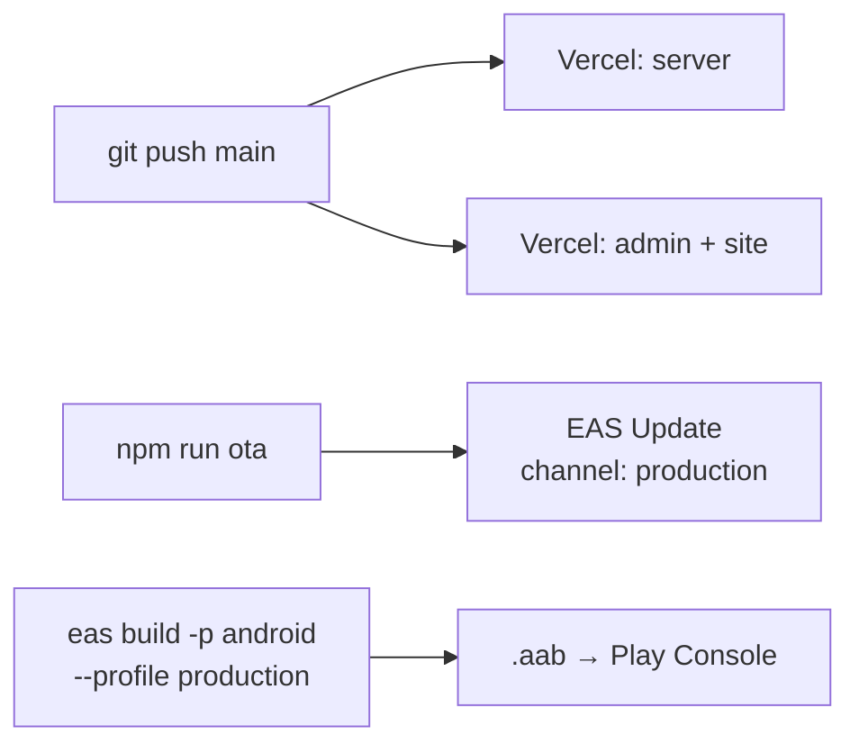

# sKirana — architecture and production runbook

What the system is made of, how a request travels through it, how to release, and
what to check first when something breaks in production.

Companion documents:

| Document | What it answers |
|---|---|
| [DATA-MODEL.md](DATA-MODEL.md) | Every collection, field, index and relationship |
| [API.md](API.md) | Every endpoint: auth, request, response, errors, side effects |
| [MOBILE-APP.md](MOBILE-APP.md) | Screens, navigation, stores, components, release |
| [ADMIN-WEB.md](ADMIN-WEB.md) | The shopkeeper's panel and the public site |
| [PRODUCTION-SETUP.md](PRODUCTION-SETUP.md) | One-time setup: domain, Clerk, keys, DNS |

---

## 1. What the product is

A customer writes a grocery list in the app — or photographs a handwritten one —
and sends it to **one shop**. The shop prices it in the admin panel and sends it
back. The customer collects the order and pays at the counter, or over UPI.

Two consequences shape the whole design:

- **There is no checkout.** Prices are not published; the shop quotes them per
  order. The app never needs a complete, priced catalogue to be useful.
- **There is one shop.** Every product, list and banner in the database belongs
  to it implicitly — there is no `shop` field anywhere. Extending this to several
  shops is a schema change, not a settings change (see DATA-MODEL.md §
  "Multi-tenant readiness").

---

## 2. The pieces



### Where each piece lives

| Piece | Where | Notes |
|---|---|---|
| Mobile app | Play Store (`com.skirana.app`) + OTA via EAS Update | `mobile/` |
| API server | Vercel project → `type-script-project-jtdk.vercel.app` | `server/`, entry `src/server.ts` |
| Admin + public site | Vercel project → `www.skirana.com` | `client/`, two HTML entries |
| Database | MongoDB Atlas M0, database `ecom` | connection string in `MONGO_URI` |
| Auth | Clerk production instance on `clerk.skirana.com` | Google sign-in + email code |
| Images | Cloudinary cloud `dnlqyxhpg` | product, category and banner images |

Both Vercel projects deploy from the same GitHub repository on a push to `main`.
A push therefore ships **server and admin together**; the mobile app is separate
(see § 6).

---

## 3. How a request travels

```mermaid
sequenceDiagram
    participant App as Mobile app
    participant Clerk
    participant API as Express (Vercel)
    participant Mongo

    App->>Clerk: getToken() (cached; 8s timeout)
    Clerk-->>App: JWT
    App->>API: GET /customer/... (Authorization: Bearer)
    API->>API: clerkMiddleware() verifies the token
    API->>API: requireAuth → userId
    API->>Mongo: find/insert
    Mongo-->>API: documents
    API-->>App: { status, data } envelope
```

Four things worth knowing about that path:

1. **The token is best-effort.** `mobile/src/lib/api.ts` gives Clerk 8 seconds to
   produce a token and then sends the request without one, so public screens
   still load if Clerk is slow. Protected routes then answer 401, which the app
   treats as "signed out", not as an error.
2. **A DB user is created on demand.** `server/src/services/user-sync.ts` maps a
   Clerk user id to a `users` document, re-linking an existing record when the
   same *verified* email comes back under a new Clerk id. This exists because a
   Clerk instance change once orphaned accounts.
3. **Every response is an envelope** (`server/src/utils/envelope.ts`); the app
   unwraps `data` in one place.
4. **Errors are one shape.** `server/src/middleware/errorhandler.ts` returns the
   message of an `AppError` as-is, and a bare `"Internal server error"` for
   anything else — so a 500 in the logs means "we threw something unplanned",
   and the customer sees nothing useful. Prefer `AppError` with a human message.

---

## 4. The main flow: a list, end to end



Two rules inside that flow that surprise people:

- **The 6-hour merge window.** A second send within six hours is appended to the
  existing unpriced list instead of creating a new order
  (`server/src/routes/customer/grocery-list.routes.ts`). This is why "I sent two
  lists and see one order" is correct behaviour, not a bug.
- **The phone number is asked once**, at the first send, and is stored on the
  user — not on the list.

### Reading a photo of a list



The customer checks and corrects the text before sending, which is the point:
a misread item becomes a wrong bill otherwise.

---

## 5. Environments and configuration

Secrets live in three places and nowhere else. **Never commit them; never paste
them into chat.**

| Place | Holds |
|---|---|
| Vercel → server project | `MONGO_URI` · `CLERK_SECRET_KEY`, `CLERK_PUBLISHABLE_KEY` · `CLOUDINARY_CLOUD_NAME`, `CLOUDINARY_API_KEY`, `CLOUDINARY_API_SECRET` · `GEMINI_API_KEY`, `GEMINI_MODEL` (optional) · `CORS_ORIGINS` · `ADMIN_EMAILS` · `SHOP_NAME`, `SHOP_UPI_ID` · `TELEGRAM_BOT_TOKEN`, `TELEGRAM_CHAT_ID` · `FIREBASE_PROJECT_ID`, `FIREBASE_CLIENT_EMAIL`, `FIREBASE_PRIVATE_KEY` (admin web push) · `RAZORPAY_KEY_ID`, `RAZORPAY_KEY_SECRET` (online payment; the app itself only uses pay-at-shop and UPI links) · `APP_LATEST_VERSION`, `APP_MIN_VERSION`, `ANDROID_PACKAGE` (update prompt) |
| Vercel → admin project | `VITE_BACKEND_URL` · `VITE_CLERK_PUBLISHABLE_KEY` · `VITE_FIREBASE_*` (browser push for the shop) |
| `mobile/.env` (in git, public values only) | `EXPO_PUBLIC_CLERK_PUBLISHABLE_KEY` (`pk_live_…`), `EXPO_PUBLIC_BACKEND_URL` |

(The list above is every variable this system needs. Most of them are what
`grep -rho "process\.env\.[A-Z_]*" server/src` and the `import.meta.env`
equivalent in `client/src` return, but two are not: `CLERK_SECRET_KEY` and
`CLERK_PUBLISHABLE_KEY` are read by `@clerk/express` itself, never by our own
code. If you add one, add it here.)

Rules that have already cost time once:

- **`VITE_` values are baked in at build time.** Changing one in Vercel does
  nothing until you redeploy.
- **Expo reads `.env.local` for production bundles too.** A test key there would
  ship to customers. Test keys belong in `.env.development.local`, and
  `mobile/scripts/preflight-ota.cjs` refuses to publish unless the key resolves
  to `pk_live_`.
- **`CORS_ORIGINS` must list every origin the admin is served from**, including
  the `www.` form.

---

## 6. Releasing



**Server and admin**: push to `main`. Both Vercel projects rebuild. There is no
separate deploy step.

**Mobile — over the air (`cd mobile && npm run ota`)**: ships JavaScript and
assets to installs whose `runtimeVersion` matches. `app.json` sets
`runtimeVersion.policy: "appVersion"`, so an OTA reaches every install of the
same version (today 1.0.4). It applies on the **second** launch: the first
launch downloads it in the background.

**Mobile — a new native build** is required for anything OTA cannot carry: a new
permission, a new native module, an Expo SDK upgrade, or a version bump. Build
with `eas build --platform android --profile production`, then upload the `.aab`
to the Play Console.

**Rollback**: `git revert <commit>` then push (server/admin), or publish a new
OTA from the reverted commit (mobile). There is no "undo" button for either.

**After a Play release reaches 100%**: set `APP_LATEST_VERSION` on the server to
the new version and redeploy, so older installs are prompted to update. Doing
this before the rollout completes prompts people to fetch a version they cannot
get yet.

---

## 7. Platform limits that shape the design

| Limit | Value | Why it matters here |
|---|---|---|
| Vercel response body | ~4.5 MB | The unpaginated product list hits this at roughly 5,000 products |
| Vercel function duration | project setting | Reading a photo takes 10–20 s; raise Max Duration if reads time out |
| MongoDB Atlas M0 | shared CPU, 512 MB | Unindexed collection scans are felt immediately; see DATA-MODEL.md |
| Cloudinary free | 25 credits/month (1 credit ≈ 1 GB bandwidth or 1,000 transformations) | Images are served resized and in WebP for exactly this reason |
| Gemini free tier | ~10–15 requests/minute | `photo-list-parser.ts` brakes per customer and caps the whole server |
| Expo push | free | Delivery via FCM; a stale token is dropped by the server |

---

## 8. Production runbook

Symptoms that have actually happened, and what caused them. Check in this order.

### The app shows "Internal server error"

That string comes from our own error handler, so **the server threw something
unplanned**. Check the Vercel function logs for the stack. Past causes:

- A Mongoose validation error reaching the handler — e.g. a list was created
  with `totalItems: 0` while the schema demanded at least 1.
- An external service failing (Cloudinary, Gemini) inside a route that does not
  wrap it in an `AppError`.

Fix forward by throwing an `AppError` with a message the customer can act on.

### The admin panel is blank / redirects in a loop

- Is the origin listed in `CORS_ORIGINS` (including `www.`)? A CORS failure
  looks like a blank page, not an error.
- Is `VITE_CLERK_PUBLISHABLE_KEY` the live key, and was the project redeployed
  after it changed?

### A customer cannot sign in, or the login screen returns after signing in

- Clerk can hold a session in `pending` state when an instance requires
  something the app does not collect (organisation membership, MFA). The app
  clears pending sessions (`mobile/src/lib/clerk-session.ts`), but the real fix
  is in the Clerk dashboard.
- `session_exists` means the device already holds a session; the app recovers by
  either adopting it or signing out.

### "User is not found in the DB"

The Clerk user id has no matching `users` document and re-linking failed —
usually a unique-index conflict on `email`. Look for `E11000` in the logs and
see `server/src/services/user-sync.ts`.

### Product images are blank, or the Shop screen feels slow

- `expo-image` on Android leaves an image **blank** if the source changes while
  a `transition` cross-fade is running. Do not add `transition` to list images
  on SDK 54.
- `cachePolicy` defaults to `disk` only; list images must set `memory-disk` or
  every scroll back up re-decodes them.

### Reading a list photo fails

- `GEMINI_API_KEY` missing on the server → the API says so plainly.
- Too many reads at once → the per-customer brake or the global ceiling in
  `photo-list-parser.ts` answers 429/503.
- Timeout → raise Vercel's Max Duration for the server project.

### An OTA did not reach a phone

- OTA applies on the **second** launch.
- The build's `runtimeVersion` must match the update's. A build of 1.0.3 never
  receives a 1.0.4 update.
- Check the channel: `production`.

### Sheets do not open / the screen goes black

Both have happened, both from the same area:

- `@gorhom/bottom-sheet` v5 does not work with Reanimated 4 (Expo SDK 54): its
  sheets never open. The app's sheet is hand-written for this reason
  (`mobile/src/components/ui/Sheet.tsx`).
- A black screen means a **render-time exception** took the React tree down. The
  known case: a sheet's contents used `useNavigation()` while the portal host
  sat outside `NavigationContainer`. Sheet contents now render behind an error
  boundary, so this shows a message instead of a black screen.

---

## 9. Conventions worth keeping

- **Sanitise at the boundary, once.** Everything a customer types passes through
  `server/src/utils/sanitizeItem.ts`: control characters, bidi tricks and
  non-grocery punctuation are stripped, lengths are capped. Devanagari marks are
  deliberately preserved.
- **The database is the source of truth for images**; only the *delivery URL* is
  transformed (`server/src/utils/cloudinary.ts`), so sizes can change without a
  migration.
- **One definition per rule.** "How many items will be sent", "is this list
  sendable", "which order is the customer waiting on" each exist in exactly one
  function, because they were duplicated once and drifted.
- **Comments explain why, not what.** Several of the stranger-looking decisions
  in this codebase (keyboard maths, cache policies, merge windows) are load
  bearing and carry the reason next to them.
