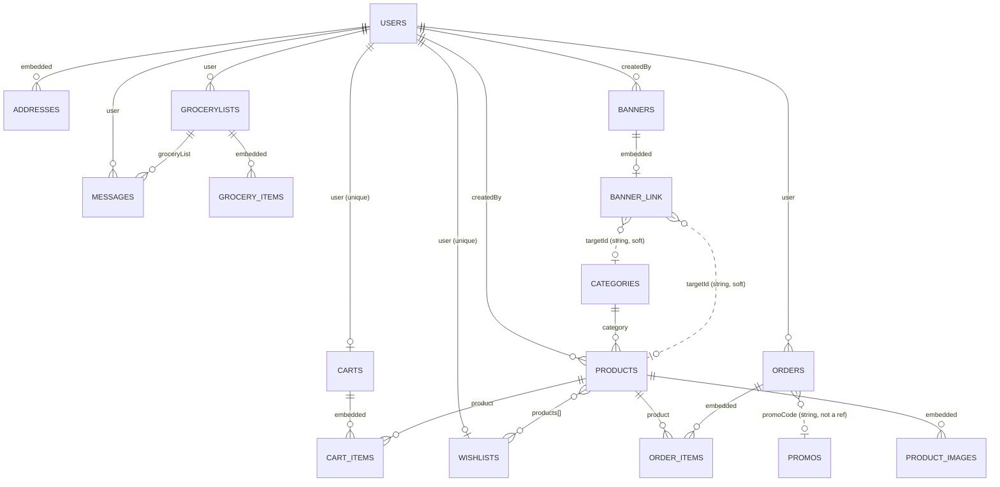
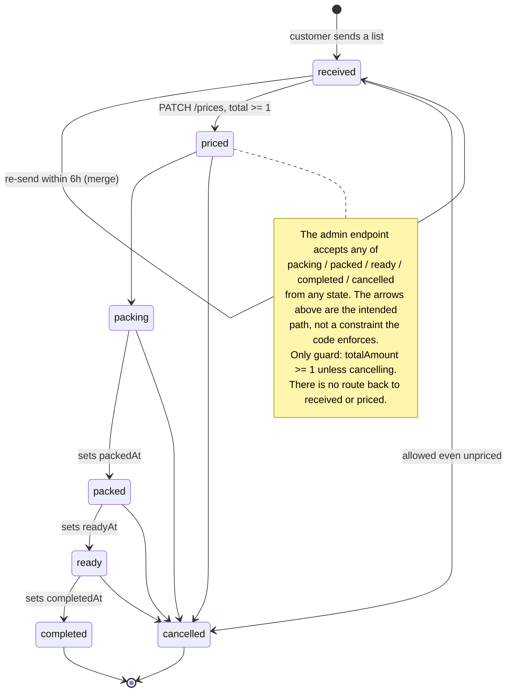
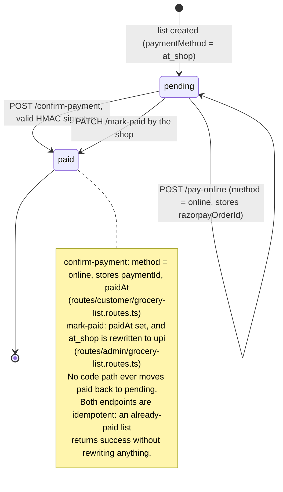

# sKirana — Data model reference

Source of truth: `server/src/models/*.ts` (schemas) and `server/src/routes/**` (what
actually reads and writes them). Every claim below names the file and symbol it
came from — never a line number, which the next commit invalidates.

Live-database facts (index lists, document counts, field usage) were read
read-only from the production `MONGO_URI` on **2026-09-19**. Counts move; the
*shape* observations are the point.

The database is MongoDB via Mongoose 9 (`server/src/db.ts`). One connection,
one database, no transactions anywhere in the codebase.

---

## 1. Overview

Solid lines are real `ObjectId` refs declared in a schema. Dotted lines are
*soft* pointers: a plain string that the code resolves by hand
(`server/src/models/Banner.ts`, `server/src/models/Order.ts`).

### Collections at a glance

| Collection | Model file | Live docs | Role |
|---|---|---|---|
| `users` | `server/src/models/User.ts` | 32 | People + addresses + push tokens + points |
| `products` | `server/src/models/Product.ts` | 84 | Catalogue |
| `categories` | `server/src/models/Category.ts` | 13 | Catalogue taxonomy |
| `grocerylists` | `server/src/models/GroceryList.ts` | 130 | **The live business object** — a customer's order |
| `messages` | `server/src/models/Message.ts` | 35 | Chat per grocery list, TTL 30 days |
| `banners` | `server/src/models/Banner.ts` | 4 | Home carousel |
| `orders` | `server/src/models/Order.ts` | 1 | Legacy cart-checkout order (see §5) |
| `carts` | `server/src/models/Cart.ts` | 2 | Legacy cart |
| `wishlists` | `server/src/models/Wishlist.ts` | 4 | Saved products |
| `promos` | `server/src/models/Promo.ts` | 3 | Discount codes |
| `customlists` | — none — | 0 | **Orphan.** No model, no code reference anywhere in the repo. Origin unverified; safe to ignore, probably safe to drop. |

There is **no** `pushtokens` / `adminpushtokens` collection. Push tokens are string
arrays on `users` — see §2.1.

---

## 2. Collections

### 2.1 `users` — `server/src/models/User.ts`

One record per person (customer or shopkeeper), created/kept in step with Clerk by
`server/src/services/user-sync.ts`.

| Field | Type | Default | Required | Meaning |
|---|---|---|---|---|
| `clerkUserId` | String | — | yes (`User.ts`) | Clerk's id for this person. Per Clerk **instance** — see the re-link trap in §4. |
| `name` | String | — | no (`User.ts`) | Display name. Customer-editable (`routes/customer/profile.routes.ts`). Null on some live docs. |
| `email` | String | — | no, but **unique** (`User.ts`) | Lower-cased, trimmed. The re-link key after a Clerk instance change. |
| `phone` | String | `""` | no (`User.ts`) | 10-digit Indian mobile, normalised (`utils/phone.ts`). |
| `role` | String enum | `"user"` | no (`User.ts`) | `user` \| `admin`. Set from `ADMIN_EMAILS` env at sync time (`services/user-sync.ts`). |
| `points` | Number | `0` | min 0 (`User.ts`) | Store credit. Credited on return (`routes/customer/orders.routes.ts`), debited at points checkout (`routes/customer/checkout-with-points.routes.ts`). |
| `addresses` | `[addressSchema]` | `[]` | no (`User.ts`) | Embedded, see below. |
| `pushTokens` | `[String]` | `[]` | no (`User.ts`) | Expo push tokens, one per mobile device. |
| `webPushTokens` | `[String]` | `[]` | no (`User.ts`) | FCM web-push tokens for admin browsers. |
| `createdAt` / `updatedAt` | Date | auto | — | `timestamps: true` (`User.ts`) |

**Embedded `addresses[]`** (`User.ts`) — `timestamps: false`, `_id` **not**
disabled, so each address has its own `_id`, which the address routes use as the
handle (`routes/customer/address.routes.ts`).

| Field | Type | Default | Required |
|---|---|---|---|
| `fullName` | String | — | yes (`User.ts`) |
| `address` | String | — | yes (`User.ts`) |
| `state` | String | — | yes (`User.ts`) |
| `postalCode` | String | — | yes (`User.ts`) |
| `isDefault` | Boolean | `false` | no (`User.ts`) |

**Indexes — declared:** `clerkUserId` unique (`User.ts`, note it is declared
*twice*: `unique: true` plus `index: true`, which yields one index), `email` unique
(`User.ts`).

**Indexes — live:** `_id_`, `clerkUserId_1` (unique), `email_1` (unique).
**No mismatch today.** The historical case is documented in the schema itself
(`User.ts`): `email_1` existed in the database as a legacy unique index
*before* anything in the code declared it, which is why a Clerk instance move
caused "User is not found in the DB" — a second record with the same email could
not be inserted. It is now declared, so the code says what the database enforces.

Live facts worth knowing: `email_1` is **not** sparse and **not** partial, so at
most *one* document may lack an email. Right now all 32 have one (0 null/empty,
0 missing), so nothing collides yet — but phone-only sign-up would break on the
second such user. 28 users have a phone, 23 have at least one `pushToken`,
**0 have a `webPushToken`** (so admin browser alerts currently reach nobody —
`utils/webPush.ts` returns early).

### 2.2 `products` — `server/src/models/Product.ts`

The shop catalogue. Products are browsable and wishlist-able; note that grocery
lists are free text and do **not** reference products at all.

| Field | Type | Default | Required | Meaning |
|---|---|---|---|---|
| `title` | String | — | yes (`Product.ts`) | Trimmed. Searched by case-insensitive regex (`routes/customer/product.routes.ts`). |
| `description` | String | — | yes (`Product.ts`) | |
| `category` | ObjectId → `Category` | — | yes (`Product.ts`) | |
| `brand` | String | — | yes (`Product.ts`) | Also a filter facet. |
| `stock` | Number | — | yes, min 0 (`Product.ts`) | Decremented on paid checkout, incremented on return. |
| `images` | `[productImageSchema]` | `[]` | no (`Product.ts`) | At least one is enforced in the route, not the schema (`routes/admin/product.routes.ts`). |
| `colors` | `[String]` | `[]` | no (`Product.ts`) | Free text; a non-empty list makes colour mandatory at add-to-cart (`routes/customer/cart-wishlist.routes.ts`). |
| `sizes` | `[String]` enum | `[]` | no (`Product.ts`) | `S` \| `M` \| `L` \| `XL`. |
| `unit` | String enum | `"piece"` | no (`Product.ts`) | `kg` \| `g` \| `litre` \| `ml` \| `piece` \| `dozen` \| `pack`. |
| `unitValue` | Number | `1` | min 0 (`Product.ts`) | How much of `unit` is one sellable item (a 10 kg bag → `10` + `kg`). |
| `status` | String enum | `"active"` | no (`Product.ts`) | `active` \| `inactive`. Every customer-facing query filters `status: "active"`. |
| `createdBy` | ObjectId → `User` | — | yes (`Product.ts`) | The admin who added it. Never read back by any route. |
| `createdAt` / `updatedAt` | Date | auto | — | `Product.ts` |

**Embedded `images[]`** (`Product.ts`, `_id: false`): `url` (String, required),
`publicId` (String, required — the Cloudinary handle used for deletion),
`isCover` (Boolean, default `false`).

**Indexes — declared:** `{status:1, createdAt:-1}`, `{status:1, category:1, createdAt:-1}`,
`{status:1, brand:1, createdAt:-1}` (`Product.ts`; the comment at
`Product.ts` records the COLLSCAN they were added to fix).
**Indexes — live:** all three present, plus `_id_`. No mismatch.

Live facts: all 84 products are `active`. `unitValue` is **absent from 13 of 84
documents** — they predate the field; readers compensate with `?? 1`
(`routes/customer/home.routes.ts`). Unit spread: `pack` 40, `kg` 18, `piece` 11,
`g` 11, `ml` 4.

**Trap:** the two checkout routes price products from `price` and `salePercentage`
(`routes/customer/checkout.routes.ts` and
`routes/customer/checkout-with-points.routes.ts`). Neither field is in
the schema and **neither exists on any of the 84 live documents** (verified: 0 and 0).
The computed subtotal is therefore `NaN`. See §5.

### 2.3 `categories` — `server/src/models/Category.ts`

| Field | Type | Default | Required | Meaning |
|---|---|---|---|---|
| `name` | String | — | yes (`Category.ts`) | Bilingual in production, e.g. `"बेबी प्रोडक्ट्स / Baby Products"` (`scripts/rename-categories-bilingual.ts`). |
| `imageUrl` | String | `""` | no (`Category.ts`) | Shown in the app's category rail. |
| `imagePublicId` | String | `""` | no (`Category.ts`) | Cloudinary handle. |
| `createdAt` / `updatedAt` | Date | auto | — | `Category.ts` |

**Indexes — declared:** none. **Live:** `_id_` only. No mismatch.
`name` is **not** unique, in the schema or the database — duplicates are prevented
only by `scripts/seed-categories.ts` skipping names it already sees, and by the
admin not typing one twice. 13 live documents, all fields populated.

### 2.4 `grocerylists` — `server/src/models/GroceryList.ts`

The real order object. A customer writes free text (item + quantity, no price), the
shop prices it and sends it back. Holds **no photos**: a photographed paper list is
parsed to text in-request and the image is discarded (`GroceryList.ts`,
`routes/customer/grocery-list.routes.ts`).

| Field | Type | Default | Required | Meaning |
|---|---|---|---|---|
| `user` | ObjectId → `User` | — | yes (`GroceryList.ts`) | Owner. Every customer query scopes on it. |
| `customerName` | String | `""` | no (`GroceryList.ts`) | **Snapshot** taken at send time; falls back to email (`routes/customer/grocery-list.routes.ts`). |
| `customerEmail` | String | `""` | no (`GroceryList.ts`) | Snapshot. |
| `customerPhone` | String | `""` | no (`GroceryList.ts`) | Snapshot. Absent from 3 of 130 live docs. |
| `items` | `[GroceryListItemSchema]` | `[]` | no (`GroceryList.ts`) | See below. |
| `totalItems` | Number | — | **yes, min 1** (`GroceryList.ts`) | Kept in step by hand: `items.length` on add/remove (`routes/admin/grocery-list.routes.ts`, `routes/customer/grocery-list.routes.ts`). |
| `totalAmount` | Number | `0` | min 0 (`GroceryList.ts`) | `0` until priced; sum of *available* item prices. |
| `status` | String enum | `"received"` | no (`GroceryList.ts`) | `received` \| `priced` \| `packing` \| `packed` \| `ready` \| `completed` \| `cancelled`. |
| `paymentMethod` | String enum | `"at_shop"` | no (`GroceryList.ts`) | `online` \| `upi` \| `at_shop`. |
| `paymentStatus` | String enum | `"pending"` | no (`GroceryList.ts`) | `pending` \| `paid`. |
| `razorpayOrderId` | String | `""` | no (`GroceryList.ts`) | Set when the customer starts an online payment. |
| `paymentId` | String | `""` | no (`GroceryList.ts`) | Razorpay payment id after verification. |
| `seenByCustomer` | Boolean | `true` | no (`GroceryList.ts`) | Drives the app's badge; every shop-side write sets it `false`. |
| `note` | String | `""` | no (`GroceryList.ts`) | Max 300 chars, enforced in the route (`utils/sanitizeItem.ts`). Merged sends append with `" \| "` (`routes/customer/grocery-list.routes.ts`). |
| `pricedAt` | Date \| null | `null` | no (`GroceryList.ts`) | |
| `packedAt` | Date \| null | `null` | no (`GroceryList.ts`) | |
| `readyAt` | Date \| null | `null` | no (`GroceryList.ts`) | |
| `completedAt` | Date \| null | `null` | no (`GroceryList.ts`) | |
| `paidAt` | Date \| null | `null` | no (`GroceryList.ts`) | Drives the dashboard sales-per-day chart (`routes/admin/dashboard.routes.ts`). |
| `createdAt` / `updatedAt` | Date | auto | — | `GroceryList.ts`. `updatedAt` is the admin list's sort key, because merges keep `createdAt` (`routes/admin/grocery-list.routes.ts`). |

**Embedded `items[]`** (`GroceryList.ts`, `_id: false`):

| Field | Type | Default | Required | Meaning |
|---|---|---|---|---|
| `name` | String | — | yes | Sanitised item text (≤ 60 chars). |
| `quantity` | String | `""` | no | **Free text**: `"2 kg"`, `"1 packet"` (≤ 12 chars). |
| `rate` | Number | `0` | min 0 | Optional per-unit price. |
| `price` | Number | `0` | min 0 | Line total; `0` until priced, and `0` for anything out of stock. |
| `available` | Boolean | `true` | no | `false` = shop marked it out of stock; it stays on the list but is never charged. |

**Indexes — declared:** `{user:1, createdAt:-1}`, `{status:1, createdAt:-1}`
(`GroceryList.ts`). **Live:** both present plus `_id_`. No mismatch.
Note the admin list page sorts by `updatedAt` (`routes/admin/grocery-list.routes.ts`)
and no index covers that.

Live facts (130 docs): status `received` 78, `completed` 15, `priced` 13,
`cancelled` 9, `packing` 9, `ready` 5, `packed` 1. Payment: `pending` 113,
`paid` 17. Method: `at_shop` 110, `upi` 17, `online` 3. Item sub-fields `rate` and
`available` are absent from older lists (present on the first item of 75 and 79 of
130 respectively) — readers normalise with `rate ?? 0` and `available !== false`
(`routes/admin/grocery-list.routes.ts`).

### 2.5 `messages` — `server/src/models/Message.ts`

One chat message on one grocery list. Deliberately its own collection so a long
conversation never bloats the order document (`Message.ts`).

| Field | Type | Default | Required | Meaning |
|---|---|---|---|---|
| `groceryList` | ObjectId → `GroceryList` | — | yes (`Message.ts`) | The conversation it belongs to. |
| `user` | ObjectId → `User` | — | yes (`Message.ts`) | The **customer** who owns the list, on both directions of the chat (`routes/admin/grocery-list.routes.ts`). Used for scoping and push. |
| `sender` | String enum | — | yes (`Message.ts`) | `customer` \| `staff`. |
| `senderName` | String | `""` | no (`Message.ts`) | Snapshot; `SHOP_NAME` env for staff (`routes/admin/grocery-list.routes.ts`). |
| `text` | String | — | yes, **maxlength 1000** (`Message.ts`) | Also checked in both routes before save. |
| `createdAt` / `updatedAt` | Date | auto | — | `Message.ts` |

**Indexes — declared:** `{groceryList:1, createdAt:1}` (`Message.ts`) and a **TTL**
index `{createdAt:1}` with `expireAfterSeconds = 2592000` (30 days) (`Message.ts`).
**Live:** `groceryList_1_createdAt_1` and `createdAt_1` with `ttl:2592000s`, plus
`_id_`. No mismatch.

The TTL is a **hard delete performed by MongoDB itself** — no cron, no code, no
audit trail. Chat older than 30 days is simply gone, while the grocery list it
belonged to stays. Expect `messages` → `grocerylists` to resolve, never the reverse.

### 2.6 `banners` — `server/src/models/Banner.ts`

Home-carousel images.

| Field | Type | Default | Required | Meaning |
|---|---|---|---|---|
| `imageUrl` | String | — | yes (`Banner.ts`) | Cloudinary URL; re-sized per request by `cdnImage(..., "banner")`. |
| `imagePublicId` | String | — | yes (`Banner.ts`) | Cloudinary handle, deleted with the banner. |
| `title` | String | `""` | no, maxlength 80 (`Banner.ts`) | Admin's label; also the screen-reader text. |
| `isActive` | Boolean | `true` | no (`Banner.ts`) | Hidden banners stay in the admin list but never reach the app. |
| `sortOrder` | Number | `0` | no, **indexed** (`Banner.ts`) | Carousel position, 0 first. |
| `link.type` | String enum | `"none"` | no (`Banner.ts`) | `none` \| `writeList` \| `shop` \| `category` \| `product`. |
| `link.targetId` | String | — | no (`Banner.ts`) | **Plain string, not a ref.** Validated to be a live Category/Product id at write time (`routes/admin/settings.routes.ts`). |
| `startsAt` | Date \| null | `null` | no (`Banner.ts`) | Optional schedule window. |
| `endsAt` | Date \| null | `null` | no (`Banner.ts`) | Must be after `startsAt` (route-enforced, `settings.routes.ts`). |
| `createdBy` | ObjectId → `User` | — | yes (`Banner.ts`) | Never read back. |
| `createdAt` / `updatedAt` | Date | auto | — | `Banner.ts` |

`liveBannerFilter(now)` (`Banner.ts`) is what the app sees: `isActive: {$ne:false}`
and inside the window, written so that documents predating these fields still count
as visible and unscheduled. `HOME_BANNER_LIMIT = 8` (`Banner.ts`).

**Indexes — declared:** `sortOrder` (`Banner.ts`). **Live:** `sortOrder_1` plus
`_id_`. No index mismatch.

**Document mismatch, though:** all **4 live banner documents contain only**
`_id`, `imageUrl`, `imagePublicId`, `createdBy`, `createdAt`, `updatedAt`, `__v`.
They have **no** `title`, `isActive`, `sortOrder`, `link`, `startsAt` or `endsAt`.
Everything that reads them uses `?? `/`!== false` fallbacks, so this is invisible
until you query directly. Also note `listBanners()` **writes** when it detects
colliding positions: opening the admin banners page backfills `sortOrder` 0..n via
`bulkWrite` (`routes/admin/settings.routes.ts`). Since the live docs still
have no `sortOrder`, that backfill has not run on production yet — a GET will
mutate 4 documents the first time.

### 2.7 `orders` — `server/src/models/Order.ts`

The classic cart → Razorpay → delivery order. **Effectively legacy** (see §5):
1 live document, `placed`/`pending`, created 2025. The admin dashboard now counts
grocery lists as orders (`routes/admin/dashboard.routes.ts`).

| Field | Type | Default | Required | Meaning |
|---|---|---|---|---|
| `user` | ObjectId → `User` | — | yes (`Order.ts`) | |
| `customerName` | String | `""` | no (`Order.ts`) | Snapshot. |
| `customerEmail` | String | `""` | no (`Order.ts`) | Snapshot. |
| `items` | `[OrderItemsSchema]` | `[]` | no (`Order.ts`) | `{ product: ObjectId→Product (req), quantity: Number (req, min 1) }`, `_id:false` (`Order.ts`). |
| `totalItems` | Number | — | yes, min 1 (`Order.ts`) | Sum of quantities, not line count. |
| `deliveryName` | String | — | yes (`Order.ts`) | Copied from the chosen address. |
| `deliveryAddress` | String | — | yes (`Order.ts`) | Flattened `"address, state, postalCode"` (`routes/customer/checkout.routes.ts`). |
| `promoCode` | String | `""` | no, uppercased (`Order.ts`) | **A code string, not a ref to `promos`.** |
| `discountAmount` | Number | `0` | min 0 (`Order.ts`) | |
| `totalAmount` | Number | — | yes, min 0 (`Order.ts`) | |
| `paymentStatus` | String enum | `"pending"` | no (`Order.ts`) | `pending` \| `paid` \| `failed` — **nothing in the codebase ever writes `failed`** (grepped across `routes/` and `services/`). |
| `orderStatus` | String enum | `"placed"` | no (`Order.ts`) | `placed` \| `shipped` \| `delivered` \| `returned`. |
| `razorpayOrderId` | String | — | **yes** (`Order.ts`) | For points-paid orders this is a synthetic `points_<timestamp>` (`routes/customer/checkout-with-points.routes.ts`). |
| `paymentId` | String | `""` | no (`Order.ts`) | |
| `paidAt` / `deliveredAt` / `returnedAt` | Date \| null | `null` | no (`Order.ts`) | |
| `createdAt` / `updatedAt` | Date | auto | — | `Order.ts` |

**Indexes — declared:** `{user:1,createdAt:-1}`, `{orderStatus:1,createdAt:-1}`,
`{paymentStatus:1,createdAt:-1}` (`Order.ts`). **Live:** all three plus
`_id_`. No mismatch.

### 2.8 `carts` — `server/src/models/Cart.ts`

One cart per user. Legacy alongside `orders`.

| Field | Type | Default | Required | Meaning |
|---|---|---|---|---|
| `user` | ObjectId → `User` | — | yes, **unique** (`Cart.ts`) | One cart per person. |
| `items` | `[cartItemSchema]` | `[]` | no (`Cart.ts`) | |
| `createdAt` / `updatedAt` | Date | auto | — | `Cart.ts` |

**Embedded `items[]`** (`Cart.ts`, `_id:false`): `product` (ObjectId → Product,
required), `quantity` (Number, required, min 1), `color` (String, optional),
`size` (String enum `S|M|L|XL`, optional). Identity of a line is
`(product, color, size)` (`routes/customer/cart-wishlist.routes.ts`).

**Indexes — declared:** `user` unique. **Live:** `user_1` unique plus `_id_`. No mismatch.
Emptied wholesale on successful checkout (`routes/customer/checkout.routes.ts`).

### 2.9 `wishlists` — `server/src/models/Wishlist.ts`

| Field | Type | Default | Required | Meaning |
|---|---|---|---|---|
| `user` | ObjectId → `User` | — | yes, **unique** (`Wishlist.ts`) | One wishlist per person. |
| `products` | `[ObjectId → Product]` | `[]` | no (`Wishlist.ts`) | Flat array of ids; de-duplicated in the route (`routes/customer/cart-wishlist.routes.ts`), not by the schema. |
| `createdAt` / `updatedAt` | Date | auto | — | `Wishlist.ts` |

**Indexes — declared:** `user` unique. **Live:** `user_1` unique plus `_id_`. No mismatch.

### 2.10 `promos` — `server/src/models/Promo.ts`

| Field | Type | Default | Required | Meaning |
|---|---|---|---|---|
| `code` | String | — | yes, **unique**, uppercase, trim (`Promo.ts`) | The key customers type. |
| `percentage` | Number | — | yes, min 1, max 100 (`Promo.ts`) | |
| `count` | Number | — | yes, **min 1** (`Promo.ts`) | Remaining redemptions. |
| `minimumOrderValue` | Number | — | yes, min 0 (`Promo.ts`) | |
| `startsAt` | Date | — | yes (`Promo.ts`) | |
| `endsAt` | Date | — | yes (`Promo.ts`) | Must be after `startsAt` (route, `routes/admin/promo.routes.ts`). |
| `createdAt` / `updatedAt` | Date | auto | — | `Promo.ts` |

**Indexes — declared:** `code` unique. **Live:** `code_1` unique plus `_id_`. No mismatch.

**Trap:** redemption does `$inc: {count: -1}` through `updateOne`
(`routes/customer/checkout.routes.ts`), which runs **no validators**, so
`count` can legitimately sit at `0` in the database despite the schema's `min: 1`.
That is the intended "used up" state — `count: {$gt: 0}` is the real gate
(`routes/customer/promo.routes.ts`, `routes/customer/home.routes.ts`).

### 2.11 Push tokens — no collection of their own

There is no `PushToken` or `AdminPushToken` model. Tokens are arrays on `users`:

* Customer devices (Expo): `users.pushTokens`, written with `$addToSet`/`$pull`
  in `routes/customer/push-token.routes.ts`, read in `utils/push.ts`.
* Admin browsers (FCM web push): `users.webPushTokens`, written in
  `routes/admin/push-token.routes.ts`, read in `utils/webPush.ts`,
  and **self-pruning** — tokens FCM reports as dead are `$pull`ed from *every* admin
  (`utils/webPush.ts`).

---

## 3. Relationships, ownership and cascades

**Ownership.** `users._id` is the owner key for `grocerylists`, `messages`, `carts`,
`wishlists` and `orders`. Every customer route re-queries with `user: dbUser._id`
rather than trusting an id from the client (e.g.
`routes/customer/grocery-list.routes.ts`). Admin routes are ungated by
owner — `requireAdmin` (`middleware/auth.ts`) sees everything.

| From → To | Kind | On delete of the target |
|---|---|---|
| `products.category` → `categories` | hard ref, required | **Blocked.** Category deletion 400s while any product points at it (`routes/admin/product.routes.ts`). |
| `carts.items.product` → `products` | hard ref | **No cascade.** Deleted products leave dangling ids; `populate` yields `null` and the row is dropped at read time (`routes/customer/cart-wishlist.routes.ts`). |
| `wishlists.products[]` → `products` | hard ref | **No cascade.** Same null-guard (`routes/customer/cart-wishlist.routes.ts`). |
| `orders.items.product` → `products` | hard ref | **No cascade.** Return-to-stock silently no-ops on a missing product (`routes/customer/orders.routes.ts`). |
| `banners.link.targetId` → category/product | soft string | **No cascade.** The app degrades the tap action to `none` when the target is gone or inactive (`routes/customer/home.routes.ts`). The admin view shows a stale id with no name (`routes/admin/settings.routes.ts`). |
| `messages.groceryList` → `grocerylists` | hard ref | **No cascade either way** — and nothing deletes a grocery list at all. Messages disappear on their own via TTL (`Message.ts`). |
| `orders.promoCode` → `promos.code` | soft string | No cascade; a deleted promo leaves the code as a historical label. |
| `products.createdBy`, `banners.createdBy` → `users` | hard ref | No cascade; never read back. |

**Nothing deletes a `User`, `GroceryList`, `Message`, `Cart`, `Wishlist` or `Order`.**
The only delete operations in the whole server are category, product, promo and
banner (`routes/admin/product.routes.ts`, `routes/admin/promo.routes.ts`,
`routes/admin/settings.routes.ts`). Banner delete also removes the Cloudinary
image best-effort, swallowing failures (`settings.routes.ts`).

**Cascading *updates* that do exist:**

* Editing your profile rewrites the denormalised `customerName`/`customerPhone` on
  all your **open** grocery lists; `completed` and `cancelled` ones keep the old
  snapshot on purpose (`routes/customer/profile.routes.ts`).
* Sending a list may **update an existing list instead of creating one** (the merge
  window, §4).
* Clerk re-link rewrites `users.clerkUserId` in place, so everything already pointing
  at that `_id` follows the person automatically (`services/user-sync.ts`).
* `scripts/seed.ts` `deleteMany`s Banners, Categories, Products and Promos.
  It is a destructive dev script pointed at whatever `MONGO_URI` is in the env.

**Cloudinary leaks** (files the database forgets about): replacing a category image
does not delete the old one (`routes/admin/product.routes.ts`), and deleting a
product does not delete its images (`routes/admin/product.routes.ts`).
Product *edits* do clean up removed images (`product.routes.ts`).

---

## 4. Invariants and traps enforced in code, not in the schema

| Invariant | Where it lives |
|---|---|
| Item name/quantity are stripped of control, zero-width and bidi characters, then reduced to an allowlist of letters (any script, incl. Devanagari marks), digits and `. , & ' - / ( ) % ×` | `utils/sanitizeItem.ts` |
| Objects/arrays in a string field collapse to `""`, so a `{$gt:""}` payload can never reach a query | `utils/sanitizeItem.ts` |
| Name ≥ 2 chars, name ≤ 60, quantity ≤ 12, note ≤ 300, ≤ 50 items per send, ≤ 100 items per list, ≤ 500 raw rows accepted | `utils/sanitizeItem.ts`; applied at `routes/customer/grocery-list.routes.ts` and `routes/admin/grocery-list.routes.ts` |
| **Merge window:** a new send merges into your existing `received` + `pending` list if that list was touched in the last 6 hours; otherwise it opens a new one. This is why two visits can share one `_id`, and why `createdAt` is not the admin sort key | `routes/customer/grocery-list.routes.ts` |
| Pricing must send exactly as many items as the list holds; names/quantities are taken from the stored list, only price/rate from the shop | `routes/admin/grocery-list.routes.ts` |
| An unavailable item is always priced `0` and excluded from the total | `routes/admin/grocery-list.routes.ts` |
| A list cannot be priced to a total below ₹1 | `routes/admin/grocery-list.routes.ts` |
| A list cannot be moved past `received`/`priced` (except to `cancelled`) until `totalAmount ≥ 1` | `routes/admin/grocery-list.routes.ts` |
| A list cannot be marked paid before it is priced | `routes/admin/grocery-list.routes.ts` |
| `completed` / `cancelled` lists reject item edits and additions — but **not** further status changes | `routes/admin/grocery-list.routes.ts` |
| A customer may remove an item only while `received`/`priced`, only while unpaid, and never down to zero items | `routes/customer/grocery-list.routes.ts` |
| `seenByCustomer` is forced to `false` on every shop-side write (price, status, mark-paid, availability, item edit, item add) | `routes/admin/grocery-list.routes.ts` |
| Razorpay payments are only accepted after an HMAC-SHA256 signature check against the stored `razorpayOrderId` | `routes/customer/grocery-list.routes.ts`, `routes/customer/checkout.routes.ts` |
| Phone numbers are normalised to 10 digits starting 6-9 (strips `+91`/leading `0`) and rejected otherwise | `utils/phone.ts`, used at `routes/customer/profile.routes.ts` and `routes/customer/grocery-list.routes.ts` |
| Stock decrements are conditional (`stock: {$gte: qty}`) so two concurrent checkouts cannot oversell | `routes/customer/checkout.routes.ts` |
| Points debits are conditional (`points: {$gte: total}`) with a compensating credit if any later step throws — the closest thing to a transaction in the codebase | `routes/customer/checkout-with-points.routes.ts` |
| Returns are allowed only on `delivered` orders within 7 days of `deliveredAt` | `routes/customer/orders.routes.ts` |
| `role: "admin"` is derived from the `ADMIN_EMAILS` env var at every sync, not set by hand | `services/user-sync.ts` |
| Re-link by email requires a **verified** email, otherwise anyone could claim another person's record | `services/user-sync.ts` |
| Request bodies are capped at 100 kb before they reach any handler | `server.ts` |
| Search strings are regex-escaped before being used as `$regex` | `utils/regex.ts` via `routes/customer/product.routes.ts`, `routes/admin/product.routes.ts` |

**Known bugs that shape the data** (report, not guesswork — read the lines):

* `routes/customer/cart-wishlist.routes.ts` — `if (itemIndex > 0)` should be
  `>= 0`. Re-adding the **first** line of a cart pushes a duplicate row instead of
  increasing its quantity, so `carts.items` can hold two rows with identical
  `(product, color, size)`.
* `routes/customer/cart-wishlist.routes.ts` — `cart.create(...)` is called on a
  `cart` that is `null` at that point; `/cart/sync` throws for any user without a
  cart. The `res.json` at line 439 is also inside the `for` loop, so the route
  responds once per item and never at all for an empty payload.
* `routes/customer/home.routes.ts` — promos are sorted by `createAt` (sic), a
  field that does not exist; the sort is a no-op.
* `routes/admin/grocery-list.routes.ts` — marking an item unavailable does
  not change `totalItems`, which is correct (the item stays on the list), but
  `totalItems` and `items.length` can still drift from historical writes; treat
  `items.length` as the truth and `totalItems` as a cached copy.

---

## 5. Lifecycles

### GroceryList `status`

Created as `received` (`routes/customer/grocery-list.routes.ts`). Pricing is its
own endpoint and is the only way to reach `priced`
(`routes/admin/grocery-list.routes.ts`). Everything else goes through
`PATCH /grocery-lists/:id/status`, whose allowed target set is flat — the only guard
is `totalAmount ≥ 1` (`routes/admin/grocery-list.routes.ts`).

### Payment status (`grocerylists.paymentStatus`)

`orders.paymentStatus` has a third value, `failed`, that nothing ever writes
(`server/src/models/Order.ts`).

### Why `orders`/`carts` count as legacy

The mobile app's whole order flow is grocery lists. The admin dashboard computes
"orders", "pending", "completed" and "total sales" from `grocerylists`, not `orders`
(`routes/admin/dashboard.routes.ts`). The cart checkout routes are still
mounted (`server.ts`) but price products from `price`/`salePercentage`, fields
that exist in neither the schema nor any of the 84 live product documents — so the
subtotal they compute is `NaN`. Live counts agree: 1 order, 2 carts, 130 grocery lists.

---

## 6. If you are adding a field

A field has to be added in four or five places before it reaches a screen. Missing
any one of them fails silently — usually as `undefined` in the UI, not an error.

1. **Schema** — `server/src/models/<Model>.ts`. Give it a default. Existing
   documents will **not** have it (see `unitValue`, 71/84, and every banner field),
   so readers must tolerate absence; a default in the schema only applies to new
   writes and to Mongoose-hydrated reads, not to `.lean()` results or raw driver reads.
2. **Route mapper** — the hand-written `mapX` function that converts a document to
   the API shape. Fields not listed there never leave the server:
   * `routes/admin/grocery-list.routes.ts` (`mapGroceryList`, admin)
   * `routes/customer/grocery-list.routes.ts` (`mapGroceryList`, customer)
   * `routes/admin/settings.routes.ts` (`mapBanner`)
   * `routes/customer/home.routes.ts` (home payload)
   * `routes/customer/address.routes.ts` (`mapAddress`)
   * `routes/admin/promo.routes.ts` (`mapPromo`)
   * `routes/customer/profile.routes.ts` (`mapProfile`)
3. **Projections** — anything with `.select("...")` or `.lean<RowType>()` silently
   drops your field even when the mapper asks for it. Check
   `routes/customer/orders.routes.ts`, `routes/admin/orders.routes.ts`,
   `routes/customer/home.routes.ts`, `routes/admin/dashboard.routes.ts`.
4. **Mobile types** — `mobile/src/features/customer/<feature>/types.ts`
   (e.g. `mobile/src/features/customer/grocery-list/types.ts` for a list field).
5. **Admin web types** — `client/src/features/<area>/<feature>/types.ts`
   (e.g. `client/src/features/admin/grocery-lists/types.ts`), plus the request
   body type if the admin writes the field
   (`client/src/features/admin/grocery-lists/types.ts`).

If the field must be queryable or sortable, add an index in the same commit and
remember the declared/live gap: **indexes only appear in the database when a process
with that model actually connects and `autoIndex` runs**. Verify against the live
cluster before assuming a declared index exists.

---

## 7. Multi-tenant readiness

Classification only: what each collection would have to become if several shops each
ran their own catalogue and their own lists in this one database. No migration design.

| Collection | Classification | Reason |
|---|---|---|
| `users` | **Stays global** (identity), **plus a new join** for staff | A person is identified by their Clerk id and email, which are instance-wide, and a customer may shop at several shops. But `role` is a single global flag (`User.ts`) and admin-ness comes from one `ADMIN_EMAILS` env list (`services/user-sync.ts`) — that has to become a per-shop membership/role join. `webPushTokens` targeting already broadcasts to *every* admin (`utils/webPush.ts`). |
| `products` | **Shop-scoped** | Each shop owns its catalogue; every customer query would need `shop` as the leading key, which also means all three compound indexes (`Product.ts`) get re-fronted by `shop`. |
| `categories` | **Shop-scoped** | Category CRUD is per-catalogue and the delete guard counts only that catalogue's products (`routes/admin/product.routes.ts`). A shared taxonomy is possible but would need a per-shop join to decide which categories a shop shows — more work, not less. |
| `grocerylists` | **Shop-scoped** | A list is addressed to one shopkeeper. The admin view is an unfiltered `GroceryList.find()` (`routes/admin/grocery-list.routes.ts`), which would leak every shop's orders without a scope. Both declared indexes would need `shop` prefixed. |
| `messages` | **Shop-scoped, needs a denormalised shop field** | Scope is inherited from the parent list, so correctness only needs the list. But the conversations view aggregates the *whole* `messages` collection before joining lists (`routes/admin/grocery-list.routes.ts`) — with no `shop` on the message itself, that aggregation cannot be scoped or indexed. |
| `banners` | **Shop-scoped** | The Home carousel is the shop's own shopfront, and `link.targetId` points at that shop's products/categories (`routes/admin/settings.routes.ts`). |
| `promos` | **Shop-scoped** | A discount is the shop's money. The `code` unique index (`Promo.ts`) must become unique per `(shop, code)`, or two shops can never use "DIWALI10". |
| `orders` | **Shop-scoped** (legacy) | Same reasoning as grocery lists; the admin list is unfiltered (`routes/admin/orders.routes.ts`). Low priority — 1 live document. |
| `carts` | **Needs a changed key** | A cart holds products that belong to one shop, so it becomes per `(user, shop)`. The `user` unique index (`Cart.ts`) blocks that today and must become a compound unique. |
| `wishlists` | **Stays global** | It is a flat list of product ids, and each product already carries its own shop, so a single per-user wishlist spanning shops reads correctly with no new field. `user` unique (`Wishlist.ts`) stays valid. |
| `users.pushTokens` | **Stays global** | A token identifies a device, not a shop relationship; per-shop targeting is a query over the membership join, not a change to the array. |
| `users.webPushTokens` | **Needs the staff join** | It is read by `role: "admin"` across all users (`utils/webPush.ts`); with several shops that alerts the wrong shopkeepers. |
| `users.addresses` | **Stays global** | A delivery address belongs to the person (`User.ts`). |
| `customlists` | **Drop** | Empty, no model, no reference in the repo. |

---

*Anything not stated above was not verified. Live-database numbers are a snapshot
of 2026-09-19 and should be re-read before you rely on them.*
