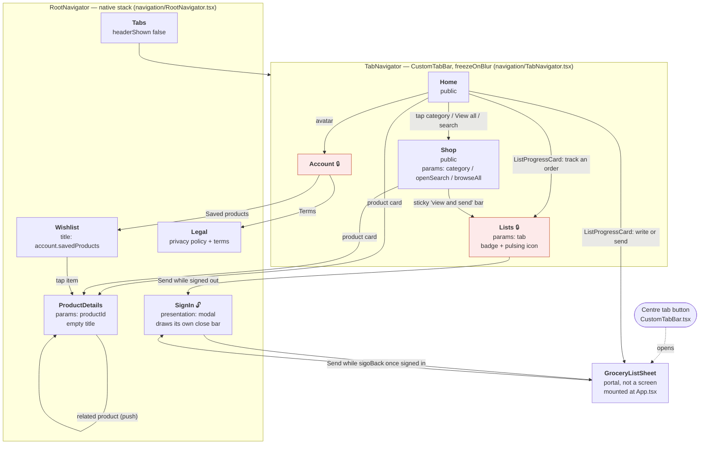

# sKirana — mobile app developer reference

Everything you need to fix a bug or add a screen in `mobile/` without having seen
the app before. Every claim below cites the code it comes from as `path:line`.

Companion documents:

| Document | What it answers |
|---|---|
| [ARCHITECTURE.md](ARCHITECTURE.md) | The whole system: server, admin, release, runbook |
| [PRODUCTION-SETUP.md](PRODUCTION-SETUP.md) | One-time setup: domain, Clerk, keys, DNS |

> **`mobile/README.md` is stale.** It describes a cart, checkout, orders, addresses
> and Razorpay (`src/lib/razorpay.ts`). None of that exists any more — there is no
> cart and no checkout in this app. Trust this document and the code, not that one.
>
> **`mobile/AGENTS.md` is also wrong**: it points at Expo SDK 57 docs, while
> `mobile/package.json` pins `expo ^54.0.35`. Read the **SDK 54** docs.

---

## 1. Orientation

### What the app does for a customer

There is **no cart and no checkout**. Prices are not published. The app is a
notebook that the customer writes a grocery list into and sends to **one** shop.

1. **Write.** The customer types items and quantities onto a paper-styled list
   (`mobile/src/components/GroceryListEditor.tsx`), or photographs a
   handwritten list and lets the server read it into the same editable lines
   (`mobile/src/components/ScanListPhoto.tsx`). They can also browse the
   catalogue and tap "+" on a product card, which adds it to that same list
   (`mobile/src/components/ProductCard.tsx`).
2. **Send.** One Send flow, shared everywhere
   (`mobile/src/features/customer/draft-list/use-send-draft.ts`). It requires
   a signed-in account and, the first time, a mobile number.
3. **Get price.** The shop prices the list in the admin panel. The customer
   watches the status move through `received → priced → packing → packed → ready`
   (`mobile/src/features/customer/grocery-list/types.ts`), and can chat with the
   shop about the order (`mobile/src/components/ChatSheet.tsx`).
4. **Collect.** They pay over UPI (a deep link into GPay/PhonePe —
   `mobile/src/lib/upi.ts`) or at the counter, and collect in person.

Bilingual, Hindi-first: the app defaults to Hindi
(`mobile/src/lib/i18n/index.ts`) and asks the language on first launch
(`mobile/src/screens/LanguagePicker.tsx`).

### Folder layout under `mobile/src`

```
src/
  navigation/     RootNavigator (native stack) + TabNavigator (bottom tabs) + param types
  screens/        One file per screen. Also SplashScreen + LanguagePicker, which are
                  NOT navigator screens — App.tsx renders them directly.
  components/     Shared components. `ui/` holds the primitives: Sheet, Button, Badge, Card.
                  `auth/` holds the login panel and the page that wraps it.
  features/       The data layer, grouped by domain.
    auth/                     store, api, types, useBootstrapAuth
    customer/
      account/                the customer's saved profile (name + mobile the shop sees)
      draft-list/             THE unsent list: store, quantity maths, use-send-draft
      grocery-list/           sent lists: store, api, types, journey-stage
      grocery-sheet/          open/closed state of the list sheet
      home/                   home payload: banners, categories, recent products
      products/               catalogue list + details + shared helpers
      push/                   Expo push token registration and hand-back
      quantity-sheet/         which product the single root quantity picker is asking about
      wishlist/               saved products
  lib/            api, env, i18n, toast, phone, upi, clean-text, token-cache,
                  clerk-session, push, utils, keyboard hooks
```

Path alias `@/*` → `./src/*` (`mobile/tsconfig.json`), and `strict: true`
(`mobile/tsconfig.json`).

### Naming conventions actually used

| Thing | Convention | Example |
|---|---|---|
| Components / screens | `PascalCase.tsx`, named export (never `default`) | `mobile/src/screens/ShopScreen.tsx` |
| Hooks, stores, helpers | `kebab-case.ts` | `mobile/src/features/customer/draft-list/use-send-draft.ts` |
| A feature folder | `store.ts` + `api.ts` + `types.ts`, same three names every time | `mobile/src/features/customer/wishlist/` |
| Zustand hook | `use<Domain>Store` | `useDraftListStore`, `useCustomerGroceryListStore` |
| Customer-facing types | prefixed `Customer…` | `CustomerGroceryList`, `CustomerProduct` |
| Styling | NativeWind `className`; inline `style` only for computed values (shadows, measured sizes) | `mobile/src/components/ProductCard.tsx` vs |
| Colours | Semantic Tailwind tokens (`bg-primary`, `text-muted-foreground`) defined in `mobile/tailwind.config.js`. Raw hex appears only where a non-Tailwind API needs it (`@expo/vector-icons` `color`, SVG `fill`) | `mobile/src/components/CustomTabBar.tsx` |
| Comments | Explain **why**, not what. Several are load-bearing — see §11 | `mobile/src/components/ProductCard.tsx` |

The app is **light-only** (`mobile/app.json`), and the theme has no dark
variants — don't add `dark:` classes expecting them to work.

### The root provider tree

Order matters. From `mobile/App.tsx`:

```
GestureHandlerRootView                     App.tsx   — required by the Sheet's pan gesture
└─ ClerkProvider (tokenCache = SecureStore) App.tsx
   └─ SafeAreaProvider                      App.tsx
      ├─ NavigationContainer                App.tsx
      │  └─ PortalProvider                  App.tsx   — INSIDE the container on purpose
      │     ├─ <Bootstrap/>                 App.tsx   — renders null; runs the startup effects
      │     ├─ <RootNavigator/>             App.tsx
      │     ├─ <GroceryListSheet/>          App.tsx   — the list paper
      │     ├─ <QuantitySheetHost/>         App.tsx   — the ONE quantity picker (§11)
      │     ├─ <UpdatePrompt/>              App.tsx   — OTA
      │     └─ <StoreUpdatePrompt/>         App.tsx   — Play Store
      └─ <Toaster/>                         App.tsx   — ABOVE the sheets, not inside them
```

Two placements are deliberate and have bitten before:

- `PortalProvider` sits **inside** `NavigationContainer` (`mobile/App.tsx`)
  because sheet contents are ordinary screen code that calls `useNavigation()` —
  the list sheet's Send navigates to the Lists tab. Outside the container that
  call throws and takes the tree down.
- `Toaster` sits **outside** `PortalProvider` (`mobile/App.tsx`) so a
  message the customer must read isn't drawn behind an open sheet.

---

## 2. Navigation



**Legend.** 🔒 = the screen renders the login in place of its content when signed
out. 🔓 = the login itself.

**What "requires sign-in" actually means here.** There is no route guard. Each
screen decides:

| Surface | Signed-out behaviour | Where |
|---|---|---|
| Home, Shop, ProductDetails | Fully usable | — |
| **Lists tab** | Renders `<AuthView>` instead of the list | `mobile/src/screens/MyListsScreen.tsx` |
| **Account tab** | Renders `<AuthView>`, with language + terms in the footer | `mobile/src/screens/AccountScreen.tsx` |
| Wishlist screen | An empty state, *not* a login | `mobile/src/screens/WishlistScreen.tsx` |
| Sending a list | Toast, close the sheet, `navigate("SignIn")` | `mobile/src/features/customer/draft-list/use-send-draft.ts` |
| Wishlist heart (card) | Toast "sign in to save" | `mobile/src/components/ProductCard.tsx` |
| Wishlist heart (details) | Toast "sign in to save" | `mobile/src/features/customer/products/details/store.ts` |

**Two screens are not in any navigator.** `SplashScreen` and `LanguagePicker` are
rendered directly by `App.tsx` (`mobile/App.tsx`) before and
over the navigator. The splash is drawn **on top** of a mounted app so Clerk, the
Home request and the customer's lists all load behind it (`mobile/App.tsx`).

**Tab params are one-shot hand-offs.** Each is cleared by the receiving screen
once applied, so tapping the same shortcut twice works
(`mobile/src/navigation/types.ts`; applied at
`mobile/src/screens/ShopScreen.tsx` and
`mobile/src/screens/MyListsScreen.tsx`).

`freezeOnBlur: true` (`mobile/src/navigation/TabNavigator.tsx`) means an
off-screen tab stops re-rendering but **stays mounted**. That is the cause of
several `useIsFocused()` guards — see §11.

---

## 3. Screens

### HomeScreen — `mobile/src/screens/HomeScreen.tsx`

**Purpose.** The landing page: where the customer is in their list journey, plus
the shop's banners, categories and newest products.

**Loads.** `loadHome()` on mount, then `loadHome({ refresh: true })` on
every focus, plus `loadLists()` when signed in. The refresh is
rate-limited to once a minute and does not blank the screen
(`mobile/src/features/customer/home/store.ts`).

**Stores.** `useCustomerHomeStore`, `useCustomerGroceryListStore`
(for the journey card's data), `useCustomerDisplayName` (which
reads `useCustomerAccountStore`).

**Renders.** `ProfileAvatar`, `ListProgressCard`, `SearchEntry`, `BannerCarousel`,
a category grid (first 8), and a 2-column `ProductCard` grid.

**Non-obvious.** The entire page above the grid is the `ListHeaderComponent` of a
single `FlatList` so the screen is **one** virtualized list — no
nested scroll views. The search bar is a *button* (`SearchEntry`,
`mobile/src/components/SearchBar.tsx`), not a field: it navigates to Shop with
`openSearch: true`, because a field that shows nothing until you find the
keyboard's search key reads as broken.

### ShopScreen — `mobile/src/screens/ShopScreen.tsx`

**Purpose.** The catalogue: a vertical category rail on the left (Blinkit-style)
and a 2-column product grid.

**Loads.** Everything through `useCustomerProductList(route.params?.category)`
 — a hook, not a store
(`mobile/src/features/customer/products/use-customer-collections.ts`). It
fetches categories once and re-fetches products whenever the filter/sort/search
query changes, with search debounced 300 ms.

**Stores.** `useDraftListStore` only, for the draft count on the sticky bar.

**Renders.** `SearchBar`, sort chips, `RailItem` rail, `ProductCard` grid, and a
sticky "N items in your list — view & send" bar when the draft is non-empty.

**Non-obvious.**
- The tab stays mounted, so the hook's *initial* category is read only once.
  Three effects apply later hand-offs from Home, each
  calling `startFresh()` to drop leftover filters and search, then clearing its
  own param.
- `searchFocusKey` is bumped to **remount** the search field so
  it takes focus even when it was already open from an earlier visit.
- `cards` is memoised and `renderCard`/`openProduct` are `useCallback`
 — a fresh object literal per render would defeat the memoised
  `ProductCard`.
- `sortOptions` currently has exactly one entry, `recent`. The filter
  machinery for brand/colour/size exists in the hook but has no UI.

### MyListsScreen (the "Lists" tab) — `mobile/src/screens/MyListsScreen.tsx`

**Purpose.** The customer's sent orders, plus their unsent draft.

**Loads.** `loadLists()` on focus when signed in, and pull-to-refresh.

**Stores.** `useCustomerGroceryListStore`, `useDraftListStore`.

**Renders.** Status tabs (`active` / `completed` / `cancelled`), a
`DraftCard` wrapping the shared `GroceryList` editor on the active tab, and a `ListCard` per order.

**Non-obvious.**
- `ListCard` marks a list seen only when the tab **is focused**. Without `useIsFocused()`, a background tab would silently
  clear the "New update" badge the customer never saw.
- Each card subscribes to *only* its own busy flag, because subscribing
  to the whole store re-renders every card and its chat sheet on any change.
- "The shop is busy" after 30 minutes is computed purely from the list's age
 — no backend field, no shopkeeper action.
- Item removal is position-based, so only one removal may be in flight and the
  position is re-read at confirm time, not at alert-open time.
- Payment buttons appear only when priced **and** still live — a cancelled or
  completed order must never ask for money again.

### AccountScreen — `mobile/src/screens/AccountScreen.tsx`

**Purpose.** Identity, saved details, order counters, settings, sign out.

**Loads.** `loadLists()` + `loadProfile()` on focus.

**Stores.** `useCustomerGroceryListStore`, `useCustomerAccountStore`, plus Clerk's `useUser()`.

**Renders.** `ProfileAvatar`, an info card, three `StatCard`s, a settings card
(`MenuRow` × N, plus an inline `LanguageRow`), and `ProfileEditSheet`.

**Non-obvious.**
- Display values prefer the **saved profile** (what the shop sees on an order)
  and fall back to Clerk.
- Sign out hands this device's push token back to the server **before** ending
  the session — otherwise the next person on a shared phone keeps
  getting the previous customer's order alerts
  (`mobile/src/features/customer/push/registry.ts`).
- The Help row is hidden unless `EXPO_PUBLIC_SHOP_WHATSAPP` is set
  (`mobile/src/lib/env.ts`).
- "Member since" shows whole months once there is at least one, else days.

### ProductDetailsScreen — `mobile/src/screens/ProductDetailsScreen.tsx`

**Purpose.** One product: gallery, stock, description, colours/sizes, related
products, and an "Add to list" bar.

**Loads.** `loadProduct(productId)` on focus, but **only if** the store currently
holds a different product.

**Stores.** `useCustomerProductDetailsStore`, `useCustomerWishlistStore`, `useDraftListStore`, `useAuthStore`.

**Renders.** `QuantityControl` inline, `Badge`, `Button`, and a sticky
action bar.

**Non-obvious.** Product pages **stack** — a related product does
`navigation.push` — yet they all share **one** store. Hence the
`productId` guard on focus and inside the store itself
(`mobile/src/features/customer/products/details/store.ts`). Colours and
sizes are apparel leftovers; they render only when the product has them.

### AuthScreen — `mobile/src/screens/AuthScreen.tsx`

A thin wrapper: `<AuthView>` with a close bar, presented as a modal
(`mobile/src/navigation/RootNavigator.tsx`), calling `navigation.goBack()`
once signed in.

### WishlistScreen — `mobile/src/screens/WishlistScreen.tsx`

Saved products as a plain `ScrollView` list. `loadWishlist()` on mount when
signed in. Three states: signed-out message, empty message, list.

### LegalScreen — `mobile/src/screens/LegalScreen.tsx`

Static privacy policy + terms, hard-coded in the file. **`SHOP_NAME`,
`CONTACT_EMAIL` and `LAST_UPDATED` at must be edited for a real shop
before publishing.** It documents the photo flow (photo is read and discarded,
 of the rendered text) — keep it in step with `ScanListPhoto`.

### SplashScreen — `mobile/src/screens/SplashScreen.tsx`

A decorative loading screen driven by a fake progress counter in `App.tsx`
(`mobile/App.tsx`: +4 % every 40 ms, then a 700 ms hold). It is **not**
tied to real loading — the app behind it is already mounted and fetching.

### LanguagePicker — `mobile/src/screens/LanguagePicker.tsx`

Shown once, on first launch, before anything else. Deliberately bilingual so
either audience can read it. Writes through `setAppLanguage`
(`mobile/src/lib/i18n/index.ts`).

---

## 4. State

Ten zustand stores. None uses zustand's `persist` middleware — the only one that
survives a restart writes to AsyncStorage by hand.

| Store | File | Holds | Written by | Persisted? |
|---|---|---|---|---|
| `useDraftListStore` | `features/customer/draft-list/store.ts` | `rows`, `hydrated`, `nextId` — the unsent list | Editor, "Add to list", photo scan, send flow | **Yes** → AsyncStorage key `draft_grocery_list_rows` |
| `useCustomerGroceryListStore` | `features/customer/grocery-list/store.ts` | `items`, `unseenCount`, `upi`, `customerPhone`, `loading`, `submitting`, `payingListId` | `loadLists`, `submitList`, `markSeen`, `removeItem`, pay actions | No |
| `useCustomerHomeStore` | `features/customer/home/store.ts` | `data` (banners, categories, recentProducts, coupons), `loading` | `loadHome` | No |
| `useCustomerAccountStore` | `features/customer/account/store.ts` | `profile` (name, email, phone) | `loadProfile`, `setProfile` after an edit | No |
| `useCustomerWishlistStore` | `features/customer/wishlist/store.ts` | `items`, `isOpen` | `loadWishlist`, `toggleItem`, `removeItem`, details store | No |
| `useCustomerProductDetailsStore` | `features/customer/products/details/store.ts` | `productId`, `data`, `loading`, selected image/colour/size | `loadProduct`, selection setters | No |
| `useGrocerySheetStore` | `features/customer/grocery-sheet/store.ts` | `isOpen` for the list sheet | Centre tab button, banners, journey card, send flow | No |
| `useQuantitySheetStore` | `features/customer/quantity-sheet/store.ts` | `target` — which product the root picker is asking about | `ProductCard`'s "+" | No |
| `useAuthStore` | `features/auth/store.ts` | `status`, `isBootstrapped`, `user`, `error` | `useBootstrapAuth` | No |
| `useToastStore` | `lib/toast.ts` | `toasts[]` | The `toast.*` helpers | No |

`lib/i18n/index.ts` also persists the chosen language to AsyncStorage under
`app_language` (`mobile/src/lib/i18n/index.ts`) — not a store, but the
app's other piece of durable state.

### The draft store, in detail

It is the heart of the app, so it earns its own notes
(`mobile/src/features/customer/draft-list/store.ts`):

- **One source of truth for "how many items".** `isSendableRow` (a row with a
  non-empty name) and `countSendableRows` back the tab badge, the
  centre-button badge, the Shop sticky bar, the sheet header and Send — so they
  cannot disagree.
- **The paper grows itself.** `withTrailingBlank` keeps exactly one blank
  line at the end, so there is no item limit. `ensureRows(count)` tops it
  up to fill a tall screen; the list sheet measures its viewport and calls it
  (`mobile/src/components/GroceryListSheet.tsx`).
- **Writes are debounced 500 ms** because saving is a native disk
  write and typing a list would do one per keystroke. An `AppState` listener
  flushes immediately when the app leaves the foreground, so nothing
  is lost.
- **Hydration is picky.** `hydrate()` restores the saved rows **only if at least
  one row is filled**; otherwise it starts fresh at 8 rows rather than
  carrying over a wall of blanks from a grown list.
- **Adding an existing product bumps rather than duplicates.** `addProduct`
  increments a leading integer quantity and leaves free text like
  "half kg" alone. `addProductWithQuantity` **sets** the quantity outright
 — that is what the quantity picker and the details screen use.
- **Scanned lines are ordinary lines**. A misread word must be fixable
  before the shop sees it, so nothing about the photo is kept.
- Every text write passes through `stripSpecials`
  (`mobile/src/lib/clean-text.ts`) — a blocklist, not a `\p{L}` allowlist, so
  it is safe on Hermes and keeps Devanagari intact.

### The "stale answer" pattern

Three stores use a module-level ticket so a late response never overwrites newer
state, and a failed refresh never empties the screen:

- `grocery-list/store.ts` (`loadTicket`) + (`inFlight`, so bootstrap and
  a focused tab share one request). A failed load keeps the previous items.
- `account/store.ts` — specifically so a profile still loading when the
  customer signs out cannot land afterwards and show the next person their name.
- `wishlist/store.ts`.

`home/store.ts` does the same with `lastLoadedAt` + `inFlight`, and
`use-customer-collections.ts` uses a local `current` flag for the same reason
(a broad search can land after a narrow one).

### Hydration path at app start (`mobile/App.tsx`)

```
App() mounts
 ├─ effect App.tsx  getStoredLanguage() → i18n.changeLanguage(lang)
 │                     · no stored language → show <LanguagePicker/>  (App.tsx)
 │                     · until it resolves  → show <SplashScreen/>    (App.tsx)
 ├─ effect App.tsx  fake splash progress, 0→100 over ~1.0 s + 700 ms hold
 └─ provider tree mounts immediately, splash drawn OVER it  (App.tsx)
     └─ <Bootstrap/>  (App.tsx, renders null)
         ├─ useBootstrapAuth()      features/auth/useBootstrapAuth.ts
         │   ├─ setApiTokenGetter(() => clerk.getToken())   ← wires lib/api.ts
         │   └─ when Clerk is loaded + signed in: POST /auth/sync → useAuthStore
         ├─ usePushNotifications()  features/customer/push/use-push-notifications.ts
         │   └─ when signed in and not yet registered: get Expo token → POST /customer/push-token
         ├─ effect App.tsx  useDraftListStore.getState().hydrate()   ← unconditional
         └─ effect App.tsx  isSignedIn ? loadLists()+loadWishlist()+loadProfile()
                                          : clearLists()+clearWishlist()+clearProfile()
```

The draft hydrates regardless of sign-in state; everything else is gated on
Clerk's `isSignedIn` and is **cleared** on sign-out, which is what stops a shared
phone leaking the previous customer's data.

---

## 5. The shared components worth knowing

### The sheet system — `mobile/src/components/ui/Sheet.tsx`

Every bottom sheet in the app is this one component with different children: the
list paper, the phone prompt, chat, the quantity picker, profile editing.

**Why it is hand-written rather than a library.** The header says it plainly
:

> `@gorhom/bottom-sheet` is written for Reanimated 3, and on **Reanimated 4** —
> which Expo SDK 54 requires — its sheets simply never open. We tried it; they
> didn't.

`mobile/package.json` pins `react-native-reanimated ~4.1.1`, so this is still
true. Do not "simplify" this file by reaching for the library.

**The portal.** The sheet renders into `<Portal>` from `@gorhom/portal`, whose host is mounted at the app root (`mobile/App.tsx`). That is
what lets one sheet open **on top of** another — Send inside the list sheet opens
the phone prompt. A `<Modal>` inside a `<Modal>` was unreliable on Android, which
is what forced each screen to hand-roll its own sheet before.

**The drag-to-close gesture.** A `Gesture.Pan()` built fresh per detector (
— one `Gesture` object cannot be shared between two `GestureDetector`s), running
on the UI thread so the sheet follows the finger:

- `onUpdate` clamps at 0 — dragging **up** does nothing, the sheet is
  already as tall as it gets.
- `onEnd` closes if dragged past **110 px** or flicked faster than **900**; otherwise it springs back.
- The backdrop opacity tracks the drag, so a half-dragged sheet
  shows a half-lit screen.
- A **tall** sheet (`height` prop) attaches the gesture to the grab bar only, because a scroll and a drag would otherwise fight. A **short**
  sheet makes its whole body draggable; taps still land, because a pan
  only starts once the finger moves.

**Keyboard handling.** The sheet's `bottom` rides on the keyboard, so
nothing inside is ever left underneath it. The listener uses
`keyboardWillShow/Hide` on iOS and `keyboardDidShow/Hide` on Android, and adds
`insets.bottom` back on Android — see §11. A **tall** sheet is pinned top *and*
bottom so the keyboard eats height off the bottom; pinning only the
bottom would push its header — and Send — off the top of the screen.

**Other essentials.**
- Android hardware back closes the top sheet. Note
  `predictiveBackGestureEnabled: false` in `mobile/app.json`.
- It stays mounted until the closing slide finishes, so it
  slides out instead of vanishing.
- `SheetContentGuard` is an error boundary. Before it, an exception
  inside a sheet took the whole app down to a black screen; now the sheet shows
  the message and can be closed.
- It re-exports `SheetTextInput`, `SheetFlatList`, `SheetScrollView`
  — currently plain RN components, re-exported so a sheet is one import and can
  gain sheet-specific behaviour later without touching every screen.

### ProductCard — `mobile/src/components/ProductCard.tsx`

Memoised and given a **stable** `onPress(id)` handler so a grid
of these doesn't re-render when the search box or draft count changes. Each card
subscribes to only its **own** saved/not-saved answer rather than the
whole wishlist array. It reads `clerk.session` at press time instead of
subscribing to `useAuth()`, because `useAuth` re-renders every card each
time Clerk refreshes its token. The "+" opens the **root** quantity picker
through the store. The `expo-image` props are load-bearing — see §11.

### GroceryListEditor — `mobile/src/components/GroceryListEditor.tsx`

The paper. A view over `useDraftListStore`. Built for typing a whole list without
touching the screen: the keyboard's **Next** key goes item → quantity → next item, and the store appends a fresh line as the last one fills.

- `ROW_HEIGHT = 44` and `PAPER_HEADER_HEIGHT = 48` are **exported**
  because `GroceryListSheet` does scroll-into-view maths from them. Change a
  height here and the sheet stays correct; hard-code one there and it won't.
- Handlers read `useDraftListStore.getState()` rather than the render's `rows`, because typing on the last line appends a new one — the list can
  change before a keypress is handled.
- `compact` shows written lines plus one blank, for the Lists-tab card.
- `autoFocusOnOpen` waits 350 ms for the sheet's slide-in so the keyboard
  doesn't fight the animation.
- The line **number** is pressable and focuses that line, so any tap on
  a row puts the cursor there.

`GroceryList` (`mobile/src/components/GroceryList.tsx`) is the inline
composition used on the Lists tab: `compact` editor + `ScanListPhoto` +
`SendListButton variant="block"`.

### ScanListPhoto — `mobile/src/components/ScanListPhoto.tsx`

One camera icon beside Send. Offers Camera or Gallery via `Alert`,
uploads up to `MAX_PHOTOS_PER_SCAN` = 3
(`mobile/src/features/customer/draft-list/store.ts`, kept in step with the
server), and writes the result into ordinary editable lines. The photo is never
stored — not on the phone, not on the server, not on the order.

- Camera needs a permission; the gallery does **not** on modern Android, because
  the system picker hands over only the chosen photo.
- Android stops showing the permission dialog after one or two refusals, so a
  permanent denial routes the customer to Settings instead of leaving them
  tapping a dead button.
- It always toasts "please check them" on success: a misread item
  becomes a wrong bill, and this is the one moment fixing it is free.

### SendListButton — `mobile/src/components/SendListButton.tsx`

Two shapes, one flow. `variant="pill"` is the compact button pinned in the list
sheet's header; `variant="block"` is the full-width button on the Lists tab. Both
call `useSendDraft()` and both own the `PhonePrompt` that flow may open.
It dismisses the keyboard first so the customer can see it sending.

### Toaster — `mobile/src/components/Toaster.tsx`

Renders `useToastStore.toasts` as pill cards under the status bar,
`pointerEvents="none"`. Toasts auto-dismiss after 2500 ms
(`mobile/src/lib/toast.ts`). Call it from anywhere — including non-React code
— via `toast.success/error/info` (`mobile/src/lib/toast.ts`), a drop-in for
the web client's `sonner` API. Mounted outside the portal (see §1).

### Auth components

- **`AuthPanel`** (`mobile/src/components/auth/AuthPanel.tsx`) — the login
  itself. See §7.
- **`AuthView`** (`mobile/src/components/auth/AuthView.tsx`) — a scrolling page
  around the panel that keeps the field being typed in above the keyboard. It
  **measures how far its own bottom sits above the screen bottom** and
  pads by the *overlap*, not by the keyboard's full height — inside a
  tab, padding the tab bar's height as well would scroll the active field off the
  top. The `footer` is hidden while typing.
- **`GoogleAuthButton`** (`mobile/src/components/GoogleAuthButton.tsx`) —
  Clerk SSO via `expo-web-browser`, warmed up on Android
  (`mobile/src/lib/use-warm-up-browser.ts`).

### Also worth knowing

| Component | File | Note |
|---|---|---|
| `CustomTabBar` | `components/CustomTabBar.tsx` | The bar is one SVG path, because a CSS `border-radius` cradle always meets the straight edge at a visible kink. The corners beside the arc must be painted the page colour or the navigator's backdrop shows through. |
| `CurvedCaption` | `components/CurvedCaption.tsx` | Devanagari cannot go through SVG `TextPath` — it advances one codepoint at a time, so matras detach and conjuncts break. This splits the text into aksharas and places each along the arc (used by `CustomTabBar.tsx`). |
| `GroceryListSheet` | `components/GroceryListSheet.tsx` | The list paper as a sheet. Send pinned in the header; fills the page with blank lines; keeps the focused line visible — **on iOS only**. |
| `QuantitySheetHost` | `components/QuantitySheet.tsx` | The app's single quantity picker. See §11. |
| `QuantityControl` | `components/QuantityControl.tsx` | Unit-aware stepper + presets, shared by the sheet and the details screen. Shows the exact string the shop will receive. |
| `ListProgressCard` | `components/ListProgressCard.tsx` | Home's lead card. Write → Send → Get price → Collect, lit to where the customer actually is. Carries no button: the centre tab button already opens the list. |
| `ChatSheet` | `components/ChatSheet.tsx` | Per-order chat, polled every 5 s **only while open**. Optimistic send with rollback. |
| `BannerCarousel` | `components/BannerCarousel.tsx` | Autoplaying promo strip. A banner is only tappable if **this build** understands its link type — a newer server may send one it has never heard of. Banners whose image fails are dropped, then retried on the next fetch. Respects Reduce Motion. |
| `PhonePrompt` | `components/PhonePrompt.tsx` | Asked once, the first time a list is sent, with a trust line explaining why. |
| `ProfileEditSheet` | `components/ProfileEditSheet.tsx` | The phone is optional; it only has to be *valid* if typed. |
| `UpdatePrompt` / `StoreUpdatePrompt` | `components/UpdatePrompt.tsx` / `StoreUpdatePrompt.tsx` | OTA vs. native release. See §10. |
| `ui/Button`, `ui/Badge`, `ui/Card` | `components/ui/` | Small NativeWind primitives over `cn()` (`lib/utils.ts`). |

---

## 6. The data layer

### `mobile/src/lib/api.ts`

One axios instance, one `request()` helper, four verb wrappers.

**Base URL** is `env.backendUrl`, from `EXPO_PUBLIC_BACKEND_URL`
(`mobile/src/lib/env.ts`).

**Timeouts.**
- Every request: **20 s**. A request that never settles shows a
  spinner for ever.
- Getting the Clerk token: **8 s**. Callers can override the
  request timeout per call — the photo read uses 60 s
  (`mobile/src/features/customer/grocery-list/api.ts`).

**Token injection**. A module-level `tokenGetter` is installed once by
`useBootstrapAuth` (`mobile/src/features/auth/useBootstrapAuth.ts`). The
interceptor races it against an 8-second timer and, on timeout or throw,
**continues without a token**. This is deliberate: if Clerk is slow or
broken, public screens (Home, Shop, the version check) must still load, so the
code gives up on the *token*, never on the *request*.

**Envelope unwrapping**. The server always answers
`{ status, data, meta?, errors? }` (`mobile/src/lib/types.ts`). `request()`
throws when `status === "error"` **or `data` is falsy**, and otherwise
returns `response.data.data` — so every caller works with the payload directly and
never sees the envelope. Errors are normalised to a plain `Error` whose message is
the server's first error message, then axios's, then a generic string. **Consequence:** an endpoint that legitimately returns `null` data would
be treated as an error here.

### Feature API modules

| Module | Calls |
|---|---|
| `features/auth/api.ts` | `POST /auth/sync`, `GET /auth/me`. `/auth/sync` returns the same user record `/auth/me` would, so launch needs one round trip (`useBootstrapAuth.ts`). |
| `features/customer/home/api.ts` | `GET /customer/home` |
| `features/customer/products/api.ts` | `GET /customer/categories`; `GET /customer/products` with a hand-built, `encodeURIComponent`-escaped query string; `GET /customer/products/:id` |
| `features/customer/grocery-list/api.ts` | `POST /customer/grocery-lists` (response carries `merged` when the server appended to an existing unpriced list); `POST …/read-photo` (multipart, 60 s); `GET /customer/grocery-lists`; `PATCH …/:id/seen`; `PATCH …/:id/pay-at-shop`; `PATCH …/:id/remove-item`; `GET`/`POST …/:id/messages` |
| `features/customer/wishlist/api.ts` | `GET /customer/wishlist`, `POST …/items`, `DELETE …/items/:productId` |
| `features/customer/account/api.ts` | `GET /customer/profile`, `PATCH /customer/profile` |
| `features/customer/push/api.ts` | `POST /customer/push-token`, `DELETE /customer/push-token` (token in the request **body** —) |
| `components/StoreUpdatePrompt.tsx` | `GET /app-version` — called directly with `apiGet`, not through a feature module |

The photo upload builds React Native's `FormData` shape (`{ uri, name, type }`),
which TypeScript's DOM `FormData` doesn't know about — hence the cast at
`grocery-list/api.ts`.

---

## 7. Auth

Clerk (`@clerk/clerk-expo`), with tokens cached in **SecureStore**
(`mobile/src/lib/token-cache.ts`), so the session survives restarts. Both
accessors swallow their errors.

### The flow

```
AuthPanel (components/auth/AuthPanel.tsx)
 ├─ "Continue with Google"  → GoogleAuthButton → Clerk useSSO()
 └─ email → ONE field, no password, no separate "sign up":
      signIn.create({ identifier })                    AuthPanel.tsx
        ├─ works           → prepareFirstFactor email_code   → mode "signIn"
        └─ form_identifier_not_found                          AuthPanel.tsx
                           → signUp.create({ emailAddress })  → mode "signUp"
      → 6-digit code step (CodeBoxes, AuthPanel.tsx)
      → signUp only: also collect a name (AuthPanel.tsx)
      → attemptFirstFactor / attemptEmailAddressVerification
      → finish() → useSessionGuard().complete()
```

Whether it is a sign-in or a sign-up is **decided by the server, never by the
customer**. The code submits itself once six digits are entered,
unless a new customer still owes a name. Resend has a 30-second
countdown that does **not** start if the resend actually failed.

### `mobile/src/lib/clerk-session.ts` — the session guard

Clerk can create a session and then hold it back as **pending** until the user
finishes a task in Clerk's own screens (choose an organization, reset a password,
set up MFA) — for example when "organization membership required" is switched on
in the dashboard. This app has no such screens, and **Clerk reports a pending
session as signed out**. Left alone, the customer stays on the login while the
device still holds a session, and every retry fails with `session_exists`.

Three functions, used identically by both the email and Google paths so they can
never answer the same situation differently:

| Function | Line | Behaviour |
|---|---|---|
| `clearPending()` | | If `clerk.session.status === "pending"`, log the blocking task, `signOut()`, return `true` |
| `complete(sessionId, setActive)` | | `setActive`, then `clearPending`. Returns `"done"` / `"onHold"` (held back and cleared) / `"incomplete"` (Clerk wants something this app doesn't collect) |
| `recoverExisting()` | | For a `session_exists` failure. Active session → `"signedIn"`; pending → cleared; Clerk says one exists but none is current → full `signOut()` so the next attempt starts clean |

`messageForOutcome` maps a non-`done` outcome to a translation key, so
both screens say the same thing. `clerkErrorCode` digs the code out of
Clerk's `{ errors: [{ code, message }] }` shape.

`AuthPanel` also calls `clearPending()` as soon as the login appears,
so a session left pending by an earlier attempt doesn't block the new one.

### What the app does when Clerk is slow or fails

| Situation | Behaviour | Where |
|---|---|---|
| Clerk hasn't loaded yet | The API interceptor waits at most 8 s, then sends the request **unauthenticated** and logs a warning — public screens still load | `lib/api.ts` |
| `useBootstrapAuth` before `isLoaded` | Returns early; nothing is cleared, nothing is fetched | `features/auth/useBootstrapAuth.ts` |
| `/auth/sync` fails | `useAuthStore.setError` — `isBootstrapped` still becomes `true`, so the app is not stuck "loading" | `features/auth/store.ts` |
| Signed out (or Clerk says so) | `clearAuth()`, and `Bootstrap` clears the lists, wishlist and profile stores | `useBootstrapAuth.ts`, `App.tsx` |
| Clerk not ready when Google is tapped | `authSessionResult` is undefined → toast, nothing attempted | `GoogleAuthButton.tsx` |
| Customer closes the Google window | Silent no-op (not an error) | `GoogleAuthButton.tsx` |
| Clerk's English-only error messages | The common codes are re-worded and translated | `AuthPanel.tsx` |

**One login, three mounts.** `AuthPanel` is mounted on the Account tab, the Lists
tab **and** inside the SignIn screen, and Clerk keeps only **one** sign-in attempt
per device. So every effect in the panel is gated on `useIsFocused()`, and a copy
left on the code step in a hidden tab resets itself to the email step
— otherwise it would send its code to whichever attempt another screen started
last, and Resend would mail a different address.

---

## 8. A customer writes a list and sends it

```mermaid
sequenceDiagram
    autonumber
    actor C as Customer
    participant Bar as CustomTabBar
    participant Sheet as GroceryListSheet + Editor
    participant Draft as useDraftListStore
    participant AS as AsyncStorage
    participant Send as useSendDraft
    participant Clerk as Clerk
    participant GL as useCustomerGroceryListStore
    participant API as server

    C->>Bar: tap the centre button
    Bar->>Sheet: useGrocerySheetStore.open()
    Sheet->>Draft: ensureRows(viewport / 44)
    Sheet->>C: autofocus first empty line (after 350 ms)

    loop each keystroke
        C->>Sheet: type item / quantity
        Sheet->>Draft: updateRow(id, key, stripSpecials(text))
        Draft->>Draft: withTrailingBlank — append a fresh line if needed
        Draft-->>AS: persist, debounced 500 ms
    end

    C->>Send: tap Send (SendListButton, keyboard dismissed)
    Send->>Send: filledRows.length > 0?
    Note over Send: empty → toast "write at least one item", stop
    Send->>Send: every name >= 2 chars? (MIN_NAME_LEN, mirrors the server)
    Note over Send: too short → toast naming the row, stop

    alt signed out
        Send->>C: toast "sign in to send"
        Send->>Sheet: Keyboard.dismiss() + close the sheet FIRST
        Note right of Sheet: on Android the sheet covers the whole app,<br/>so the login would open behind it
        Send->>Clerk: navigate("SignIn") → AuthPanel
        C->>Clerk: Google, or email + 6-digit code
        Clerk-->>Send: signed in → goBack(); the customer taps Send again
    end

    Send->>GL: customerPhone still null?
    GL->>API: GET /customer/grocery-lists
    API-->>GL: items, unseenCount, upi, customerPhone

    alt no number on file
        Send->>C: open PhonePrompt (sheet over the sheet, via the portal)
        C->>Send: enter a 10-digit mobile → submitWithPhone(phone)
    end

    Send->>GL: submitList({ items, phone? })
    GL->>API: POST /customer/grocery-lists
    Note over API: only TEXT is ever sent —<br/>a photo was read into these lines earlier and discarded
    API-->>GL: the created list (merged? true if appended to an unpriced one)
    GL->>C: toast "sent to shop" / "merged into your list"
    GL-)API: loadLists() in the background

    Send->>Draft: clearDraft()
    Send->>Sheet: Keyboard.dismiss() + close the sheet
    Send->>C: navigate to Tabs › Lists, params { tab: "active" }
```

Code: `use-send-draft.ts` (`send`), (`doSubmit`)
(`submitWithPhone`); `grocery-list/store.ts` (`submitList`).

**The re-entrancy guard.** `sending` is a `useRef`, not the store's `submitting`
(`use-send-draft.ts`): `submitting` covers only the POST, but `send()` can
`await loadLists()` before that, and a second tap in that gap would send the whole
list twice.

---

## 9. i18n

Two files, `en.ts` and `hi.ts`, wired into i18next in `lib/i18n/index.ts`.

**Defaults.** `lng: "hi"` — Hindi-first, rural-first (`mobile/src/lib/i18n/index.ts`),
`fallbackLng: "en"`, `compatibilityJSON: "v4"`, `returnNull: false`.
The stored choice is applied at launch and the first-launch picker sets it
(`mobile/App.tsx`).

**Key structure.** Exactly **two levels** — `namespace.key` — with one exception:
`lists.timeline.*` and `lists.tabs.*` go three deep, because they are looked up
dynamically by status (`MyListsScreen.tsx`). Namespaces are
`common`, `tabs`, `journey`, `home`, `phone`, `photos`, `lists`, `shop`,
`product`, `auth`, `chat`, `wishlist`, `account`, `update`, `storeUpdate`
(`mobile/src/lib/i18n/en.ts`).

**The plural convention.** i18next v4 suffixes on the *same* base key, always with
an interpolated `{{count}}`, and always called as `t("key", { count })`:

```ts
// mobile/src/lib/i18n/en.ts
itemCount_one:   "{{count}} item",
itemCount_other: "{{count}} items",
```

20 such keys exist in each file. Hindi has the same `one`/`other` categories, so
the two suffixes suffice there too (`mobile/src/lib/i18n/hi.ts`).

**The rule that `hi.ts` must mirror `en.ts` — enforced by a type.** English is the
source of truth:

```ts
export type Translations = typeof en;   // mobile/src/lib/i18n/en.ts
```

```ts
export const hi: Translations = { … };  // mobile/src/lib/i18n/hi.ts
```

Because `Translations` is derived from the English object, **a key added to
`en.ts` and not to `hi.ts` is a TypeScript error**, and so is a stray key in
`hi.ts`. `npx tsc --noEmit` is what catches it — there is no lint rule or test.

**Adding a string.**

1. Add it to the right namespace in `mobile/src/lib/i18n/en.ts`.
2. Add the same key to `mobile/src/lib/i18n/hi.ts`.
3. For a countable thing, add `_one` **and** `_other` in both files, and use
   `{{count}}`.
4. Use it with `const { t } = useTranslation()` in a component, or the default
   `i18n.t(...)` import outside React — stores do this
   (`mobile/src/features/customer/grocery-list/store.ts`).
5. Run `npx tsc --noEmit`.

Note that `stripSpecials` deliberately preserves Devanagari
(`mobile/src/lib/clean-text.ts`), and the tab caption needs
`CurvedCaption` rather than SVG `TextPath` for the same reason (§5).

---

## 10. Build and release

### Version and runtime policy — `mobile/app.json`

| Field | Value | Line |
|---|---|---|
| `version` | `1.0.4` | |
| `runtimeVersion.policy` | `appVersion` | |
| `updates.url` | `https://u.expo.dev/f5c42a74-…` | |
| `android.package` / `ios.bundleIdentifier` | `com.skirana.app` |, |
| `scheme` | `skirana` (the OAuth redirect target) | |
| `android.predictiveBackGestureEnabled` | `false` | |
| `userInterfaceStyle` | `light` | |

`runtimeVersion.policy = "appVersion"` is the single most important line for
releases. Two consequences:

1. **An OTA only reaches installs whose app version matches.** Bumping `version`
   in `app.json` therefore *cuts off* every phone still on the old version until
   they install a new binary from the Play Store. Do not bump it casually.
2. It makes `Updates.runtimeVersion` equal to the **installed binary's** version —
   it is baked into the native build and does not change when an OTA is applied.
   `StoreUpdatePrompt` relies on exactly that to compare the installed version
   against `GET /app-version` (`mobile/src/components/StoreUpdatePrompt.tsx`), which is what makes the whole Play-Store-nag feature shippable over the
   air with no native module.

### What can ship over the air, and what cannot

| Ships over OTA (JS bundle + assets) | Needs a new native build |
|---|---|
| Any change under `mobile/src`, `App.tsx` | Adding/removing/upgrading a native module or Expo config plugin |
| New screens, stores, components, strings | Anything in `app.json`'s `plugins`, `android`, `ios`, permissions |
| Styling, images bundled with the app | Changing `version` (it changes `runtimeVersion` → old installs stop receiving OTAs) |
| The `StoreUpdatePrompt` nag itself | Icons, splash, package name, the Expo SDK itself |

**The two prompts.**
- `UpdatePrompt` (`mobile/src/components/UpdatePrompt.tsx`) — OTA. It re-checks
  on every foreground so a freshly published update lands without a
  cold start, and re-asks if a *different* update arrives after "Later".
  Inert in Expo Go / dev, where `Updates.isEnabled` is false.
  *(The comment at states `checkAutomatically: ON_LOAD`; that is
  `expo-updates`' default — it is **not** configured in `app.json`. Unverified
  against the installed module.)*
- `StoreUpdatePrompt` (`mobile/src/components/StoreUpdatePrompt.tsx`) — a new
  Play Store build. Android only. Below the server's `minVersion`
  the update is **mandatory** — no "Later".

### `npm run ota` and its preflight guard

```jsonc
// mobile/package.json
"ota": "node scripts/preflight-ota.cjs && eas update --branch production --clear-cache"
```

`mobile/scripts/preflight-ota.cjs` exists because **this has already gone wrong
once in production**:

> Expo reads `.env.local` **before** `.env` even for a production bundle, so a
> test key left on the publishing machine would reach every customer.

The script sets `NODE_ENV=production`, resolves the env exactly as
`expo export` will via `@expo/env`, and **exits non-zero unless
`EXPO_PUBLIC_CLERK_PUBLISHABLE_KEY` starts with `pk_live_`**. Its error
message names the fix: put test keys in `.env.development.local`, which is ignored
in a production bundle.

Env files live in `mobile/`. `mobile/.env` defines `EXPO_PUBLIC_BACKEND_URL` and
`EXPO_PUBLIC_CLERK_PUBLISHABLE_KEY`; `EXPO_PUBLIC_SHOP_WHATSAPP` is optional and
unset by default (`mobile/src/lib/env.ts`). Only `EXPO_PUBLIC_*` variables
reach the bundle.

### EAS profiles — `mobile/eas.json`

| Profile | Channel | Distribution | Notes |
|---|---|---|---|
| `development` | — | internal | `developmentClient: true`, Android APK |
| `preview` | `preview` | internal | Android APK |
| `production` | `production` | store | `autoIncrement: true` |

`cli.appVersionSource: "remote"` — EAS owns the build number. `npm run ota`
publishes to **branch** `production`, which maps to the `production` **channel**.

### Other scripts — `mobile/package.json`

`npm start` (Metro), `npm run android` / `ios` (`expo run:*` — a local native
build, not Expo Go), `npm run web`.

### Stack (verified from `mobile/package.json`)

Expo `^54.0.35`, React Native `0.81.5`, React `19.1.0`, expo-updates `~29.0.19`,
NativeWind `^4.2.6` (Babel `jsxImportSource` at `mobile/babel.config.js`, Metro
at `mobile/metro.config.js`), zustand `^5.0.14`, `@clerk/clerk-expo ^2.19.31`,
i18next `^26.4.0`, expo-image `~3.0.11`, gesture-handler `~2.28.0`, reanimated
`~4.1.1` + `react-native-worklets 0.5.1`, React Navigation 7.

> **New Architecture:** *unverified.* `app.json` sets no `newArchEnabled` flag; on
> SDK 54 the New Architecture is the default, so the app is presumed to be running
> on it, but nothing in this repo states it.

---

## 11. Traps

Hard-won, all documented next to the code. Do not "clean these up".

### 1. Android edge-to-edge means the window no longer resizes for the keyboard

`mobile/src/components/ui/Sheet.tsx` and
`mobile/src/lib/use-keyboard-height.ts`.

React Native on Android reports the keyboard height with the **navigation bar
subtracted**. This window draws behind the nav bar (edge-to-edge, the RN 0.81
default), so the keyboard actually covers `reported + insets.bottom`. Both files
add the inset back — exact, and self-correcting, since without edge-to-edge the
inset is 0. Also use `keyboardDidShow/Hide` on Android and `keyboardWillShow/Hide`
on iOS (`Sheet.tsx`). This is why the list sheet shed ~120 lines of
hand-rolled keyboard code (`mobile/src/components/GroceryListSheet.tsx`).

### 2. `expo-image` `transition` blanks images on Android

`mobile/src/components/ProductCard.tsx`.

> A cross-fade that is still running when the source changes leaves the picture
> **blank** — expo/expo#35664, fixed in expo-image 56.0.11, and SDK 54 pins 3.0.11.
> That is the "images vanish when I scroll back up" bug.

`ProductCard` therefore passes **no** `transition`. Other screens still use
`transition={150…200}` on images that are not in a recycling list
(`HomeScreen.tsx`, `ShopScreen.tsx`, `ProductDetailsScreen.tsx`) —
if you ever put those into a `FlatList` cell, drop the prop.

Its companion on the same element: `recyclingKey={product.id}`
(`ProductCard.tsx`), so a recycled cell can never flash the previous product's
photo.

### 3. `expo-image` `cachePolicy` defaults to `disk` alone

`mobile/src/components/ProductCard.tsx`.

> Without `cachePolicy="memory-disk"` every picture is re-read and re-decoded from
> storage each time it scrolls back into view, which is what made the grid feel
> slow on a cheap phone.

### 4. Env file precedence can ship a test Clerk key to every customer

`mobile/scripts/preflight-ota.cjs`.

Expo loads `.env.local` **before** `.env`, even for a production bundle. It has
already happened once. Publish only via `npm run ota`; put test keys in
`.env.development.local`.

### 5. The quantity sheet is mounted once, at the root

`mobile/src/features/customer/quantity-sheet/store.ts`, host at
`mobile/src/components/QuantitySheet.tsx`, mounted at `mobile/App.tsx`.

> A card is drawn dozens at a time in the Shop grid, and a sheet is not free even
> while closed — it measures the window, reads the safe area, creates shared
> values and a gesture. Twenty of those on a cheap phone is paid for at exactly
> the wrong moment: while the customer scrolls.

So a product card only calls `useQuantitySheetStore.open({ … })`
(`ProductCard.tsx`). Never put a `<Sheet>` inside a list cell. The host keeps
the last product's title while the sheet slides away, so it doesn't blank
mid-animation (`QuantitySheet.tsx`).

### 6. `@gorhom/bottom-sheet` does not work on Reanimated 4

`mobile/src/components/ui/Sheet.tsx`. Its sheets never open on Expo SDK 54.
That is why `Sheet.tsx` exists. See §5.

### 7. `freezeOnBlur` keeps tabs mounted, so background screens still run effects

`mobile/src/navigation/TabNavigator.tsx`. Three consequences already fixed:

- `MyListsScreen.tsx`, — without `useIsFocused()`, a background tab
  marks lists "seen" and clears a badge the customer never saw.
- `AuthPanel.tsx` — a hidden copy on the code step hijacks the device's
  single Clerk sign-in attempt.
- `AuthPanel.tsx` — a hidden copy would swallow the Android back press
  meant for the visible screen.

### 8. Close the sheet *before* navigating on Android

`mobile/src/features/customer/draft-list/use-send-draft.ts`.

> On Android [the sheet] is drawn over the whole app, so the login screen would
> open behind it and look like nothing happened.

### 9. Android's ScrollView already scrolls the focused field into view

`mobile/src/components/GroceryListSheet.tsx`.

> Doing it again from JS made two scrollers fight — different margins, a
> throttled (stale) scroll offset — and the list jumped on its own.

So `SCROLL_FOCUSED_LINE_FROM_JS` is `Platform.OS === "ios"`, and `onScroll` /
`scrollEventThrottle` / `onRowFocus` are all wired **only** on iOS.

### 10. Do not gate UPI on `Linking.canOpenURL()`

`mobile/src/lib/upi.ts`.

> On Android 11+ `canOpenURL` returns false for the `upi` scheme unless it's
> declared in the manifest's `<queries>` — a false negative even when GPay/PhonePe
> **are** installed. `openURL` launches the intent regardless and throws only if
> nothing handles it.

### 11. A sheet's error used to black-screen the whole app

`mobile/src/components/ui/Sheet.tsx`. The known cause was sheet contents
calling `useNavigation()` while the portal host sat outside `NavigationContainer`
— which is why `PortalProvider` is inside it (`mobile/App.tsx`). The
`SheetContentGuard` boundary now shows a message instead.

### 12. Hand the push token back before signing out

`mobile/src/features/customer/push/registry.ts`, called at
`mobile/src/screens/AccountScreen.tsx`. The server needs the *customer's*
token to remove it, so it must happen while the session still exists. Otherwise a
shared phone keeps receiving the previous customer's order alerts and the next
customer is never registered. The token lives in a module variable, not a ref, for
exactly this reason.

### 13. `w-full`, not `flex-1`, on a product card

`mobile/src/components/ProductCard.tsx`. `flex-1` collapsed the card to zero
height inside a plain `ScrollView` on Home. `w-full` works in both the Home
`FlatList` and the Shop grid.

### 14. Devanagari cannot go through SVG `TextPath`

`mobile/src/components/CustomTabBar.tsx`,
`mobile/src/components/CurvedCaption.tsx`. It advances one codepoint at a
time, so the zero-width ि matra and the स्ट conjunct fall apart and ल/स collide —
verified on device; no amount of letter-spacing fixes it. `CurvedCaption` splits
into aksharas and places whole clusters.

### 15. A failed refresh must never look like "no data"

`mobile/src/features/customer/grocery-list/store.ts` (and the same rule in
`home/store.ts`, `wishlist/store.ts`, `account/store.ts`).
Emptying the store on a network error would make Home fall back to "write a list"
and Lists claim nothing was ever sent.

---

## Quick index

| I need to… | Start here |
|---|---|
| Add a screen | `mobile/src/navigation/types.ts` → `RootNavigator.tsx` or `TabNavigator.tsx` → `mobile/src/screens/` |
| Add a bottom sheet | `mobile/src/components/ui/Sheet.tsx` — never a library, never inside a list cell |
| Add a string | `mobile/src/lib/i18n/en.ts` **and** `hi.ts`, then `npx tsc --noEmit` |
| Call a new endpoint | A `features/**/api.ts` module using `apiGet/apiPost/apiPatch/apiDelete` |
| Add persisted state | Follow `draft-list/store.ts` — debounced AsyncStorage + an `AppState` flush |
| Debug "images go blank" | §11 traps 2 and 3 |
| Debug a keyboard overlap on Android | §11 trap 1 |
| Debug a login loop / `session_exists` | `mobile/src/lib/clerk-session.ts` and §7 |
| Ship a change | §10 — `npm run ota` for JS; a new EAS build for anything native |
