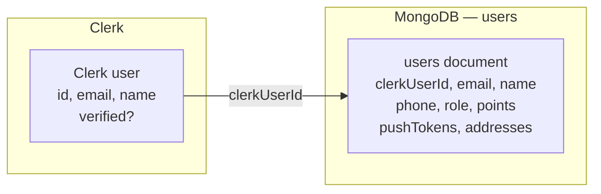
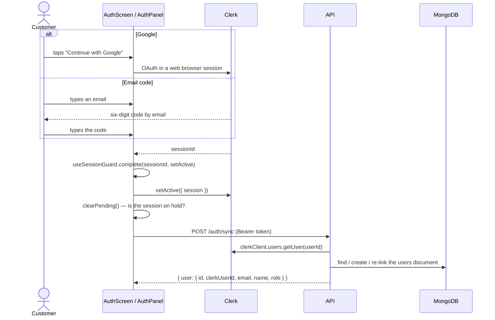
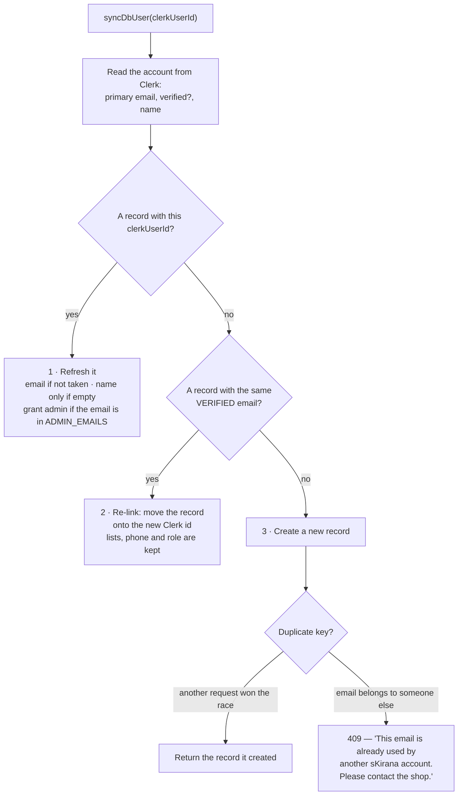
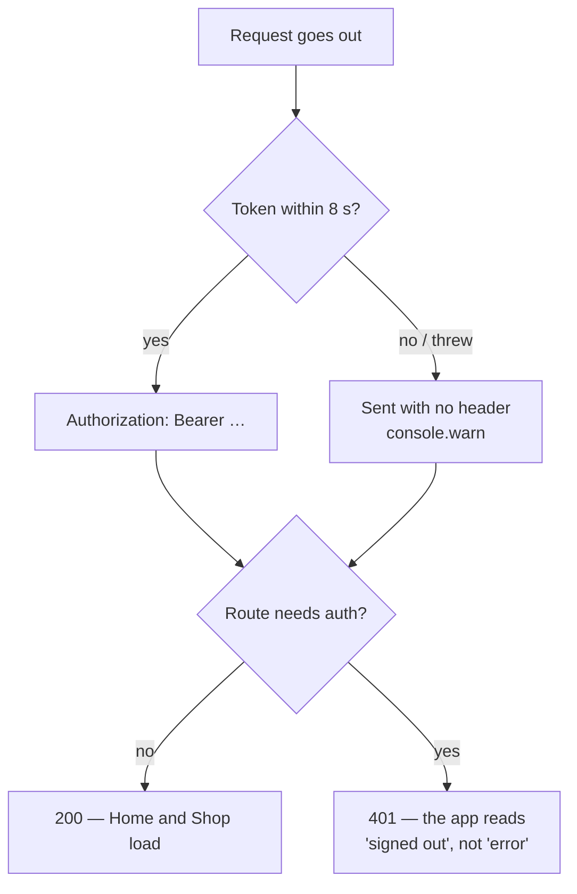

# Signing in

How a person becomes a signed-in customer or an admin. Clerk owns the
identity; this system owns the user record and the role. The two are joined by
one field, and most of the trouble ever seen here has been that join coming
apart.

## Two identities, one join



Clerk holds authentication and the identity fields. The `users` document holds
everything the shop needs and Clerk does not: the mobile number, the role,
points, addresses and push tokens. `server/src/services/user-sync.ts` is what
keeps the two together.

!!! danger "A Clerk user id belongs to one Clerk instance"
    When the app moved from Clerk's test instance to production, every
    returning customer arrived with a **new** Clerk id and the **same** email.
    The `users` collection has a unique index on `email`, so creating a second
    record failed and the customer ended up with no record at all — the error
    read "User is not found in the DB". The re-linking rule below exists
    because of that.

## How a customer signs in

Two ways in, both ending in the same guard.



Passwords are switched off on the production Clerk instance, verified 15 Sept
(`PRODUCTION-SETUP.md`). The two paths are deliberately funnelled through one
piece of code, `useSessionGuard` in `mobile/src/lib/clerk-session.ts`, so they
can never answer the same situation differently.

The app is not gated behind sign-in. `mobile/src/navigation/RootNavigator.tsx`
registers no route guard: Home and Shop work signed out, and the Lists and
Account screens draw the login themselves.

## The token on each request

Neither client stores a token itself. Each installs a *getter* once at startup
and the request interceptor calls it per request, so Clerk can refresh an
expiring token and the next request picks it up.

| | Mobile app | Admin panel |
|---|---|---|
| Installed by | `useBootstrapAuth` → `setApiTokenGetter` (`mobile/src/lib/api.ts`) | `useBootstrapAuth` → `setApiTokenGetter` (`client/src/lib/api.ts`) |
| Waiting for the token | Races it against `TOKEN_TIMEOUT_MS` = 8 s, then continues **without** one | Awaits it, with no timeout |
| Where the session is kept | Expo SecureStore, via `tokenCache` (`mobile/src/lib/token-cache.ts`) | The browser, by Clerk |
| Request timeout | `REQUEST_TIMEOUT_MS` = 20 s, raised to 60 s for a photo read | axios default |

On the server, `clerkMiddleware()` runs on every request and only *attaches*
the auth state — it never rejects anything. The refusal happens at the route:

- `requireAuth` reads the Clerk session and nothing else. No database call, so
  it is cheap enough to mount on a whole router. It answers **401** when there
  is no session, and it loads nothing onto the request.
- `requireAdmin` calls `getDbUserFromReq`, so it reads (and may write) the
  database. It answers **403 "Admin access only"** for a signed-in customer and
  401 for nobody. Mount it on admin routers only.

A handler that needs to know *who* the customer is calls `getDbUserFromReq`
itself; that is the usual first line of every customer handler.

## The database user record {#user-record}

`getDbUserFromReq` looks the caller up by `clerkUserId`. If there is no record
it falls through to `syncDbUser` rather than failing — so a signed-in customer
always ends up with a record, even if the app's explicit sync call never
happened or raced ahead.

`syncDbUser` calls Clerk's API every time and then takes one of three paths.



### The re-linking rule {#re-linking}

**Only a verified email may claim an existing record.** Otherwise anyone could
sign up with someone else's address and inherit their order history. The email
match is case-insensitive (collation strength 2), because Clerk lowercases
emails but older records may not have.

A re-link is logged with both ids:

```
[user-sync] re-linked user <mongoId> from <oldClerkId> to <newClerkId>
```

That line is the evidence that a customer came back after a Clerk instance
change. If you are chasing a "lost account" report, grep the Vercel logs for
`[user-sync]`.

### Names, emails and roles

- The **name** is filled in from Clerk only when the stored one is empty. The
  customer may have changed it in the app, and that is the name the shop sees
  on their orders.
- The **email** is refreshed from Clerk unless another record already holds it.
- The **role** comes from the `ADMIN_EMAILS` environment variable, read fresh
  on every call — so the list can be changed in Vercel and applied by a
  redeploy, with no code change. It **only ever grants**. Removing an email
  does not demote an existing admin; that takes a database edit.

Creating a record is safe under concurrency by retry rather than by locking:
two requests from the same login can both reach path 3, and the loser catches
the duplicate-key error and returns the record the winner created.

## What the admin panel shows

The panel's guards are `ProtectedLayout` → `RoleGuardLayout allow={["admin"]}`
→ `AdminLayout` (`client/src/router.tsx`). They are user experience, not
security — the real enforcement is `requireAdmin` on the server.

| Situation | What the shopkeeper sees |
|---|---|
| Clerk still loading, or the bootstrap unsettled | A full-screen loader, no text (`Commonloader`) |
| Not signed in | Redirect to `/sign-in`, Clerk's form inside `AuthShell` |
| Signed in, not an admin | **"Admin access only"** — "This is the sKirana shop panel, for store owners. Your account doesn't have admin access. If you're a customer, please use the sKirana mobile app." One **Sign out** button |
| Bootstrap failed | **"Couldn't reach the shop server"** — "You're signed in, but your account couldn't be loaded. Check your internet and try again." plus the raw error, then **Try again** and **Sign out** |

Neither of the last two redirects anywhere, on purpose: `/` navigates to
`/admin`, so a redirect would loop.

!!! warning "'Network Error' under that second screen means CORS"
    A blocked origin never reaches the client as a recognisable error. The
    browser discards the response and axios reports the opaque string
    `"Network Error"`. Check `CORS_ORIGINS` on the server project before
    anything else — see the [runbook](../operations/runbook.md#blank-admin).

The panel's bootstrap (`client/src/features/auth/useBootstrapAuth.ts`) calls
`POST /auth/sync` and then `GET /auth/me`, in that order — sync must come first
so a first-time user has a record to read. The mobile app calls only
`POST /auth/sync`, because it answers with the same payload `/auth/me` would.
There is no retry and no polling; recovery is the **Try again** button, which
reloads the page.

## When Clerk is slow or broken



This is deliberate. If Clerk is slow, the app gives up on the token, never on
the request, so the public screens still work. The cost is that a request made
in the first moments after launch can legitimately reach the server
unauthenticated — so do not read an occasional 401 in the logs as a bug.

The admin panel has no such fallback. Every admin route needs a token, so a
Clerk outage there is a full outage.

## Pending sessions {#pending-sessions}

Clerk can create a session and then hold it back until the person finishes
something in Clerk's own screens — choosing an organisation, resetting a
password, setting up MFA. Clerk reports a held session as **signed out**, so
the customer sits on the login screen while the device still holds a session,
and every retry fails with `session_exists`.

`useSessionGuard` handles it in three places:

| Function | What it does |
|---|---|
| `clearPending()` | If `clerk.session.status === "pending"`, logs the task key and signs out. Returns whether it did. The login panel also calls this as soon as it appears, so a session left pending by an earlier attempt cannot block the new one. |
| `complete(sessionId, setActive)` | Activates the session, then clears a pending one. Returns `"done"`, `"onHold"` or `"incomplete"`. |
| `recoverExisting()` | For `session_exists`: an **active** session means the customer is already in; a pending one is cleared; otherwise the device is signed out entirely so the next attempt starts clean. |

The two Clerk error codes the login branches on, dug out by `clerkErrorCode`:

- `form_identifier_not_found` — no such account, so sign up instead.
- `session_exists` — hand to `recoverExisting`.

!!! note "The app can only clear a pending session, not fix the cause"
    The real fix is in the Clerk dashboard. The known cause here was
    **Organizations** left switched on in the production instance with
    "membership required", which the development instance did not have. It was
    turned off on 15 Sept (`PRODUCTION-SETUP.md`). If pending sessions return,
    compare `/v1/environment` on both instances — particularly
    `organization_settings.force_organization_selection`.

## Signing out

One thing must happen before `signOut()`: the device's push token is handed
back to the server. `releasePushToken()` in
`mobile/src/features/customer/push/registry.ts` clears the local record first,
then calls `DELETE /customer/push-token`. The server needs the *customer's own*
token to authorise the removal, so doing it after sign-out is too late — and a
shared phone would keep receiving the previous customer's order alerts.

## Where the keys live

Names only. Values belong in Vercel, Clerk and the local env files — never in
this repository and never in a chat.

| Key | Where it lives | Notes |
|---|---|---|
| `CLERK_SECRET_KEY` | Vercel, server project | Read by the Clerk SDK, not by our code |
| `CLERK_PUBLISHABLE_KEY` | Vercel, server project | Public value |
| `VITE_CLERK_PUBLISHABLE_KEY` | Vercel, admin project | Baked into the bundle at build time — a change needs a redeploy |
| `EXPO_PUBLIC_CLERK_PUBLISHABLE_KEY` | `mobile/.env`, committed | Public `pk_live_` value; a test key belongs in `.env.development.local` |
| `ADMIN_EMAILS` | Vercel, server project | Comma-separated; grants the admin role on sign-in |

App, admin and server keys must be switched **together**. Mismatched keys mean
sign-in fails everywhere. Full detail in
[Configuration](../operations/configuration.md) and `PRODUCTION-SETUP.md`.
