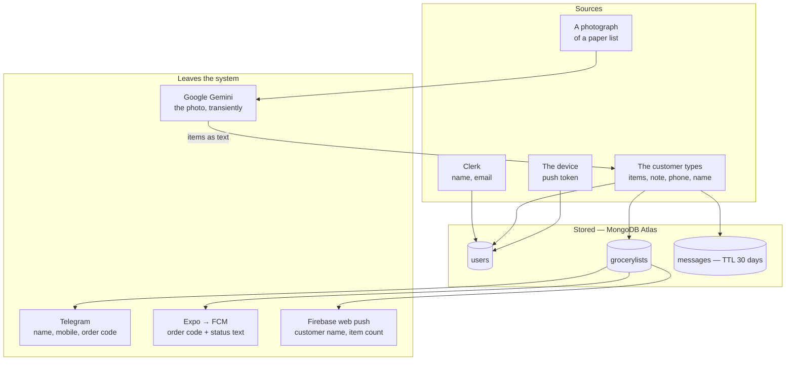
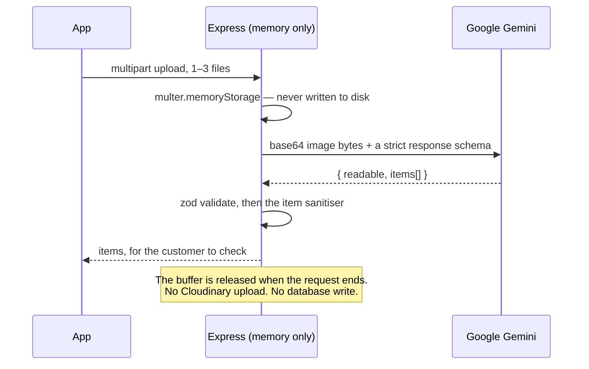
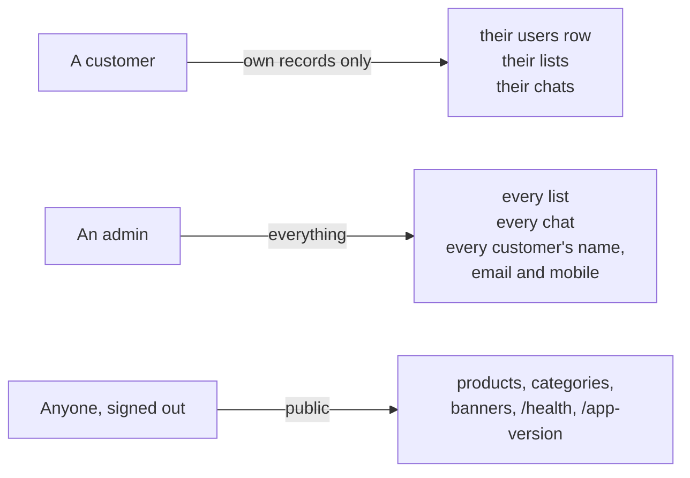

# Where customer data goes

Every piece of data this system holds about a person: where it comes from,
where it is stored, who can read it, and what leaves the system. This doubles
as the privacy map — the published policy at `www.skirana.com/privacy`
(`client/src/pages/legal/Privacy.tsx`) makes claims, and this page is the
evidence behind them.

## The map

## What is held, and where {#inventory}

| Datum | Comes from | Stored in | Notes |
|---|---|---|---|
| Name | Clerk (Google or email account), then editable in the app | `users.name`, copied onto `grocerylists.customerName` | Clerk only fills it in when the stored one is empty |
| Email | Clerk | `users.email`, copied onto `grocerylists.customerEmail` | Unique index; this is the field the [re-linking rule](auth.md#re-linking) matches on |
| Mobile number | The customer types it, once, at the first send | `users.phone`, copied onto `grocerylists.customerPhone` | Normalised to ten digits starting 6–9; anything else is ignored without an error |
| Grocery list items | Typed, or read off a photograph and then corrected | `grocerylists.items` | Free text, sanitised and capped |
| Order note | Typed | `grocerylists.note` | 300 characters; merged notes are joined with ` \| ` |
| Order status and timestamps | The shop's actions | `grocerylists` | `pricedAt`, `packedAt`, `readyAt`, `completedAt`, `paidAt` |
| Chat messages | Both sides | `messages` | **Hard-deleted 30 days after writing**, by a MongoDB TTL index |
| Push token | The device, via Expo | `users.pushTokens[]` | One per device; handed back on sign-out |
| Admin browser push token | The shopkeeper's browser, via Firebase | `users.webPushTokens[]` | Admin accounts only |
| Delivery addresses | Typed, legacy catalogue path | `users.addresses[]` | A grocery list is collected from the shop and never touches these |
| Points | Legacy catalogue path | `users.points` | Not used by the grocery-list flow |
| Payment identifiers | Razorpay | `grocerylists.razorpayOrderId`, `paymentId` | Order and payment ids only |

**Card, bank and UPI PIN details are never seen and never stored.** Payment is
either cash at the counter, or a UPI deep link the customer completes in their
own UPI app, or a Razorpay order whose signature the server verifies.

Details are copied onto the list rather than read through the `user` reference,
so the shop still sees the details it was given at the time even if the
customer later changes them.

## What is deliberately not collected

- **No location, contacts or microphone.** The `expo-image-picker` plugin is
  configured with `microphonePermission: false` in `mobile/app.json`.
- **No analytics and no advertising SDK.** Verified by search: there is no
  Sentry, Crashlytics, PostHog, Segment or similar anywhere in `server/src`,
  `client/src` or `mobile/src`. The consequence for operations is covered in
  [Monitoring](../operations/monitoring.md).
- **No photograph of a list, anywhere.** See below.

## The photograph {#photo}

The one piece of data that is handled and then thrown away.

The photo lives only in that request's memory. It is not saved on the server,
not in the database, and not with the order. What is stored is the text the
customer checked.

Google processes the photo under its own terms and may keep it for a limited
time and use it to improve its services — that is stated in the privacy
policy, and it is why the app's wording asks people to photograph the grocery
list and nothing else.

## Who can read what {#access}

- **A customer sees only their own.** Every list lookup on the customer routes
  is scoped by `user`, so someone else's list answers **404**, not 403 — the
  existence of the list is not disclosed either.
- **An admin sees everything.** Ownership is never checked on the admin side.
  There is no finer permission than the single `role: "admin"` flag, and it is
  granted from `ADMIN_EMAILS`.
- **The catalogue is public.** The home and product routers have no guard;
  every product query is pinned to `status: "active"`.
- **The server never sends one customer's data to another.** The chat mapper
  omits the `groceryList` and `user` references, so a client cannot walk from a
  message back to a customer record.

## What leaves the system {#egress}

Four outbound flows carry customer data. Each is best-effort and swallows its
own failures.

### Google Gemini — `server/src/services/photo-list-parser.ts`

| | |
|---|---|
| **Sends** | The image bytes, base64-encoded inline, plus a fixed system instruction |
| **When** | Only when the customer taps to read a photo |
| **Receives** | `{ readable, items[] }`, validated with zod and then sanitised |
| **Endpoint** | `generativelanguage.googleapis.com` |
| **Not sent** | No name, no email, no phone number, no customer id. The per-customer brake uses the database id as a local key only. |

### Telegram — `server/src/utils/telegram.ts`

| | |
|---|---|
| **Sends** | Customer name (or email as a fallback), mobile number, item count and the eight-character order code |
| **When** | A list is sent, and when a list is merged into |
| **To** | Every chat id in `TELEGRAM_CHAT_ID` — the shopkeeper's own phone |
| **If unset** | Silent no-op; nothing else changes |

The customer's **email** appears only as a fallback when there is no name.
Messages are sent with `parse_mode: "HTML"`, so raw `<` or `&` in customer text
must be escaped by the caller or Telegram rejects the message.

### Expo push → FCM — `server/src/utils/push.ts`

| | |
|---|---|
| **Sends** | A title containing the order code, a fixed status sentence, and the `listId` in the data payload |
| **When** | Pricing, any status change, payment confirmation |
| **To** | Every token on that one customer's record |
| **Not sent** | No item names, no total for the status pushes — although the pricing push does carry the total, as `total ₹<amount>` |

Tokens that no longer look like Expo tokens are dropped before sending;
duplicates are collapsed. Expo's per-ticket results are not inspected, so a
token Expo has since retired is not pruned here.

### Firebase web push — `server/src/utils/webPush.ts`

| | |
|---|---|
| **Sends** | The customer's name (or email as a fallback) and how many items they sent |
| **When** | A list is created, merged into, or a customer writes a chat message |
| **To** | **Every** user with `role: "admin"` and a non-empty `webPushTokens` |
| **If unconfigured** | Silent no-op, cached — nothing is logged and nothing throws |

Tokens FCM reports as permanently dead are pulled from every admin record. A
transient failure is never treated as dead.

## The processors

The providers named in the published policy, and what each actually holds:

| Provider | Holds |
|---|---|
| Clerk | The account: name, email, sign-in history, sessions |
| MongoDB Atlas | Everything in the inventory above |
| Vercel | Request logs, including paths and status codes; no bodies |
| Cloudinary | Product, category and banner images — shop content, not customer content |
| Expo + Google Firebase | Push tokens and the notification text in transit |
| Telegram | The order alerts, in the shop's private chat, indefinitely |
| Google Gemini | The photograph, transiently, under Google's terms |
| Razorpay | Order and payment records for online payments |

## Retention and deletion

| Data | Kept for |
|---|---|
| Account, lists, order history | While the account is active, so the customer can see past orders |
| Chat messages | 30 days from writing, then hard-deleted by MongoDB's TTL index |
| Photographs of lists | Not kept at all |
| Push tokens | Until sign-out removes that device's token, or FCM reports it dead |
| Lists | **Never deleted.** A cancelled list keeps its `cancelled` status. |
| User records | Never deleted by any code path |

!!! warning "Account deletion is a manual process, by design"
    `www.skirana.com/delete-account` (`client/src/pages/legal/DeleteAccount.tsx`)
    is the URL Google Play requires under Data safety. It describes a manual
    flow: the customer emails from the address they signed in with, the shop
    verifies, the shop deletes. The page makes no requests and there is **no
    endpoint** behind it — verified by search, nothing in `server/src/routes`
    deletes from `users` or `grocerylists`. The work is done by hand against
    Clerk and the database.

    The 7-day and 30-day figures on that page are commitments published to an
    app store. Treat them as such, and keep them identical to the privacy page.
    The contact address in the page's constants is the only route in, so it
    has to be monitored.

## If you are adding something that touches customer data

1. Does it need to be **stored**? The photo path is the model: use it,
   transform it, let it go.
2. Does the field belong on the **user** or on the **list**? Details the shop
   must still see later are copied onto the list.
3. Does it **leave the system**? If so, add it to the egress table above, and
   check the published privacy policy still describes what happens.
4. Does it pass through the boundary sanitiser
   (`server/src/utils/sanitizeItem.ts`)? Everything a customer types should.
5. Does a **mapper** need to expose it — and should it? A field not named in
   the mapper never leaves the server, which is sometimes exactly what you
   want. See [Add a field](../guides/add-a-field.md).
