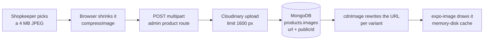

# One picture's journey

A product photograph, from the shopkeeper's laptop to a card in a customer's
Shop grid. Five stages, three of which change the bytes.

The rule that makes it all work: **the database is the source of truth, and
only the delivery URL is transformed.** Sizes can therefore change without a
migration — edit the variant table and redeploy.



## 1. Before it leaves the browser

`client/src/lib/image.ts` shrinks the file **before** upload. It is not a
nicety: a phone-camera photo is often 3–12 MB, which is past the ~4.5 MB
request-body limit of the hosting platform. That failure is ugly — the edge
returns a 413 with no CORS headers, so the shopkeeper sees only "Network
Error".

| Constant | Value | Effect |
|---|---|---|
| `MAX_DIMENSION` | 1600 | Longest side, aspect ratio preserved |
| `JPEG_QUALITY` | 0.8 | Re-encoded through a canvas |
| `MAX_IMAGE_BYTES` | 1 MB | Enforced by the callers, not by `compressImage` itself |

`compressImage` uses `createImageBitmap` → canvas → `toBlob("image/jpeg")`. It
**never throws**: five separate paths return the original file unchanged — a
non-raster file or a GIF, a browser without `createImageBitmap` or `toBlob`, an
undecodable image, no 2D context, or a result that came out no smaller than the
original. The output is always lossy JPEG, so PNG transparency is lost and the
extension is rewritten to `.jpg`.

Home banners deliberately skip this path: they are validated but never
re-encoded.

## 2. The upload

Three routes accept image bytes, all with `multer.memoryStorage()` — nothing
touches disk, which matters on a read-only serverless filesystem.

| Route | Per-file cap | Count | Types accepted |
|---|---|---|---|
| `server/src/routes/admin/product.routes.ts` (products, categories) | 5 MB (`MAX_IMAGE_BYTES`) | 10 | `image/jpeg`, `image/png`, `image/webp` |
| `server/src/routes/admin/settings.routes.ts` (banners) | 5 MB (`MAX_FILE_BYTES`) | 10 (`MAX_FILES`) | the same three |
| `server/src/routes/customer/grocery-list.routes.ts` (list photos) | 6 MB (`MAX_PHOTO_BYTES`) | 3 (`MAX_PHOTOS_PER_READ`) | the same three |

The filter trusts the browser-declared MIME type, not the bytes.

!!! warning "Multer's limit errors are not all wrapped"
    On the **banner** and **list-photo** routes, a multer error is converted to
    a 400 with a readable message — "Each banner image must be under 5 MB",
    "Each photo must be under 6 MB". On the **product** route only the
    `fileFilter` rejection is an `AppError` ("Only JPG, PNG or WebP images can
    be uploaded"); multer's own limit errors surface as a bare **500 "Internal
    server error"**.

!!! note "A correction to ADMIN-WEB.md"
    `ADMIN-WEB.md` § 10.7 says product uploads have "no server-side size or
    type check" because multer is configured with `fieldSize` rather than
    `fileSize`. That has been fixed: `product.routes.ts` now sets
    `limits: { fileSize: MAX_IMAGE_BYTES, files: 10 }` and a `fileFilter`, and
    carries a comment explaining the difference. The § 10.7 heading is stale.

## 3. The stored master

`uploadSingleBufferToCloudinary` in `server/src/utils/cloudinary.ts` streams
the buffer into Cloudinary with one transformation applied at upload:

```
width: 1600, height: 1600, crop: "limit", quality: "auto:good"
```

`crop: "limit"` only ever shrinks — it never enlarges and never crops. So the
stored asset is **not** byte-identical to what the shopkeeper chose. The
1600 px bound is the second place that number appears; the browser already
applied it, and this is the backstop for anything that skipped the browser
path.

What goes into MongoDB is two fields per image:

| Field | Why both |
|---|---|
| `url` | The `secure_url` — what everything is built from |
| `publicId` | The only handle that can later **delete** the picture |

`uploadManyBuffersToCloudinary` is `Promise.all` over the single upload and
preserves gallery order. One failure rejects the lot and leaves the already
succeeded images orphaned in Cloudinary. `deleteFromCloudinary` destroys in
parallel and swallows every failure, so a failed cleanup never blocks the
shopkeeper's save.

Folders in use: `ecommerce-monster-video/products` (the default),
`…/categories` and `…/banners`. The folder names are inherited from the
project this codebase grew out of.

## 4. The delivery variants

Nothing rewrites the stored URL. `cdnImage(url, variant)` builds a delivery URL
by inserting a transformation segment straight after `/image/upload/`:

```
f_webp,q_auto,c_limit,w_<width>
```

| Variant | Width | Used for |
|---|---|---|
| `thumb` | 200 | Category chips, tiny rows |
| `card` | 500 | Product grid, home rails |
| `detail` | 900 | Product page hero |
| `banner` | 1200 | Full-width promo strip |

Two decisions inside that string are load-bearing:

- **`f_webp`, not `f_auto`.** `f_auto` picks a format from the `Accept` header.
  The app's HTTP clients — OkHttp/Glide on Android, SDWebImage on iOS — send no
  WebP in `Accept`, so Cloudinary fell back to JPEG. Measured: **33.7 KB as
  JPEG where WebP is 22.8 KB**, about a third of the bytes wasted on every
  card.
- **No `dpr_auto`.** It would bill a separate derivative for every screen
  density of the same picture, against a monthly credit allowance. See
  [Limits](../operations/limits.md).

`cdnImage` is safe to call twice: a URL that does not contain `/image/upload/`
(a seeded link, an empty field) is returned untouched, and so is one that
already carries `f_auto` or `f_webp`.

`sizedProduct(product, variant)` in `server/src/utils/productImages.ts` is the
only place a product's images are rewritten. It calls `product.toObject()` and
maps each `images[].url` through `cdnImage`, returning a plain object that
cannot be saved back.

### Who asks for which

| Where | Call |
|---|---|
| Customer product list, admin product list and update responses | `sizedProduct(item, "card")` |
| Customer single product | `sizedProduct(foundProduct, "detail")`; its related products use `"card"` |
| Home banners, admin banner list | `cdnImage(url, "banner")` |
| Home categories | `cdnImage(url, "thumb")` |
| Cart and wishlist rows | `cdnImage(url, "card")` |

## 5. What the app asks for, and what it keeps

**The app asks for nothing.** There is no image helper anywhere in
`mobile/src` — no width calculation, no client-side URL rewriting. The server
decides the variant and the app renders the URL it was handed. The only
image-shaped helper is `getCoverImage(product)` in
`mobile/src/features/customer/products/product-list.shared.ts`, which picks the
cover image, then the first image, then `""` so the card can draw a
placeholder.

`ProductCard` (`mobile/src/components/ProductCard.tsx`) passes three
`expo-image` props that exist for measured reasons:

| Prop | Value | Why |
|---|---|---|
| `cachePolicy` | `"memory-disk"` | The default is disk **only**. Without this every picture is re-read and re-decoded from storage each time it scrolls back into view. |
| `transition` | **absent** | A cross-fade still running when the source changes leaves the view blank on Android — expo/expo#35664. Fixed in expo-image 56.0.11; Expo SDK 54 pins 3.0.11, so this codebase has the bug, not the fix. |
| `recyclingKey` | `product.id` | A recycled cell can never flash the previous product's photo |

Other screens still use `transition={150…200}` on images that are **not** in a
recycling list — `HomeScreen.tsx`, `ShopScreen.tsx`,
`ProductDetailsScreen.tsx`, `BannerCarousel.tsx`. If you ever move one of those
into a `FlatList` cell, drop the prop.

## The numbers {#numbers}

These were measured against the shop's own catalogue and recorded in the commit
that made each change. `ARCHITECTURE.md` carries no byte measurements for
images; the figures below come from the git history and from the comments in
`server/src/utils/cloudinary.ts`.

**From `ebfd8c8` — "perf(server): send every picture at the size it is actually drawn"**

| Measurement | Before | After |
|---|---|---|
| A screen of 20 product cards | 19.4 MB | 0.64 MB |
| One 2.5 MB catalogue JPEG, drawn as a card | 2.5 MB | 23 KB |

**From `df8ae50` — "perf: the Shop grid stops blanking, and stops re-rendering itself"**

| Measurement | Value |
|---|---|
| A card image served as JPEG vs WebP | 33.7 KB vs 22.8 KB |
| Card width, before and after | 400 px → 500 px |
| Slot the card actually fills | ~163–188 dp at 2.6–3× ≈ **490 real pixels** |
| Product collection indexes before the change | `keysExamined: 0` — a collection scan feeding a blocking sort |

The file header in `cloudinary.ts` states the same thing in round terms: a grid
of 20 cards is about 8 MB of original JPEGs and about 0.6 MB once each is asked
for at the size it is drawn.

!!! note "One commit message is superseded by the next"
    `ebfd8c8`'s body describes `f_auto` and a card width of 400. Both were
    changed an hour later by `df8ae50` to `f_webp` and 500. The code is the
    authority; the older commit message is history, not documentation.

## If you are changing something here

- **Changing a variant width** is a one-line edit to `VARIANTS` in
  `cloudinary.ts` and a redeploy. No migration, no re-upload — the stored
  master is untouched. It does bill fresh derivatives at the new width.
- **Adding a variant** means adding it to `VARIANTS`, which widens the
  `ImageVariant` type, and then choosing it at each call site.
- **Raising an upload limit** means raising it in the browser
  (`client/src/lib/image.ts`) and on the route in the same commit, and checking
  it against the platform's request-body limit.
- **Never** rewrite the URL stored in the database. Everything downstream
  assumes the stored value is the untransformed master.
