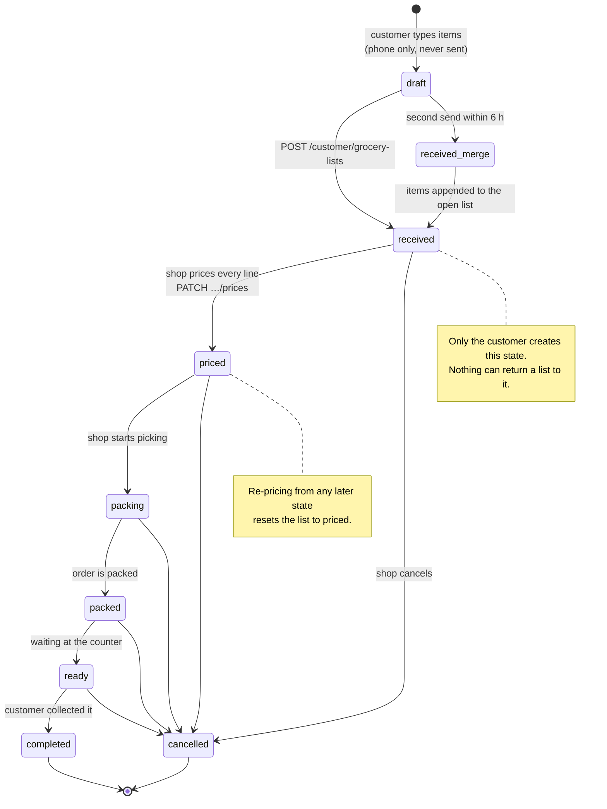
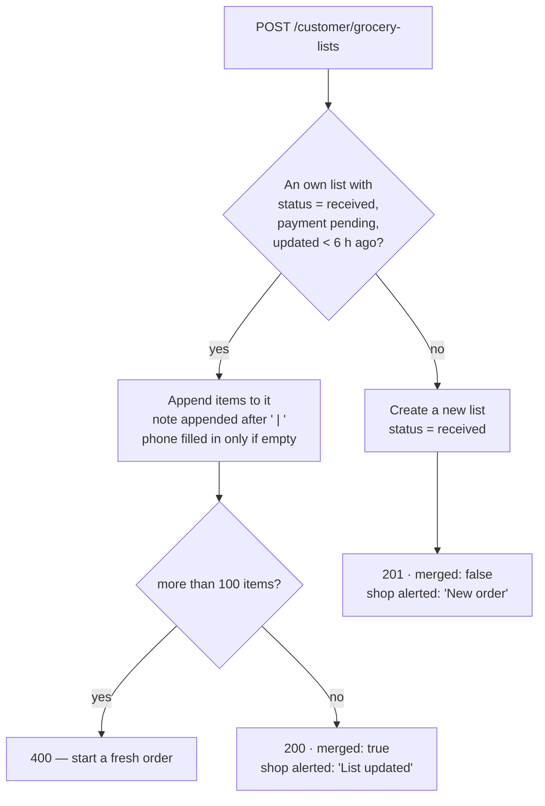
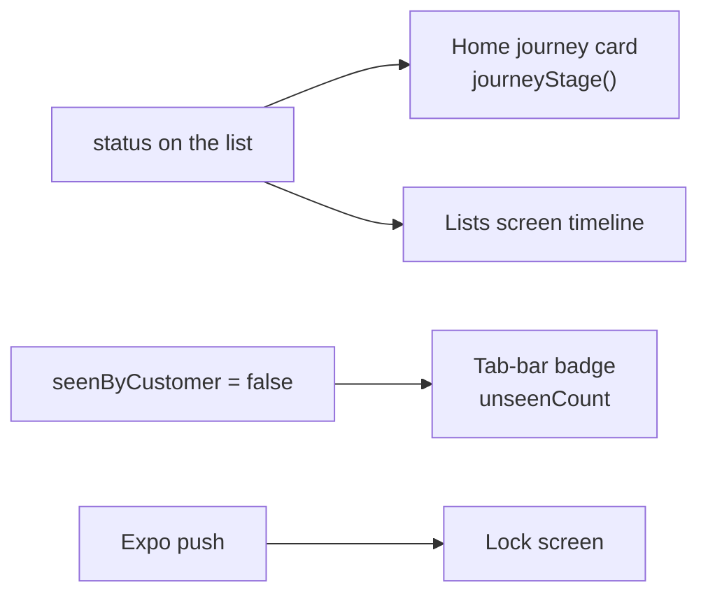
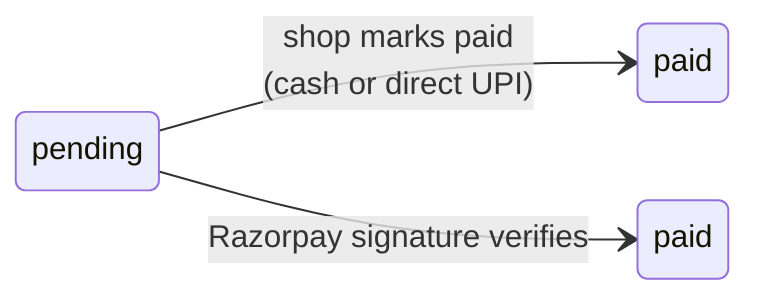
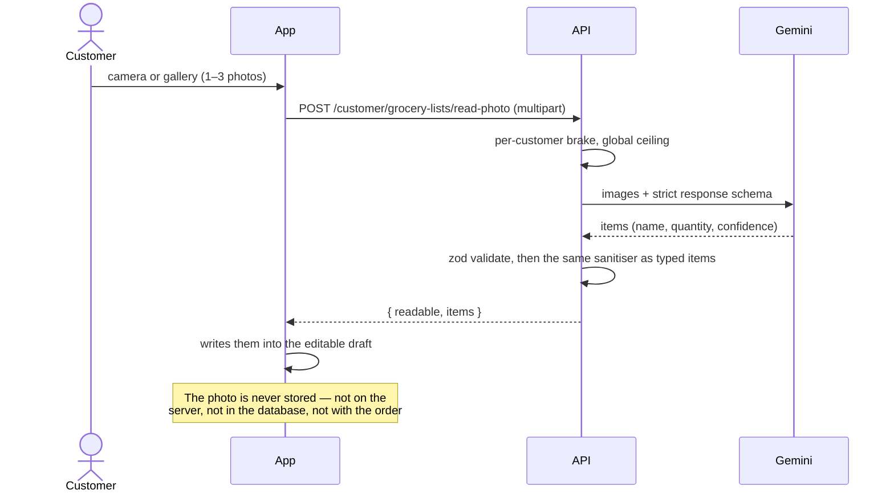

# A list, from written to collected

One grocery list is the whole business. This page follows it from the moment
the customer types the first item to the moment the shop marks it complete:
every status, who is allowed to move it, what the customer sees at each step,
and what cannot be undone.

The statuses are declared as `GroceryListStatus` in
`server/src/models/GroceryList.ts`. The shop's moves live in
`server/src/routes/admin/grocery-list.routes.ts`; the customer's in
`server/src/routes/customer/grocery-list.routes.ts`.

## The states

The diagram shows the intended path. **The code enforces almost none of the
order.** The status route accepts any of `packing`, `packed`, `ready`,
`completed`, `cancelled` from any current state, so the shop may jump from
`packing` straight to `completed`, or cancel from anywhere. One gate exists: a
list whose `totalAmount` is below 1 can only be moved to `cancelled`, with the
message `"Price the list before moving it forward"`.

| Status | Meaning | Who sets it | How |
|---|---|---|---|
| `received` | The shop has the list, unpriced | Customer | Creating the list |
| `priced` | A total exists, sent back to the customer | Shop | `PATCH /admin/grocery-lists/:listId/prices` |
| `packing` | The shop is picking the items | Shop | `PATCH …/status` |
| `packed` | The order is packed | Shop | `PATCH …/status` |
| `ready` | Waiting at the counter | Shop | `PATCH …/status` |
| `completed` | Collected | Shop | `PATCH …/status` |
| `cancelled` | Dropped, from any state | Shop | `PATCH …/status` |

`received` and `priced` are rejected by the status route on purpose: `received`
is the creation state and there is no way back to it, and `priced` belongs to
the pricing route.

## The 6-hour merge window {#merge-window}

A customer who sends a second list soon after the first almost always means
"add these to my order", not "open a second order". So a send is merged
instead of creating a list when **all four** conditions hold
(`MERGE_WINDOW_MS`, six hours, in `server/src/routes/customer/grocery-list.routes.ts`):

- the open list belongs to the same customer;
- its `status` is `received`;
- its `paymentStatus` is `pending`;
- its `updatedAt` is within the last six hours.

Consequences worth stating plainly:

- **"I sent two lists and see one order" is correct behaviour.** The response
  carries `merged: true` and the status code is **200** rather than 201.
- The window is measured from `updatedAt`, so each merge extends it by another
  six hours.
- A priced or packed list is never merged into. Nor is a list older than the
  window — a send the next morning opens a fresh order rather than reopening
  yesterday's.
- The merged note is the old note and the new one joined by ` | `.
- The admin list is sorted by `updatedAt`, not `createdAt`, so a re-sent order
  rises back to the top of the shop's queue instead of staying buried at its
  original position.

Caps along the way, all from `server/src/utils/sanitizeItem.ts`: more than 500
raw rows in one request is refused outright; more than `MAX_ITEMS_PER_SUBMIT`
(50) surviving rows in one send is refused; a merged list above
`MAX_ITEMS_PER_LIST` (100) is refused with `"This list already has too many
items (max 100)."`

## What happens at each step

### The customer writes and sends

The list exists only on the phone until it is sent — the draft store in
`mobile/src/features/customer/draft-list/store.ts`. Items may be typed, or
read off a photograph (see [One picture's journey](images.md) and the photo
section below).

On send the server, in this order: normalises and stores the phone number on
the **user** record if it is new; cleans and caps every field; merges or
creates; then alerts the shop twice — a Firebase web push to every admin
browser (`notifyAdmins`) and a Telegram message (`sendTelegram`) carrying the
customer's name, mobile number and the eight-character order code.

Both alerts are awaited before the response, because Vercel freezes the
function once the response is sent. Both swallow their own failures.

### The shop prices it

`PATCH /admin/grocery-lists/:listId/prices` takes an array the same length as
the stored one. **Pricing is positional** — prices are matched to items by
array index, not by name, which is why a mismatched length is rejected with
`"Item count does not match the customer's list"` rather than being silently
misaligned. The customer's own `name` and `quantity` stay the source of truth;
anything the panel sends in those fields is ignored.

Per row: `price` is rounded with `Math.round`, so paise are discarded. `rate`
is display-only and is never multiplied into the total. A row already marked
unavailable is forced to `price: 0` whatever the shop sent. The total must
reach at least 1, so a list cannot be sent back priced at zero.

The write sets `items`, `totalAmount`, `status: "priced"`, `pricedAt`, and
`seenByCustomer: false`. Then one Expo push goes to every device the customer
has registered, titled `"Your list is priced"`.

!!! warning "Re-pricing knocks a list backwards"
    The pricing route has no status gate. Pricing a list that is already
    `packed` sets it back to `priced` and stamps a new `pricedAt`. The shop
    then has to walk it forward again.

### The shop moves it along

`PATCH /admin/grocery-lists/:listId/status`. Each step stamps its own date the
**first** time it is reached — `packedAt`, `readyAt`, `completedAt` — and never
overwrites it, so setting a status twice keeps the original time. Cancelling
stamps nothing. Every move also sets `seenByCustomer: false` and sends one
Expo push.

The push bodies are fixed strings in `statusNotification`
(`server/src/routes/admin/grocery-list.routes.ts`). They are customer-facing
and are sent as written:

| Status | What the customer's phone shows |
|---|---|
| `packing` | The shop has started packing your order. |
| `packed` | Your order is packed. |
| `ready` | Your order is ready — come and collect it! |
| `completed` | Your order is complete. Thank you! |
| `cancelled` | Your order was cancelled by the shop. |

The title is `Order #CODE`, where the code is the last eight characters of the
list's `_id`, upper-cased. That code is not stored — it is derived in the
mapper, and it is what the shop and the customer quote at each other.

## What the customer sees

Three surfaces, driven by three different things.

**The Home card** shows one stage at a time, decided by `journeyStage` in
`mobile/src/features/customer/grocery-list/journey-stage.ts`. It is a pure
function with three rules, in order:

1. An unsent draft always wins — a list the customer forgot to send never
   reached the shop.
2. Otherwise a `ready` order leads, because that one needs the customer to walk
   to the shop.
3. Otherwise the **newest** order leads — not the one furthest along, so an old
   unfinished order cannot hide the list just sent.

The stages are `write`, `send`, `pricing`, `priced`, `packing` (covering both
`packing` and `packed`) and `ready`. `completed` and `cancelled` are not
tracked; with none left the journey starts over at `write`.

**The badge** counts lists where `seenByCustomer` is false. Every shop-side
change sets that flag false; opening the list sets it back through
`PATCH /customer/grocery-lists/:listId/seen`. `unseenCount` is computed in the
handler from the rows it is about to return, so it can never disagree with
them.

**The push** arrives for pricing, every status change, and payment
confirmation. It carries the `listId` in its data, which is what routes the tap
to the right list.

## What the customer can still change

Very little, and all of it before packing.

| Action | Endpoint | Allowed when |
|---|---|---|
| Remove one item | `PATCH …/remove-item` | `status` is `received` or `priced`, not paid, and more than one item remains |
| Choose pay-at-shop | `PATCH …/pay-at-shop` | Not already paid. No status gate. |
| Pay online | `POST …/pay-online` | Not paid, and `totalAmount` ≥ 1 |
| Confirm an online payment | `POST …/confirm-payment` | Signature verifies against the stored order id |
| Mark the list seen | `PATCH …/seen` | Any time |
| Send a chat message | `POST …/messages` | Any time; 1,000 characters |

Removing an item recomputes `totalAmount` from the remaining prices, and sends
**no** push and no Telegram message — the shopkeeper only learns of it on their
next refresh, which matters if they are already picking that item off the
shelf.

A list lookup is always scoped by `user`, so another customer's list answers
**404 "List not found"**, never 403. The reverse is not true: ownership is
never checked on the admin side, and an admin may read and change any list and
any chat.

## Money

`paymentStatus` is `pending` or `paid`, and **only the server ever sets
`paid`** — after Razorpay's HMAC signature verifies, or after the shopkeeper
confirms at the counter. `paymentMethod` is `at_shop` (the default), `upi` or
`online`, and is a statement of intent, not a payment.

`PATCH /admin/grocery-lists/:listId/mark-paid` is the manual confirmation. It
requires a priced list, is safe to call twice (the second call writes nothing
and sends no push), leaves the status where it was, and promotes a
`paymentMethod` still sitting at the `at_shop` default to `upi`. There is no
automatic reconciliation for direct UPI — the shop is the one who knows the
money arrived.

!!! note "A stale Razorpay order id can survive"
    Switching back to pay-at-shop after starting an online payment leaves the
    stored `razorpayOrderId` in place rather than clearing it, so an old
    Razorpay order could still be confirmed later. Re-pricing overwrites the id,
    and only the newest one is accepted by `confirm-payment`.

## The photo path

A photograph is a faster way to write the list, not a part of the order.

This creates nothing. No list is started and no draft is saved; the items are a
suggestion until the customer sends them. `readable: false` comes back as a
**200**, not an error, so a caller must check the flag rather than the status
code. The customer checks and corrects the text before sending — a misread item
would otherwise become a wrong bill.

## What is irreversible {#irreversible}

| Thing | Why |
|---|---|
| Reaching `received` | Nothing can set a list back to `received`; the status route rejects the value |
| `packedAt`, `readyAt`, `completedAt`, `pricedAt`, `paidAt` | Stamped once, never overwritten. A status set twice keeps the first time. |
| A merge | The two sends become one list. There is no un-merge; the shop can only edit or remove items. |
| Marking paid | No endpoint sets `paymentStatus` back to `pending` |
| Deletion | **Lists are never deleted.** A cancelled list keeps its `cancelled` status so the shop's history stays whole. |
| A sent Expo push | Already on the customer's lock screen. Correcting a wrong status change sends a second push; it does not retract the first. |
| Chat messages | Deleted by a TTL index 30 days after they are written (`server/src/models/Message.ts`) — a deletion you cannot stop, rather than one you cannot do |

## Gaps worth knowing

- A list edited by the shop after pricing (`POST …/items`, `PATCH …/items/:index`)
  sets `seenByCustomer: false` but sends **no** push. The customer sees the
  badge, not a notification.
- Adding or editing items is refused when the list is `cancelled` or
  `completed` — `"This order is already closed"` — but is allowed at every
  other stage, including after payment.
- Seven of the ten admin routes answer with the **whole** list collection, not
  the row that changed. The panel replaces its state wholesale. That response
  grows for the life of the shop; see [Limits](../operations/limits.md).
