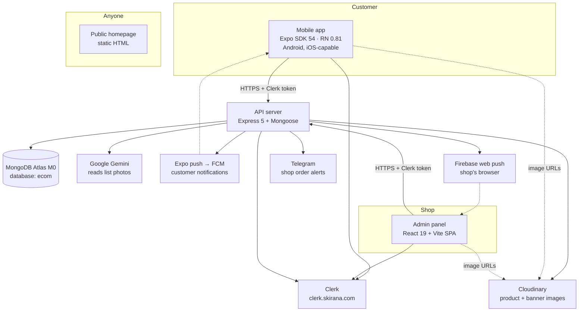
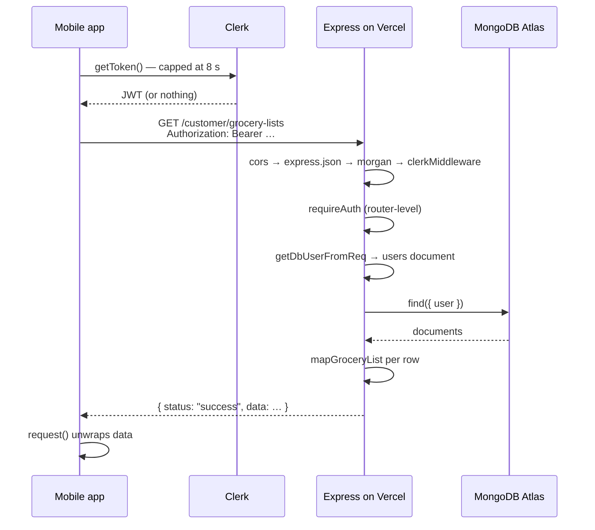
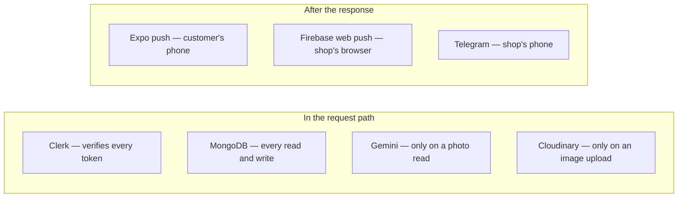

# The system

What the pieces are, how a request travels through them, and where each piece
runs. Read this before changing anything that crosses a boundary.

## The pieces

There are three clients, one server, one database, and five outside services.

| Piece | Source | What it is |
|---|---|---|
| Mobile app | `mobile/` | The customer's app. Writes a list, photographs one, watches its progress, pays. |
| Admin panel | `client/` (`app.html` entry) | The shopkeeper's panel. Prices lists, moves them along, manages the catalogue. |
| Public homepage | `client/` (`index.html` entry) | Plain HTML, no React. Also serves the legal pages Google Play requires. |
| API server | `server/` (`src/server.ts`) | Every read and write. No other client talks to the database. |
| Database | MongoDB Atlas, free tier | Eleven collections; `grocerylists` is the live business object. |

Two facts about the shape of it:

- **The server is the only thing that touches the database.** Both clients go
  through HTTP. There is no direct Atlas connection from a browser or a phone.
- **The mobile app and the admin panel do not talk to each other.** They meet
  in the `grocerylists` collection and in the notifications the server sends.

## Where each piece is deployed

| Piece | Where it runs | How it gets there |
|---|---|---|
| API server | Vercel project `type-script-project-jtdk` | Push to `main` |
| Admin panel + homepage | Vercel project `type-script-project-eight`, served at `www.skirana.com` | Push to `main` |
| Mobile app | Play Store, package `com.skirana.app`; JavaScript also over the air via EAS Update | `eas build` / `npm run ota` |
| Database | MongoDB Atlas M0 | Managed; no deploy |
| Auth | Clerk production instance on `clerk.skirana.com` | Managed; configured in Clerk's dashboard |
| Images | Cloudinary cloud `dnlqyxhpg` | Uploaded by the server at admin request |

Both Vercel projects deploy from the same GitHub repository. **One push to
`main` therefore ships the server and the admin panel together.** The mobile
app is on its own schedule — see [Release a change](../guides/release.md).

???+ info "What is actually in the repo, and what is dashboard configuration"
    `client/vercel.json` is the only deployment file in the repository. It
    contains one rewrite, sending every path to `/app.html`; static files are
    matched first, so `/` still gets the homepage and the SPA handles the rest.
    `client/vite.config.ts` reproduces that rule for the dev server with its
    `adminAppFallback` plugin, so local and production routing agree.

    There is **no** `vercel.json` under `server/` and no `api/` directory. The
    server project's build command and entry point are configured in the Vercel
    dashboard, not in the repository — so you cannot read them here. **Unverified**
    from the repo; `server/package.json` builds with `tsc` and starts with
    `node dist/server.js`.

### URLs

| URL | Serves |
|---|---|
| `www.skirana.com/` | The static homepage (`client/index.html`) |
| `www.skirana.com/admin` | The admin panel; `/` and any unknown path redirect here (`client/src/router.tsx`) |
| `www.skirana.com/privacy`, `/terms`, `/delete-account` | Public legal pages, no sign-in. Google Play requires these URLs. |

The panel's own routes are `/admin/grocery-lists` (the landing page),
`/admin/dashboard`, `/admin/products`, `/admin/coupons`, `/admin/messages` and
`/admin/settings`, all registered in `client/src/router.tsx`.

!!! note "A correction to ARCHITECTURE.md"
    `ARCHITECTURE.md` § 2 labels the admin panel `www.skirana.com/app`. `app.html`
    is the name of the HTML entry file, not a URL. The panel is served at
    `/admin`, as `client/src/router.tsx` and `PRODUCTION-SETUP.md` both say.

## How a request travels {#request-path}

Every call from either client follows the same path. This is the mobile app
fetching its lists.

The parts worth knowing, in order:

1. **The token is best-effort.** `mobile/src/lib/api.ts` races Clerk's
   `getToken` against `TOKEN_TIMEOUT_MS` (8 seconds) and sends the request
   **without** a token if Clerk loses. Public screens therefore still load when
   Clerk is slow. Protected routes then answer 401, which the app reads as
   "signed out". The admin panel's client (`client/src/lib/api.ts`) has no such
   race — it awaits the token.
2. **Middleware order is fixed** in `server/src/server.ts`: CORS, then
   `express.json({ limit: "100kb" })`, then `morgan`, then `clerkMiddleware()`.
   `clerkMiddleware` never rejects anything; it only attaches the auth state.
   A request with no token reaches the route and is refused there.
3. **There is no `/api` prefix and no version prefix.** Three mount points:
   `/auth`, `/customer` (eleven routers) and `/admin` (seven routers, each
   behind `requireAdmin`). Because the routers share a prefix, the first router
   with a matching path wins — adding a path that already exists in an earlier
   router makes the later one unreachable.
4. **A database user is created on demand.** `getDbUserFromReq` in
   `server/src/middleware/auth.ts` looks the caller up by `clerkUserId` and
   falls through to `syncDbUser` when there is no record. See
   [Signing in](auth.md).
5. **Every response is an envelope.** `server/src/utils/envelope.ts` produces
   `{ status, data }` or `{ status, errors }`; both clients unwrap `data` in
   one place. A route that answers with `null` data would be treated as a
   failure by the mobile client's `request()` — worth knowing before you add
   one.
6. **Errors have one shape.** `server/src/middleware/errorhandler.ts` passes an
   `AppError`'s message through with its own status code, and answers anything
   else with a bare 500 and the literal string `"Internal server error"`. So a
   500 means *we threw something unplanned*, and the customer learns nothing
   from it. Throw an `AppError` with a message a person can act on.

### Public, signed-in, and admin

| Reach | Routes | Enforced by |
|---|---|---|
| Public | `/health`, `/app-version`, the home and catalogue routers | Nothing — no guard mounted |
| Signed-in customer | Grocery lists, profile, push tokens, cart, wishlist, checkout, addresses, orders | `requireAuth` applied to the whole router |
| Admin | Everything under `/admin` | `requireAdmin`, applied per router |

`requireAuth` checks the Clerk session only and reads no database.
`requireAdmin` reads (and may write) the user record, because the role lives
there — so it is more expensive, and is mounted on admin routers only.

## Where the outside services sit

The second group is not really after the response. On Vercel the function
freezes the moment the response is sent, so every notification call is
**awaited before** the response goes out — see the comments on the pricing
route in `server/src/routes/admin/grocery-list.routes.ts`. All three swallow
their own failures, so none can turn the shopkeeper's action into an error.

| Service | Called from | If it is down |
|---|---|---|
| Clerk | `clerkMiddleware`, `syncDbUser` | Signed-in routes answer 401; public screens still load |
| MongoDB Atlas | Everywhere | The server exits at boot if it cannot connect; a later failure is a 500 |
| Cloudinary | `server/src/utils/cloudinary.ts` | Image uploads fail; existing images keep serving from the CDN |
| Gemini | `server/src/services/photo-list-parser.ts` | Photo reading answers 503 with a plain message; typing still works |
| Expo push | `server/src/utils/push.ts` | Customers get no notification; the list still moves |
| Firebase web push | `server/src/utils/webPush.ts` | The shop's browser is not alerted; Telegram still is |
| Telegram | `server/src/utils/telegram.ts` | No shop alert; nothing else changes |

## What the pieces agree on

Three conventions hold across every boundary. Break one and the failure is
usually silent.

- **One envelope.** `{ status, data, meta?, errors? }`, built by
  `server/src/utils/envelope.ts`, unwrapped by `request()` in
  `mobile/src/lib/api.ts` and by the helpers in `client/src/lib/api.ts`.
- **One sanitiser.** Everything a customer types passes through
  `server/src/utils/sanitizeItem.ts` at the boundary, once. Devanagari marks
  are deliberately preserved.
- **One mapper per shape.** A document never goes onto the wire directly; each
  route has a hand-written `mapX` function. A field not named in the mapper
  never leaves the server, which is the usual reason a new field arrives as
  `undefined` — see [Add a field](../guides/add-a-field.md).

## Where to go next

- [A list, from written to collected](list-lifecycle.md) — the main flow, every status.
- [Signing in](auth.md) — Clerk, tokens, and the user record.
- [One picture's journey](images.md) — upload, storage, delivery.
- [Where customer data goes](data-flow.md) — the privacy map.
- [Runbook](../operations/runbook.md) — when it is broken.
