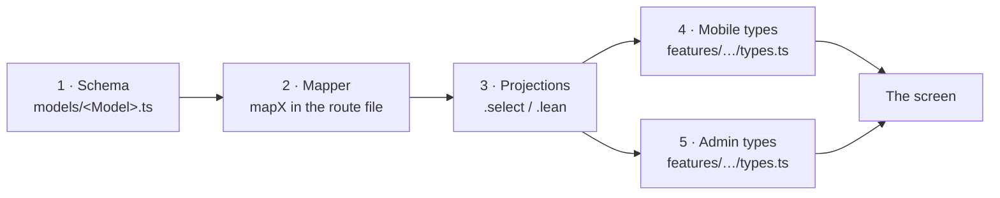

# Add a field

A field has to be added in five places before it reaches a screen. Missing any
one of them fails **silently** — usually as `undefined` in the interface, never
as an error. That is why this is a checklist and not a paragraph.

This expands the checklist in `docs/DATA-MODEL.md` § 6, which is the source of
the file list below.



## 1. The schema

`server/src/models/<Model>.ts`

Give the field a default. Then remember what a default does and does not do:

- It applies to **new writes** and to Mongoose-hydrated reads.
- It does **not** apply to `.lean()` results or raw driver reads.
- Existing documents will not have the field at all. `unitValue` is on 71 of 84
  products; every banner field has the same gap.

So every reader must tolerate absence. Normalise in the mapper — that is what
`rate: listItem.rate ?? 0` and `available: listItem.available !== false` are
doing in the grocery-list mappers, so an old record reads the same as a new
one.

If the field must be queryable or sortable, add the index in the same commit.

!!! warning "A declared index may not exist in the database"
    Indexes only appear when a process carrying that model connects and
    `autoIndex` runs. Verify against the live cluster before assuming a
    declared index is real.

## 2. The route mapper

Fields not named in the mapper never leave the server. Every hand-written
mapper in the codebase:

| Mapper | File |
|---|---|
| `mapGroceryList` (shop's view) | `server/src/routes/admin/grocery-list.routes.ts` |
| `mapGroceryList` (customer's view) | `server/src/routes/customer/grocery-list.routes.ts` |
| `mapMessage` | both grocery-list route files |
| `mapBanner` | `server/src/routes/admin/settings.routes.ts` |
| the home payload | `server/src/routes/customer/home.routes.ts` |
| `mapAddress` | `server/src/routes/customer/address.routes.ts` |
| `mapPromo` | `server/src/routes/admin/promo.routes.ts` |
| `mapProfile` | `server/src/routes/customer/profile.routes.ts` |

**There are two grocery-list mappers and they differ on purpose.** The shop's
adds `customerName`, `customerEmail`, `customerPhone` and `updatedAt`, and
deliberately omits `seenByCustomer` — that flag drives the customer's unread
badge and means nothing to the shop. Decide which of the two your field belongs
to; adding it to both by reflex can leak a customer-only concern into the
panel, or a shop-only one into the app.

???+ info "Products are the exception"
    The product path has no hand-written mapper. `sizedProduct` in
    `server/src/utils/productImages.ts` calls `product.toObject()` and spreads
    it, rewriting only the image URLs. A new field on the `Product` schema
    therefore reaches clients with no mapper edit — and so does anything else
    you put on that schema, including things you did not mean to publish.

## 3. The projections

A `.select("...")` or a `.lean<RowType>()` drops your field **before** the
mapper can ask for it. The mapper will then produce `undefined` and look
innocent.

Check these four:

- `server/src/routes/customer/orders.routes.ts`
- `server/src/routes/admin/orders.routes.ts`
- `server/src/routes/customer/home.routes.ts`
- `server/src/routes/admin/dashboard.routes.ts`

`server/src/utils/push.ts` also projects — `.select("pushTokens")` — which is
correct and should stay narrow.

## 4. The mobile types

`mobile/src/features/customer/<feature>/types.ts`

For a list field that is
`mobile/src/features/customer/grocery-list/types.ts`. Mirror exactly what the
mapper returns: `_id` as a string, dates as ISO strings, optional where old
documents will not have it.

If the app **writes** the field, the request-body type in the same file needs
it too, and so does the `api.ts` wrapper that sends it.

## 5. The admin panel types

`client/src/features/<area>/<feature>/types.ts`

For a list field that is
`client/src/features/admin/grocery-lists/types.ts`. If the shop writes the
field, add it to the request-body type in the same file.

!!! note "The two clients have already drifted once"
    `client/src/features/customer/products/types.ts` declares `price` and
    `salePercentage`, which exist in neither the `Product` schema nor any live
    document, and lacks `unit`/`unitValue`, which do exist. That copy is dead —
    no route renders those pages. The mobile types are the truthful ones. Do
    not use the web customer types as a template.

## 6. Everything else that touches it

| If the field… | Also change |
|---|---|
| is typed by a customer | Cap it with `cleanField(value, MAX_LEN)` in `server/src/utils/sanitizeItem.ts`, and add the constant there rather than inline |
| is shown to a customer in words | Both `mobile/src/lib/i18n/en.ts` **and** `hi.ts`. `hi` is typed as `Translations`, so a missing key is a compile error — run `npx tsc --noEmit` |
| is written by the shop | The admin form: `client/src/features/admin/<feature>/use-*.ts` and the dialog component |
| changes what the shop is told | The Telegram text in `server/src/utils/telegram.ts` callers, or the push bodies in `statusNotification` |
| must be sortable or filterable | An index, in the same commit |

## 7. The documents, in the same commit

- The collection's table in `docs/DATA-MODEL.md` and in
  [the database interface pages](../interfaces/database/index.md).
- The endpoint's response shape in [the API pages](../interfaces/api/index.md).
- The TSDoc on the schema field, if the field's meaning is not obvious from its
  name. This codebase puts the note beside the field.

## Verifying it arrived

Work outward, and stop at the first place it is missing.

```bash
# 1. Is it in the database?
#    mongosh → db.grocerylists.findOne({}, { yourField: 1 })

# 2. Does it leave the server?
curl -s http://localhost:5000/customer/grocery-lists \
  -H "Authorization: Bearer <token>" | grep yourField

# 3. Does the client type know about it?
cd mobile && npx tsc --noEmit
cd client && npm run build
```

If step 1 finds it and step 2 does not, it is the mapper or a projection. If
step 2 finds it and the screen does not, it is the types or the component.

## Traps

| Trap | What you see |
|---|---|
| Schema only | The field is in the database and nowhere else |
| Mapper only | Nothing — the mapper reads a field the document does not have |
| Forgot the projection | `undefined`, even though the mapper names it |
| Added to one client's types | Works in the app, missing in the panel, or the reverse |
| Relied on the schema default for old documents | `undefined` on every record written before today |
| Added a key to `en.ts` but not `hi.ts` | A TypeScript error — which is the point |
| Added an index but never connected with that model | The query is still a collection scan |
