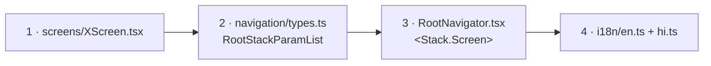

# Add a screen

Two apps, two answers. Pick the one you are working in.

- [A screen in the mobile app](#mobile) — a stack screen, or a new tab.
- [A page in the admin panel](#admin).

---

## A screen in the mobile app {#mobile}

### A stack screen — four edits



**1. The screen file** — `mobile/src/screens/<Name>Screen.tsx`

Use a **named** export: `export function ThingScreen()`. Every screen in this
app does, and the navigator imports them by name through the `@/` alias, which
`mobile/tsconfig.json` maps to `./src/*`.

**2. The param list** — `mobile/src/navigation/types.ts`

Add a key to `RootStackParamList` with its params, or `undefined` when there
are none:

```ts
export type RootStackParamList = {
  // …
  Thing: { thingId: string };
};
```

**3. Register it** — `mobile/src/navigation/RootNavigator.tsx`

```tsx
<Stack.Screen name="Thing" component={ThingScreen}
  options={{ title: t("thing.title") }} />
```

The navigator reads titles through `useTranslation()` **inside** the component,
so they re-render when the language changes. Do not hard-code a title string.

The shared `screenOptions` already set the header and background colours
(`#f6f1e8` ground, `#1f2a2e` tint) and a minimal back button. Let them apply
unless you have a reason not to.

**4. The strings** — `mobile/src/lib/i18n/en.ts` and `hi.ts`

Add a namespace to `en`, then mirror it **exactly** in `hi.ts`. `hi` is
annotated `: Translations`, where `Translations = typeof en`, so a missing or
stray key is a compile error. Enforcement is `npx tsc --noEmit` — there is no
lint rule and no test.

Keys are `namespace.key`, exactly two levels, with two documented exceptions
(`lists.timeline.*` and `lists.tabs.*`, looked up dynamically by status).
Plurals use i18next v4's `_one` / `_other` suffixes with `{{count}}`.

Hindi is the **default** language (`lng: "hi"`), with English as the fallback.
A missing Hindi string is not a hypothetical.

!!! note "There is no route guard"
    Every route is reachable signed out. The Lists and Account screens draw the
    login themselves. If your screen needs a signed-in customer, handle that in
    the screen.

### A new tab — five more edits

`mobile/src/navigation/TabNavigator.tsx`, `types.ts` and
`mobile/src/components/CustomTabBar.tsx`.

1. Add the key to `TabParamList` in `navigation/types.ts`.
2. Add an entry to the module-level `iconByRoute` map in `TabNavigator.tsx`. It
   is typed `Record<keyof TabParamList, keyof typeof MaterialCommunityIcons.glyphMap>`,
   so a new tab without an icon is a **compile error** — deliberately.
3. Add `<Tab.Screen name=… component=… />`.
4. Add a `tabs.<lowercased route name>` string to `en.ts` and `hi.ts`. Labels
   come from ``t(`tabs.${route.name.toLowerCase()}`)``.
5. Edit `CustomTabBar.tsx`.

!!! danger "The tab bar is hard-coded to four tabs"
    `CustomTabBar` renders `renderTab(0)`, `renderTab(1)`, a flexible spacer,
    then `renderTab(2)` and `renderTab(3)`. The gap is where the raised centre
    button sits. **A fifth tab will not appear** until that block is rewritten.

    The centre button is not a tab and has no route: it opens the grocery sheet
    through `useGrocerySheetStore`, is captioned with `t("tabs.writeList")`,
    and takes its badge from `countSendableRows` on the draft store.

### The feature slice behind it

If the screen needs data, add
`mobile/src/features/customer/<domain>/` with the three conventional files:

| File | Holds |
|---|---|
| `types.ts` | Types mirroring the server's JSON. `_id` as a string, dates as ISO strings. No runtime code. |
| `api.ts` | One exported async function per endpoint, over `apiGet`/`apiPost`/… from `@/lib/api`. No state, no toasts. |
| `store.ts` | A zustand store, `use<Domain>Store`. Unpersisted, with a `clear()` for sign-out. |

Pure logic goes in its own named file (`journey-stage.ts` is the model), and
the React wrapper in a `use-*.ts` beside it. That split is what makes the
journey decision testable without React.

Copy the stale-response guard from the existing stores: a module-scoped
`let loadTicket = 0`, outside the store state, so a slow response cannot
overwrite newer state and a failed load cannot empty a populated list.

### Traps specific to screens

| Trap | Why |
|---|---|
| Putting a `<Sheet>` inside a list cell | A sheet is not free while closed — it measures the window, reads insets, creates shared values and a gesture. The quantity sheet is mounted **once** at the root; a card only calls `useQuantitySheetStore.open(...)`. |
| Assuming a background tab is idle | `freezeOnBlur` keeps tabs mounted, so effects still run. Guard with `useIsFocused` — without it a background Lists tab marks lists seen and clears a badge nobody saw. |
| Navigating while a sheet is open on Android | The sheet is drawn over the whole app, so the new screen opens behind it and looks like nothing happened. Close first. |
| Adding `transition` to an image in a recycling list | It blanks on Android (expo/expo#35664). See [One picture's journey](../explain/images.md). |
| Expecting `SplashScreen` or `LanguagePicker` to navigate | Neither is in a navigator. `App.tsx` renders them directly and they take callbacks. |
| Using `@gorhom/bottom-sheet` | Its sheets never open on Reanimated 4 / Expo SDK 54. Use `mobile/src/components/ui/Sheet.tsx`. |

### Before you commit

```bash
cd mobile && npx tsc --noEmit
```

That is the whole gate — there is no test script and no lint script in
`mobile/package.json`. It does catch a missing Hindi string and a tab with no
icon.

---

## A page in the admin panel {#admin}

### The edits

**1. The page** — `client/src/pages/admin/<Name>.tsx`

Pages in this folder use **default** exports, unlike the mobile screens.

**2. The route** — `client/src/router.tsx`

Add a child under the `/admin` element, inside the existing
`ProtectedLayout` → `RoleGuardLayout allow={["admin"]}` → `AdminLayout` nest.
Do not add a new guard; those three already wrap everything under `/admin`.

```tsx
{ path: "reports", element: <AdminReports /> },
```

**3. The sidebar** — `client/src/components/admin/common/sidebar.tsx`

A route with no sidebar entry is reachable only by typing the URL. That is how
`/admin/orders` became invisible: the page exists, the backend exists, and
nothing links to it.

**4. The feature slice** — `client/src/features/admin/<feature>/`

| File | Holds |
|---|---|
| `api.ts` | One function per endpoint over `apiGet`/`apiPost`/`apiPatch`/`apiDelete` from `@/lib/api` |
| `types.ts` | Entity, params and request-body types |
| `use-<thing>.ts` | The page's own state — filters, drafts, saving flags, polling. A plain React hook. |
| `store.ts` | Only if the state must cross components or outlive the page |

The split is a convention worth keeping: **hooks for page state, zustand for
state that crosses components**. There is no Redux and no React Query.

### If the page polls

The grocery-list page polls every 15 seconds (`POLL_MS` in
`client/src/features/admin/grocery-lists/use-admin-grocery-lists.ts`); an open
chat polls every 5 seconds. There is no socket and no server-sent stream
anywhere in this system.

Two behaviours to copy if you add polling:

- A background poll passes `silent = true` and does not touch the loading flag,
  so the page does not flash.
- A failed poll leaves the previous data on screen and shows **no** error. The
  trade-off is deliberate and worth knowing: a server outage looks like a quiet
  shop.

And one thing to be careful of: half-typed input must not live in the polled
data. The price drafts are held in the hook, keyed by list id, precisely so a
poll cannot clobber them.

### Traps specific to the panel

| Trap | Why |
|---|---|
| Adding a `VITE_` variable and changing it in Vercel | The value is baked in at build time. Nothing changes until a **redeploy**. |
| A new static HTML page | Needs two edits — the file, and the `rolldownOptions.input` map in `client/vite.config.ts` |
| Expecting a redirect on a guard failure | `RoleGuardLayout` deliberately renders a panel instead: `/` navigates to `/admin`, so a redirect would loop |
| Copying from `client/src/pages/customer/**` | That whole storefront is dead — compiled, shipped, reachable from no route |
| Relying on browser push locally | `client/.env` carries no `VITE_FIREBASE_*`, so the bell renders `null` in development with no message |

### Before you commit

```bash
cd client && npm run build    # tsc -b && vite build
cd client && npm run lint
```
