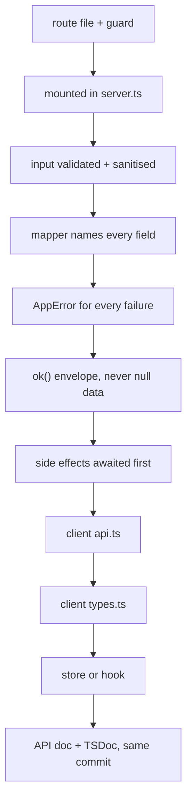

# Add an endpoint

Every file that has to change, in order. An endpoint that works in Postman but
returns `undefined` in the app has usually skipped step 4 or step 8.

## Decide three things first

| Question | Consequence |
|---|---|
| **Who may call it?** | Public → no guard. Signed-in customer → `requireAuth` on the router. Shop → `requireAdmin`, which also covers being signed in. |
| **Which router?** | `/customer` and `/admin` are each shared by many routers, mounted in order in `server/src/server.ts`. The first router with a matching path wins. |
| **Does it answer with the row, or the collection?** | The admin grocery-list routes answer with the **whole** collection after a mutation, because the panel replaces its state wholesale. Follow the neighbours in the file you are editing. |

!!! danger "A path that already exists in an earlier router is unreachable"
    Both `/customer` and `/admin` are mounted eleven and seven times over.
    Express matches in mount order, so defining `/customer/products` in a
    second router after `customerProductRouter` silently shadows it. Check the
    mount list in `server/src/server.ts` before choosing a path.

## The checklist

### 1. The route file

`server/src/routes/<customer|admin>/<area>.routes.ts`

Either add to an existing router or create a new one. A new router exports a
`Router()` under a name ending in `Router`, and applies its own guard:

```ts
export const customerThingRouter = Router();
customerThingRouter.use(requireAuth);   // or requireAdmin, or neither
```

Wrap every async handler in `asyncHandler` from `server/src/utils/asyncHandler.ts`.
Without it a rejected promise never reaches the error middleware, and the
request hangs until the client's timeout.

### 2. Mount it

`server/src/server.ts` — add the import and the `app.use()` line, in the
customer or admin block. Mount order is the routing rule; put it where it
cannot shadow an existing path.

Skip this step if you added to an existing router.

### 3. Validate and sanitise the input

At the boundary, once.

| Input | Use |
|---|---|
| A required path segment or string | `requireText(value, "List id is required")` from `server/src/utils/helpers.ts` |
| A required number | `requireNumber(...)` |
| A document that must exist | `requireFound(doc, "List not found", 404)` — treats **any** falsy value as missing |
| Free text a customer typed | `cleanField(value, MAX_LEN)` from `server/src/utils/sanitizeItem.ts` |
| An array of `{ name, quantity }` | `cleanItems(raw)` — caps at 500 raw rows and 50 surviving rows |
| A mobile number | `normalizeMobile(value)` from `server/src/utils/phone.ts` |
| Anything going into a regex | `escapeRegex(value)` from `server/src/utils/regex.ts` |

The client is not trusted. `cleanField` collapses a non-string — an object, an
array, a `{ "$gt": "" }` injection payload — to an empty string before it can
reach a query.

### 4. Write a mapper

Never put a Mongoose document on the wire. Write, or reuse, a `mapX` function
in the same file that names every field explicitly and returns a plain object.

This is what makes the contract deliberate: a field not named in the mapper
never leaves the server. It is also the single most common reason a new field
arrives as `undefined` in a client — see [Add a field](add-a-field.md).

The product path is the one exception: `sizedProduct` spreads the whole
document and only rewrites image URLs.

### 5. Throw `AppError`, not `Error`

```ts
throw new AppError(400, "This list already has too many items (max 100).");
```

`server/src/middleware/errorhandler.ts` passes an `AppError`'s message through
to the caller verbatim with its own status code. **Anything else becomes a bare
500 and the literal string "Internal server error"** — the customer learns
nothing and you get a log line. Write messages a person can act on.

### 6. Answer with the envelope

`res.json(ok(payload))`, or `res.status(201).json(ok(payload))`. `ok` and
`fail` are in `server/src/utils/envelope.ts`.

!!! warning "Never answer with `null` data"
    `request()` in `mobile/src/lib/api.ts` treats a falsy `data` as a failure,
    whatever the status code. An endpoint that legitimately has nothing to
    return should answer with an object — `{ removed: true }`, `{ items: [] }`
    — not `null`.

### 7. Side effects come **before** the response

On Vercel the function freezes the instant the response is sent. So `await`
every notification rather than firing it and returning:

```ts
await notifyUser(list.user, title, body, { listId });   // utils/push.ts
await notifyAdmins(title, body, data);                  // utils/webPush.ts
await sendTelegram(text);                               // utils/telegram.ts
res.json(ok(payload));
```

All three swallow their own failures, so awaiting them cannot fail the request.

### 8. The client API module

| Client | File |
|---|---|
| Mobile | `mobile/src/features/customer/<feature>/api.ts` |
| Admin panel | `client/src/features/<area>/<feature>/api.ts` |

One exported async function per endpoint, a thin wrapper over `apiGet` /
`apiPost` / `apiPatch` / `apiDelete` from `@/lib/api`. No state, no toasts.
They return the already-unwrapped payload and throw a plain `Error`.

Two differences between the two clients, both real:

- Mobile has `apiPut`; the admin client does not.
- Mobile builds query strings by hand with `encodeURIComponent`, because React
  Native has no `URLSearchParams`. The admin client uses `URLSearchParams`.

A per-call timeout goes in the axios config — the photo-read call raises the
20-second default to 60 seconds that way.

### 9. The client types

`types.ts` in the same feature folder. Pure type aliases mirroring the server's
JSON — the entity, the params type, the request-body type, the response
wrapper. No runtime code.

Mirror what the mapper actually returns, including `_id` as a string and dates
as ISO strings.

### 10. The store or hook

| Kind of state | Where |
|---|---|
| Crosses components, or must survive a navigation | A zustand store, `store.ts`, exported as `use<Domain>Store` |
| Belongs to one page | A plain React hook, `use-<thing>.ts`, with `useState`/`useEffect` |

There is no Redux, no React Query and no SWR anywhere in this codebase.

Two conventions in the stores that exist for a reason:

- A **module-scoped ticket** (`let loadTicket = 0`) outside the store state, so
  a stale response can never overwrite newer state and a failed load never
  empties a populated list.
- A `clear()` action, called on sign-out.

### 11. Update the reference documents

In the **same commit**:

- The endpoint's entry in [the API interface pages](../interfaces/api/index.md)
  — request, response, errors, side effects, and whether it needs auth.
- `docs/DATA-MODEL.md` if you touched a schema.
- The TSDoc block above the handler. This codebase documents what a caller
  cannot see from the signature: what it throws, what it writes, what it calls,
  what it caps, and why the odd parts are odd.

## What "done" looks like



## Checking it by hand

```bash
# public
curl -i http://localhost:5000/health

# signed in — take a token from the app or the panel's network tab
curl -i http://localhost:5000/customer/grocery-lists \
  -H "Authorization: Bearer <token>"
```

Expect the envelope both ways. A 401 with no token and a 403 as a non-admin on
an `/admin` path are the two guards proving they are mounted.

## Traps

| Trap | What happens |
|---|---|
| Forgot `asyncHandler` | A rejected promise never reaches the error middleware; the request hangs |
| Threw a plain `Error` | The caller sees "Internal server error" and nothing else |
| Answered with `null` data | The mobile client treats it as a failure |
| Fired a push without awaiting | On Vercel the function freezes and the push is killed mid-flight |
| Mounted the path after a router that already matches it | Silently unreachable |
| Returned the Mongoose document | `__v`, internal references and anything you later add to the schema all leak |
| Used `.select()` or `.lean<T>()` and then a mapper | The projection drops the field before the mapper can ask for it |
