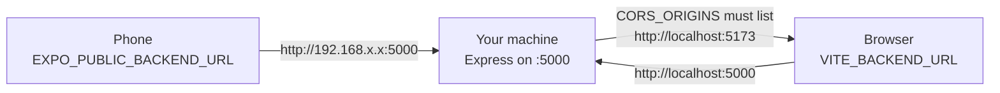

# Get it running

From a clone to all three packages running against your own machine. Allow an
hour the first time, mostly for the Android development build.

## What you need first

| Thing | Why | Notes |
|---|---|---|
| Node.js and npm | All three packages | No version is pinned — there is no `engines` field and no `.nvmrc`. Expo SDK 54 and Vite 8 both want a current LTS. |
| Git | The repository | — |
| A MongoDB connection string | The server refuses to start without one | An Atlas free cluster, or a local `mongod` |
| A Clerk **development** instance | Sign-in | Test keys only. `pk_live_`/`sk_live_` do not work on localhost. |
| Android device or emulator | The mobile app | Optional if you are only touching the server or the panel |
| An EAS account | Only to build the mobile development client | Same account as the project owner |

You do **not** need Cloudinary, Gemini, Telegram, Firebase or Razorpay keys to
run the list flow — except that the server will not boot without Razorpay's two
keys (see the trap below).

## 1. Clone and install

The three packages are independent. There is no workspace root and no lockfile
at the top level, so install each one.

```bash
git clone <repo-url>
cd mern-ecommerce-2026

cd server && npm install && cd ..
cd client && npm install && cd ..
cd mobile && npm install && cd ..
```

| Directory | What it is | Runs on |
|---|---|---|
| `server/` | Express 5 + Mongoose API | Node |
| `client/` | The admin panel and the public homepage, one Vite build with two HTML entries | A browser |
| `mobile/` | The customer's Expo app | A phone or emulator |

## 2. Configure the server

Create `server/.env`. It is git-ignored. **Names only below — never commit a
value, never paste one into a chat.**

| Variable | Needed to start? | What happens without it |
|---|---|---|
| `MONGO_URI` | **Yes** | `connectDB` rejects and the process exits with code 1 |
| `RAZORPAY_KEY_ID`, `RAZORPAY_KEY_SECRET` | **Yes** | `utils/razorpay` throws at import time, which stops the whole server — not just the payment routes |
| `CLERK_SECRET_KEY`, `CLERK_PUBLISHABLE_KEY` | For any signed-in route | Token verification fails; everything protected answers 401 |
| `CORS_ORIGINS` | For the admin panel | Defaults to `http://localhost:3000`, which is **not** where Vite serves. See the trap below. |
| `ADMIN_EMAILS` | To be an admin | You sign in as a customer and the panel shows "Admin access only" |
| `PORT` | No | Defaults to 5000 |
| `CLOUDINARY_CLOUD_NAME`, `CLOUDINARY_API_KEY`, `CLOUDINARY_API_SECRET` | Only to upload images | Uploads fail; existing image URLs still render |
| `GEMINI_API_KEY` | Only to read list photos | The API answers 503 with a plain message; typing still works |
| `GEMINI_MODEL` | No | Defaults to a current Flash model |
| `TELEGRAM_BOT_TOKEN`, `TELEGRAM_CHAT_ID` | No | Silent no-op |
| `FIREBASE_PROJECT_ID`, `FIREBASE_CLIENT_EMAIL`, `FIREBASE_PRIVATE_KEY` | No | Admin browser push is a silent no-op |
| `SHOP_NAME`, `SHOP_UPI_ID` | No | `SHOP_NAME` defaults to `"sKirana"`; with no UPI id the app hides the UPI option |
| `APP_LATEST_VERSION`, `APP_MIN_VERSION`, `ANDROID_PACKAGE` | No | No update prompt is shown |

Every one of these is described in full in
[Configuration](../operations/configuration.md).

!!! danger "Set `CORS_ORIGINS` to Vite's port, or the panel will look broken"
    The server defaults to `http://localhost:3000`. Vite serves the admin panel
    on `http://localhost:5173`. With the default, every request from the panel
    is blocked by the browser and the shopkeeper's screen says **"Couldn't
    reach the shop server"** with the message `"Network Error"` — no server-side
    error, nothing in the logs. Put your dev origin in `CORS_ORIGINS`.

    Matching is exact on scheme, host and port. No wildcards, no trailing slash.

## 3. Configure the admin panel

Create `client/.env`, also git-ignored.

| Variable | Purpose |
|---|---|
| `VITE_BACKEND_URL` | Where the API is. Defaults to `http://localhost:5000` if unset — silently, with no warning. |
| `VITE_CLERK_PUBLISHABLE_KEY` | Your Clerk **test** key |
| `VITE_FIREBASE_API_KEY`, `VITE_FIREBASE_AUTH_DOMAIN`, `VITE_FIREBASE_PROJECT_ID`, `VITE_FIREBASE_MESSAGING_SENDER_ID`, `VITE_FIREBASE_APP_ID`, `VITE_FIREBASE_VAPID_KEY` | Browser push for the shop. Optional — the bell simply renders nothing without them. |

!!! warning "`VITE_` values are frozen into the bundle"
    Vite substitutes `import.meta.env.VITE_*` textually at build time. Changing
    one means restarting the dev server locally, and a **redeploy** in
    production. Nothing reads these at runtime.

## 4. Configure the mobile app

`mobile/.env` **is committed** and holds only public production values. Do not
edit it for local work. Instead create `mobile/.env.development.local`, which
is git-ignored:

| Variable | Purpose |
|---|---|
| `EXPO_PUBLIC_BACKEND_URL` | Your machine's **LAN IP**, e.g. `http://192.168.x.x:5000` |
| `EXPO_PUBLIC_CLERK_PUBLISHABLE_KEY` | Your Clerk **test** key |
| `EXPO_PUBLIC_SHOP_WHATSAPP` | Optional; unset hides the Help row on the Account screen |

!!! danger "A test key must never go in `mobile/.env.local`"
    Expo reads `.env.local` **before** `.env`, even when building a production
    bundle. A test key there ships to every customer. It has happened once.
    `.env.development.local` is the only correct place, and
    `mobile/scripts/preflight-ota.cjs` refuses to publish an OTA unless the
    resolved key starts with `pk_live_`.

## 5. Run each package

Three terminals.

=== "Server"

    ```bash
    cd server
    npm run dev          # nodemon + tsx, watching src/
    ```

    It logs `Server is now listening to port 5000`. Check it:

    ```bash
    curl http://localhost:5000/health
    ```

    A 200 proves the process is up **and** that Mongo was reachable at boot —
    the listener only starts after `connectDB()` resolves. It does not re-check
    the connection per call.

=== "Admin panel"

    ```bash
    cd client
    npm run dev          # Vite, http://localhost:5173
    ```

    `/` is the static homepage. `/admin` is the panel, and any unknown path
    redirects there. The `adminAppFallback` plugin in `vite.config.ts`
    reproduces the production rewrite locally, so routing agrees in both
    places.

=== "Mobile app"

    ```bash
    cd mobile
    npx expo start
    ```

    **Expo Go will not work.** The app uses native modules Expo Go does not
    carry — Clerk, notifications, the image picker. You need a development
    build once per device:

    ```bash
    eas build --platform android --profile development
    ```

    Install the resulting `.apk`, then `npx expo start` and open it from the
    build.

## 6. Point the app at your own server



1. Find your machine's LAN address (`ipconfig` on Windows, `ifconfig` or
   `ip addr` elsewhere).
2. Put `http://<that-ip>:5000` in `mobile/.env.development.local` as
   `EXPO_PUBLIC_BACKEND_URL`. **`localhost` does not resolve from a phone** —
   it points at the phone itself.
3. Restart the Metro bundler. Env values are inlined at bundle time, so a
   change needs a restart, and sometimes `npx expo start --clear` — Metro's
   cache has kept a stale key before.
4. If the phone and the machine are on different networks, or the network
   blocks peer traffic, use `npx expo start --tunnel` (`@expo/ngrok` is already
   a dev dependency).
5. The phone does not need a CORS entry — CORS is a browser rule. The **admin
   panel** does.

## 7. Make yourself an admin

1. Put your email in the server's `ADMIN_EMAILS` (comma-separated) and restart
   the server.
2. Sign in to the panel at `http://localhost:5173/admin`.
3. The bootstrap calls `POST /auth/sync`, which reads the list fresh and grants
   the role on the spot.

If you already signed in before adding the email, sign out and in again — the
role is granted during sync, not on page load. The list **only ever grants**;
removing an email does not demote an existing admin, which takes a database
edit.

## 8. Check it end to end

1. In the app, write two or three items and send them. The app asks for a
   mobile number the first time.
2. In the panel, `/admin/grocery-lists` shows the order within 15 seconds — it
   polls, there is no socket.
3. Price each line and save. The list moves to `priced`.
4. The app shows the total. With push configured, the phone gets "Your list is
   priced".
5. Move the list through packing to `ready`.

If step 2 never happens, the problem is almost always CORS or
`VITE_BACKEND_URL`. If step 4 never happens, it is push configuration, and the
list itself is fine.

## Generating the code reference

The TSDoc comments in the source can be built into a browsable site. The output
is **not committed** — it is a build product.

```bash
cd server && npm run docs    # → docs/reference/server/index.html
cd mobile && npm run docs    # → docs/reference/mobile/index.html
cd client && npm run docs    # → docs/reference/admin/index.html
```

## Traps on a fresh machine

| Symptom | Cause |
|---|---|
| Server exits immediately with `failed to start` | `MONGO_URI` missing or unreachable |
| Server exits with `Missing env: RAZORPAY_KEY_ID` | `utils/razorpay` builds its client at module scope, so a missing key stops the whole server rather than just the payment routes |
| Panel loads, every request fails with "Network Error" | `CORS_ORIGINS` does not list `http://localhost:5173` |
| Panel loads but calls production | `VITE_BACKEND_URL` unset; it falls back to localhost silently, or is stale because Vite was not restarted |
| Sign-in fails everywhere | Live keys on localhost, or app/panel/server keys from different Clerk instances |
| App builds but every request fails | `EXPO_PUBLIC_BACKEND_URL` is `localhost`, which on a phone means the phone |
| Reading a photo answers 503 | `GEMINI_API_KEY` unset. Expected; type the items instead. |

More symptoms, and what to do about them, in the
[runbook](../operations/runbook.md).
