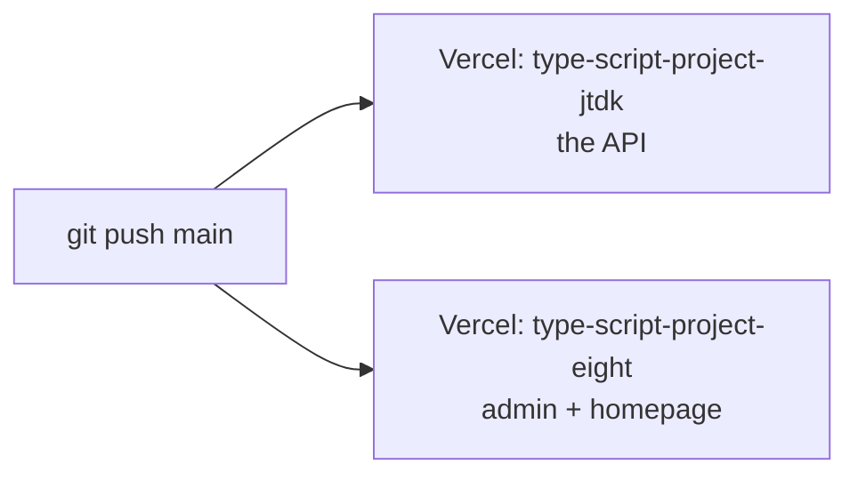
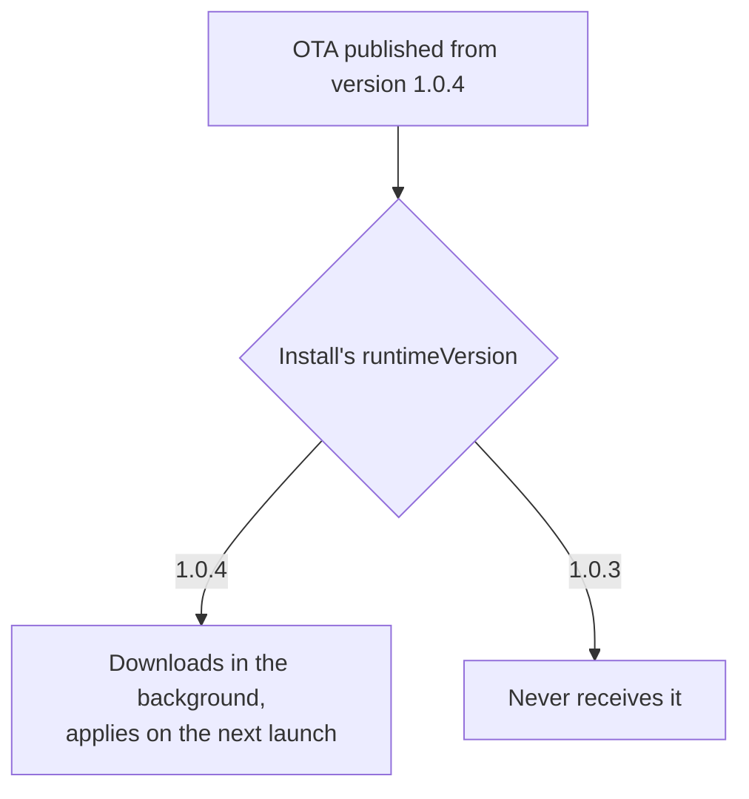
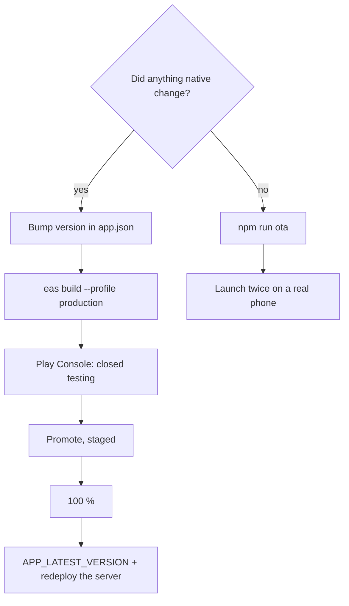

# Release a change

Three things ship on three different schedules. Work out which one you are
doing before you start.

| What changed | How it ships | Reaches people |
|---|---|---|
| Server code | `git push` to `main` | Within a minute or two |
| Admin panel or homepage | `git push` to `main` (the same push) | Within a minute or two, after a hard refresh |
| Mobile JavaScript, styles, strings, assets | `cd mobile && npm run ota` | On the **second** launch of matching installs |
| Anything native in the mobile app | `eas build` → Play Console | Hours to days, at Google's pace |

## Server and admin panel

Both Vercel projects deploy from the same repository on a push to `main`. One
push ships **both**. There is no separate deploy step.



Two things a push does **not** do:

- **It does not apply an environment-variable change.** A value edited in
  Vercel takes effect only after a redeploy of that project.
- **It does not update a `VITE_` value in a running browser.** Those are
  substituted textually into the bundle at build time.

## Mobile — over the air

```bash
cd mobile
npm run ota -- --message "what changed"
```

That script is `node scripts/preflight-ota.cjs && eas update --branch production --clear-cache`.

### The preflight guard {#preflight}

`mobile/scripts/preflight-ota.cjs` runs first and can stop the publish. It:

1. sets `NODE_ENV=production`;
2. loads the env files through `@expo/env` from `mobile/` — resolving them
   **exactly** the way `expo export` would;
3. reads `EXPO_PUBLIC_CLERK_PUBLISHABLE_KEY`;
4. **exits 1** unless the resolved value starts with `pk_live_`, printing only
   the first 12 characters and telling you to move test keys to
   `.env.development.local`.

The `&&` means `eas update` never runs after a failure.

!!! danger "Why the guard exists"
    Expo reads `.env.local` **before** `.env`, even when bundling for
    production. A test key in `.env.local` ships to every customer, and it has
    happened: Metro's cache kept an old `pk_test` key inlined after `.env`
    changed, and one OTA carried it to production. Google's sign-in screen then
    said "continue to Clerk" instead of "sKirana".

    `--clear-cache` is on the command for the same reason. Do not remove it,
    and do not call `eas update` directly.

### The runtime-version rule {#runtime-version}

`mobile/app.json` sets `runtimeVersion: { "policy": "appVersion" }`. So the
runtime version **is** `version` — today `1.0.4`.



Consequences:

- **An OTA reaches only installs of the same version.** A build of 1.0.3 will
  never receive a 1.0.4 update, no matter how many times it is launched.
- **Bumping `version` cuts off every existing install** from future OTAs until
  they get the new build from Play.
- **It applies on the second launch.** The first launch downloads it in the
  background; `UpdatePrompt` then offers a reload, or it takes effect next
  time.

!!! warning "Changing the Clerk key means bumping the version in the same commit"
    A key change that only goes out over the air reaches installs of the
    current version, leaving anyone on an older build with a mismatched key and
    a broken sign-in. Bump `version` in `app.json` in the same commit as the
    key change, and build.

### Channels and branches

| Profile in `eas.json` | Channel | Built as |
|---|---|---|
| `development` | none | APK, dev client, internal |
| `preview` | `preview` | APK, internal |
| `production` | `production` | AAB, `autoIncrement: true` |

`npm run ota` publishes to the **branch** `production`, which the production
channel subscribes to. There is no script for the preview channel — that needs
`eas update --branch preview` by hand.

`eas.json` sets `cli.appVersionSource: "remote"`, so the Android version code
lives on EAS's servers, not in this repository. There is no `versionCode` in
`app.json` to edit.

## Mobile — a new native build

Needed for anything an OTA cannot carry:

- a new Android permission;
- a new native module or config plugin;
- an Expo SDK upgrade;
- a change to `app.json`'s native configuration — package name, scheme, icons,
  notification channel;
- a version bump.

```bash
cd mobile
eas build --platform android --profile production
```

Then in the Play Console, for `com.skirana.app`:

1. Upload the `.aab` to **closed testing** first. That is the path every
   release so far has taken.
2. Test the things that only break on a real device: Google sign-in, the email
   code, sending a list, seeing the price come back, a push arriving.
3. Promote to **production**, staged. Past releases have started at 20 % in
   India.
4. Watch the release's crash and ANR rates before increasing the rollout — see
   [Monitoring](../operations/monitoring.md).
5. Increase to 100 %.

## After a release reaches everyone {#after-release}

Only when the staged rollout is at 100 %:

1. Set `APP_LATEST_VERSION` on the **server** project in Vercel to the new
   version.
2. **Redeploy** the server project. The value is read per request by
   `GET /app-version`, but Vercel only picks up a changed variable on a
   redeploy.

`StoreUpdatePrompt` in the app compares `Updates.runtimeVersion` against that
value on every foreground and offers the Play listing. Setting it early prompts
people to fetch a version they cannot get yet.

`APP_MIN_VERSION` is the harder lever: below it the dialog is **mandatory**,
with no "Later". Use it only when an older build is actively broken. An unset
`APP_LATEST_VERSION` is the quiet case — no prompt at all — so forgetting it
is harmless, not broken.

## Rolling back

| What | How |
|---|---|
| Server or admin | `git revert <commit>` and push. Both projects rebuild. |
| Mobile OTA | Publish a new OTA from the reverted commit. There is no "undo". |
| A Play release | Halt the staged rollout in the Play Console. People who already updated stay updated. |

There is no rollback button for any of these.

## A release checklist



Before you publish:

- [ ] `cd mobile && npx tsc --noEmit` passes — that is the only gate the mobile
      package has; there is no test script and no lint script.
- [ ] `cd client && npm run build` passes, if the panel changed.
- [ ] The key in the resolved env is `pk_live_` — the preflight will tell you,
      but knowing beforehand saves a cycle.
- [ ] The commit message says what changed, for the `--message` on the OTA.
- [ ] If a server-side variable changed, you have redeployed that project.

After:

- [ ] Launch the app **twice** on a real phone. Once is not enough to see an
      OTA.
- [ ] Send a list and price it, end to end.
- [ ] Check the Vercel function logs for anything new.
