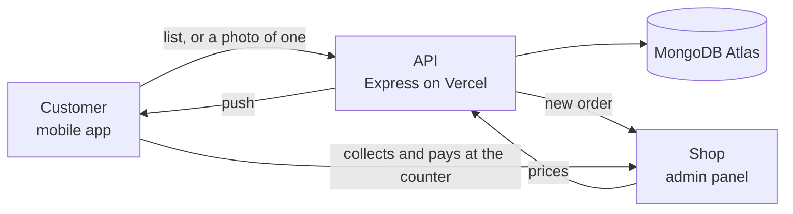

# sKirana

A customer writes a grocery list in the app — or photographs a handwritten one —
and sends it to one shop. The shop prices it and sends it back. The customer
collects the order and pays at the counter, or over UPI.

Two facts shape everything else in this codebase:

- **There is no checkout.** Prices are not published; the shop quotes them per
  order. The app is useful without a complete, priced catalogue, which is what
  makes it usable by a shop that has never had one.
- **There is one shop.** Every product, list and banner belongs to it
  implicitly — there is no `shop` field anywhere yet.



## Where to start

| You are… | Read |
|---|---|
| New here | [The system](explain/system.md), then [a list from written to collected](explain/list-lifecycle.md) |
| Fixing production, now | [Runbook](operations/runbook.md) |
| Changing the database | [Schema overview](interfaces/database/index.md) and [Add a field](guides/add-a-field.md) |
| Calling or changing an endpoint | [About the API](interfaces/api/index.md) |
| Looking for one function | [All functions](reference/all-functions.md), or search — the magnifier, top right |
| Setting up a new machine | [Get it running](guides/getting-started.md) |

## How this site is organised

**Guide** explains how things work and how to do a task. **Modules** describes
each part of the system in the product's own terms — what it does, and
deliberately what it does *not* do. **Interfaces** is the contract: every
endpoint, every collection, every message that leaves the system. **Code
reference** is generated from the TSDoc comments in the source, so it cannot
drift from the code. **Operations** is for when something is wrong.

## What you can trust

Every page here was written by reading the code, and every claim names the file
and the function it came from. Where the live database or a live endpoint was
measured, the number is the measured one. Anything that could not be verified is
marked **unverified** — take those marks seriously.

References never cite line numbers. A single pass of adding comments to this
codebase moved 1,383 of them in an afternoon without a word of prose changing;
a path and a symbol name survive that, and a line number cannot.

The pages also record what is **already broken or dead**: the inherited
e-commerce cart and checkout that no shipped client can reach, the list
endpoints with no pagination, and the places where a bare 500 is returned for
something the caller could have been told plainly. Read those before assuming a
piece of this codebase is load bearing.

## Building this site

```bash
pip install mkdocs-material mkdocs-literate-nav
node docs/tools/build-reference.mjs   # regenerate the code reference
mkdocs serve                          # http://127.0.0.1:8000
mkdocs build                          # static site in docs-site/
```

The code reference is generated from TypeDoc's JSON, which in turn comes from
the comments in the source. Change a comment, re-run the generator, and the
page changes with it.
