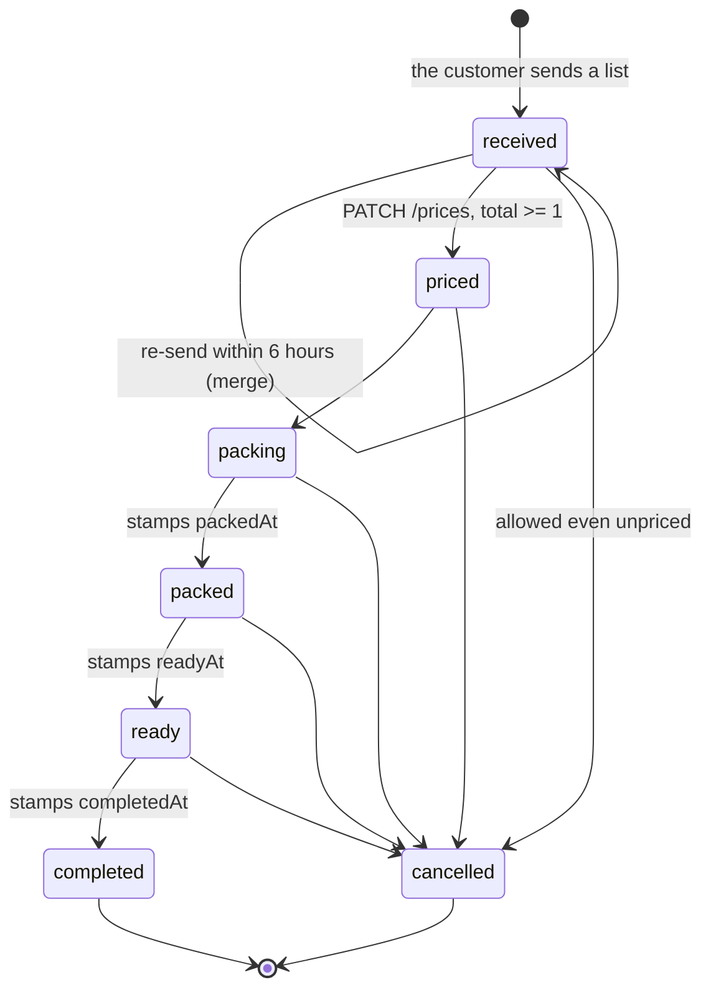

# Grocery lists — admin side {#grocery-lists-admin}

`server/src/routes/admin/grocery-list.routes.ts` · exported as
`adminGroceryListRouter` · mounted at `/admin` in `mainEntryFunction`
(`server/src/server.ts`), second among the seven admin routers.

## What this router owns

The shopkeeper's side of a grocery list: pricing it, moving it through the
packing statuses, correcting its items, and the chat attached to it.

The customer's own routes are in
[grocery-lists-customer](grocery-lists-customer.md) and map the same documents
differently.

## Who may call it

`adminGroceryListRouter.use(requireAdmin)` guards the router end to end, so
every route answers **401** to a caller with no Clerk session and **403
`Admin access only`** to a signed-in customer. No route here is public.

**Ownership is never checked.** An admin may read and change any customer's
list and any list's chat.

???+ warning "Seven of the ten routes answer with the WHOLE list collection"
    Every mutation except the chat write re-runs `getAllGroceryLists` and
    returns `data.items` — every list the shop has ever received, with all
    their items, unfiltered and unpaginated. The admin panel treats each
    mutation as a full refresh, so a caller should **replace** its local state
    rather than patch one row.

    This is also the API's largest response, and it is re-sent after every
    pricing, status change and item edit. With Vercel's 4.5 MB response cap
    (see [platform limits](index.md#limits)) it is the first endpoint likely
    to break as the shop grows.

## The list shape {#list-shape}

`mapGroceryList` here is the admin twin of the customer mapper. Compared with
it, this one **adds** `customerName`, `customerEmail`, `customerPhone` and
`updatedAt`, and deliberately **omits** `seenByCustomer` — that flag drives the
customer's own unread badge and means nothing to the shop. The raw `user`
reference, `razorpayOrderId`, `paymentId` and `__v` are left out as well.

```json
{
  "_id": "68e5556677889900aabbccdd",
  "code": "00AABBCCDD",
  "customerName": "Asha Kumari",
  "customerEmail": "asha@example.com",
  "customerPhone": "9876543210",
  "items": [
    {
      "name": "Atta",
      "quantity": "5 kg",
      "rate": 52,
      "price": 260,
      "available": true
    }
  ],
  "totalItems": 1,
  "totalAmount": 260,
  "status": "priced",
  "paymentMethod": "at_shop",
  "paymentStatus": "pending",
  "note": "Please call before 6pm",
  "pricedAt": "2026-09-19T05:12:09.441Z",
  "packedAt": null,
  "readyAt": null,
  "completedAt": null,
  "paidAt": null,
  "createdAt": "2026-09-19T04:58:31.220Z",
  "updatedAt": "2026-09-19T05:12:09.452Z"
}
```

The three `customer` fields fall back to the populated `user` record's `name`,
`email` and `phone`, so lists created before the snapshot existed still show
who sent them. Each item comes back with `rate` defaulted to `0` and
`available` normalised to a real boolean, so an old record reads the same as a
new one.

`code` is not stored — it is the last eight characters of the `_id`,
upper-cased.

## Status transitions {#status-transitions}



The arrows are the intended path, not a constraint the code enforces.
`PATCH /status` accepts any of `packing`, `packed`, `ready`, `completed` and
`cancelled` from any state, so the shop can jump straight from `packing` to
`completed`. The only guard is `totalAmount >= 1` unless cancelling. There is
no route back to `received` or `priced` — `received` is only ever the creation
state, and `priced` is set by the pricing route alone.

---

## `GET /admin/grocery-lists` {#get-grocery-lists}

The whole list collection for the admin panel.

**Auth:** admin. **Path, query and body parameters:** none are read. There is
no filter, no search and no paging.

Sorted by `updatedAt` descending, with `user` populated down to
`name email phone`.

???+ info "Why `updatedAt` and not `createdAt`"
    When a customer sends a new list that merges into an existing unpriced one,
    its items and `updatedAt` change but its `createdAt` stays. Sorting by
    `createdAt` would bury a freshly re-sent order at its old position.
    `updatedAt` bubbles active orders to the top. No index covers that sort —
    see [grocery-lists](../database/grocery-lists.md#indexes).

```json
{
  "status": "success",
  "data": { "items": [] }
}
```

`items` holds [the list shape](#list-shape), most recently active first.

**Errors:** 401 and 403 from the router guard.

**Side effects:** none. This is the only read-only list route here; the others
return the same payload as a by-product of writing.

**Called by:** `getAdminGroceryLists` in
`client/src/features/admin/grocery-lists/api.ts`.

---

## `PATCH /admin/grocery-lists/:listId/prices` {#patch-prices}

Prices every line of a list in one go and moves it to `priced`. This is the
only way a list reaches `priced`.

**Auth:** admin.

| Path parameter | Meaning |
|---|---|
| `listId` | The list's `_id`. Trimmed; must be non-empty |

### Request body

| Field | Type | Validation |
|---|---|---|
| `items` | `IncomingPricedItem[]` | Must be an array, non-empty, and its length must **equal the stored item count exactly** |

Each row may carry `name`, `quantity`, `rate` and `price`, but only two are
read:

| Field | Behaviour |
|---|---|
| `price` | Must be a number of 0 or more. Rounded with `Math.round`, so paise are discarded |
| `rate` | Kept only when finite and greater than zero, otherwise stored as `0`. **Display only** — it is never multiplied into the total |
| `name` and `quantity` | **Ignored entirely.** The customer's own text stays the source of truth |

Pricing is matched to the stored list **by array position**, not by name, which
is why the length has to match exactly — a client that dropped or added a row
is rejected rather than silently misaligned.

A row already marked unavailable is forced to `price: 0` whatever the shop
sent, and its `available` flag cannot be changed here — use
[the availability route](#patch-availability).

The total is the sum of the stored prices and must come to at least 1, so a
list cannot be sent back priced at zero. There is **no status gate**: a list
can be re-priced after it has moved on, which resets it to `priced`.

Answers with [the whole collection](#list-shape).

**Errors**

| Status | Message |
|---|---|
| 400 | `List id is required` |
| 400 | `Items are required` — missing, not an array, or empty |
| 404 | `List not found` |
| 400 | `Item count does not match the customer's list` |
| 400 | `Each item price must be 0 or more` — a price is `NaN` or negative |
| 400 | `Total must be greater than 0` — the rounded prices add up to less than 1 |

**Side effects**

- **Database:** one write — `items`, `totalAmount`, `status: "priced"`,
  `pricedAt`, and `seenByCustomer: false` to re-light the customer's badge.
- **Push to the customer:** one Expo push to every device they have registered,
  titled `"Your list is priced"`.

The push is awaited because the serverless function freezes once the response
is sent; `notifyUser` in `server/src/utils/push.ts` swallows its own errors, so
it cannot fail the request. No Telegram, no Cloudinary.

**Called by:** `setAdminGroceryListPrices` in
`client/src/features/admin/grocery-lists/api.ts`.

---

## `PATCH /admin/grocery-lists/:listId/status` {#patch-status}

Sets the packing status of a list and tells the customer.

**Auth:** admin.

| Path parameter | Meaning |
|---|---|
| `listId` | The list's `_id` |

### Request body

| Field | Type | Allowed values |
|---|---|---|
| `status` | string | `packing`, `packed`, `ready`, `completed` and `cancelled` — the `ALLOWED_STATUSES` tuple |

`received` and `priced` are rejected as invalid here: pricing has its own route
and nothing may return a list to `received`.

**Gate:** a list whose `totalAmount` is below 1 can only be moved to
`cancelled`, so an unpriced list cannot be marched through packing. Nothing
else enforces an order — see [status transitions](#status-transitions).

`packedAt`, `readyAt` and `completedAt` are stamped the **first** time their
status is reached and are never overwritten, so a status set twice keeps the
original time. Cancelling stamps nothing.

Answers with [the whole collection](#list-shape).

**Errors**

| Status | Message |
|---|---|
| 400 | `List id is required` |
| 400 | `Status is required` |
| 400 | `Invalid status` |
| 404 | `List not found` |
| 400 | `Price the list before moving it forward` — unpriced, and the target is not `cancelled` |

**Side effects**

- **Database:** one write — `status`, possibly one timestamp, and
  `seenByCustomer: false`.
- **Push to the customer:** one Expo push titled `"Order #CODE"`, with the body
  taken from the `statusNotification` table. Sent for every status **including
  `cancelled`**.

The five bodies are in that table and are sent as written, so a change there
changes what the customer reads on their lock screen. They are listed on the
[Outbound messages](../messages.md#status-bodies) page.

**Called by:** `updateAdminGroceryListStatus` in
`client/src/features/admin/grocery-lists/api.ts`.

---

## `PATCH /admin/grocery-lists/:listId/mark-paid` {#patch-mark-paid}

Records that the shop has the money for a list. A manual confirmation for cash
and direct UPI — an online Razorpay payment is confirmed on the customer's side
instead and does not come through here.

**Auth:** admin.

| Path parameter | Meaning |
|---|---|
| `listId` | The list's `_id` |

**Query parameters:** none. **Request body:** none is read.

**Gate:** the list must be priced, meaning `totalAmount >= 1`.

A list already marked paid short-circuits: it answers 200 with the collection,
writes nothing, and sends no push. So the route is safe to call twice.

`paymentMethod` is only touched when it is still the `at_shop` default, in
which case it becomes `upi`; a method of `online` is left alone. `status` is
not changed, so a paid list stays wherever it was in packing.

Answers with [the whole collection](#list-shape).

**Errors**

| Status | Message |
|---|---|
| 400 | `List id is required` |
| 404 | `List not found` |
| 400 | `Price the list before marking it paid` |

**Side effects**

- **Database:** one write — `paymentStatus: "paid"`, `paidAt`, possibly
  `paymentMethod`, and `seenByCustomer: false`.
- **Push to the customer:** one Expo push titled `"Payment received"`.

**Called by:** `markAdminGroceryListPaid` in
`client/src/features/admin/grocery-lists/api.ts`.

---

## `PATCH /admin/grocery-lists/:listId/items/:index/availability` {#patch-availability}

Marks one line of a list out of stock, or back in stock.

**Auth:** admin.

| Path parameter | Meaning |
|---|---|
| `listId` | The list's `_id` |
| `index` | A zero-based position into the stored `items` array. Must be a non-negative integer, within range |

### Request body

| Field | Read as | Notes |
|---|---|---|
| `available` | `Boolean(req.body.available)` | A missing field, `null`, `0` or `""` all mean **out of stock**. There is no way to signal "leave it alone" |

Marking a line unavailable zeroes its `price`. Marking it available again does
**not** restore the old price, so the list has to be re-priced. The total is
recomputed from the available lines only.

The line itself is never removed, so the customer can still see what they asked
for. `totalItems` is therefore unchanged, which is correct.

**No status gate**: a completed or cancelled list can still be changed here,
unlike the item edit and item add routes.

Answers with [the whole collection](#list-shape).

**Errors**

| Status | Message |
|---|---|
| 400 | `List id is required` |
| 400 | `Valid item index is required` |
| 404 | `List not found` |
| 404 | `Item not found in this list` — `:index` is past the end |

**Side effects**

- **Database:** one write — `items`, `totalAmount`, `seenByCustomer: false`.
- **Push to the customer:** one Expo push titled `"Item not available · #CODE"`,
  naming the item — sent **only** when marking a line unavailable. Restoring a
  line sends nothing.

**Called by:** `setAdminGroceryListItemAvailability` in
`client/src/features/admin/grocery-lists/api.ts`.

---

## `PATCH /admin/grocery-lists/:listId/items/:index` {#patch-item}

Rewrites the name or quantity of one line — to fix a typo, clarify a vague
quantity, or correct what the customer sent.

**Auth:** admin.

| Path parameter | Meaning |
|---|---|
| `listId` | The list's `_id` |
| `index` | A zero-based position into `items`; non-negative integer, within range |

### Request body

| Field | Type | Validation |
|---|---|---|
| `name` | string, optional | `cleanField(value, MAX_NAME_LEN, true)` — 60 characters, and must still be at least `MIN_NAME_LEN` = 2 after cleaning |
| `quantity` | string, optional | `cleanField(value, MAX_QTY_LEN, true)` — 12 characters; may end up empty |

An omitted field keeps the stored value, so a caller can send just one of the
two.

Both fields go through the grocery allowlist cleaner in
`server/src/utils/sanitizeItem.ts`: control, zero-width and bidi characters are
dropped, and every character outside letters in any script — Devanagari
combining marks included — digits, whitespace and `. , & ' - / ( ) %` and `×`
is removed, then whitespace is collapsed and the result truncated.

A non-string body value cleans to `""`, so sending `{ "name": { "$gt": "" } }`
fails the length check rather than reaching Mongo.

**Gate:** rejected once the list is `completed` or `cancelled`.

`price`, `rate` and `available` are carried across untouched, so correcting a
name cannot change what the customer owes.

Answers with [the whole collection](#list-shape).

**Errors**

| Status | Message |
|---|---|
| 400 | `List id is required` |
| 400 | `Valid item index is required` |
| 404 | `List not found` |
| 400 | `This order is already closed` — the list is `completed` or `cancelled` |
| 404 | `Item not found in this list` |
| 400 | `Item name is required` — the cleaned name is empty |
| 400 | `Item name is too short` — the cleaned name is a single character |

**Side effects:** one database write — `items`, `seenByCustomer: false`.
**No push.** The customer sees the correction the next time they open the list.
This is the only mutation in this router that notifies nobody.

**Called by:** `updateAdminGroceryListItem` in
`client/src/features/admin/grocery-lists/api.ts`.

---

## `POST /admin/grocery-lists/:listId/items` {#post-items}

Appends a line the customer asked for outside the app — in person, on the
phone, or later.

**Auth:** admin.

| Path parameter | Meaning |
|---|---|
| `listId` | The list's `_id` |

### Request body

| Field | Type | Validation |
|---|---|---|
| `name` | string | Same cleaner and 60-character cap as the edit route; must survive at 2 characters or more |
| `quantity` | string | Same cleaner and 12-character cap; may be empty |

Any `price`, `rate` or `available` in the body is ignored. The new line always
starts at `rate: 0, price: 0, available: true`, so the list has to be re-priced
before it can move forward.

**Gates:** the list must not be `completed` or `cancelled`, and must hold fewer
than `MAX_ITEMS_PER_LIST` = 100 items.

???+ info "Validation order"
    The name is checked **before** the list is loaded, so a bad name on a
    non-existent list answers 400, not 404.

Answers **200** with [the whole collection](#list-shape) — not 201, and not the
new line.

**Errors**

| Status | Message |
|---|---|
| 400 | `List id is required` |
| 400 | `Item name is required` |
| 400 | `Item name is too short` |
| 404 | `List not found` |
| 400 | `This order is already closed` |
| 400 | `This list already has the maximum 100 items.` |

**Side effects**

- **Database:** one write — `items`, `totalItems`, `seenByCustomer: false`.
- **Push to the customer:** one Expo push titled `"Item added · #CODE"` naming
  the item, so the customer learns of an addition they did not make.

**Called by:** `addAdminGroceryListItem` in
`client/src/features/admin/grocery-lists/api.ts`.

---

## `GET /admin/grocery-lists/conversations` {#get-conversations}

One row per chat, newest activity first, for the admin Messages page.

**Auth:** admin. **Path, query and body parameters:** none are read.

An aggregation over the `messages` collection: it sorts by `createdAt`
descending, groups by `groceryList`, keeps the newest message and the message
count per list, re-sorts by that newest message, and caps the result at
**100** conversations. That cap is not configurable and there is no paging, so
a busy shop cannot reach the 101st conversation from here.

This and [`/customer/home`](home.md) are the only two bounded reads in the API.

A group whose list has since been deleted is dropped, so `messageCount` counts
surviving messages for a surviving list. Because messages are deleted by a TTL
index thirty days after they are written, a quiet conversation disappears from
this response even though the list remains.

Each row carries `customerName` and `customerPhone` with the same populated
fallbacks as [the list shape](#list-shape), but not `customerEmail` and none of
the money or item fields.

```json
{
  "status": "success",
  "data": {
    "conversations": [
      {
        "listId": "68e5556677889900aabbccdd",
        "code": "00AABBCCDD",
        "customerName": "Asha Kumari",
        "customerPhone": "9876543210",
        "status": "priced",
        "messageCount": 4,
        "lastMessage": {
          "text": "Yes, packing it now.",
          "sender": "staff",
          "createdAt": "2026-09-19T05:20:44.008Z"
        }
      }
    ]
  }
}
```

???+ info "Why Express does not mistake `conversations` for a list id"
    This literal path is registered **before** `/grocery-lists/:listId/messages`,
    and there is no `GET /grocery-lists/:listId` at all, so no parameterised
    route can capture it.

**Errors:** 401 and 403 from the router guard.

**Side effects:** none.

**Called by:** `getAdminConversations` in
`client/src/features/admin/grocery-lists/api.ts`.

---

## `GET /admin/grocery-lists/:listId/messages` {#get-messages}

The full conversation for one list, oldest first.

**Auth:** admin.

| Path parameter | Meaning |
|---|---|
| `listId` | The list's `_id` |

**Query parameters:** none — the whole conversation comes back unpaginated,
bounded in practice only by the thirty-day retention on messages.

Unlike the customer twin there is **no ownership scope**: any admin may read
any customer's chat. The list is loaded purely to answer 404 for an unknown id;
nothing from it appears in the response.

Reading marks nothing as seen, in either direction.

```json
{
  "status": "success",
  "data": {
    "messages": [
      {
        "_id": "68e6667788990011bbccddee",
        "sender": "customer",
        "senderName": "Asha Kumari",
        "text": "Is the 5 kg pack available?",
        "createdAt": "2026-09-19T05:18:02.331Z"
      }
    ]
  }
}
```

**Errors**

| Status | Message |
|---|---|
| 400 | `List id is required` |
| 404 | `List not found` |

**Side effects:** none.

**Called by:** `getAdminGroceryListMessages` in
`client/src/features/admin/grocery-lists/api.ts`.

---

## `POST /admin/grocery-lists/:listId/messages` {#post-messages}

The shop writes a chat message on one list.

**Auth:** admin.

| Path parameter | Meaning |
|---|---|
| `listId` | The list's `_id` |

### Request body

| Field | Type | Validation |
|---|---|---|
| `text` | string | Trimmed, required, at most **1000** characters — the same ceiling the schema enforces, so the 400 here is what a caller sees rather than a validation 500 |

The text is **not** put through the grocery allowlist cleaner: chat is
free-form, so punctuation survives.

`sender` is always `"staff"` and `senderName` is snapshotted from the
`SHOP_NAME` environment variable, falling back to `"Shop"`. Neither can be set
by the caller. The message is linked to the list's own customer, so an admin
cannot address it to anyone else.

No status gate: a closed order can still be replied to.

Unlike the mutations above, this answers **201** with the single created
message, not the list collection. Its shape is the same as the read's.

**Errors**

| Status | Message |
|---|---|
| 400 | `List id is required` |
| 400 | `Message cannot be empty` |
| 400 | `Message is too long` |
| 404 | `List not found` |

**Side effects**

- **Database:** one insert into `messages`, which the TTL index deletes thirty
  days later.
- **Push to the customer:** one Expo push titled
  `"Message from the shop · #CODE"`, carrying the message text as the body — so
  the whole message appears on the customer's lock screen.

No Telegram, no Cloudinary.

**Called by:** `sendAdminGroceryListMessage` in
`client/src/features/admin/grocery-lists/api.ts`.
