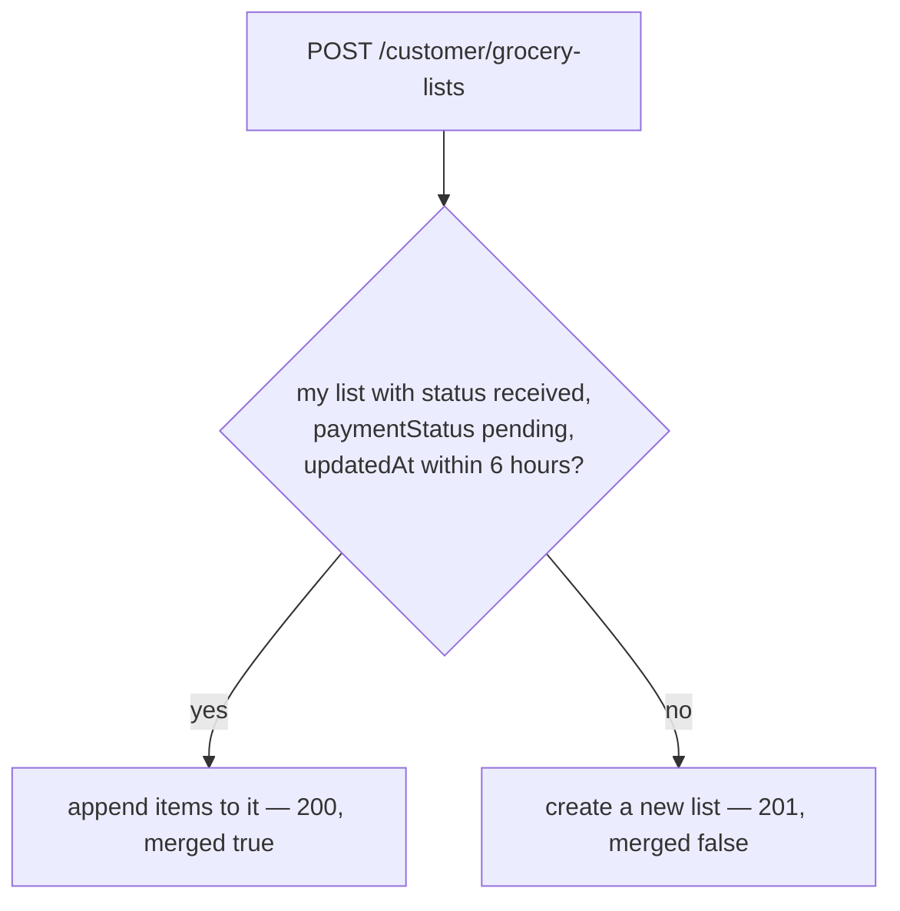

# Grocery lists — customer side {#grocery-lists-customer}

`server/src/routes/customer/grocery-list.routes.ts` · exported as
`customerGroceryListRouter` · mounted at `/customer` in `mainEntryFunction`
(`server/src/server.ts`).

## What this router owns

Sending a handwritten shopping list to the shop, watching what the shop does
with it, paying for it, and the chat attached to it. This is the path most
customers take, rather than the catalogue and cart.

The division of labour matters when reading these endpoints. **The customer
writes** item names, quantities and a note. **The shop writes** prices, `rate`,
`available`, `status` and the timestamps. The only list edit a customer can
make after sending is removing a single item, and only before packing starts.

The shopkeeper's side of the same lists and the same chat is in
[grocery-lists-admin](grocery-lists-admin.md).

## Who may call it

`customerGroceryListRouter.use(requireAuth)` covers the whole router, so every
route needs a signed-in customer. No route here is public and none is
admin-only.

Every list lookup is scoped by `user`, so a list owned by somebody else answers
**404 `List not found`** rather than 403 — an id is never confirmed to exist.
A malformed `listId` reaches Mongoose as a `CastError` and surfaces as a
**500**.

None of these routes paginates.

## The list shape {#list-shape}

Every list endpoint here answers with `mapGroceryList`:

```json
{
  "_id": "68e5556677889900aabbccdd",
  "code": "00AABBCCDD",
  "items": [
    {
      "name": "Atta",
      "quantity": "5 kg",
      "rate": 52,
      "price": 260,
      "available": true
    },
    {
      "name": "Surf chota",
      "quantity": "2 packets",
      "rate": 0,
      "price": 0,
      "available": false
    }
  ],
  "totalItems": 2,
  "totalAmount": 260,
  "status": "priced",
  "paymentMethod": "at_shop",
  "paymentStatus": "pending",
  "seenByCustomer": false,
  "note": "Please call before 6pm",
  "pricedAt": "2026-09-19T05:12:09.441Z",
  "packedAt": null,
  "readyAt": null,
  "completedAt": null,
  "paidAt": null,
  "createdAt": "2026-09-19T04:58:31.220Z"
}
```

`code` is not stored. It is the last eight characters of the `_id`,
upper-cased, and is the human reference the shop and the customer quote at each
other — the same one used in push titles and Telegram messages.

A missing `rate` is emitted as `0` and a missing `available` as `true`, so the
app never has to test for `undefined`.

Deliberately omitted: `user`, `customerName`, `customerEmail`,
`customerPhone`, `razorpayOrderId`, `paymentId`, `updatedAt` and `__v`. The
customer's own phone number is therefore never returned by this mapper; it
comes back once, separately, from
[`GET /customer/grocery-lists`](#get-grocery-lists).

## The message shape {#message-shape}

Both chat endpoints use `mapMessage`:

```json
{
  "_id": "68e6667788990011bbccddee",
  "sender": "staff",
  "senderName": "sKirana",
  "text": "Atta is ready, coming in 10 minutes.",
  "createdAt": "2026-09-19T05:20:44.008Z"
}
```

`sender` is `"customer"` or `"staff"`, which is how the app decides which side
of the thread to draw the bubble on. The `groceryList` and `user` references,
`updatedAt` and `__v` are omitted.

---

## `POST /customer/grocery-lists/read-photo` {#post-read-photo}

Turns photos of a handwritten list into `{ readable, items }` for the app to
put in an editable draft.

**Auth:** signed-in customer. **Path and query parameters:** none.

### Request body — `multipart/form-data`

| Property | Value |
|---|---|
| Field name | `photos`, repeated |
| Files | 1 to 3 (`MAX_PHOTOS_PER_READ`) |
| Size | at most 6 MB each (`MAX_PHOTO_BYTES`) |
| Types | `image/jpeg`, `image/png` and `image/webp` — checked on the **declared** MIME type, not the bytes |
| Storage | memory only, through `multer.memoryStorage()` |

Parsing is done by the `acceptPhotos` middleware, which wraps the
`receivePhotos` multer instance and translates multer's own failures into an
`AppError`. All the photos of one list go in a single request so the model sees
a list that runs onto a second page, and so it costs one quota unit.

This creates nothing. No list is started, no draft is saved, and the returned
items are only a suggestion until the customer sends them through
[`POST /customer/grocery-lists`](#post-grocery-lists).

### Response

```json
{
  "status": "success",
  "data": {
    "readable": true,
    "items": [
      { "name": "आटा", "quantity": "5 kg", "confidence": "high" },
      { "name": "surf chota", "quantity": "2", "confidence": "medium" },
      { "name": "Chini", "quantity": "", "confidence": "low" }
    ]
  }
}
```

`confidence` is the model's own estimate of how clearly the writing could be
read. The app uses it to flag rows the customer should check; nothing on the
server treats a low-confidence row differently.

Names and quantities come back already cleaned by the same `cleanField` rules
the send endpoint applies, rows under two characters are dropped, and the list
is cut to 50 items.

???+ warning "`readable: false` is a 200, not an error"
    `readable` is false when the model could not read the photo **or** when
    nothing survived cleaning. That case answers **200** with
    `{ "readable": false, "items": [] }`. A caller must check the flag rather
    than the status code.

### Errors

| Status | Message | Raised by |
|---|---|---|
| 400 | `Send a JPG, PNG or WebP photo` | the multer `fileFilter`, before the handler runs |
| 400 | `Each photo must be under 6 MB` | `acceptPhotos`, on `LIMIT_FILE_SIZE` |
| 400 | `Send at most 3 photos at a time` | `acceptPhotos`, on **any other** multer limit — too many files, an unexpected field name, too many parts. So this text is not proof the count was the real problem |
| 400 | `Choose at least one photo` | the handler, when the body carries no `photos` part |
| 429 | `Your photo is still being read — one moment.` | `parseGroceryListPhotos`, when this customer already has a read in flight |
| 429 | `Just a moment before the next photo.` | fewer than 5 seconds since that customer's previous read **finished** |
| 503 | `Reading photos isn't switched on yet. Please type the items instead.` | `GEMINI_API_KEY` is unset |
| 503 | `A lot of lists are being read right now. Try again in a minute, or type the items.` | after 12 reads in the current minute, server-wide |
| 503 | `Could not reach the photo-reading service. Check the internet and try again.` | the call failed, or the 45 second abort fired |
| 503 | `The photo reader is busy right now. Try again in a minute, or type the items.` | Gemini answered 429 |
| 503 | `The photo could not be read just now. Try again, or type the items.` | any other Gemini failure, or the reply failed zod validation |

See [rate limits](index.md#limits) for why these brakes are per process and
therefore approximate.

**Side effects:** one Gemini `generateContent` call over plain REST, with the
image bytes base64-encoded inline, and one `[photo-parser]` log line on
success. **No database write, no Cloudinary upload, and no storage of the image
anywhere.** The bytes arrive in the request, go to the model, and are gone when
the response is written. What the customer keeps is the text, which they can
correct before the shop ever sees it.

**Called by:** `readListPhotos` in
`mobile/src/features/customer/grocery-list/api.ts`, which raises the axios
timeout to 60 s for this one call.

---

## `POST /customer/grocery-lists` {#post-grocery-lists}

Sends a list of items to the shop, either as a new order or as more items on
the order already open.

**Auth:** signed-in customer. **Path and query parameters:** none.

### Request body

| Field | Type | Validation |
|---|---|---|
| `items` | `[{ name, quantity }]` | Cleaned by `cleanItems` in `server/src/utils/sanitizeItem.ts`. Anything that is not an array is treated as empty |
| `note` | string | `cleanField(value, 300)` — `MAX_NOTE_LEN`. Specials are **not** blocked here, so prose keeps its punctuation |
| `phone` | string | `normalizeMobile(value)`. An invalid number is **ignored without an error** |

Per-item limits, applied in this order by `cleanItems`:

| Rule | Value | Effect |
|---|---|---|
| Raw rows accepted | more than 500 | rejected outright, before anything is mapped |
| `name` | `MAX_NAME_LEN` = 60 characters | truncated |
| `quantity` | `MAX_QTY_LEN` = 12 characters | truncated |
| `name` after cleaning | under `MIN_NAME_LEN` = 2 | the row is **dropped silently** |
| Surviving rows in one send | more than `MAX_ITEMS_PER_SUBMIT` = 50 | rejected |
| Items on the merged list | more than `MAX_ITEMS_PER_LIST` = 100 | rejected |

Because short rows are dropped before the count, a list padded with junk rows
is not punished for them — but a body that had rows can still fail the "at
least one item" check.

???+ info "Cleaning is the last line of defence"
    The client caps and cleans too, but the client is never trusted. In
    `cleanField`, a non-string value — an object, an array, a `{ "$gt": "" }`
    injection payload — collapses to an empty string rather than reaching the
    query or the database. Only `name` and `quantity` survive a row, so a
    client cannot post its own price.

### The six-hour merge window



If the customer already has a not-yet-priced list from the same shopping
session, the new items are merged into it instead of opening a parallel order.
A send after the window starts a fresh order with today's date, so a week-old
`received` list no longer keeps absorbing every future send. Priced and packed
lists are never merged into.

On a merge: the new note is appended to the old one separated by `" | "`, and
the stored phone is filled in **only if it was empty**.

Because a merge keeps the list's `createdAt` and bumps only `updatedAt`, the
admin list sorts by `updatedAt` — see
[grocery-lists-admin](grocery-lists-admin.md#get-grocery-lists).

### Response

**201** for a new list, **200** for a merge. Both bodies are
[the list shape](#list-shape) plus a `merged` boolean:

```json
{
  "status": "success",
  "data": {
    "_id": "68e5556677889900aabbccdd",
    "code": "00AABBCCDD",
    "items": [
      {
        "name": "Atta",
        "quantity": "5 kg",
        "rate": 0,
        "price": 0,
        "available": true
      }
    ],
    "totalItems": 1,
    "totalAmount": 0,
    "status": "received",
    "paymentMethod": "at_shop",
    "paymentStatus": "pending",
    "seenByCustomer": true,
    "note": "Please call before 6pm",
    "pricedAt": null,
    "packedAt": null,
    "readyAt": null,
    "completedAt": null,
    "paidAt": null,
    "createdAt": "2026-09-19T04:58:31.220Z",
    "merged": false
  }
}
```

### Errors

| Status | Message |
|---|---|
| 400 | `Too many items in one request` — above 500 raw rows |
| 400 | `A list can have at most 50 items per send` — above 50 surviving rows |
| 400 | `Add at least one item` — nothing survived cleaning |
| 400 | `This list already has too many items (max 100).` — a merge would pass the per-list cap |
| 401 | the standard unauthenticated message |

**Side effects**

- **Database:** may write `users.phone` when the caller sends a new valid
  number. Then either creates a `grocerylists` document or updates an existing
  one.
- **Push to the shop:** `notifyAdmins` sends an FCM web push to every admin
  browser — `"New grocery list"` or `"List updated"`.
- **Telegram:** `sendTelegram` sends a message to every configured chat id.

Both notification calls are **awaited** rather than left running, because
Vercel freezes the function once the response is sent. Both swallow their own
failures, so neither can fail the request. Exact templates are on the
[Outbound messages](../messages.md) page.

**Called by:** `submitGroceryList` in
`mobile/src/features/customer/grocery-list/api.ts`.

---

## `GET /customer/grocery-lists` {#get-grocery-lists}

Every list the caller has ever sent, newest first, plus the few extras the list
screen needs.

**Auth:** signed-in customer. **Path, query and body parameters:** none are
read.

Returns all of the caller's lists with no pagination and no date cut-off, so
the response grows for the life of the account.

```json
{
  "status": "success",
  "data": {
    "items": [],
    "unseenCount": 2,
    "upi": { "id": "skirana@okhdfcbank", "name": "sKirana" },
    "customerPhone": "9876543210"
  }
}
```

`items` holds [the list shape](#list-shape), newest first.

| Field | Meaning |
|---|---|
| `unseenCount` | How many lists the shop has updated and the customer has not opened. Computed in this handler from the returned rows, not from a separate count query, so it can never disagree with `items` |
| `upi.id` | `SHOP_UPI_ID`, or `""`. When it is empty the app is expected to hide the UPI option rather than build a broken deep link |
| `upi.name` | `SHOP_NAME`, defaulting to `"sKirana"` |
| `customerPhone` | The number stored on the user, `""` when never captured. This is the **only** place the API hands a customer their own stored number back, and it is what lets the app decide whether to prompt for one on first send |

**Errors:** 401 from the router guard.

**Side effects:** none of its own, beyond the create-on-demand `users` write.

**Called by:** `getCustomerGroceryLists` in
`mobile/src/features/customer/grocery-list/api.ts`.

---

## `PATCH /customer/grocery-lists/:listId/seen` {#patch-seen}

Marks one list as opened, so it stops counting towards the badge.

**Auth:** signed-in customer.

| Path parameter | Meaning |
|---|---|
| `listId` | The list's `_id`. Trimmed; must be non-empty |

**Query parameters:** none. **Request body:** none is read.

Idempotent: setting the flag on an already-seen list succeeds and returns the
same body. The shop sets the flag back to `false` on **every** change it makes,
so this is expected to be called many times over a list's life.

Answers with [the list shape](#list-shape).

**Errors**

| Status | Message |
|---|---|
| 400 | `List id is required` |
| 404 | `List not found` |

**Side effects:** one write to `grocerylists`. Nothing is sent to the shop.

**Called by:** `markGroceryListSeen` in
`mobile/src/features/customer/grocery-list/api.ts`.

---

## `PATCH /customer/grocery-lists/:listId/remove-item` {#patch-remove-item}

Drops one item from a list the caller has already sent — for example when the
quoted total came out over budget.

**Auth:** signed-in customer.

| Path parameter | Meaning |
|---|---|
| `listId` | The list's `_id` |

### Request body

| Field | Type | Validation |
|---|---|---|
| `index` | number | Must be an integer of 0 or more, and within the array |

???+ warning "The index is positional, with no version check"
    It is the position in the `items` array **as the last response returned
    it**. If the shop adds or removes an item in between, the same index
    removes a different row. Nothing detects that.

Guards run in this order: valid index, not already paid, status is `received`
or `priced`, index within range, more than one item left. A list can never be
emptied this way — removing the last item is refused, and cancelling an order
entirely is the shop's job.

`totalAmount` is recomputed as the sum of the remaining `price` values, so on a
list the shop has not priced yet it stays at 0. `totalItems` is set to the new
length.

Answers with [the list shape](#list-shape).

**Errors**

| Status | Message |
|---|---|
| 400 | `List id is required` |
| 400 | `Valid item index is required` |
| 400 | `This list is already paid` |
| 400 | `Items can only be removed before the shop starts packing` — `status` is anything but `received` or `priced` |
| 400 | `A list needs at least one item` |
| 404 | `Item not found in this list` — `index` is past the end |
| 404 | `List not found` |

**Side effects:** one write to `grocerylists`. **No push and no Telegram**, so
the shopkeeper only learns of the removal on their next refresh — which matters
if they are already picking the item off the shelf. Every shop-side change
notifies the customer; this customer-side change does not notify the shop.

**Called by:** `removeGroceryListItem` in
`mobile/src/features/customer/grocery-list/api.ts`.

---

## `PATCH /customer/grocery-lists/:listId/pay-at-shop` {#patch-pay-at-shop}

Records that the customer will pay in person on pickup.

**Auth:** signed-in customer.

| Path parameter | Meaning |
|---|---|
| `listId` | The list's `_id` |

**Query parameters:** none. **Request body:** none is read.

Sets `paymentMethod` to `"at_shop"` and nothing else. `paymentStatus` stays
`"pending"` until the shopkeeper marks the list paid from the admin side, so
this is a statement of intent and not a payment.

There is no status gate, so this works on a list the shop has not priced yet
and on one already packed. Only an already-paid list is refused.

It also undoes a change of mind: a list switched to `"online"` by
[`pay-online`](#post-pay-online) can be switched back here. The
`razorpayOrderId` already stored is **left in place** rather than cleared, so
that stale order id stays on the document and an old Razorpay order could still
be confirmed later.

Answers with [the list shape](#list-shape).

**Errors**

| Status | Message |
|---|---|
| 400 | `List id is required` |
| 400 | `This list is already paid` |
| 404 | `List not found` |

**Side effects:** one write to `grocerylists`. Nothing is sent to the shop.

**Called by:** `payGroceryListAtShop` in
`mobile/src/features/customer/grocery-list/api.ts`.

---

## `POST /customer/grocery-lists/:listId/pay-online` {#post-pay-online}

Opens a Razorpay order for the shop's quoted total and returns what the
checkout sheet needs.

**Auth:** signed-in customer.

| Path parameter | Meaning |
|---|---|
| `listId` | The list's `_id` |

**Query parameters:** none. **Request body:** none is read — the amount comes
from the stored `totalAmount` and can never be set by the caller.

The amount is converted from rupees to paise by `toSubUnits` in
`server/src/utils/razorpay.ts` before it reaches Razorpay. The receipt is
`GroceryList_<id>`.

`totalAmount < 1` means the shop has not priced the list yet, and is refused. A
list the shop later re-prices needs a new call, because the previous
`razorpayOrderId` is overwritten each time — the newest order id is the only
one [`confirm-payment`](#post-confirm-payment) will accept.

```json
{
  "status": "success",
  "data": {
    "razorpay": {
      "keyId": "rzp_live_XXXXXXXXXXXX",
      "orderId": "order_QaBcDeFgHiJkLm",
      "amount": 26000,
      "currency": "INR"
    },
    "list": {}
  }
}
```

`list` holds [the list shape](#list-shape). `keyId` is `RAZORPAY_KEY_ID`. That
is the publishable key and is meant to reach the client; the secret never
leaves the server.

**Errors**

| Status | Message |
|---|---|
| 400 | `List id is required` |
| 400 | `This list is already paid` |
| 400 | `The shop has not priced this list yet` — `totalAmount` is below 1 |
| 404 | `List not found` |
| 500 | a Razorpay SDK failure, which is not an `AppError` |

**Side effects:** creates an order at Razorpay, then one write to
`grocerylists` storing `razorpayOrderId` and `paymentMethod: "online"`. If the
write fails the Razorpay order is left orphaned. No push, no Telegram.

The server will not boot at all unless `RAZORPAY_KEY_ID` and
`RAZORPAY_KEY_SECRET` are both set — `checkEnv` throws at import time in
`server/src/utils/razorpay.ts`.

**Called by: nobody.** Grepping `mobile/src` and `client/src` for `pay-online`
finds no call site. The app offers pay-at-shop and a UPI deep link instead:
`payViaUpi` in `mobile/src/features/customer/grocery-list/store.ts` calls
`buildUpiUrl` and `openUpiPayment` from `mobile/src/lib/upi.ts` and makes no
HTTP request at all. The app's own
`mobile/src/features/customer/grocery-list/types.ts` says as much in its
comment on `GroceryListPaymentMethod`.

---

## `POST /customer/grocery-lists/:listId/confirm-payment` {#post-confirm-payment}

Verifies the Razorpay callback and marks the list paid.

**Auth:** signed-in customer.

| Path parameter | Meaning |
|---|---|
| `listId` | The list's `_id` |

### Request body

| Field | Type | Required |
|---|---|---|
| `razorpay_payment_id` | string | yes; trimmed, non-empty |
| `razorpay_order_id` | string | yes; trimmed, non-empty |
| `razorpay_signature` | string | yes; trimmed, non-empty |

Trust comes from the signature, not from the client's word. The handler
recomputes `HMAC-SHA256("<order_id>|<payment_id>")` with
`RAZORPAY_KEY_SECRET` and compares it with the one sent. The order id must
**also** match the `razorpayOrderId` stored on the list, so a valid signature
for a different order is refused.

The comparison is plain string equality, not a constant-time compare.

Idempotent: an already-paid list returns **200** with the list unchanged,
before the signature is checked, so a repeated callback is harmless.

Answers with [the list shape](#list-shape).

**Errors**

| Status | Message |
|---|---|
| 400 | `List id is required` |
| 400 | `razorpayPaymentId is needed` |
| 400 | `razorpayOrderId is needed` |
| 400 | `razorpaySignature is needed` |
| 400 | `Order id mismatch` |
| 400 | `Invalid payment signature` |
| 404 | `List not found` |

**Side effects:** one write to `grocerylists` setting `paymentStatus: "paid"`,
`paymentMethod: "online"`, `paymentId` and `paidAt`. **No push and no
Telegram**, so the shop is not told the list was paid online and finds out on
its next refresh.

**Called by: nobody**, for the same reason as
[`pay-online`](#post-pay-online).

---

## `GET /customer/grocery-lists/:listId/messages` {#get-messages}

The whole conversation about one list, oldest first.

**Auth:** signed-in customer.

| Path parameter | Meaning |
|---|---|
| `listId` | The list's `_id` |

**Query parameters:** none. **Request body:** none.

Returns both sides of the thread, customer and staff. There is no pagination
and no unread marker; the app is expected to poll and diff.

Ownership is checked first: the list is loaded scoped by `user` before any
message is read.

```json
{
  "status": "success",
  "data": {
    "messages": [
      {
        "_id": "68e6667788990011bbccddee",
        "sender": "customer",
        "senderName": "Asha Kumari",
        "text": "Is the 5 kg pack available?",
        "createdAt": "2026-09-19T05:18:02.331Z"
      },
      {
        "_id": "68e6667788990011bbccddef",
        "sender": "staff",
        "senderName": "sKirana",
        "text": "Yes, packing it now.",
        "createdAt": "2026-09-19T05:20:44.008Z"
      }
    ]
  }
}
```

???+ info "An old order's chat comes back empty"
    Messages are deleted by MongoDB 30 days after they were written, by a TTL
    index on `createdAt` in `server/src/models/Message.ts` rather than by any
    code here. The list itself is never deleted, so expect
    `messages` to `grocerylists` to resolve and never the reverse. See
    [messages](../database/messages.md).

**Errors**

| Status | Message |
|---|---|
| 400 | `List id is required` |
| 404 | `List not found` — checked before any message is read |

**Side effects:** none.

**Called by:** `getGroceryListMessages` in
`mobile/src/features/customer/grocery-list/api.ts`, from `ChatSheet`.

---

## `POST /customer/grocery-lists/:listId/messages` {#post-messages}

Sends one chat message to the shop about a list.

**Auth:** signed-in customer.

| Path parameter | Meaning |
|---|---|
| `listId` | The list's `_id` |

### Request body

| Field | Type | Validation |
|---|---|---|
| `text` | string | Trimmed, non-empty, at most **1000** characters. The schema enforces the same cap, so the check here is the friendly error rather than the only guard |

The text is stored as sent. Unlike item names it is **not** put through the
grocery allowlist cleaner, so special characters survive and the length cap is
the only limit. Anything rendering it must escape it.

`sender` is fixed to `"customer"` and cannot be set by the caller.
`senderName` is the user's name, else their email, else `"Customer"`.

There is no status gate, so a message can be sent about a completed or
cancelled list.

Answers **201** with [the message shape](#message-shape) — the single created
message, not the thread.

**Errors**

| Status | Message |
|---|---|
| 400 | `List id is required` |
| 400 | `Message cannot be empty` |
| 400 | `Message is too long` — above 1000 characters |
| 404 | `List not found` |

**Side effects**

- **Database:** one insert into `messages`, which the TTL index deletes thirty
  days later.
- **Push to the shop:** an FCM web push to every admin browser, titled
  `"New message · #CODE"`.
- **Telegram:** a message to every configured chat id.

**The full message text is copied into both notifications**, so it leaves the
database for two external services. Both calls are awaited and both swallow
their own failures. See [Outbound messages](../messages.md).

**Called by:** `sendGroceryListMessage` in
`mobile/src/features/customer/grocery-list/api.ts`, from `ChatSheet`.
