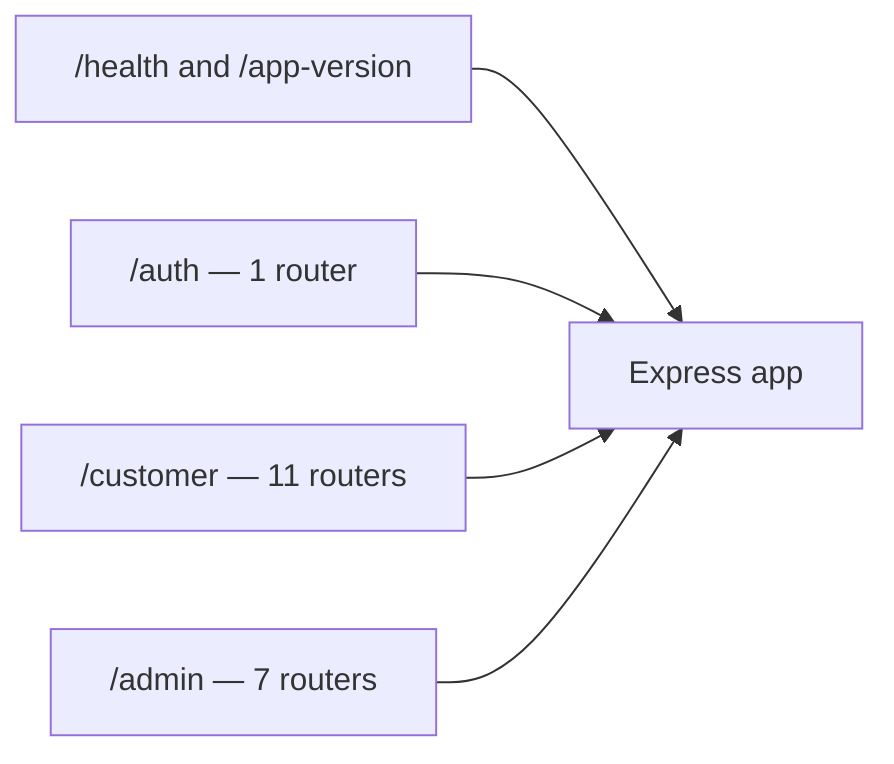
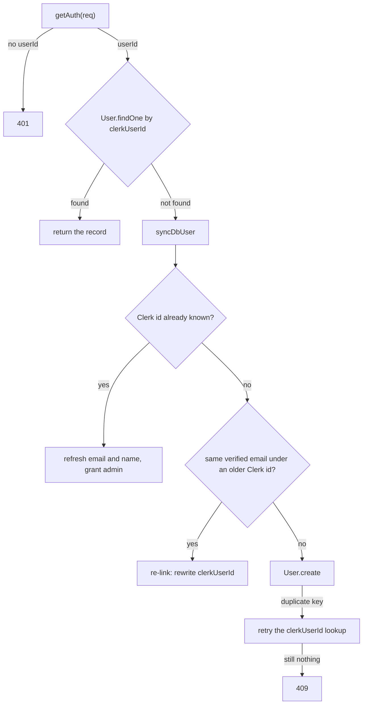

# The REST API {#api}

Every endpoint the sKirana server exposes, one page per router. Written from
`server/src/server.ts` and the routers under `server/src/routes/**`.

There are **76 endpoints**. None of them is paginated.

References name a file and a symbol, never a line number — the rule is set out
in `docs/README.md`, under "Keeping them true".

---

## Base URL {#base-url}

| Environment | Base URL | Where it is set |
|---|---|---|
| Production (mobile app) | `https://type-script-project-jtdk.vercel.app` | `mobile/.env` → `EXPO_PUBLIC_BACKEND_URL` |
| Production (admin web) | the same host | Vercel admin project → `VITE_BACKEND_URL` |
| Local development | `http://localhost:5000` | `client/.env` → `VITE_BACKEND_URL`; `mobile/src/lib/env.ts` falls back to this |

The port is `process.env.PORT || 5000`, read in `mainEntryFunction`
(`server/src/server.ts`).

There is no `/api` prefix and no version prefix. Three mount points only:



Eleven customer routers share the `/customer` prefix and seven admin routers
share `/admin`. Express matches a path against them in mount order and the
first router with a matching path wins, so adding a path that already exists
in an earlier router would make the later one unreachable.

---

## The response envelope {#envelope}

Every endpoint answers with the same shape, built by `ok` and `fail` in
`server/src/utils/envelope.ts`.

```ts
type ApiEnvelope<T> = {
  status: "success" | "error";
  data: T | null;
  meta?: Record<string, unknown>;
  errors?: Array<{ message: string; code?: string }>;
};
```

Success:

```json
{
  "status": "success",
  "data": { "message": "Server is healthy/in running state" }
}
```

Failure:

```json
{
  "status": "error",
  "data": null,
  "errors": [{ "message": "List not found", "code": "APP_ERROR" }]
}
```

`meta` is never populated. Every call site in the codebase passes only `data`,
so the key is absent from the JSON.

The mobile client unwraps this in one place (`mobile/src/lib/api.ts`) and
treats `status === "error"` **or a falsy `data`** as a thrown error. An
endpoint that legitimately returned `data: null` would surface in the app as a
failed request.

---

## Errors and status codes {#errors}

`errorHandler` in `server/src/middleware/errorhandler.ts` is the one place a
failure becomes a response.

| Thrown | Status | `errors[0]` |
|---|---|---|
| `AppError(statusCode, message)` from `server/src/utils/AppError.ts` | `err.statusCode` | `{ message, code: "APP_ERROR" }` |
| Anything else — a Mongoose `CastError`, a schema `ValidationError`, a duplicate key, the body-parser 413, a bug | `500` | `{ message: "Internal server error", code: "INTERNAL" }`; the real error only reaches the server log |
| No route matched, via `notFound` in `server/src/middleware/notFound.ts` | `404` | `{ message: "Route not found GET" }` — the **method**, not the path, and no `code` |

Status codes route code actually produces: **200**, **201**, **400**, **401**,
**403**, **404**, **409**, **429**, **500**, **503**. There is no 422 and no
502.

Async handlers are wrapped in `asyncHandler` (`server/src/utils/asyncHandler.ts`),
so a rejected promise reaches the error handler rather than hanging the request.

Three helpers in `server/src/utils/helpers.ts` raise most 400s and 404s:

- `requireText(value, message, statusCode = 400)` — throws when
  `String(value || "").trim()` is empty.
- `requireNumber(value, message, statusCode = 400)` — throws when the value is
  not a number, or is `NaN`.
- `requireFound(value, message, statusCode = 404)` — throws when the value is
  falsy, and returns it typed as present otherwise.

???+ warning "Two consequences worth knowing before you debug"
    **A malformed ObjectId in a path parameter is a 500, not a 400.** Mongoose
    raises a `CastError`, which is not an `AppError`, so it becomes the generic
    500. For example `GET /customer/grocery-lists/abc/messages`.

    **A request body over 100 kB is a 500, not a 413.** `express.json` throws a
    `PayloadTooLargeError` carrying `status: 413`, but `errorHandler` only
    special-cases `AppError`.

---

## Authentication {#auth}

`server/src/middleware/auth.ts`. Send a Clerk session JWT:

```
Authorization: Bearer <clerk session token>
```

| Guard | Symbol | Behaviour |
|---|---|---|
| none | — | Public. `/health`, `/app-version`, `/customer/home`, `/customer/categories`, `/customer/products`, `/customer/products/:id`. |
| customer | `requireAuth` | 401 `"User is not logged in. Means unauth user! !"` when Clerk gives no `userId`. Checks the session only — no database read. Applied router-wide with `router.use(requireAuth)`. |
| admin | `requireAdmin` | Resolves the database user, then 403 `"Admin access only"` when `role !== "admin"`. An unauthenticated caller hits the 401 first. Applied router-wide on all seven admin routers. |

`clerkMiddleware()` runs before every route but never rejects a request. It
only reads the header and attaches the auth state, so an unauthenticated call
reaches the route and is refused there.

Admin rights are never granted through this API. `syncDbUser`
(`server/src/services/user-sync.ts`) promotes a user whose verified Clerk email
appears in the `ADMIN_EMAILS` environment variable. That code only ever grants
the role; removing an email does not demote an existing admin.

### How the database user is resolved {#user-resolution}

Every authenticated handler starts with `getDbUserFromReq(req)`
(`server/src/middleware/auth.ts`):



Two things follow for a caller. **Any** authenticated endpoint can return 401,
and rarely 409 `"This email is already used by another sKirana account. Please
contact the shop."` from the create path. And a read can write: a first-time
caller has their `users` record created inside a `GET`.

The re-link path exists because moving Clerk from test to live keys gave every
returning customer a new `clerkUserId`, while `users.email` carries a unique
index. Only a **verified** email may claim an existing record.

---

## Rate limits and timeouts {#limits}

### Server-side rate limiting

Exactly one endpoint is rate-limited: `POST /customer/grocery-lists/read-photo`,
through the brakes in `parseGroceryListPhotos`
(`server/src/services/photo-list-parser.ts`).

| Control | Value | What the caller sees |
|---|---|---|
| Same customer, a read already in flight | the `readingNow` set | **429** `Your photo is still being read — one moment.` |
| Same customer, gap since their previous read **finished** | `USER_GAP_MS` = 5 s | **429** `Just a moment before the next photo.` |
| Whole server, per rolling minute | `GLOBAL_LIMIT_PER_MIN` = 12 | **503** `A lot of lists are being read right now. Try again in a minute, or type the items.` |
| Model call | `MODEL_TIMEOUT_MS` = 45 s, via `AbortSignal.timeout` | **503** `Could not reach the photo-reading service. Check the internet and try again.` |

The gap is measured from when the previous read finished, not when it started,
because a read takes roughly ten seconds.

These counters live in this process's memory. Vercel runs several instances,
each with its own copy, so the real ceiling is 12 multiplied by the number of
instances, per minute. The code says so itself: a brake on cost, never a
security boundary.

No other endpoint is rate-limited at all.

### Client-side timeouts

`mobile/src/lib/api.ts`.

| Timeout | Value | Effect |
|---|---|---|
| `REQUEST_TIMEOUT_MS` | 20 s | axios aborts and the app throws `"timeout of 20000ms exceeded"` |
| `TOKEN_TIMEOUT_MS` | 8 s | Clerk's `getToken` is raced against this; on timeout the request goes out **unauthenticated**, so a protected endpoint answers 401 and the app reads it as signed out |
| Per-call override | 60 s for `read-photo`, in `mobile/src/features/customer/grocery-list/api.ts` | the only call allowed to outlive the 20 s default |

Note the arithmetic. The server permits a 45 s Gemini call and the app waits
60 s, but every other call gives up at 20 s.

### Body size

`express.json({ limit: "100kb" })` in `mainEntryFunction`
(`server/src/server.ts`) caps JSON bodies. Multipart bodies bypass it and are
bounded per route by multer instead — see the four upload endpoints on
[products-admin](products-admin.md), [settings-and-banners](settings-and-banners.md)
and [grocery-lists-customer](grocery-lists-customer.md).

### Platform limits

**Unverified.** There is no `vercel.json` for the server in this repository, so
nothing pins the plan, the function memory or the duration. Vercel's platform
defaults — a 4.5 MB request body, a 4.5 MB response body and a 10 to 15 second
function duration — would each bite here, and should be confirmed in the
project dashboard before anyone relies on them. A 4.5 MB request cap is smaller
than the 6 MB photo cap the route enforces, and a 10 second duration cap is
shorter than the 45 second Gemini timeout.

---

## CORS {#cors}

`CORS_ORIGINS` is a comma-separated allowlist, defaulting to
`http://localhost:3000`, with `credentials: true` (`mainEntryFunction`,
`server/src/server.ts`). An origin that is not on the list is refused by the
browser as a CORS failure, so the caller never sees a JSON error for it.

---

## Root endpoints {#root}

### `GET /health` {#get-health}

Auth: public. No parameters.

Always answers 200 with a fixed message. It says the process is up, not that
the database is: the listener only starts after `connectDB()` resolves, so a
200 proves Mongo was reachable at boot. It does not re-check the connection.

```json
{
  "status": "success",
  "data": { "message": "Server is healthy/in running state" }
}
```

**Side effects:** none.

No shipped client calls this endpoint. Grepping `mobile/src` and `client/src`
for `/health` finds no call site.

### `GET /app-version` {#get-app-version}

Auth: public. No parameters.

The version the mobile app compares itself against, so publishing a new Play
Store release needs an environment change rather than a deploy. Reads three
environment variables and nothing else — no database, no Play Store call.

| Field | Source | Default |
|---|---|---|
| `latestVersion` | `APP_LATEST_VERSION` | `""` |
| `minVersion` | `APP_MIN_VERSION` | `""` |
| `androidPackage` | `ANDROID_PACKAGE` | `"com.skirana.app"` |

```json
{
  "status": "success",
  "data": {
    "latestVersion": "1.0.1",
    "minVersion": "1.0.0",
    "androidPackage": "com.skirana.app"
  }
}
```

An empty `latestVersion` is the "say nothing" case: the app has no version to
compare against and shows no prompt, so forgetting the variable is quiet rather
than broken. The app decides what to do with the answer; this route enforces
nothing.

**Side effects:** none.

Called by `StoreUpdatePrompt` in `mobile/src/components/StoreUpdatePrompt.tsx`.

---

## Every endpoint {#all-endpoints}

Auth column: **none** = public · **customer** = `requireAuth` · **admin** =
`requireAdmin`.

### Root

| Method | Path | Auth | Purpose |
|---|---|---|---|
| GET | [`/health`](#get-health) | none | Liveness probe. |
| GET | [`/app-version`](#get-app-version) | none | Play Store version for the update prompt. |

### Auth — [auth.md](auth.md)

| Method | Path | Auth | Purpose |
|---|---|---|---|
| POST | [`/auth/sync`](auth.md#post-auth-sync) | customer | Create, re-link or refresh the database user after login. |
| GET | [`/auth/me`](auth.md#get-auth-me) | customer | The caller's own user record. |

### Home — [home.md](home.md)

| Method | Path | Auth | Purpose |
|---|---|---|---|
| GET | [`/customer/home`](home.md#get-customer-home) | none | Banners, categories, four newest products, four live coupons. |

### Catalogue, customer side — [products-customer.md](products-customer.md)

| Method | Path | Auth | Purpose |
|---|---|---|---|
| GET | [`/customer/categories`](products-customer.md#get-customer-categories) | none | Every category, A to Z. |
| GET | [`/customer/products`](products-customer.md#get-customer-products) | none | Active products, filtered and searched. |
| GET | [`/customer/products/:id`](products-customer.md#get-customer-product) | none | One active product plus up to four related. |

### Catalogue, admin side — [products-admin.md](products-admin.md)

| Method | Path | Auth | Purpose |
|---|---|---|---|
| GET | [`/admin/categories`](products-admin.md#get-admin-categories) | admin | Every category. |
| POST | [`/admin/categories`](products-admin.md#post-admin-categories) | admin | Create a category, with an optional picture. |
| PUT | [`/admin/categories/:id`](products-admin.md#put-admin-category) | admin | Rename a category and optionally replace its picture. |
| DELETE | [`/admin/categories/:id`](products-admin.md#delete-admin-category) | admin | Delete a category nothing points at. |
| GET | [`/admin/products`](products-admin.md#get-admin-products) | admin | Every product, any status, optional title search. |
| GET | [`/admin/products/:id`](products-admin.md#get-admin-product) | admin | One product, for the edit screen. |
| POST | [`/admin/products`](products-admin.md#post-admin-products) | admin | Create a product with one to ten images. |
| PUT | [`/admin/products/:id`](products-admin.md#put-admin-product) | admin | Replace a product's fields and reconcile its images. |
| DELETE | [`/admin/products/:id`](products-admin.md#delete-admin-product) | admin | Delete a product. |

### Grocery lists, customer side — [grocery-lists-customer.md](grocery-lists-customer.md)

| Method | Path | Auth | Purpose |
|---|---|---|---|
| POST | [`/customer/grocery-lists/read-photo`](grocery-lists-customer.md#post-read-photo) | customer | Read photos of a handwritten list into items. Stores nothing. |
| POST | [`/customer/grocery-lists`](grocery-lists-customer.md#post-grocery-lists) | customer | Send a list; merges into an unpriced list from the last six hours. |
| GET | [`/customer/grocery-lists`](grocery-lists-customer.md#get-grocery-lists) | customer | All of my lists, newest first, plus the badge count and the shop's UPI details. |
| PATCH | [`/customer/grocery-lists/:listId/seen`](grocery-lists-customer.md#patch-seen) | customer | Clear the badge for one list. |
| PATCH | [`/customer/grocery-lists/:listId/remove-item`](grocery-lists-customer.md#patch-remove-item) | customer | Remove one item, before packing starts. |
| PATCH | [`/customer/grocery-lists/:listId/pay-at-shop`](grocery-lists-customer.md#patch-pay-at-shop) | customer | Choose to pay at the counter. |
| POST | [`/customer/grocery-lists/:listId/pay-online`](grocery-lists-customer.md#post-pay-online) | customer | Open a Razorpay order for the list. |
| POST | [`/customer/grocery-lists/:listId/confirm-payment`](grocery-lists-customer.md#post-confirm-payment) | customer | Verify the Razorpay signature and mark the list paid. |
| GET | [`/customer/grocery-lists/:listId/messages`](grocery-lists-customer.md#get-messages) | customer | Read the chat on one of my lists. |
| POST | [`/customer/grocery-lists/:listId/messages`](grocery-lists-customer.md#post-messages) | customer | Send a chat message to the shop. |

### Grocery lists, admin side — [grocery-lists-admin.md](grocery-lists-admin.md)

| Method | Path | Auth | Purpose |
|---|---|---|---|
| GET | [`/admin/grocery-lists`](grocery-lists-admin.md#get-grocery-lists) | admin | Every list, most recently active first. |
| PATCH | [`/admin/grocery-lists/:listId/prices`](grocery-lists-admin.md#patch-prices) | admin | Price every line; status becomes `priced`. |
| PATCH | [`/admin/grocery-lists/:listId/status`](grocery-lists-admin.md#patch-status) | admin | Move a list along packing to completed, or cancel it. |
| PATCH | [`/admin/grocery-lists/:listId/mark-paid`](grocery-lists-admin.md#patch-mark-paid) | admin | Confirm a counter or direct-UPI payment. |
| PATCH | [`/admin/grocery-lists/:listId/items/:index/availability`](grocery-lists-admin.md#patch-availability) | admin | Mark one line in or out of stock. |
| PATCH | [`/admin/grocery-lists/:listId/items/:index`](grocery-lists-admin.md#patch-item) | admin | Edit one line's name or quantity. |
| POST | [`/admin/grocery-lists/:listId/items`](grocery-lists-admin.md#post-items) | admin | Add a line to an open list. |
| GET | [`/admin/grocery-lists/conversations`](grocery-lists-admin.md#get-conversations) | admin | Last message per list, newest first, at most 100. |
| GET | [`/admin/grocery-lists/:listId/messages`](grocery-lists-admin.md#get-messages) | admin | Read one list's chat. |
| POST | [`/admin/grocery-lists/:listId/messages`](grocery-lists-admin.md#post-messages) | admin | Reply to the customer. |

### Profile and addresses — [profile-and-addresses.md](profile-and-addresses.md)

| Method | Path | Auth | Purpose |
|---|---|---|---|
| GET | [`/customer/profile`](profile-and-addresses.md#get-profile) | customer | My name, email and mobile. |
| PATCH | [`/customer/profile`](profile-and-addresses.md#patch-profile) | customer | Update name and mobile; pushes both onto my open lists. |
| GET | [`/customer/addresses`](profile-and-addresses.md#get-addresses) | customer | My addresses, default first. |
| POST | [`/customer/addresses`](profile-and-addresses.md#post-addresses) | customer | Add an address. |
| PATCH | [`/customer/addresses/:addressId`](profile-and-addresses.md#patch-address) | customer | Replace one address's four fields. |
| DELETE | [`/customer/addresses/:addressId`](profile-and-addresses.md#delete-address) | customer | Delete an address. |

### Shop settings — [settings-and-banners.md](settings-and-banners.md)

| Method | Path | Auth | Purpose |
|---|---|---|---|
| GET | [`/admin/settings/banners`](settings-and-banners.md#get-banners) | admin | Every banner in carousel order. |
| POST | [`/admin/settings/banners`](settings-and-banners.md#post-banners) | admin | Upload one to ten images as banners. |
| PUT | [`/admin/settings/banners/order`](settings-and-banners.md#put-banner-order) | admin | Rewrite the whole carousel order. |
| PATCH | [`/admin/settings/banners/:bannerId`](settings-and-banners.md#patch-banner) | admin | Edit a banner's title, visibility, tap action or schedule. |
| DELETE | [`/admin/settings/banners/:bannerId`](settings-and-banners.md#delete-banner) | admin | Delete a banner and its Cloudinary image. |
| GET | [`/admin/promos`](settings-and-banners.md#get-promos) | admin | Every promo code. |
| POST | [`/admin/promos`](settings-and-banners.md#post-promos) | admin | Create a promo code. |
| PATCH | [`/admin/promos/:promoId`](settings-and-banners.md#patch-promo) | admin | Replace every field of a promo code. |
| DELETE | [`/admin/promos/:promoId`](settings-and-banners.md#delete-promo) | admin | Delete a promo code. |

### Dashboard — [dashboard.md](dashboard.md)

| Method | Path | Auth | Purpose |
|---|---|---|---|
| GET | [`/admin/dashboard/lite`](dashboard.md#get-lite) | admin | The six headline counters. |
| GET | [`/admin/dashboard/daily`](dashboard.md#get-daily) | admin | Orders and sales per day, over the last seven IST days. |

### Push tokens — [push-tokens.md](push-tokens.md)

| Method | Path | Auth | Purpose |
|---|---|---|---|
| POST | [`/customer/push-token`](push-tokens.md#post-customer) | customer | Register this device for Expo push. |
| DELETE | [`/customer/push-token`](push-tokens.md#delete-customer) | customer | Unregister on sign-out. |
| POST | [`/admin/push-token`](push-tokens.md#post-admin) | admin | Register an admin browser for Firebase web push. |
| DELETE | [`/admin/push-token`](push-tokens.md#delete-admin) | admin | Unregister an admin browser. |

### Cart, checkout, orders and wishlist — [legacy-cart-checkout-orders.md](legacy-cart-checkout-orders.md)

Every endpoint here except the three wishlist routes is unreachable from any
shipped client. They are still live, still authenticated, and the checkout pair
still creates real Razorpay orders and moves real stock.

| Method | Path | Auth | Purpose |
|---|---|---|---|
| GET | [`/customer/cart`](legacy-cart-checkout-orders.md#get-cart) | customer | My cart. |
| POST | [`/customer/cart/items`](legacy-cart-checkout-orders.md#post-cart-items) | customer | Add a product, with its variant, to the cart. |
| PATCH | [`/customer/cart/items/:productId/increase`](legacy-cart-checkout-orders.md#patch-increase) | customer | Add one, capped by stock. |
| PATCH | [`/customer/cart/items/:productId/decrease`](legacy-cart-checkout-orders.md#patch-decrease) | customer | Take one off, removing the row at zero. |
| DELETE | [`/customer/cart/items/:productId`](legacy-cart-checkout-orders.md#delete-cart-item) | customer | Remove one cart row. |
| POST | [`/customer/cart/sync`](legacy-cart-checkout-orders.md#post-cart-sync) | customer | Merge a guest cart into the stored one. Broken; see the page. |
| GET | [`/customer/wishlist`](legacy-cart-checkout-orders.md#get-wishlist) | customer | My wishlist. **Live in the mobile app.** |
| POST | [`/customer/wishlist/items`](legacy-cart-checkout-orders.md#post-wishlist-items) | customer | Save a product. **Live in the mobile app.** |
| DELETE | [`/customer/wishlist/items/:productId`](legacy-cart-checkout-orders.md#delete-wishlist-item) | customer | Unsave a product. **Live in the mobile app.** |
| POST | [`/customer/promos/apply`](legacy-cart-checkout-orders.md#post-promos-apply) | customer | Check a promo code against an order value. |
| POST | [`/customer/checkout/create-session`](legacy-cart-checkout-orders.md#post-create-session) | customer | Price the cart and open an Order plus a Razorpay order. |
| POST | [`/customer/checkout/confirm`](legacy-cart-checkout-orders.md#post-checkout-confirm) | customer | Verify the signature, move stock, empty the cart. |
| GET | [`/customer/checkout/points`](legacy-cart-checkout-orders.md#get-points) | customer | My points balance. |
| POST | [`/customer/checkout/pay-with-points`](legacy-cart-checkout-orders.md#post-pay-with-points) | customer | Pay for the cart entirely from points. |
| GET | [`/customer/orders`](legacy-cart-checkout-orders.md#get-customer-orders) | customer | My orders, from the `orders` collection. |
| PATCH | [`/customer/orders/:orderId/return`](legacy-cart-checkout-orders.md#patch-return) | customer | Return a delivered order, within seven days. |
| GET | [`/admin/orders`](legacy-cart-checkout-orders.md#get-admin-orders) | admin | Every order. |
| PATCH | [`/admin/orders/:orderId/status`](legacy-cart-checkout-orders.md#patch-admin-order-status) | admin | Change an order's delivery status. |

---

## External services {#external}

| Service | Used by | Configuration | If it fails |
|---|---|---|---|
| **Clerk** | every authenticated request | `CLERK_SECRET_KEY` and `CLERK_PUBLISHABLE_KEY` | Token verification fails, so 401. `syncDbUser` failing to reach `users.getUser` is a 500. |
| **MongoDB Atlas** | everything | `MONGO_URI` | The server does not start; see `connectDB` in `server/src/db.ts`. At runtime a query error is a 500. |
| **Cloudinary** | product, category and banner images | `CLOUDINARY_CLOUD_NAME`, `CLOUDINARY_API_KEY` and `CLOUDINARY_API_SECRET` | An upload throws, so 500. Deletes are best effort and only log; see `deleteFromCloudinary` in `server/src/utils/cloudinary.ts`. |
| **Google Gemini** | `read-photo` only | `GEMINI_API_KEY` and `GEMINI_MODEL` | Every failure becomes a 503 with a plain sentence; the real cause is logged with a `[photo-parser]` prefix. |
| **Expo push** | customer notifications | none; token-based | `sendPushNotifications` in `server/src/utils/push.ts` swallows everything and the request still succeeds. |
| **Firebase FCM** | admin browser alerts | `FIREBASE_PROJECT_ID`, `FIREBASE_CLIENT_EMAIL` and `FIREBASE_PRIVATE_KEY` | Unconfigured is a silent no-op; see `getApp` in `server/src/utils/webPush.ts`. Dead tokens are pruned from `users.webPushTokens`. |
| **Telegram** | shop order alerts | `TELEGRAM_BOT_TOKEN` and `TELEGRAM_CHAT_ID` | Unconfigured is a silent no-op; send failures are swallowed by `sendTelegram` in `server/src/utils/telegram.ts`. |
| **Razorpay** | the payment endpoints | `RAZORPAY_KEY_ID` and `RAZORPAY_KEY_SECRET` | **`checkEnv` throws at import time** in `server/src/utils/razorpay.ts`, so the whole server fails to boot — not just the payment routes. |

Other environment variables that change a response: `SHOP_NAME`, `SHOP_UPI_ID`,
`ADMIN_EMAILS`, `CORS_ORIGINS`, `APP_LATEST_VERSION`, `APP_MIN_VERSION` and
`ANDROID_PACKAGE`.

What each notification actually says is on the
[Outbound messages](../messages.md) page.
