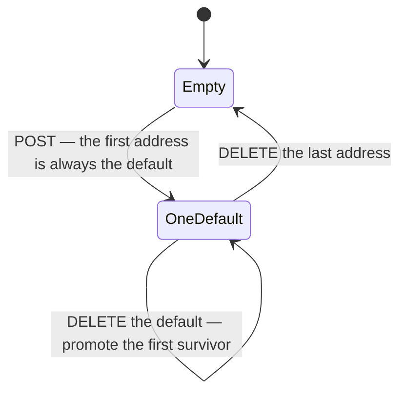

# Profile and addresses {#profile-and-addresses}

Two routers, both mounted at `/customer` in `mainEntryFunction`
(`server/src/server.ts`).

| Router | File | Symbol | Paths |
|---|---|---|---|
| Profile | `server/src/routes/customer/profile.routes.ts` | `customerProfileRouter` | `/customer/profile` |
| Addresses | `server/src/routes/customer/address.routes.ts` | `customerAddressRouter` | `/customer/addresses` and `/customer/addresses/:addressId` |

## What these routers own

The profile router owns the customer's own name, email and mobile number — the
details the **shop** sees on their orders. The address router owns the
`addresses` sub-documents on the same `users` record.

Email is read-only through this API. It comes from Clerk and is synchronised by
`syncDbUser` in `server/src/services/user-sync.ts`.

## Who may call them

Both apply `requireAuth` router-wide. Every handler works only on the caller's
own record, so one customer can never read or write another's; no route accepts
a user id.

???+ warning "The address routes are not reached by any shipped client"
    They belong to the cart-and-checkout flow the apps no longer reach. The
    only call sites are `getCustomerAddresses`, `createCustomerAddresses`,
    `updateCustomerAddresses` and `deleteCustomerAddress` in
    `client/src/features/customer/profile/api.ts`, inside the admin web's dead
    customer island — see
    [the legacy page](legacy-cart-checkout-orders.md#dead-island). They are
    still live and still authenticated.

    A grocery list is collected from the shop, so it does not use an address at
    all. The profile routes, by contrast, are live in the mobile app.

---

## `GET /customer/profile` {#get-profile}

The caller's own name, email and mobile.

**Auth:** signed-in customer. **Path, query and body parameters:** none.

Shaped by `mapProfile`: each missing value becomes `""`, never `null` and never
an absent key, so the app can bind the values straight into text inputs.
Everything else on the record is deliberately omitted — `_id`, `clerkUserId`,
`role`, `points`, `addresses` and the push-token arrays.

```json
{
  "status": "success",
  "data": {
    "name": "Asha Kumari",
    "email": "asha@example.com",
    "phone": "9876543210"
  }
}
```

**Errors:** 401 from the router guard; 409 is possible from the
create-on-demand path described in
[How the database user is resolved](index.md#user-resolution).

**Side effects:** none, beyond that create-on-demand write to `users`.

**Called by:** `getCustomerProfile` in
`mobile/src/features/customer/account/api.ts`.

---

## `PATCH /customer/profile` {#patch-profile}

Updates the caller's name, mobile number, or both.

**Auth:** signed-in customer. **Path and query parameters:** none.

### Request body

Both fields are optional, and only keys actually **present** in the body are
touched — so sending `{ "phone": "..." }` leaves the name alone. Sending `null`
counts as present and will fail validation.

| Field | Validation | Limit |
|---|---|---|
| `name` | `cleanField(value, 50, true)` from `server/src/utils/sanitizeItem.ts`: control, zero-width and bidi characters stripped, then everything outside the grocery allowlist removed, whitespace collapsed, trimmed, cut to length. A name that cleans down to nothing is rejected | `MAX_NAME_LEN` here is 50 characters |
| `phone` | `normalizeMobile(value)` from `server/src/utils/phone.ts`: every non-digit dropped, a leading `+91` or `0` removed, and the result must match an Indian ten-digit mobile starting 6, 7, 8 or 9 | exactly 10 digits |

???+ info "Here an invalid phone is an error; on a grocery list it is ignored"
    `POST /customer/grocery-lists` puts the same value through the same
    `normalizeMobile` but silently discards a number that does not normalise.
    This route raises a 400 instead.

```json
{
  "status": "success",
  "data": {
    "name": "Asha Kumari",
    "email": "asha@example.com",
    "phone": "9876543210"
  }
}
```

**Errors**

| Status | Message |
|---|---|
| 400 | `Please enter your name` — `name` was present but empty after cleaning |
| 400 | `Enter a valid 10-digit mobile number` — `phone` was present but did not normalise |
| 401 | the standard unauthenticated message |

**Side effects:** two database writes.

1. The `users` document is saved.
2. `GroceryList.updateMany` rewrites the denormalised `customerName` and
   `customerPhone` on every one of the caller's lists whose `status` is **not**
   `completed` or `cancelled`.

The second write matters. Each list stores a snapshot of the name and phone
taken when it was sent, so without it the shop would keep calling the old
number. Finished and cancelled lists deliberately keep the old snapshot as a
historical record. `customerName` falls back to the email when the name is
empty.

Nothing is sent to the shop: no push, no Telegram.

**Called by:** `updateCustomerProfile` in
`mobile/src/features/customer/account/api.ts`, from the Account screen.

---

## The address list, and what every address route returns {#address-shape}

All four address routes answer with the same thing: the caller's **complete**
address list, default first. None of them returns the single record that
changed, and the create answers 200 rather than 201.

The sort is `Number(b.isDefault) - Number(a.isDefault)`, which is stable on the
default flag only, so the remaining addresses keep their insertion order.

Each entry is shaped by `mapAddress`. The `_id` is stringified and becomes `""`
when absent, which happens for an address just pushed onto the array but not
yet saved. Mongoose internals such as `__v` are omitted. The four text fields
come back exactly as stored — they are trimmed on the way in but not otherwise
cleaned.

```json
{
  "status": "success",
  "data": {
    "items": [
      {
        "_id": "68e4445566778899aabbccdd",
        "fullName": "Asha Kumari",
        "address": "12 Station Road, Rajajinagar",
        "state": "Karnataka",
        "postalCode": "560010",
        "isDefault": true
      }
    ]
  }
}
```

### The default-address invariant

Exactly one address is the default whenever the list is non-empty. The rule is
enforced in the routes, not the schema:



`isDefault: false` is never honoured. The `PATCH` can set the flag but never
clear it, so the only way to move the default is to promote a different
address.

---

## `GET /customer/addresses` {#get-addresses}

The caller's addresses, default first.

**Auth:** signed-in customer. **Path, query and body parameters:** none.

A customer with no addresses gets `{ "items": [] }`, not a 404.

**Errors**

| Status | Message |
|---|---|
| 404 | `User not found` — the record resolved from the Clerk session has since disappeared from the database |
| 401 | the standard unauthenticated message |

**Side effects:** none, beyond the create-on-demand `users` write.

---

## `POST /customer/addresses` {#post-addresses}

Adds an address to the caller's list.

**Auth:** signed-in customer. **Path and query parameters:** none.

### Request body

| Field | Type | Required | Validation |
|---|---|---|---|
| `fullName` | string | yes | trimmed, non-empty |
| `address` | string | yes | trimmed, non-empty |
| `state` | string | yes | trimmed, non-empty |
| `postalCode` | string | yes | trimmed, non-empty. **Not** checked against any postcode format |
| `isDefault` | boolean | no | Honoured only when it is exactly `true`. Any other value, including the string `"true"`, leaves the existing default alone |

There is no length cap and no sanitiser on any of the four text fields, unlike
the profile and grocery-list fields.

The new address becomes the default when `isDefault` is exactly `true`, or when
it is the first address on the record.

Answers **200** with [the whole list](#address-shape) — not 201, and not the
created address on its own.

**Errors**

| Status | Message |
|---|---|
| 400 | `Full name is required` |
| 400 | `Address is required` |
| 400 | `State is required` |
| 400 | `postal code is required` — the lower-case "postal" is the live message |
| 404 | `User not found` |

**Side effects:** one write to the `users` document.

---

## `PATCH /customer/addresses/:addressId` {#patch-address}

Replaces the four fields of one address.

**Auth:** signed-in customer.

### Path parameters

| Parameter | Meaning |
|---|---|
| `addressId` | The **sub-document** `_id` from `users.addresses`, not a top-level collection id |

### Request body

Despite the verb this is a full replacement of the four text fields, not a
partial update. `fullName`, `address`, `state` and `postalCode` are all
required, exactly as on the create, and omitting one is an error rather than a
"leave it alone".

`isDefault: true` promotes this address and demotes the rest. `false` is
ignored.

Answers with [the whole list](#address-shape).

**Errors**

| Status | Message |
|---|---|
| 400 | `Address id is required` |
| 400 | `Full name is required` |
| 400 | `Address is required` |
| 400 | `State is required` |
| 400 | `postal code is required` |
| 404 | `User not found` |
| 404 | `Address not found` — no address on the record has that id |

**Side effects:** one write to the `users` document.

---

## `DELETE /customer/addresses/:addressId` {#delete-address}

Removes one address.

**Auth:** signed-in customer.

### Path parameters

| Parameter | Meaning |
|---|---|
| `addressId` | The sub-document `_id` |

**Query parameters:** none. **Request body:** none is read, so this `DELETE` is
safe with clients that strip one — unlike the
[push-token deletes](push-tokens.md).

Deleting the default promotes the first remaining address, so the list never
ends up with entries but no default. Deleting the last address leaves an empty
list rather than an error.

Answers with [the whole remaining list](#address-shape).

**Errors**

| Status | Message |
|---|---|
| 400 | `Address id is required` |
| 404 | `User not found` |
| 404 | `Address not found` |

**Side effects:** one write to the `users` document.
