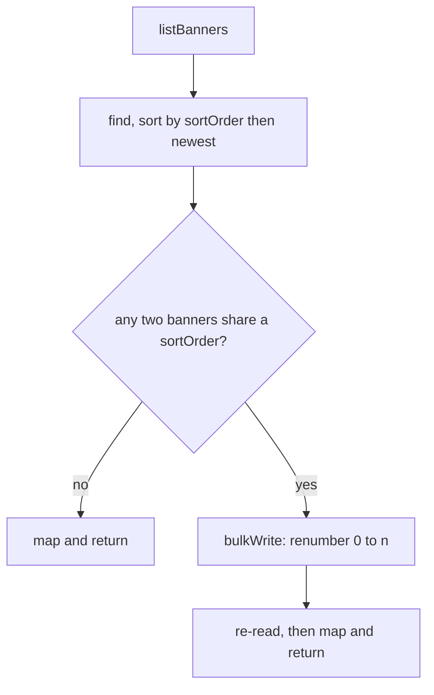

# Shop settings — banners and promo codes {#settings-and-banners}

Two routers, both mounted at `/admin` in `mainEntryFunction`
(`server/src/server.ts`).

| Router | File | Symbol | Paths |
|---|---|---|---|
| Banners | `server/src/routes/admin/settings.routes.ts` | `adminSettingsRouter` | `/admin/settings/banners` and below |
| Promo codes | `server/src/routes/admin/promo.routes.ts` | `adminPromoRouter` | `/admin/promos` and `/admin/promos/:promoId` |

## Who may call them

Both apply their guard router-wide — `adminSettingsRouter.use(requireAdmin)`
and `adminPromoRouter.use(requireAdmin)` — so every route answers **401** to a
caller with no Clerk session and **403 `Admin access only`** to a signed-in
customer.

## A shared habit: every route returns the whole collection

There is no per-banner GET and no per-promo GET. Every route in both routers,
including the mutations, answers with the full list, so the admin panel can
replace its table outright after any change. Both creates return **200**, not
201. Neither is paginated.

---

# Banners {#banners}

## What this router owns

The `banners` collection and the Cloudinary folder
`ecommerce-monster-video/banners` behind it. The app's own carousel feed is
[`GET /customer/home`](home.md), which applies `liveBannerFilter` separately —
this router shows hidden and expired banners too.

`limit` in every response is `HOME_BANNER_LIMIT` = 8: how many **live** banners
the app's carousel shows, not a cap on how many may be stored. The server never
enforces it on upload, so an admin can store more than the app will ever
display, and an upload can push an existing banner out of the carousel.

## The banner shape {#banner-shape}

`mapBanner` gives every optional field a concrete value, so the client never
has to test for `undefined`: a missing `link` becomes `{ "type": "none" }`, a
missing `title` becomes `""`, a missing `sortOrder` becomes `0`, and `isActive`
is `true` unless it is explicitly `false` — so a record saved before the flag
existed reads as visible.

```json
{
  "_id": "68d9a1b2c3d4e5f6a7b8c9d0",
  "imageUrl": "https://res.cloudinary.com/demo/image/upload/f_webp,q_auto,c_limit,w_1200/v1/ecommerce-monster-video/banners/diwali-offer.jpg",
  "imagePublicId": "ecommerce-monster-video/banners/diwali-offer",
  "title": "diwali offer",
  "isActive": true,
  "sortOrder": 0,
  "link": {
    "type": "category",
    "targetId": "68c1112233445566778899aa",
    "targetName": "Staples"
  },
  "startsAt": "2026-10-28T18:30:00.000Z",
  "endsAt": "2026-11-05T18:30:00.000Z",
  "createdAt": "2026-09-01T06:15:22.104Z"
}
```

`targetId` and `targetName` are present only for a `category` or `product`
link. `targetName` is resolved by `targetNames` — two batched queries, each
skipped when no banner links to that kind — and is `undefined` when the target
has been deleted, which is how a stale link shows in the panel.

Dates go out as ISO strings, with `null` — not an omitted key — for an unset
schedule. `imagePublicId` is returned raw for the panel's use while `imageUrl`
is rewritten by `cdnImage` to the 1200 px `banner` variant, so the two no
longer refer to the same URL. `createdBy` and `updatedAt` are omitted.

## Ordering {#banner-ordering}

`sortOrder` is a dense sequence maintained by this router alone.
`listBanners` is the one place it is repaired.



Deleting a banner leaves a **gap** in the sequence. That is fine — only the
relative values matter — and `listBanners` does not renumber for a gap, only
for a duplicate.

---

## `GET /admin/settings/banners` {#get-banners}

Every banner in carousel order, with the app's carousel cap.

**Auth:** admin. **Path, query and body parameters:** none. No paging, no
filter.

```json
{
  "status": "success",
  "data": {
    "items": [],
    "limit": 8
  }
}
```

`items` holds [the banner shape](#banner-shape).

**Errors:** 401 and 403 from the router guard.

???+ warning "This GET can write to the database"
    If two banners share a `sortOrder`, `listBanners` renumbers the **whole
    collection** with a `bulkWrite` before answering. A caller must not treat
    this as a safe, repeatable read.

    The repair is one-shot: once positions are distinct the check costs one
    `Set` and nothing is written. Two admins loading the page at the same
    instant can both run it, but both write the same positions.

    All four live banner documents have no `sortOrder` field at all, so this
    backfill has not yet run in production — the first `GET` will mutate four
    documents. See [banners](../database/banners.md).

**Called by:** `getAdminBanners` in
`client/src/features/admin/settings/api.ts`.

---

## `POST /admin/settings/banners` {#post-banners}

Uploads images and creates one banner per file, returning the full list.

**Auth:** admin. **Path and query parameters:** none.

### Request body — `multipart/form-data`

| Property | Value |
|---|---|
| Field name | `images`, repeated. Any other file field is a `LIMIT_UNEXPECTED_FILE` |
| Files | 1 to `MAX_FILES` = 10 |
| Size | at most `MAX_FILE_BYTES` = 5 MB each |
| Types | `image/jpeg`, `image/png` and `image/webp`, on the browser-declared MIME type |
| Storage | `multer.memoryStorage()` |

Parsing and the limit errors are handled by the `acceptImages` middleware
before the handler runs. Unlike the product routes, it translates **every**
`MulterError` into a clear 400.

New banners are **appended**, not inserted: `sortOrder` continues from the
current maximum, so the order of existing banners is untouched. Ordering relies
on `Promise.all` preserving input order, which is what lets `files[index]` name
the right upload.

A new banner is live at once. `isActive` and the link type take their schema
defaults of visible and `none`, with no schedule, and a title guessed from the
file name by `titleFromFileName`: the last extension is dropped, runs of `-`
and `_` become single spaces, then `cleanField` caps it at 80 characters. Case
is left alone, so `Diwali-Offer.png` keeps its capitals. A name that cleans
down to nothing yields `""`, which is a valid title.

`createdBy` records the admin's `users` `_id`; it is stored but never returned.

Answers **200** with `{ items, limit }`.

**Errors**

| Status | Message |
|---|---|
| 400 | `Choose at least one image` — no `images` file in the request |
| 400 | `Only JPG, PNG or WebP images can be banners` — from the file filter |
| 400 | `Each banner image must be under 5 MB` — `LIMIT_FILE_SIZE` |
| 400 | `Upload at most 10 images at a time` — `LIMIT_FILE_COUNT` or `LIMIT_UNEXPECTED_FILE` |
| 400 | `Couldn't read the uploaded images` — any other multer error |

**Side effects:** every buffer is uploaded to Cloudinary under
`ecommerce-monster-video/banners`, shrunk to fit a 1600 px box at
`quality: auto:good`; then one `insertMany`. The two are not a transaction, so
if the insert fails the images stay in Cloudinary as orphans.

**Called by:** `uploadAdminBanners` in
`client/src/features/admin/settings/api.ts`, sending `FormData`.

---

## `PUT /admin/settings/banners/order` {#put-banner-order}

Rewrites the carousel order and returns the full list.

**Auth:** admin. **Path and query parameters:** none.

### Request body

| Field | Type | Validation |
|---|---|---|
| `ids` | string array | Every banner id, each a valid ObjectId, each **exactly once** |

This is a whole-collection replacement, not a partial reorder. A short list, a
long list, a duplicate or an unknown id is all refused. `sortOrder` is set to
the array index, so the result is always dense and distinct.

???+ info "Why the two failures have different statuses"
    A malformed body is a **400**. A well-formed list that no longer matches
    the collection is a **409** — an admin whose page is stale because someone
    else added or deleted a banner is told to refresh, rather than shown a
    validation error.

The check and the write are not atomic, so a banner created between them is
left at whatever `sortOrder` it was given.

**Errors**

| Status | Message |
|---|---|
| 400 | `Send the banner ids in their new order` — `ids` is not an array, or holds a non-string or non-ObjectId member |
| 409 | `The banner list changed - refresh and try again` — duplicates, the wrong count, or an id not in the collection |

**Side effects:** one `bulkWrite` over the whole collection.

**Called by:** `reorderAdminBanners` in
`client/src/features/admin/settings/api.ts`.

---

## `PATCH /admin/settings/banners/:bannerId` {#patch-banner}

Updates one banner and returns the full list.

**Auth:** admin.

| Path parameter | Meaning |
|---|---|
| `bannerId` | The banner `_id`. An id that is not a valid ObjectId is reported as **not found**, not as a bad request |

### Request body

**Presence, not value, decides what changes.** Each field is tested with `in`,
so sending `"title": ""` empties the title while omitting `title` leaves it
alone. That is also how a schedule is cleared: send `startsAt` or `endsAt` as
`null` or `""`; omitting the key keeps the stored date.

| Field | Type | Validation |
|---|---|---|
| `title` | string | `cleanField(value, 80)` — `MAX_TITLE` |
| `isActive` | boolean | Must be a **real boolean**, so `"true"` from a form is refused |
| `link` | object | Validated by `readLink`; see below |
| `startsAt` | string or null | Validated by `readDate` |
| `endsAt` | string or null | Validated by `readDate` |

Neither the image nor `sortOrder` can be changed here. The image is fixed at
upload, and order goes through
[`PUT /settings/banners/order`](#put-banner-order).

### `readLink`

A `raw` that is not an object — `null`, a string, `undefined` — is treated as
`{}`, which fails the type check, so there is no silent default.

`type` must be one of `BANNER_LINK_TYPES` in `server/src/models/Banner.ts`:

| Type | What it opens | `targetId` |
|---|---|---|
| `none` | nothing; just a picture | dropped |
| `writeList` | the "write your list" sheet | dropped |
| `shop` | the Shop tab | dropped |
| `category` | the Shop tab filtered to one category | required |
| `product` | one product's page | required |

For the first three the function returns immediately and any `targetId` sent
alongside is **dropped**, so switching a banner away from a category link
clears the target rather than leaving it stranded.

For `category` and `product`, `targetId` must be a valid ObjectId **and** still
exist, checked with an `exists` query. That is a point-in-time read, not a
foreign key: a category deleted afterwards leaves the banner pointing at
nothing, which `targetNames` then renders without a `targetName` and
[`/customer/home`](home.md) degrades to `none`.

### `readDate`

`null`, `undefined` and `""` all mean "no date" and return `null`. Anything
that is not a string is rejected outright, so a numeric epoch is not accepted.
A string is parsed by `new Date`, which accepts far more than ISO 8601 and
reads a date-only string as UTC midnight.

The ordering rule is checked against the **merged** result, not the request, so
sending only `startsAt` can still fail on an `endsAt` that was already stored.
It applies only when both ends are set; one-ended windows are allowed.

**Errors**

| Status | Message |
|---|---|
| 404 | `Banner not found` — the id is malformed, or no such banner exists |
| 400 | `Invalid visibility` — `isActive` is present but not a boolean |
| 400 | `Choose what the banner opens` — `type` is missing or unknown |
| 400 | `Pick the category this banner opens` or `Pick the product this banner opens` — the target id is missing or not a valid ObjectId |
| 400 | `That category no longer exists` or `That product no longer exists` |
| 400 | `Invalid start date` or `Invalid end date` |
| 400 | `The end date must be after the start date` |

**Side effects:** one `save` on the `banners` document.

**Called by:** `updateAdminBanner` in
`client/src/features/admin/settings/api.ts`.

---

## `DELETE /admin/settings/banners/:bannerId` {#delete-banner}

Deletes one banner and returns the full list.

**Auth:** admin.

| Path parameter | Meaning |
|---|---|
| `bannerId` | The banner `_id`; a malformed id is reported as not found |

**Query parameters:** none. **Request body:** none.

The delete is unconditional — no confirmation step and no soft delete. Hiding a
banner means [`PATCH`](#patch-banner) with `isActive: false` instead.

**Errors**

| Status | Message |
|---|---|
| 404 | `Banner not found` |

**Side effects:** one `findByIdAndDelete` on `banners`, then a **best-effort**
Cloudinary delete of the image, wrapped in a `try`/`catch` that only logs. The
banner is already gone from the app, so a failed image clean-up would only
leave an unused file in Cloudinary — it must not fail the request.

This is the only delete in the admin surface that cleans up its Cloudinary
asset; the product and category deletes do not — see
[products-admin](products-admin.md#image-leaks).

**Called by:** `deleteAdminBanner` in
`client/src/features/admin/settings/api.ts`.

---

# Promo codes {#promos}

## What this router owns

Discount codes for **catalogue** orders. Grocery lists are priced by hand and
do not use them. The customer-facing check is
[`POST /customer/promos/apply`](legacy-cart-checkout-orders.md#post-promos-apply),
which is read-only and unreachable from any shipped client; the codes
themselves are also surfaced to the app as `coupons` on
[`GET /customer/home`](home.md).

`code` is the natural key. It is upper-cased on the way in and must be unique
across the collection.

???+ warning "Uniqueness is checked twice, and the router's check can race"
    The schema declares `code` as `unique: true` in
    `server/src/models/Promo.ts`, so the database enforces it with an index.
    Each route **also** runs its own `findOne` first, to produce a friendly
    400 rather than a duplicate-key 500. That check is a separate query, so two
    simultaneous creates of the same code can both pass it — and the loser then
    gets the generic 500 from the index.

    The module comment on `adminPromoRouter` says uniqueness is "enforced in
    this router rather than by an index". That is wrong: the index exists.

## The promo shape {#promo-shape}

`mapPromo` produces:

```json
{
  "_id": "68d0000011112222333344cc",
  "code": "DIWALI10",
  "percentage": 10,
  "count": 42,
  "minimumOrderValue": 500,
  "startsAt": "2026-10-28T18:30:00.000Z",
  "endsAt": "2026-11-05T18:30:00.000Z",
  "createdAt": "2026-09-01T06:15:22.104Z"
}
```

`count` is the number of uses **still left**, not the number already used.
`__v` and `updatedAt` are omitted. The `_id` is stringified and becomes `""`
when absent.

## Validation, shared by create and update {#promo-validation}

`parsePromoPayload` is used by both, so the `PATCH` is a **full replacement**
and cannot change one field on its own.

| Field | Rule |
|---|---|
| `code` | Trimmed, upper-cased, must be non-empty |
| `percentage` | A number from 1 to 100 |
| `count` | A whole number of 1 or more |
| `minimumOrderValue` | A number of 0 or more, in rupees |
| `startsAt` | Must parse as a date |
| `endsAt` | Must parse as a date, strictly after `startsAt` |

???+ warning "Two messages do not match what they guard"
    `"Percentage must be between 1 and 10"` guards a **1 to 100** range, and
    the `minimumOrderValue` failure is reported as `"Promo count must be
    atleast 0 or more"`. Both are quoted below exactly as they are sent.

---

## `GET /admin/promos` {#get-promos}

Every promo code, newest first by `createdAt`.

**Auth:** admin. **Path, query and body parameters:** none.

Unfiltered: expired and exhausted promos are included, and the panel decides
how to show them.

```json
{
  "status": "success",
  "data": { "items": [] }
}
```

`items` holds [the promo shape](#promo-shape).

**Errors:** 401 and 403 from the router guard.

**Side effects:** none.

**Called by:** `getAdminPromos` in `client/src/features/admin/promo/api.ts`.
The admin panel reaches it at the browser route `/admin/coupons`; there is no
`/admin/coupons` API path.

---

## `POST /admin/promos` {#post-promos}

Creates a promo code.

**Auth:** admin. **Path and query parameters:** none.

**Request body:** the six fields in [validation](#promo-validation), all
required.

Answers **200** with the whole list — not 201, and not the created record.

**Errors**

| Status | Message |
|---|---|
| 400 | `promo code is required` |
| 400 | `Percentage must be between 1 and 10` |
| 400 | `Promo count must be atleast 1` |
| 400 | `Promo count must be atleast 0 or more` — this is the `minimumOrderValue` message |
| 400 | `Valid start time is required` |
| 400 | `Valid end time is required` |
| 400 | `End time should be after start time` |
| 400 | `Promo code already exists` |

**Side effects:** one insert into `promos`.

**Called by:** `createAdminPromo` in `client/src/features/admin/promo/api.ts`.

---

## `PATCH /admin/promos/:promoId` {#patch-promo}

Replaces every field of one promo code.

**Auth:** admin.

| Path parameter | Meaning |
|---|---|
| `promoId` | The promo `_id`; trimmed, must be non-empty |

**Request body:** the same six required fields. Despite the verb this is a full
replacement, so omitting one is an error rather than a "leave it alone".

The uniqueness check excludes the record being edited, so a promo may keep its
own code. Editing `count` sets the remaining uses **outright** — it is not
added to the current balance.

Answers with the whole list.

**Errors**

| Status | Message |
|---|---|
| 400 | `Promo Id is needed here` |
| 404 | `Promo not found` |
| 400 | `Promo code already exists` — a **different** promo already holds the new code |
| 400 | every message from [validation](#promo-validation) |

**Side effects:** one write to `promos`.

**Called by:** `updateAdminPromo` in `client/src/features/admin/promo/api.ts`.

---

## `DELETE /admin/promos/:promoId` {#delete-promo}

Removes a promo code.

**Auth:** admin.

| Path parameter | Meaning |
|---|---|
| `promoId` | The promo `_id` |

**Query parameters:** none. **Request body:** none.

The delete is unconditional: a promo that is live, or that customers have
already used, is removed without warning. Orders that recorded the code keep
their own copy of it as a plain string, so past discounts are unaffected —
see [orders](../database/orders.md).

Answers with the whole remaining list.

**Errors**

| Status | Message |
|---|---|
| 400 | `Promo Id is needed here` |
| 404 | `Promo not found` |

**Side effects:** one delete from `promos`.

**Called by:** `deleteAdminPromo` in `client/src/features/admin/promo/api.ts`.
