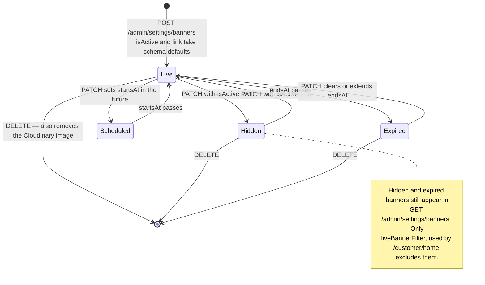

# `banners` {#banners}

`server/src/models/Banner.ts` · model `Banner` · **4 live documents**
(2026-09-19).

## Purpose

The promotional images across the top of the app's Home screen. A banner is a
picture the shop uploads, ordered by hand, optionally scheduled, and optionally
linked to somewhere in the app.

Managed by [the admin settings router](../api/settings-and-banners.md#banners)
and served to the app by [`GET /customer/home`](../api/home.md).

## Fields

| Field | Type | Default | Required | Meaning |
|---|---|---|---|---|
| `imageUrl` | String | — | yes | The Cloudinary delivery address. Re-sized per request to the 1200 px `banner` variant by `cdnImage` |
| `imagePublicId` | String | — | yes | The Cloudinary handle. Neither is optional, because the id is what later deletes the picture |
| `title` | String | `""` | no, `maxlength: 80` | The admin's name for the banner; also the screen-reader text |
| `isActive` | Boolean | `true` | no | A hidden banner stays in the admin list but never reaches the app |
| `sortOrder` | Number | `0` | no, **indexed** | Position in the Home carousel, 0 first |
| `link.type` | String enum | `"none"` | no | What a tap opens |
| `link.targetId` | String | — | no | **A plain string, not a ref.** Validated to be a live category or product id at write time |
| `startsAt` | Date or null | `null` | no | The start of an optional schedule window |
| `endsAt` | Date or null | `null` | no | The end. Must be after `startsAt` when both are set, enforced in the route |
| `createdBy` | ObjectId to `User` | — | yes | The admin who uploaded it. **Never read back** |
| `createdAt` and `updatedAt` | Date | auto | — | `{ timestamps: true }` |

## Sub-documents: `link` {#link}

Embedded, with no `_id` of its own.

| Field | Type | Meaning |
|---|---|---|
| `type` | String enum, default `"none"` | One of `BANNER_LINK_TYPES` |
| `targetId` | String, trimmed | The category or product id, for the two types that need one |

`targetId` is held as a plain string rather than an ObjectId ref **on purpose**,
so a banner survives the target being deleted — it just stops going anywhere
useful. Nothing in the schema enforces the pairing between `type` and
`targetId`; the admin route validates it, and the app treats a link it cannot
follow as `none`.

## Enums

`BANNER_LINK_TYPES`, exported from the model:

| Value | What it opens | Needs `targetId` |
|---|---|---|
| `none` | nothing; just a picture | no |
| `writeList` | the "write your list" sheet | no |
| `shop` | the Shop tab | no |
| `category` | the Shop tab filtered to one category | **yes** |
| `product` | one product's page | **yes** |

The order of the array carries no meaning; it is the source of the schema's
enum and of the `BannerLinkType` type.

## Who is live, and when {#live-filter}

`liveBannerFilter(now)`, exported from the model, is the filter
[`/customer/home`](../api/home.md) applies. It takes the instant as an
argument rather than reading the clock itself, so one request judges every
banner at the same moment.

```js
{
  isActive: { $ne: false },
  $and: [
    { $or: [{ startsAt: null }, { startsAt: { $lte: now } }] },
    { $or: [{ endsAt: null }, { endsAt: { $gt: now } }] },
  ],
}
```

The looseness is deliberate, and it is what made it safe to add these fields to
a collection that already had rows. `isActive` is tested with `$ne: false`, so
a document with no such field counts as **on**. Each date is tested as "null or
in the right direction", so a document with no dates counts as **unscheduled**.

The window is half-open: live from `startsAt` inclusive until `endsAt`
exclusive.

`HOME_BANNER_LIMIT` is 8. It is applied as the `limit` on the Home query and
also sent to the admin panel, so the shop is told the ceiling rather than
discovering that a ninth banner never appears. **It is advisory** — nothing
refuses to store more.

## Indexes {#indexes}

**Declared:** `sortOrder`, through `index: true` on the field. The Home
carousel's only query sorts by it; without the index that sort is done in
memory on every app launch.

**Live**, as checked on 2026-09-19: `sortOrder_1` plus `_id_`. No index
mismatch.

## A document mismatch, though {#document-mismatch}

???+ danger "All four live banners are missing six of their fields"
    Every one of the four live documents contains only `_id`, `imageUrl`,
    `imagePublicId`, `createdBy`, `createdAt`, `updatedAt` and `__v`.

    They have **no** `title`, `isActive`, `sortOrder`, `link`, `startsAt` or
    `endsAt`.

    Everything that reads them compensates with `??` and `!== false`
    fallbacks — `mapBanner` and `liveBannerFilter` — so this is invisible
    until you query the collection directly.

    It also means the `sortOrder` backfill in `listBanners` has **not yet run
    in production**. Since all four share the implicit position 0, the first
    `GET /admin/settings/banners` will detect the collision and mutate four
    documents. A read that writes. See
    [the API page](../api/settings-and-banners.md#get-banners).

## Invariants enforced in routes, not the schema {#invariants}

| Invariant | Where |
|---|---|
| `sortOrder` is kept **dense and distinct** — renumbered 0 to n by a `bulkWrite` whenever two banners share a position | `listBanners` in `server/src/routes/admin/settings.routes.ts` |
| A **gap** in `sortOrder`, left by a delete, is not repaired. Only the relative values matter | same |
| A reorder must send **every** banner id, each exactly once. A short list, a long list, a duplicate or an unknown id is a 409, not a 400 | `adminSettingsRouter` `PUT /settings/banners/order`, same file |
| A `category` or `product` link's `targetId` must be a valid ObjectId **and** still exist, checked with an `exists` query at write time. That is a point-in-time read, not a foreign key | `readLink`, same file |
| A `none`, `writeList` or `shop` link **drops** any `targetId` sent with it, so switching a banner away from a category link clears the target | `readLink`, same file |
| `endsAt` must be strictly after `startsAt`, checked against the **merged** result rather than the request. One-ended windows are allowed | `adminSettingsRouter` `PATCH /settings/banners/:bannerId`, same file |
| `isActive` must be a real boolean, so `"true"` from a form is refused | same |
| A new banner's `title` is guessed from the uploaded file name, then cleaned and capped at 80 characters | `titleFromFileName`, same file |
| New banners are **appended**: `sortOrder` continues from the current maximum | `adminSettingsRouter` `POST /settings/banners`, same file |
| A tap target that has been deleted, or a product that is no longer `active`, degrades the link to `{ type: "none" }` before it reaches the app | `resolveBannerLinks` in `server/src/routes/customer/home.routes.ts` |

## Lifecycle {#lifecycle}

A banner has two independent states: whether it is switched on, and whether it
is inside its schedule. Both must hold for the app to show it.



There is no soft delete — hiding a banner is the `PATCH` with
`isActive: false`.

## Cloudinary {#cloudinary}

Uploads go to `ecommerce-monster-video/banners`, shrunk to fit a 1600 px box at
`quality: auto:good`.

| Action | The Cloudinary asset |
|---|---|
| `POST /admin/settings/banners` | uploaded **before** the `insertMany`, and the two are not a transaction — a failed insert leaves orphans |
| `PATCH /admin/settings/banners/:bannerId` | never touched; the image is fixed at upload and cannot be replaced |
| `DELETE /admin/settings/banners/:bannerId` | **deleted**, best effort, inside a `try`/`catch` that only logs. The banner is already gone from the app, so a failed clean-up must not fail the request |

This is the only delete in the admin surface that cleans up after itself — the
product and category deletes do not.

## Where a banner document is read and written

| Route | Reads | Writes |
|---|---|---|
| [`GET /admin/settings/banners`](../api/settings-and-banners.md#get-banners) | all, by `sortOrder` then newest | **possibly** — the `sortOrder` backfill |
| [`POST /admin/settings/banners`](../api/settings-and-banners.md#post-banners) | the current maximum `sortOrder` | `insertMany`, then the list read |
| [`PUT /admin/settings/banners/order`](../api/settings-and-banners.md#put-banner-order) | every `_id` | `bulkWrite` over the whole collection |
| [`PATCH /admin/settings/banners/:bannerId`](../api/settings-and-banners.md#patch-banner) | by id | one `save` |
| [`DELETE /admin/settings/banners/:bannerId`](../api/settings-and-banners.md#delete-banner) | — | `findByIdAndDelete` |
| [`GET /customer/home`](../api/home.md) | `liveBannerFilter`, capped at 8 | — |

`server/src/scripts/seed.ts` also runs `deleteMany` on this collection. It is a
destructive development script.

## Multi-tenant note

Classification only. `banners` would become **shop-scoped**: the Home carousel
is the shop's own shopfront, and `link.targetId` points at that shop's own
products and categories.
