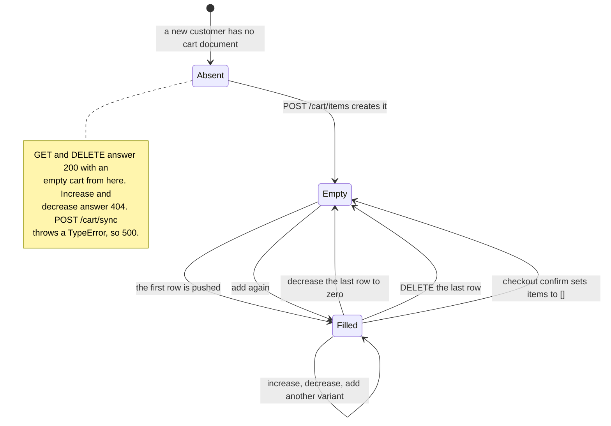

# `carts` {#carts}

`server/src/models/Cart.ts` · model `Cart` · **2 live documents**
(2026-09-19).

## Purpose

A customer's basket in the catalogue side of the shop. One cart per customer,
kept between sessions.

Separate from the [grocery list](grocery-lists.md), which is the free-text
route to the same shop and the one customers actually use.

**Effectively legacy**, alongside [orders](orders.md). No shipped client
reaches any of the six cart routes — see
[the legacy API page](../api/legacy-cart-checkout-orders.md#dead-island).

## Fields

| Field | Type | Default | Required | Meaning |
|---|---|---|---|---|
| `user` | ObjectId to `User` | — | yes, **unique** | The owner. A customer can only ever have one cart, and the unique index is also what every lookup uses |
| `items` | `[cartItemSchema]` | `[]` | no | Embedded; see below |
| `createdAt` and `updatedAt` | Date | auto | — | `{ timestamps: true }` |

Items are embedded rather than kept in a separate collection because a basket
is small, always read whole, and never queried across customers.

## Sub-documents: `items[]` {#items}

`cartItemSchema`, declared with `_id: false`.

| Field | Type | Default | Required | Meaning |
|---|---|---|---|---|
| `product` | ObjectId to `Product` | — | yes | A hard ref |
| `quantity` | Number | — | yes, `min: 1` | At least 1 — removing a line deletes it rather than setting zero |
| `color` | String | — | no, trimmed | The chosen variant; absent for a product that offers none |
| `size` | String enum | — | no | `S`, `M`, `L` or `XL`; absent for a product that offers none |

???+ info "No price is stored on a cart line"
    The product is referenced, so what the customer pays is whatever the
    catalogue says at checkout, not what it said when they added the item.

    A consequence for callers: because the cart response projects the product
    down to `title brand images`, **no cart endpoint can show a total in
    money** — only `totalQuantity`.

## Enums

`size` uses the same four values as `ProductSize` — `S`, `M`, `L`, `XL` — but
declared inline on this schema rather than shared.

## Line identity {#line-identity}

A cart line is identified by the triple **`(product, color, size)`**, not by
product alone, so the same product in two colours is two rows. The comparison
lives in `isSameCartItem` in
`server/src/routes/customer/cart-wishlist.routes.ts`: the product reference is
compared as a string, and an absent colour or size is treated as `""`, exactly
and case-sensitively.

Nothing in the schema enforces that the triple is unique.

???+ danger "Known defect: the first row can be duplicated"
    `POST /customer/cart/items` tests `if (itemIndex > 0)` where every other
    comparable check in the file uses `>= 0`. Re-adding the product that sits
    at **index 0** falls through to the `else` branch and pushes a second
    identical row instead of increasing the first.

    So `carts.items` really can hold two rows with identical
    `(product, color, size)`. Documented, not fixed.

## Indexes {#indexes}

**Declared:** `user` unique, through `unique: true` on the field.

**Live**, as checked on 2026-09-19: `user_1` (unique) plus `_id_`. No mismatch.

That one index is all a lookup needs — a cart is only ever fetched by its
owner.

## Invariants enforced in routes, not the schema {#invariants}

All in `server/src/routes/customer/cart-wishlist.routes.ts`.

| Invariant | Where |
|---|---|
| Only a product with `status: "active"` can be added, increased or decreased. Anything else is reported as **not found**, so a caller cannot distinguish an archived product from a missing one | `POST /cart/items`, `PATCH .../increase`, `PATCH .../decrease`, `DELETE .../:productId` |
| The **product** decides whether a variant is required: a non-empty `colors` makes a colour mandatory and validated against the list, and likewise for `sizes`. A stray `color` on a variantless product is discarded rather than rejected | `getSelectedvariant` |
| The variant is read from the **body** on `POST /cart/items` and `POST /cart/sync`, but from the **query string** on increase, decrease and delete | the five handlers |
| `quantity` must be a number of at least 1 | `POST /cart/items` |
| Stock is checked twice on add — the requested quantity alone, and the resulting row total — and never exceeded | `POST /cart/items`, `PATCH .../increase` |
| Stock is only **read**, never reserved or decremented, so two callers can each fill a cart past the real stock | every cart route |
| Decreasing to zero or below **splices the row out**, so there is no separate "remove the last unit" call | `PATCH .../decrease` |
| Rows whose product has been deleted are dropped **silently** at read time by a `flatMap`, so `totalQuantity` counts only survivors | `getCartResponse` |
| A caller with no cart gets an **empty cart** from `GET` and `DELETE`, but a **404 `Cart not found`** from increase and decrease | the four handlers |
| The cart is emptied wholesale on a successful checkout, with `$set: { items: [] }` | `customerCheckoutRouter` `POST /checkout/confirm` in `server/src/routes/customer/checkout.routes.ts`, and the points twin |

## Lifecycle {#lifecycle}

A cart document is created on the first add and then never deleted — only
emptied.

The document itself is never removed. Nothing in the server deletes a `Cart`.

???+ danger "`POST /customer/cart/sync` cannot work"
    Two defects, documented rather than fixed.

    With no existing cart it calls `cart.create(...)` on the `null` it has just
    tested for — a `TypeError`, so a 500.

    And `cart.save()` and `res.json()` are both inside the per-item loop, so a
    two-item sync writes the response twice and an empty `items` array writes
    no response at all. See
    [the API page](../api/legacy-cart-checkout-orders.md#post-cart-sync).

## Cascades {#cascades}

| Reference | On delete of the target |
|---|---|
| `items.product` to `products` | **No cascade.** The dangling id stays in the array; `populate` yields `null` and the row is dropped at read time, so it is invisible rather than broken |
| `user` to `users` | Nothing deletes a user |

Deleting a product therefore silently shrinks every cart that held it. That is
why [products](products.md#lifecycle) recommends deactivating rather than
deleting.

## Where a cart document is read and written

| Route | Reads | Writes |
|---|---|---|
| [`GET /customer/cart`](../api/legacy-cart-checkout-orders.md#get-cart) | by `user`, `items.product` populated to `title brand images` | — |
| [`POST /customer/cart/items`](../api/legacy-cart-checkout-orders.md#post-cart-items) | by `user` | create if absent, then `save` |
| [`PATCH .../increase`](../api/legacy-cart-checkout-orders.md#patch-increase) | by `user` | `save` |
| [`PATCH .../decrease`](../api/legacy-cart-checkout-orders.md#patch-decrease) | by `user` | `save` |
| [`DELETE .../:productId`](../api/legacy-cart-checkout-orders.md#delete-cart-item) | by `user` | `save`, except on the no-cart path |
| [`POST /customer/cart/sync`](../api/legacy-cart-checkout-orders.md#post-cart-sync) | by `user` | one `save` per accepted row |
| [`POST /customer/checkout/create-session`](../api/legacy-cart-checkout-orders.md#post-create-session) | `.select("items").lean()` | — |
| [`POST /customer/checkout/confirm`](../api/legacy-cart-checkout-orders.md#post-checkout-confirm) | — | `$set: { items: [] }` |
| [`POST /customer/checkout/pay-with-points`](../api/legacy-cart-checkout-orders.md#post-pay-with-points) | `.select("items").lean()` | `$set: { items: [] }` |

## Multi-tenant note

Classification only. `carts` would **need a changed key**. A cart holds
products that belong to one shop, so it becomes per `(user, shop)` — and the
`user` unique index blocks that today. It would have to become a compound
unique index.
