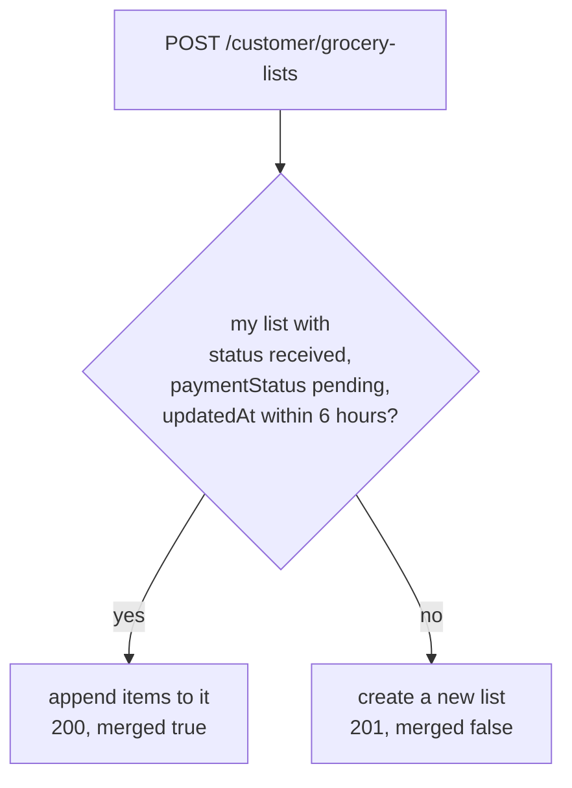
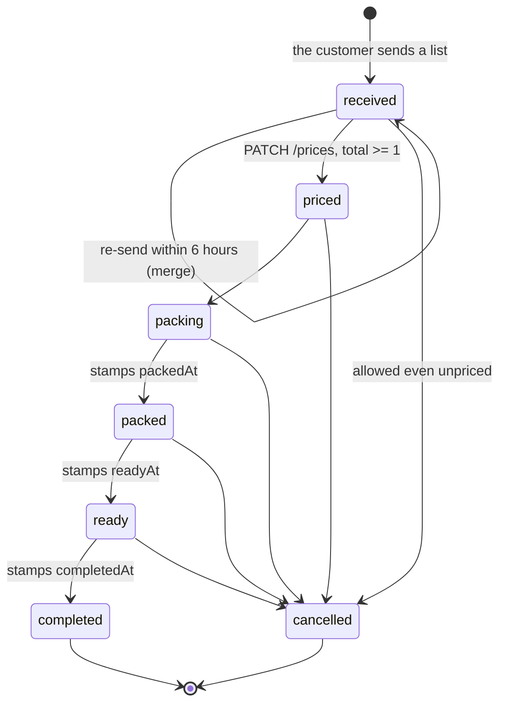
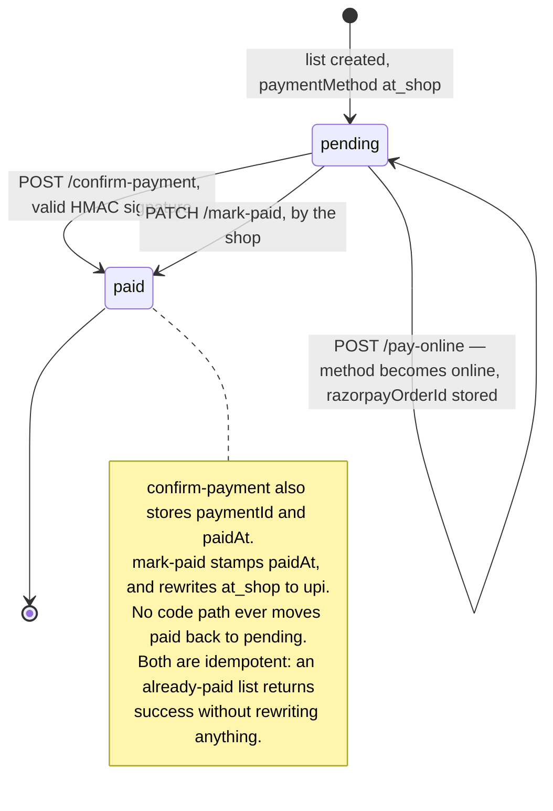

# `grocerylists` {#grocery-lists}

`server/src/models/GroceryList.ts` · model `GroceryList` · **130 live
documents** (2026-09-19).

## Purpose

**The live business object.** A customer writes a free-text grocery list — item
and quantity, no price. The shopkeeper receives it, fills in a price per line,
and sends it back. The customer then pays online or at the shop on pickup.

This is the path most customers take, rather than the catalogue and cart. The
conversation about a list lives in [messages](messages.md).

???+ info "A list holds no photographs"
    A customer may photograph their handwritten paper, but that photo is read
    into items the moment it is taken and then thrown away. What is stored is
    the text they checked, never the image. See
    [what is never stored](index.md#never-stored).

## Fields

| Field | Type | Default | Required | Meaning |
|---|---|---|---|---|
| `user` | ObjectId → `User` | — | yes | The owner. Every customer query scopes on it |
| `customerName` | String | `""` | no | A **snapshot** taken at send time, falling back to the email so the shopkeeper always sees who sent it |
| `customerEmail` | String | `""` | no | A snapshot |
| `customerPhone` | String | `""` | no | A snapshot. Absent from 3 of the 130 live documents |
| `items` | `[GroceryListItemSchema]` | `[]` | no | Embedded; see below |
| `totalItems` | Number | — | **yes, `min: 1`** | Kept in step by hand as `items.length` on add and remove |
| `totalAmount` | Number | `0` | no, `min: 0` | Rupees. `0` until priced, then the sum of the **available** lines' `price` |
| `status` | String enum | `"received"` | no | Where the list has got to |
| `paymentMethod` | String enum | `"at_shop"` | no | How the customer chose to pay |
| `paymentStatus` | String enum | `"pending"` | no | Whether the money has arrived |
| `razorpayOrderId` | String | `""` | no | Set when the customer starts an online payment, and overwritten on each attempt |
| `paymentId` | String | `""` | no | The Razorpay payment id, after the signature is verified |
| `seenByCustomer` | Boolean | `true` | no | Drives the app's badge. Set `false` by every shop-side write, and back to `true` when the customer opens the list |
| `note` | String | `""` | no | Free text. Capped at 300 characters in the route, not the schema |
| `pricedAt` | Date or null | `null` | no | Stamped once, when the shop prices the list |
| `packedAt` | Date or null | `null` | no | Stamped once, the first time `packed` is reached |
| `readyAt` | Date or null | `null` | no | Stamped once |
| `completedAt` | Date or null | `null` | no | Stamped once |
| `paidAt` | Date or null | `null` | no | Drives the dashboard's sales-per-day series |
| `createdAt` / `updatedAt` | Date | auto | — | `{ timestamps: true }`. `updatedAt` is the **admin list's sort key**, because merges keep `createdAt` |

The three `customer*` fields are copied onto the list rather than read through
`user`, so the shop still has the details it was given at the time even if the
customer later changes them. Editing a profile does push corrected details onto
**open** lists — see [the invariants](#invariants).

`totalAmount` stays 0 until the shopkeeper prices the list, so it cannot be
read as "free": `status` says whether it means anything yet.

The `...At` dates are stamps, written once when the list reaches that step and
left alone afterwards, so a status set twice keeps the original time.

## Sub-documents: `items[]` {#items}

`GroceryListItemSchema`, declared with `_id: false`.

| Field | Type | Default | Required | Meaning |
|---|---|---|---|---|
| `name` | String | — | yes | The customer's own words, sanitised. At most 60 characters |
| `quantity` | String | `""` | no | **Free text** — `"2 kg"`, `"1 packet"` — because that is how people write a list, and forcing units would slow them down. At most 12 characters |
| `rate` | Number | `0` | no, `min: 0` | An optional per-unit price in rupees. **Display only** — never multiplied into the total |
| `price` | Number | `0` | no, `min: 0` | The line total in rupees; `0` until priced, and `0` for anything out of stock |
| `available` | Boolean | `true` | no | `false` is the shop saying it is out of stock. The line **stays on the list** so the customer can see what they will not be getting, but is never charged |

Every `name` and `quantity` here has been through `cleanField` or `cleanItems`
(`server/src/utils/sanitizeItem.ts`), whether it was typed or read off a
photograph.

Live facts (2026-09-19): `rate` and `available` are **absent from older lists**
— present on the first item of 75 and 79 of the 130 documents respectively. The
mappers normalise with `rate ?? 0` and `available !== false`, so an old record
reads the same as a new one.

## Enums

| Type | Values |
|---|---|
| `GroceryListStatus` | `received`, `priced`, `packing`, `packed`, `ready`, `completed`, `cancelled` |
| `GroceryListPaymentMethod` | `online` (a Razorpay order), `upi` (a direct transfer to the shop), `at_shop` (cash or card on collection, and the default) |
| `GroceryListPaymentStatus` | `pending`, `paid` |

`priced` is the one the customer is waiting for: it is when a total exists and
payment becomes possible.

`paid` is only ever set by the server, after Razorpay's signature has been
verified or the shopkeeper has confirmed payment at the counter — never on the
client's word.

Live status spread (130 documents): `received` 78, `completed` 15, `priced` 13,
`cancelled` 9, `packing` 9, `ready` 5, `packed` 1. Payment: `pending` 113,
`paid` 17. Method: `at_shop` 110, `upi` 17, `online` 3.

## Indexes {#indexes}

**Declared** (`server/src/models/GroceryList.ts`):

| Index | Serves |
|---|---|
| `{ user: 1, createdAt: -1 }` | A customer opening their own orders |
| `{ status: 1, createdAt: -1 }` | The shop's queue, filtered to one status |

Both put the sort field last, so the index satisfies the sort as well as the
match and the database never has to order the results itself.

**Live**, as checked on 2026-09-19: both, plus `_id_`. No index mismatch.

???+ warning "The admin list page sorts by `updatedAt`, and no index covers it"
    [`GET /admin/grocery-lists`](../api/grocery-lists-admin.md#get-grocery-lists)
    reads the whole collection sorted by `updatedAt` descending. Neither
    declared index helps, so that is a blocking in-memory sort over every list
    the shop has ever received — and it runs again after almost every mutation
    in that router.

    The sort itself is deliberate, not a mistake: see
    [the merge window](#the-merge-window).

## The merge window {#the-merge-window}

A new send does not always create a list.

`MERGE_WINDOW_MS` is six hours
(`customerGroceryListRouter` `POST /grocery-lists`,
`server/src/routes/customer/grocery-list.routes.ts`).

If the customer already has a not-yet-priced list from the same shopping
session, the new items are merged into it instead of opening a parallel order.
A send after the window starts a fresh order with today's date, so a week-old
`received` list no longer keeps absorbing every future send. Priced and packed
lists are never merged into.

Two consequences:

- **Two visits can share one `_id`.** A merged list keeps its original
  `createdAt` and bumps only `updatedAt`, which is why `createdAt` is not the
  admin sort key.
- On a merge the new note is appended to the old with `" | "`, and the stored
  phone is filled in only if it was empty.

## Status lifecycle {#lifecycle}

The arrows are the intended path, **not a constraint the code enforces**.
`PATCH /admin/grocery-lists/:listId/status` accepts any of `packing`, `packed`,
`ready`, `completed` and `cancelled` from any state, so the shop can jump
straight from `packing` to `completed` or cancel from anywhere. The only guard
is `totalAmount >= 1` unless cancelling.

There is no route back to `received` or `priced`. `received` is only ever the
creation state, and `priced` is set by the pricing route alone — which has no
status gate, so a list **can** be re-priced after it has moved on, and that
resets it to `priced`.

Lists are never deleted. A cancelled one keeps its `cancelled` status, so the
shop's history stays whole.

## Payment lifecycle {#payment-lifecycle}

## Invariants enforced in routes, not the schema {#invariants}

### Pricing and money

| Invariant | Where |
|---|---|
| Pricing must send **exactly as many items** as the list holds — matching is by array position, not by name | `adminGroceryListRouter` `PATCH /grocery-lists/:listId/prices`, `server/src/routes/admin/grocery-list.routes.ts` |
| Names and quantities are taken from the **stored** list; only `price` and `rate` come from the shop. A `name` or `quantity` in the pricing body is ignored entirely | same |
| `price` is rounded with `Math.round`, so paise are discarded | same |
| An **unavailable** item is always priced `0` and excluded from the total, whatever the shop sent | same, and `PATCH .../items/:index/availability` |
| A list cannot be priced to a total below ₹1 — the message reads `Total must be greater than 0` | `PATCH .../prices` |
| A list cannot be moved past `received` or `priced`, except to `cancelled`, until `totalAmount >= 1` | `PATCH .../status` |
| A list cannot be marked paid before it is priced | `PATCH .../mark-paid` |
| `mark-paid` only touches `paymentMethod` when it is still the `at_shop` default, in which case it becomes `upi`. An `online` method is left alone | `PATCH .../mark-paid` |
| Razorpay payments are accepted only after an HMAC-SHA256 check against the **stored** `razorpayOrderId` | `customerGroceryListRouter` `POST .../confirm-payment`, `server/src/routes/customer/grocery-list.routes.ts` |
| The amount sent to Razorpay is always the stored `totalAmount`, never a value from the caller | `POST .../pay-online` |

### Items

| Invariant | Where |
|---|---|
| Item name and quantity are stripped of control, zero-width and bidi characters, then reduced to an allowlist of letters in any script, digits and `. , & ' - / ( ) %` and `×` | `cleanField` and `cleanItems`, `server/src/utils/sanitizeItem.ts` |
| Objects and arrays in a string field collapse to `""`, so a `{ "$gt": "" }` payload can never reach a query | `cleanField`, same file |
| Name at least 2 characters and at most 60; quantity at most 12; note at most 300; at most 50 items per send; at most 100 items per list; at most 500 raw rows accepted | same file, applied in `POST /customer/grocery-lists` and the two admin item routes |
| A row whose name is under 2 characters is **dropped silently**, not rejected | `cleanItems` |
| A customer may remove an item only while `received` or `priced`, only while unpaid, and **never down to zero items** | `customerGroceryListRouter` `PATCH .../remove-item` |
| `completed` and `cancelled` lists reject item edits and additions — but **not** further status changes, and **not** availability changes | `adminGroceryListRouter` `PATCH .../items/:index` and `POST .../items` |
| A new admin-added line always starts at `rate: 0, price: 0, available: true`; any price in the body is ignored | `POST .../items` |
| `totalItems` is updated by hand on add and remove. Marking an item unavailable does **not** change it, which is correct — the item stays on the list | both routers |

### Customer visibility

| Invariant | Where |
|---|---|
| `seenByCustomer` is forced to `false` on **every** shop-side write: price, status, mark-paid, availability, item edit, item add | `adminGroceryListRouter`, all six handlers |
| Every customer lookup is scoped by `user`, so a list owned by somebody else answers 404 `List not found` rather than 403 | `customerGroceryListRouter`, every handler |
| An admin may read and change **any** customer's list; ownership is never checked on the admin side | `adminGroceryListRouter` |
| Editing a profile rewrites `customerName` and `customerPhone` on all of that customer's **open** lists. `completed` and `cancelled` ones keep the old snapshot on purpose | `customerProfileRouter` `PATCH /profile`, `server/src/routes/customer/profile.routes.ts` |

???+ warning "`totalItems` and `items.length` can drift"
    `totalItems` is a cached copy maintained by hand. Historical writes can
    leave the two out of step. **Treat `items.length` as the truth.**

## Where a list document is read and written

| Route | Reads | Writes |
|---|---|---|
| [`POST /customer/grocery-lists`](../api/grocery-lists-customer.md#post-grocery-lists) | the merge target | insert, or update on a merge |
| [`GET /customer/grocery-lists`](../api/grocery-lists-customer.md#get-grocery-lists) | all of one customer's, newest first | — |
| `PATCH .../seen` | one, scoped | `seenByCustomer` |
| `PATCH .../remove-item` | one, scoped | `items`, `totalItems`, `totalAmount` |
| `PATCH .../pay-at-shop` | one, scoped | `paymentMethod` |
| `POST .../pay-online` | one, scoped | `paymentMethod`, `razorpayOrderId` |
| `POST .../confirm-payment` | one, scoped | `paymentStatus`, `paymentMethod`, `paymentId`, `paidAt` |
| `GET` / `POST .../messages` | one, scoped, for the ownership check | — |
| [`GET /admin/grocery-lists`](../api/grocery-lists-admin.md#get-grocery-lists) | **all**, sorted by `updatedAt`, `user` populated | — |
| The six admin mutations | one by id, then **all** again for the response | see [the admin page](../api/grocery-lists-admin.md) |
| `GET /admin/grocery-lists/conversations` | those whose ids the aggregation returned | — |
| [`GET /admin/dashboard/lite`](../api/dashboard.md#get-lite) | three `countDocuments` and one `$sum` aggregation | — |
| [`GET /admin/dashboard/daily`](../api/dashboard.md#get-daily) | the last eight days, projected to five fields | — |
| `PATCH /customer/profile` | — | `updateMany` on open lists |

## Multi-tenant note

Classification only. `grocerylists` would become **shop-scoped**: a list is
addressed to one shopkeeper, and the admin view is an unfiltered
`GroceryList.find`, which would leak every shop's orders without a scope. Both
declared indexes would need `shop` prefixed.
