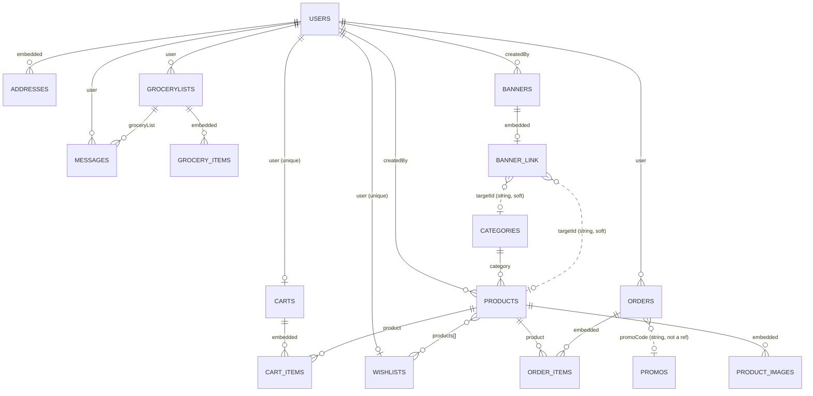

# The database {#database}

One page per collection. Written from the schemas in `server/src/models/*.ts`
and from what actually reads and writes them in `server/src/routes/**`.

MongoDB through Mongoose 9. One connection, opened once at boot by `connectDB`
in `server/src/db.ts` and awaited before Express starts listening, so no route
can run without a database behind it. **There are no transactions anywhere in
the codebase.**

References name a file and a symbol, never a line number — the rule is set out
in `docs/README.md`, under "Keeping them true".

---

## The shape of it {#erd}

Solid lines are real `ObjectId` refs declared in a schema. Dotted lines are
**soft** pointers: a plain string the code resolves by hand, so the target can
be deleted without breaking the document. See `server/src/models/Banner.ts` and
`server/src/models/Order.ts`.

---

## The collections {#collections}

Document counts were read read-only from the production `MONGO_URI` on
**2026-09-19** and recorded in `docs/DATA-MODEL.md`. They move; the *shape*
observations are the point.

| Collection | Page | Live docs | Role |
|---|---|---|---|
| `users` | [users](users.md) | 32 | People, addresses, push tokens and points |
| `products` | [products](products.md) | 84 | The catalogue |
| `categories` | [categories](categories.md) | 13 | Catalogue taxonomy |
| `grocerylists` | [grocery-lists](grocery-lists.md) | 130 | **The live business object** — a customer's order |
| `messages` | [messages](messages.md) | 35 | Chat per grocery list; deleted after 30 days |
| `banners` | [banners](banners.md) | 4 | The Home carousel |
| `orders` | [orders](orders.md) | 1 | The inherited cart-checkout order. Effectively legacy |
| `carts` | [carts](carts.md) | 2 | The inherited basket. Effectively legacy |
| `wishlists` | [wishlists](wishlists.md) | 4 | Saved products |
| `promos` | [promos](promos.md) | 3 | Discount codes for catalogue orders |
| `customlists` | — | 0 | **Orphan.** No model, no code reference anywhere in the repo. Origin unverified; safe to ignore, probably safe to drop |

There is **no** `pushtokens` collection. Push tokens are two string arrays on
`users` — see [users](users.md#push-tokens).

---

## Rules that apply to every collection {#global-rules}

### Timestamps

Every model is declared with `{ timestamps: true }`, so `createdAt` and
`updatedAt` are maintained by Mongoose. The one exception is the embedded
`addressSchema` on `users`, which sets `timestamps: false` because an address
is replaced rather than tracked.

`updatedAt` is load-bearing in two places. It is the sort key for the admin
list page, because a merge keeps `createdAt` — see
[grocery-lists](grocery-lists.md#the-merge-window) — and it is the window the
merge itself is measured against.

### Sanitising

Every piece of free text that reaches a grocery list — hand-typed, or read off
a photograph — passes through `cleanField` or `cleanItems` in
`server/src/utils/sanitizeItem.ts`. The client caps and cleans too, but the
client is never trusted.

Two jobs, in this order:

1. **Strip dangerous characters.** `stripDangerousChars` drops C0 controls and
   DEL, and zero-width and bidi characters: `U+200B` to `U+200F`, `U+202A` to
   `U+202E`, `U+2060` and `U+FEFF`. These are what make two different strings
   look identical to a shopkeeper reading an order, or reverse the direction of
   what is displayed. Done by code point, so the source itself carries no
   invisible characters.
2. **Reduce the character set**, for an item name or quantity only. The
   allowlist is `/[^\p{L}\p{M}\p{N}\s.,&'\-/()%×]/gu`: letters in any script,
   digits, whitespace, and `. , & ' - / ( ) %` and `×`. `\p{M}` is essential —
   Hindi vowel signs are combining marks, not letters, and dropping them would
   mangle Devanagari. Free prose such as the note skips this step, so it keeps
   its punctuation.

Then whitespace is collapsed, the value is trimmed, and it is hard-capped.

???+ info "Objects and arrays collapse to an empty string"
    `cleanField` only turns real primitives into text. An object, an array,
    `null` or `undefined` all become `""`, so a `{ "$gt": "" }` injection
    payload can never reach a query as an operator and can never be stored as
    `[object Object]`. Nothing is rejected: bad input becomes a shorter string,
    or an empty one, and the caller decides what empty means.

The caps, all from `server/src/utils/sanitizeItem.ts`:

| Constant | Value | Applies to |
|---|---|---|
| `MAX_NAME_LEN` | 60 | an item name |
| `MAX_QTY_LEN` | 12 | an item quantity |
| `MIN_NAME_LEN` | 2 | a name shorter than this is **dropped**, not rejected |
| `MAX_NOTE_LEN` | 300 | a list's note |
| `MAX_ITEMS_PER_SUBMIT` | 50 | items in one send |
| `MAX_ITEMS_PER_LIST` | 100 | items on one list, after merges and additions |
| — | 500 | raw rows accepted before anything is mapped |

Search text is escaped separately, by `escapeRegex` in
`server/src/utils/regex.ts`, before it is used in a `$regex`.

Phone numbers go through `normalizeMobile` in `server/src/utils/phone.ts`:
every non-digit dropped, a leading `+91` or `0` removed, and the result must be
ten digits starting 6, 7, 8 or 9. The empty string is the only failure signal.

Chat text is the exception: it is trimmed and length-capped at 1000 characters
but **not** put through the allowlist, because chat is free-form. Anything
rendering it must escape it.

### Request bodies are capped before any handler runs

`express.json({ limit: "100kb" })` in `mainEntryFunction`
(`server/src/server.ts`). Multipart uploads bypass it and are bounded per route
by multer instead.

### What is never stored {#never-stored}

| Not stored | Why | Where |
|---|---|---|
| **Photographs of handwritten lists** | The bytes arrive in the request, go to the model, and are gone when the response is written. Never on disk, never in Cloudinary, never on the list. What the customer keeps is the **text**, which they can correct before the shop sees it | `server/src/services/photo-list-parser.ts`, and the note on `GroceryList` |
| **A password** | Clerk owns authentication entirely | `server/src/services/user-sync.ts` |
| **A card number or any payment instrument** | Razorpay holds them. Only its `razorpayOrderId` and `paymentId` are stored | `server/src/utils/razorpay.ts` |
| **A unit price on an order line** | `orders.items` holds only `product` and `quantity`. The order's `totalAmount` is the record of what was charged, so an order cannot be re-costed from its own document | `server/src/models/Order.ts` |
| **A price on a cart line** | The product is referenced, so what the customer pays is whatever the catalogue says at checkout | `server/src/models/Cart.ts` |
| **A price on a product** | Money is settled per order — by the shopkeeper pricing each grocery-list line, or by the total recorded at catalogue checkout | `server/src/models/Product.ts` |

### Deletes {#deletes}

Only four things in the whole server delete a document:

| Delete | Where |
|---|---|
| A category | `adminProductRouter` `DELETE /categories/:id` in `server/src/routes/admin/product.routes.ts` |
| A product | `adminProductRouter` `DELETE /products/:id`, same file |
| A promo | `adminPromoRouter` `DELETE /promos/:promoId` in `server/src/routes/admin/promo.routes.ts` |
| A banner | `adminSettingsRouter` `DELETE /settings/banners/:bannerId` in `server/src/routes/admin/settings.routes.ts` |

**Nothing deletes a `User`, `GroceryList`, `Message`, `Cart`, `Wishlist` or
`Order`.** A cancelled list keeps its `cancelled` status, so the shop's history
stays whole. Messages disappear on their own, through a TTL index that MongoDB
applies without any code — see [messages](messages.md).

Two scripts also delete, and neither runs in normal operation:
`server/src/scripts/seed.ts` runs `deleteMany` on Banners, Categories, Products
and Promos, and `server/src/scripts/migrate-categories.ts` removes merged
categories. `seed.ts` is destructive and points at whatever `MONGO_URI` is in
the environment.

### Cascades {#cascades}

| From and to | Kind | On delete of the target |
|---|---|---|
| `products.category` to `categories` | hard ref, required | **Blocked.** The category delete answers 400 while any product points at it |
| `carts.items.product` to `products` | hard ref | **No cascade.** The dangling id stays; `populate` yields `null` and the row is dropped at read time |
| `wishlists.products[]` to `products` | hard ref | **No cascade.** Same null guard |
| `orders.items.product` to `products` | hard ref | **No cascade.** Return-to-stock silently matches nothing |
| `banners.link.targetId` to a category or product | soft string | **No cascade.** `/customer/home` degrades the tap action to `none`; the admin view shows an id with no name |
| `messages.groceryList` to `grocerylists` | hard ref | **No cascade either way** — and nothing deletes a grocery list at all |
| `orders.promoCode` to `promos.code` | soft string | No cascade; a deleted promo leaves the code as a historical label |
| `products.createdBy` and `banners.createdBy` to `users` | hard ref | No cascade; never read back |

### Cascading updates that do exist

- Editing a profile rewrites the denormalised `customerName` and
  `customerPhone` on all of that customer's **open** grocery lists.
  `completed` and `cancelled` ones keep the old snapshot on purpose. See
  `customerProfileRouter` `PATCH /profile` in
  `server/src/routes/customer/profile.routes.ts`.
- Sending a list may **update an existing list instead of creating one** — the
  six-hour merge window, in
  [grocery-lists](grocery-lists.md#the-merge-window).
- A Clerk re-link rewrites `users.clerkUserId` in place, so everything already
  pointing at that `_id` follows the person automatically. See `syncDbUser` in
  `server/src/services/user-sync.ts`.

### Cloudinary assets the database forgets about

Replacing a category image, deleting a category and deleting a product all
leave their Cloudinary files behind. Product **edits** and banner **deletes**
do clean up. See
[the catalogue page](../api/products-admin.md#image-leaks).

### Indexes only exist once a process connects

A declared index appears in the database when a process holding that model
connects and Mongoose's `autoIndex` runs. The declared list and the live list
can therefore differ. Each collection page records both, where the live list
was checked.
