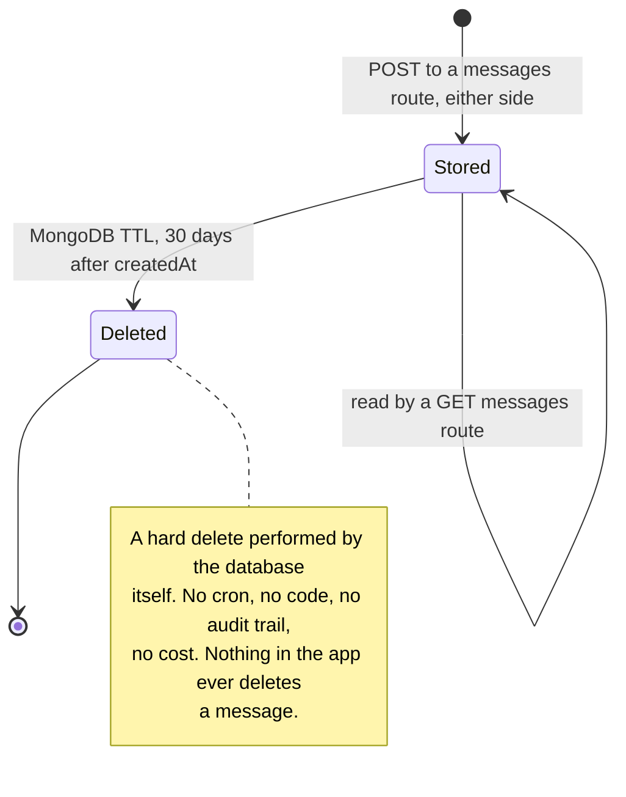

# `messages` {#messages}

`server/src/models/Message.ts` · model `Message` · **35 live documents**
(2026-09-19).

## Purpose

The conversation between a customer and the shop about **one** grocery list.
Either side can send: `customer` is the person who owns the order, `staff` is
anyone on the shop side. There is no finer distinction — the shop is one voice
to the customer, whoever at the counter actually typed it.

Kept in its own collection rather than embedded in the list, so a long
conversation never bloats the order document.

**Messages are not kept for ever.** MongoDB deletes each one 30 days after it
was sent — see [retention](#retention).

## Fields

| Field | Type | Default | Required | Meaning |
|---|---|---|---|---|
| `groceryList` | ObjectId to `GroceryList` | — | yes | The order this chat belongs to |
| `user` | ObjectId to `User` | — | yes | The **customer** who owns the order, on both directions of the chat. Duplicated from the list so a customer's messages can be scoped and pushed to without reading the list first |
| `sender` | String enum | — | yes | `customer` or `staff` |
| `senderName` | String | `""` | no | A snapshot taken when the message was written, so renaming the shop does not rewrite old messages |
| `text` | String | — | yes, **`maxlength: 1000`** | Trimmed |
| `createdAt` and `updatedAt` | Date | auto | — | `{ timestamps: true }`. `createdAt` is load-bearing: the TTL index measures from it |

## Sub-documents

None.

## Enums

`MessageSender` is `"customer"` or `"staff"`.

## Indexes {#indexes}

**Declared** in `server/src/models/Message.ts`:

| Index | Purpose |
|---|---|
| `{ groceryList: 1, createdAt: 1 }` | Fetching one conversation, oldest first — the only read shape there is |
| `{ createdAt: 1 }` with `expireAfterSeconds: 2592000` | The TTL. A single-field index on the Date field is what TTL requires |

**Live**, as checked on 2026-09-19: `groceryList_1_createdAt_1` and
`createdAt_1` with `ttl: 2592000s`, plus `_id_`. No mismatch.

The `conversations` aggregation sorts the **whole** collection by `createdAt`
descending before grouping, so the TTL index happens to serve it as well.

## Retention {#retention}



`THIRTY_DAYS_IN_SECONDS` is `30 * 24 * 60 * 60`, which is 2,592,000.

Two consequences worth designing around:

- **Chat older than 30 days is simply gone, while the grocery list it belonged
  to stays.** Nothing deletes a list. So expect `messages` to resolve to
  `grocerylists` and never the reverse.
- **A quiet conversation disappears from the admin Messages page** even though
  the list remains, because
  [`GET /admin/grocery-lists/conversations`](../api/grocery-lists-admin.md#get-conversations)
  aggregates over `messages` and drops a group whose list no longer resolves.

## Invariants enforced in routes, not the schema {#invariants}

| Invariant | Where |
|---|---|
| A customer may only read or write the chat on **their own** list: the list is loaded scoped by `user` first, so someone else's id answers 404 `List not found` | `customerGroceryListRouter` `GET` and `POST /grocery-lists/:listId/messages` in `server/src/routes/customer/grocery-list.routes.ts` |
| An admin may read and write **any** list's chat. Ownership is never checked on the admin side | `adminGroceryListRouter` in `server/src/routes/admin/grocery-list.routes.ts` |
| `sender` is fixed by the route and can never be set by the caller — `"customer"` on the customer route, `"staff"` on the admin route | both routers |
| `senderName` is likewise fixed: the user's name, else their email, else `"Customer"`; or `SHOP_NAME`, else `"Shop"` | both routers |
| `user` on a staff message is copied from the **list's** owner, so an admin cannot address a message to anyone else | `adminGroceryListRouter` `POST /grocery-lists/:listId/messages` |
| `text` must be non-empty after trimming and at most 1000 characters. Both routes check it before the save, so the caller sees a 400 rather than a schema-validation 500 | both routers |
| `text` is **not** put through the grocery allowlist cleaner. Chat is free-form, so punctuation and special characters survive and the length cap is the only limit. Anything rendering it must escape it | both routers |
| **No status gate.** A message can be sent about a `completed` or `cancelled` list, in either direction | both routers |
| Reading marks nothing as seen, in either direction. There is no unread marker on a message at all | both routers |

## The wire shape

Both sides map a message identically, with `mapMessage`:

```json
{
  "_id": "68e6667788990011bbccddee",
  "sender": "staff",
  "senderName": "sKirana",
  "text": "Atta is ready, coming in 10 minutes.",
  "createdAt": "2026-09-19T05:20:44.008Z"
}
```

The `groceryList` and `user` references, `updatedAt` and `__v` are omitted, so
a client cannot walk from a message back to the customer record. The list id is
already known to whoever asked for the thread.

## Privacy note {#privacy}

Every message leaves the database for a notification service the moment it is
written. **The full text is copied into the push body**, so it appears on a
lock screen — the customer's phone via Expo, or the shop's browser via
Firebase — and a customer's message is also copied into a Telegram alert.

The 30-day TTL does not reach any of those copies. See
[Outbound messages](../messages.md).

## Where a message document is read and written

| Route | Reads | Writes |
|---|---|---|
| [`GET /customer/grocery-lists/:listId/messages`](../api/grocery-lists-customer.md#get-messages) | all for one list, oldest first, after an ownership check | — |
| [`POST /customer/grocery-lists/:listId/messages`](../api/grocery-lists-customer.md#post-messages) | — | one insert, `sender: "customer"` |
| [`GET /admin/grocery-lists/:listId/messages`](../api/grocery-lists-admin.md#get-messages) | all for one list, oldest first, no ownership check | — |
| [`POST /admin/grocery-lists/:listId/messages`](../api/grocery-lists-admin.md#post-messages) | — | one insert, `sender: "staff"` |
| [`GET /admin/grocery-lists/conversations`](../api/grocery-lists-admin.md#get-conversations) | an aggregation over the whole collection, capped at 100 groups | — |

Neither read paginates. The conversation is bounded in practice only by the
30-day retention.

## Multi-tenant note

Classification only. `messages` would be **shop-scoped and would need a
denormalised shop field**. Scope is inherited from the parent list, so
correctness only needs the list — but the conversations view aggregates the
*whole* collection before joining lists, and with no `shop` on the message
itself that aggregation could not be scoped or indexed.
