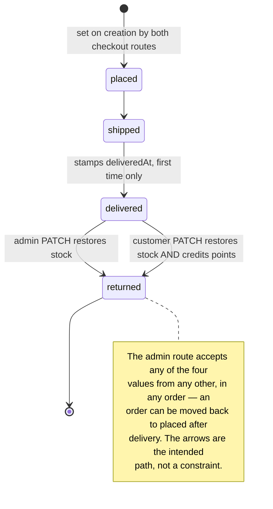

# `orders` {#orders}

`server/src/models/Order.ts` · model `Order` · **1 live document**
(2026-09-19) — `placed` and `pending`, created in 2025.

## Purpose

An order placed through the catalogue and cart, paid for up front: pick from
the catalogue, apply a promo code, pay with Razorpay, then track delivery.

**Effectively legacy.** The shop runs on
[grocery lists](grocery-lists.md) instead, and the admin dashboard counts
*those* as orders — `adminDashboardRouter` in
`server/src/routes/admin/dashboard.routes.ts` does not read this collection at
all. No shipped client reaches any of the four routes that touch it; see
[the legacy API page](../api/legacy-cart-checkout-orders.md#dead-island).

## Fields

| Field | Type | Default | Required | Meaning |
|---|---|---|---|---|
| `user` | ObjectId to `User` | — | yes | The customer. Every customer query scopes on it |
| `customerName` | String | `""` | no | A **snapshot**, so a later profile change does not rewrite a past order |
| `customerEmail` | String | `""` | no | A snapshot |
| `items` | `[OrderItemsSchema]` | `[]` | no | Embedded; see below |
| `totalItems` | Number | — | yes, `min: 1` | The **sum of quantities**, not the line count |
| `deliveryName` | String | — | yes | Copied from the chosen address's `fullName` |
| `deliveryAddress` | String | — | yes | A flattened `"address, state, postalCode"`, joined at checkout |
| `promoCode` | String | `""` | no, uppercase, trimmed | **A code string, not a ref to `promos`** |
| `discountAmount` | Number | `0` | no, `min: 0` | In rupees. What the promo took off |
| `totalAmount` | Number | — | yes, `min: 0` | In rupees. What the customer was actually charged, after the discount |
| `paymentStatus` | String enum | `"pending"` | no | Whether the money arrived |
| `orderStatus` | String enum | `"placed"` | no | Where the goods have got to |
| `razorpayOrderId` | String | — | **yes** | So a row exists only once Razorpay has been asked to take the money |
| `paymentId` | String | `""` | no | Arrives when payment succeeds |
| `paidAt` | Date or null | `null` | no | |
| `deliveredAt` | Date or null | `null` | no | The seven-day return window is measured from this |
| `returnedAt` | Date or null | `null` | no | |
| `createdAt` and `updatedAt` | Date | auto | — | `{ timestamps: true }` |

???+ info "`razorpayOrderId` is required even when no money moved"
    A points-paid order has no Razorpay order, so
    `customerCheckoutWithPointsRouter` `POST /checkout/pay-with-points` writes a
    synthetic `points_<timestamp>` into **both** `razorpayOrderId` and
    `paymentId`. That is how a points order is told apart from a Razorpay one
    downstream.

    It is a millisecond timestamp, not a unique id, and nothing enforces
    uniqueness on it.

## Sub-documents: `items[]` {#items}

`OrderItemsSchema`, declared with `_id: false`.

| Field | Type | Default | Required | Meaning |
|---|---|---|---|---|
| `product` | ObjectId to `Product` | — | yes | A hard ref |
| `quantity` | Number | — | yes, `min: 1` | How many |

**Only the product and how many.** No price is copied, so an order's lines
cannot be re-priced from the document itself — `totalAmount` on the order is
the entire record of what was charged. The cart's `color` and `size` are not
carried across either, so an order does not record which variant was bought.

## Enums

| Type | Values | Notes |
|---|---|---|
| `PaymentStatus` | `pending`, `paid`, `failed` | Moves to `paid` only once Razorpay's signature has been verified on the server, or the order was paid from points |
| `OrderStatus` | `placed`, `shipped`, `delivered`, `returned` | `placed` on creation; nothing in the schema enforces the order of the rest |

???+ warning "Nothing in the codebase ever writes `failed`"
    Grepping `server/src/routes/` and `server/src/services/` for a write of
    `paymentStatus: "failed"` finds nothing. An order that was simply never
    paid for stays `pending` for ever; a payment that was attempted and
    refused leaves no trace on the order at all.

## Indexes {#indexes}

**Declared** in `server/src/models/Order.ts`:

| Index | Serves |
|---|---|
| `{ user: 1, createdAt: -1 }` | a customer's own orders |
| `{ orderStatus: 1, createdAt: -1 }` | the shop's queue, filtered by delivery status |
| `{ paymentStatus: 1, createdAt: -1 }` | the same, filtered by payment status |

Each puts the sort field last, so the index serves the sort as well as the
match.

**Live**, as checked on 2026-09-19: all three, plus `_id_`. No mismatch.

The two routes that actually read this collection use none of them for
filtering: `GET /customer/orders` matches on `user` (so the first index
applies) and `GET /admin/orders` is an unfiltered `find` sorted by `createdAt`.

## Invariants enforced in routes, not the schema {#invariants}

| Invariant | Where |
|---|---|
| Prices are **never** taken from the request. The cart is re-priced from the current `Product` records on every call | `customerCheckoutRouter` `POST /checkout/create-session` in `server/src/routes/customer/checkout.routes.ts`, and the points twin |
| Every product must exist and be `active`, with enough `stock`, before an order is written | both checkout routes |
| `addressId` must be one of the **caller's own** saved addresses | both checkout routes |
| `paymentStatus` reaches `paid` only after an HMAC-SHA256 signature check against the **stored** `razorpayOrderId` — never on the client's word | `customerCheckoutRouter` `POST /checkout/confirm` |
| `confirm` is idempotent at the top: an already-paid order returns 200 before any signature check or stock change, so a repeated callback cannot decrement stock twice | same |
| Stock decrements are **conditional** on `stock: { $gte: quantity }`, so a single item can never go negative | same, and the points twin |
| A return is allowed only on a `delivered` order that carries a `deliveredAt`, and only within **seven days** of it | `customerOrderRouter` `PATCH /orders/:orderId/return` in `server/src/routes/customer/orders.routes.ts` |
| `deliveredAt` is stamped only the **first** time an order reaches `delivered`, so a re-delivery keeps the original date the return window is measured from | `adminOrderRouter` `PATCH /orders/:orderId/status` in `server/src/routes/admin/orders.routes.ts` |
| The admin return restores stock but is guarded against an order already `returned`, so stock cannot be credited twice | same |
| The admin return does **not** credit `users.points`; only the customer's own return does | same |

???+ danger "Nothing here is transactional"
    `POST /checkout/confirm` decrements stock item by item and throws mid-loop
    on the first shortfall, leaving earlier items decremented, the order still
    `pending`, and Razorpay holding the money. Nothing refunds or restores it.

    `POST /checkout/pay-with-points` credits the points back on failure, but
    **not** the stock, and does not refill the emptied cart.

    The customer's own return has no idempotency guard beyond the status
    check, so two racing requests can both credit the points.

## Lifecycles {#lifecycles}

Two independent state machines on one document.

### Payment

```mermaid
stateDiagram-v2
  [*] --> pending : create-session writes the order with a Razorpay order id
  pending --> paid : confirm — valid HMAC signature
  [*] --> paid : pay-with-points — written as paid, with a synthetic points id
  paid --> [*]
  pending --> [*] : abandoned; nothing cancels or expires it

  note right of pending
    The enum also allows "failed",
    but no code path ever writes it.
    An abandoned session simply stays
    pending for ever.
  end note
```

### Delivery

## Cascades {#cascades}

| Reference | On delete of the target |
|---|---|
| `items.product` to `products` | **No cascade.** The dangling id stays. Return-to-stock runs `Product.updateOne` which matches nothing, silently, so the stock is simply not restored |
| `promoCode` to `promos.code` | A **soft string**, so a deleted promo leaves the code as a historical label. `discountAmount` records what was actually taken off |
| `user` to `users` | Nothing deletes a user |

Nothing deletes an order, either. There is no `deleteOne` or
`findByIdAndDelete` on this model anywhere in the server.

## Where an order document is read and written

| Route | Reads | Writes |
|---|---|---|
| [`POST /customer/checkout/create-session`](../api/legacy-cart-checkout-orders.md#post-create-session) | — | insert, `paymentStatus: "pending"` |
| [`POST /customer/checkout/confirm`](../api/legacy-cart-checkout-orders.md#post-checkout-confirm) | by id, scoped by `user` | `paymentStatus`, `paymentId`, `paidAt` |
| [`POST /customer/checkout/pay-with-points`](../api/legacy-cart-checkout-orders.md#post-pay-with-points) | — | insert, already `paid` |
| [`GET /customer/orders`](../api/legacy-cart-checkout-orders.md#get-customer-orders) | the caller's own, projected to nine fields | — |
| [`PATCH /customer/orders/:orderId/return`](../api/legacy-cart-checkout-orders.md#patch-return) | by id, scoped by `user` | `orderStatus`, `returnedAt` |
| [`GET /admin/orders`](../api/legacy-cart-checkout-orders.md#get-admin-orders) | all, projected to eleven fields | — |
| [`PATCH /admin/orders/:orderId/status`](../api/legacy-cart-checkout-orders.md#patch-admin-order-status) | by id, no owner scope | `orderStatus`, possibly `deliveredAt` |

## Multi-tenant note

Classification only. `orders` would become **shop-scoped**, for the same reason
as grocery lists: the admin list is an unfiltered `Order.find`, which would
leak every shop's orders without a scope. Low priority, at one live document.
