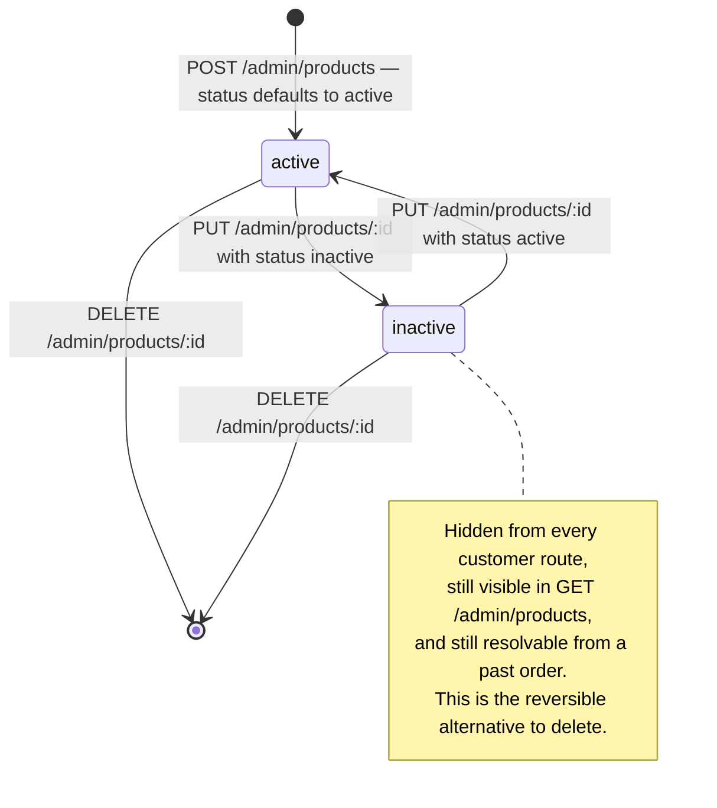

# `products` {#products}

`server/src/models/Product.ts` · model `Product` · **84 live documents**
(2026-09-19), all of them `active`.

## Purpose

The shop catalogue: what the Shop tab lists and what a cart and an order refer
to. A grocery list does **not** use products at all — it is free text.

Pictures are stored at their uploaded address and resized in the URL on the way
out; see `cdnImage` in `server/src/utils/cloudinary.ts` and `sizedProduct` in
`server/src/utils/productImages.ts`.

## Fields

| Field | Type | Default | Required | Meaning |
|---|---|---|---|---|
| `title` | String | — | yes | Trimmed. The only field the search matches, case-insensitively |
| `description` | String | — | yes | Trimmed |
| `category` | ObjectId to `Category` | — | yes | A hard ref. Its required-ness is why a category with products cannot be deleted |
| `brand` | String | — | yes | Trimmed. Also a filter facet on `/customer/products` |
| `stock` | Number | — | yes, `min: 0` | A plain count. The model never decrements it; whether an order does is the routes' business |
| `images` | `[productImageSchema]` | `[]` | no | Embedded; see below. **At least one is enforced in the route, not the schema** |
| `colors` | `[String]` | `[]` | no | Free text. A non-empty list makes a colour mandatory at add-to-cart |
| `sizes` | `[String]` enum | `[]` | no | `S`, `M`, `L` and `XL` |
| `unit` | String enum | `"piece"` | no | How the product is measured |
| `unitValue` | Number | `1` | no, `min: 0` | How much of `unit` makes one sellable item — a 10 kg bag is `unitValue: 10` with `unit: "kg"`. Loose items keep the default |
| `status` | String enum | `"active"` | no | `active` or `inactive` |
| `createdBy` | ObjectId to `User` | — | yes | The admin who added it. **Never read back by any route** |
| `createdAt` and `updatedAt` | Date | auto | — | `{ timestamps: true }` |

???+ danger "There is no price field, and two routes depend on one"
    The schema declares no `price` and no `salePercentage`, and **neither field
    exists on any of the 84 live documents**.

    Money is settled per order: on a grocery list by the shopkeeper pricing
    each line, and on a catalogue order by the total recorded at checkout.

    But both checkout routes price the cart from `product.price` and
    `product.salePercentage` — `customerCheckoutRouter`
    `POST /checkout/create-session` and `customerCheckoutWithPointsRouter`
    `POST /checkout/pay-with-points`. The computed subtotal is therefore
    `NaN`, and so is the `totalAmount` written to the order. See
    [the legacy page](../api/legacy-cart-checkout-orders.md#nan-trap).

## Sub-documents: `images[]` {#images}

`productImageSchema`, declared with `_id: false`.

| Field | Type | Default | Required | Meaning |
|---|---|---|---|---|
| `url` | String | — | yes | The Cloudinary delivery address **as uploaded**, with no transformation. `cdnImage` adds one per request |
| `publicId` | String | — | yes | The Cloudinary handle that can delete it, and the identity the update route diffs on |
| `isCover` | Boolean | `false` | no | Marks the one shown in listings |

Nothing in the schema enforces that exactly one image carries `isCover` — see
[the invariants](#invariants).

## Enums

| Type | Values |
|---|---|
| `ProductSize` | `S`, `M`, `L` and `XL` |
| `ProductStatus` | `active` and `inactive` |
| `ProductUnit` | `kg`, `g`, `litre`, `ml`, `piece`, `dozen` and `pack` |

`inactive` hides a product from customers without deleting it, so its history
in past orders stays intact. Every customer-facing query filters on `status`,
which is why it leads all three indexes.

## Indexes {#indexes}

**Declared** in `server/src/models/Product.ts`:

| Index |
|---|
| `{ status: 1, createdAt: -1 }` |
| `{ status: 1, category: 1, createdAt: -1 }` |
| `{ status: 1, brand: 1, createdAt: -1 }` |

**Live**, as checked on 2026-09-19: all three, plus `_id_`. No mismatch.

???+ info "Why all three, and why they were added"
    The schema comment records the measurement: without them the database read
    the **whole collection** and sorted it in memory for every catalogue query
    — `keysExamined: 0`, a COLLSCAN feeding a blocking SORT. Survivable at 84
    products; not at a few thousand.

    The first two are both needed. An index on
    `(status, category, createdAt)` cannot serve a plain `(status)` query
    sorted by date, because within it dates are only ordered inside each
    category.

Note that the **admin** product list applies no `status` filter at all, so it
does not use the leading key.

## Other live facts (2026-09-19)

- All 84 products are `active`.
- `unitValue` is **absent from 13 of the 84 documents** — they predate the
  field. Readers compensate with `?? 1`, for example in the `recentProducts`
  mapper on `/customer/home`.
- Unit spread: `pack` 40, `kg` 18, `piece` 11, `g` 11, `ml` 4.

## Invariants enforced in routes, not the schema {#invariants}

| Invariant | Where |
|---|---|
| **At least one image.** The create route refuses an upload with no file; the update route refuses a merged set that comes to nothing | `adminProductRouter` `POST /products`, message `Atleast one image is needed`, and `PUT /products/:id`, message `Atleast one img is needed` — both in `server/src/routes/admin/product.routes.ts` |
| On create the **first uploaded file** becomes the cover; there is no way to nominate another | `POST /products`, same file |
| On update the cover is `coverImagePublicId`, falling back to the first image in the merged order. **A `coverImagePublicId` that matches nothing leaves no cover at all**, and nothing catches that | `PUT /products/:id`, same file |
| `category` must be the `_id` of an existing category, checked with a `findById` | both write routes, same file |
| `stock` is only guarded against `NaN` by `requireNumber`, so a **negative** value passes the route and is refused by the schema's `min: 0` as a 500 rather than a 400 | both write routes, same file |
| `unitValue` is kept only when finite and greater than zero; otherwise it silently becomes `1` | both write routes, same file |
| `status`, `unit`, `colors` and `sizes` are **not** validated in the route. A bad value reaches the schema enum and becomes a 500 | both write routes, same file |
| `createdBy` is set from the calling admin's own record and cannot be supplied by the caller; the update route never touches it | both write routes, same file |
| Every customer-facing query pins `status: "active"`, so an inactive product is reported as "not found" rather than hidden behind a different error | `customerProductRouter` in `server/src/routes/customer/product.routes.ts`, plus `customerCartWishlistRouter` and `customerHomeRouter` |
| Search text is regex-escaped before it becomes a `$regex` | `escapeRegex` in `server/src/utils/regex.ts`, used by both product list routes |
| Stock decrements at checkout are **conditional** — `stock: { $gte: qty }` — so two concurrent checkouts cannot oversell a single item | `customerCheckoutRouter` `POST /checkout/confirm` in `server/src/routes/customer/checkout.routes.ts` |
| Stock is checked but **never reserved** when a cart row is added or a checkout session opened | `customerCartWishlistRouter` and `customerCheckoutRouter` |

## Lifecycle {#lifecycle}

`status` is the only state a product has, and there is no soft delete.

???+ warning "Prefer deactivating to deleting"
    Carts, wishlists and past orders hold the product's `_id`. A deleted
    product leaves a dangling id: `populate` yields `null`, and the row is
    dropped silently at read time — so a customer cannot tell a removed cart
    row from one that was never added.

    `PUT /admin/products/:id` also resets `status`, `unit` and `unitValue` to
    their defaults when those fields are omitted, so a partial-looking update
    can silently reactivate an inactive product.

## Cloudinary {#cloudinary}

Uploads go to `ecommerce-monster-video/products` — the default folder in
`uploadManyBuffersToCloudinary`, because the product routes pass none — shrunk
to fit a 1600 px box at `quality: auto:good`.

| Action | The Cloudinary assets |
|---|---|
| `POST /admin/products` | uploaded **before** the insert, so a document that then fails validation leaves its images stranded |
| `PUT /admin/products/:id` | images no longer in `existingImages` **are** deleted, best effort — but the deletes run **before** the "at least one image" check, so a request that removes them all destroys the assets and only then answers 400 |
| `DELETE /admin/products/:id` | **left behind**, every one |

## Where a product document is read and written

| Route or helper | Reads | Writes |
|---|---|---|
| [`GET /customer/products`](../api/products-customer.md#get-customer-products) | active, filtered, `card` images | — |
| [`GET /customer/products/:id`](../api/products-customer.md#get-customer-product) | one active with `detail` images, plus four related at `card` | — |
| [`GET /customer/home`](../api/home.md) | the four newest active, projected to six fields | — |
| [`GET /admin/products`](../api/products-admin.md#get-admin-products) | **any status**, optional title search | — |
| [`GET /admin/products/:id`](../api/products-admin.md#get-admin-product) | one, any status | — |
| `POST`, `PUT` and `DELETE /admin/products` | — | insert, save, delete |
| `DELETE /admin/categories/:id` | `countDocuments` for the delete guard | — |
| `GET /admin/dashboard/lite` | `countDocuments`, **no status filter** | — |
| Cart and wishlist routes | active only, for validation and the row preview | — |
| Checkout routes | `.select("price salePercentage stock status")` | conditional `$inc` on `stock` |
| Order return routes | — | `$inc` on `stock` |
| Banner `readLink` and `targetNames` | `exists`, and `title` for display | — |

## Multi-tenant note

Classification only. `products` would become **shop-scoped**: each shop owns
its catalogue, every customer query would need `shop` as the leading key, and
all three compound indexes would have to be re-fronted by it.
