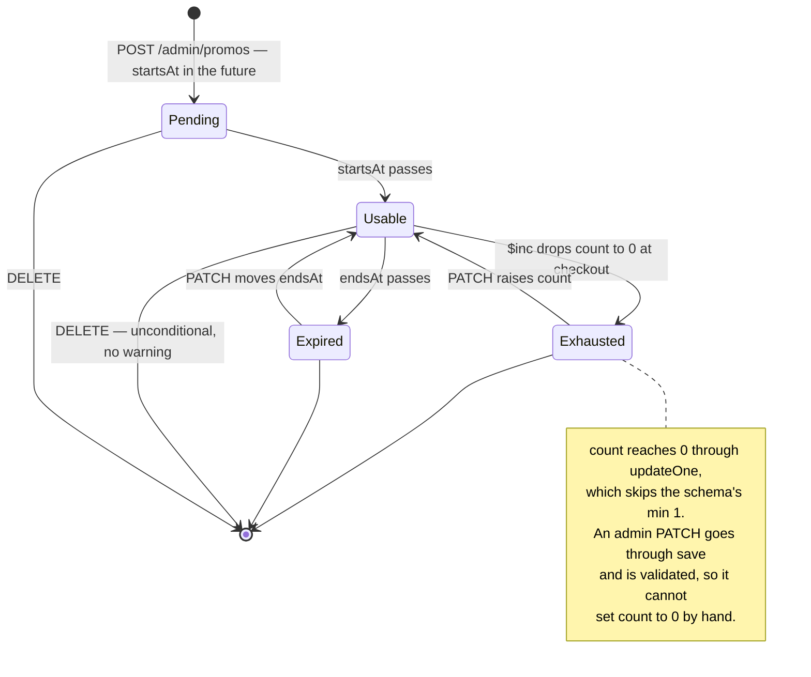

# `promos` {#promos}

`server/src/models/Promo.ts` · model `Promo` · **3 live documents**
(2026-09-19).

## Purpose

Discount codes for **catalogue** orders. Created by the shop in
[the admin promo routes](../api/settings-and-banners.md#promos) and applied at
catalogue checkout.

Grocery lists are priced by hand and do not use these at all — which means the
whole discount mechanism belongs to the
[legacy cart flow](../api/legacy-cart-checkout-orders.md), with one exception:
live codes are still surfaced to the mobile app as `coupons` on
[`GET /customer/home`](../api/home.md).

## Fields

| Field | Type | Default | Required | Meaning |
|---|---|---|---|---|
| `code` | String | — | yes, **unique**, uppercase, trimmed | The key customers type. Stored uppercase, so a customer typing any case matches |
| `percentage` | Number | — | yes, `min: 1`, `max: 100` | The discount, as a percentage of the subtotal. There is no flat-amount discount |
| `count` | Number | — | yes, `min: 1` | How many uses **remain** — not how many have been taken |
| `minimumOrderValue` | Number | — | yes, `min: 0` | In rupees. The subtotal the order must reach before the code applies |
| `startsAt` | Date | — | yes | The window opens |
| `endsAt` | Date | — | yes | The window closes. Both are required, so every code has a window |
| `createdAt` and `updatedAt` | Date | auto | — | `{ timestamps: true }` |

Whether the window is actually checked is the reading route's business, not the
schema's. Every one of them does check it.

## Sub-documents

None.

## Enums

None.

## Indexes {#indexes}

**Declared:** `code` unique, through `unique: true` on the field.

**Live**, as checked on 2026-09-19: `code_1` (unique) plus `_id_`. No mismatch.

That single index is also the only one a lookup needs — a code is only ever
fetched by its own text. The admin list sorts by `createdAt` with no index, but
at three documents that costs nothing.

???+ warning "The router also checks uniqueness, and its check can race"
    Both `POST /admin/promos` and `PATCH /admin/promos/:promoId` run their own
    `findOne` before writing, to produce a friendly
    400 `Promo code already exists` rather than a duplicate-key 500. That is a
    separate query, so two simultaneous creates of the same code can both pass
    it — and the loser then gets the generic 500 from the index.

    The module comment on `adminPromoRouter` in
    `server/src/routes/admin/promo.routes.ts` says uniqueness is "enforced in
    this router rather than by an index". That is wrong: the index exists and
    is the real guarantee.

## The `count: 0` trap {#count-zero}

???+ danger "`count` can legitimately sit at 0 despite the schema's `min: 1`"
    Redemption is an `$inc: { count: -1 }` through `updateOne`
    (`customerCheckoutRouter` `POST /checkout/confirm` in
    `server/src/routes/customer/checkout.routes.ts`, and the points twin).
    `updateOne` runs **no validators**, so `min: 1` never fires.

    That is the intended "used up" state, not a bug. Nothing re-validates the
    document afterwards.

    **The real gate is `count: { $gt: 0 }`,** which is what every reading path
    applies — `customerPromoRouter` `POST /promos/apply`, the two checkout
    routes, and the `coupons` query in
    `server/src/routes/customer/home.routes.ts`. A `PATCH` from the admin
    panel, by contrast, goes through `save` and *is* validated, so an admin
    cannot set `count` to 0 by hand.

## Invariants enforced in routes, not the schema {#invariants}

All of these live in `server/src/routes/admin/promo.routes.ts` unless stated.

| Invariant | Where |
|---|---|
| `code` is trimmed and upper-cased before it is written or looked up | `parsePromoPayload`, and the two customer-facing readers |
| `percentage` must be a number from 1 to 100 — but the message says `"Percentage must be between 1 and 10"` | `parsePromoPayload` |
| `count` must be a **whole** number of 1 or more. The schema only enforces `min: 1`, not integrality | `parsePromoPayload` |
| `minimumOrderValue` must be a number of 0 or more — but its failure is reported as `"Promo count must be atleast 0 or more"` | `parsePromoPayload` |
| `endsAt` must be strictly after `startsAt` | `parsePromoPayload` |
| `PATCH` is a **full replacement**: it reuses `parsePromoPayload`, so all six fields are required and omitting one is an error | `adminPromoRouter` `PATCH /promos/:promoId` |
| Editing `count` sets the remaining uses **outright** — it is not added to the current balance | same |
| The uniqueness check on update excludes the record being edited, so a promo may keep its own code | same |
| The window and `count` are re-checked at checkout, not trusted from the earlier `promos/apply` call | `customerCheckoutRouter` and `customerCheckoutWithPointsRouter` |
| The decrement is **conditional** on `count: { $gt: 0 }` — but its result is **not checked**, so a promo exhausted in the meantime still lets the order through at the quoted discount | `customerCheckoutRouter` `POST /checkout/confirm` |
| `POST /customer/promos/apply` reserves nothing and decrements nothing, so two callers can both be told a single-remaining code is usable | `customerPromoRouter` in `server/src/routes/customer/promo.routes.ts` |

## Lifecycle {#lifecycle}

A promo has no status field. Its usability is derived, every time, from the
window and the remaining count.

## Cascades {#cascades}

Deleting a promo is unconditional: a code that is live, or that customers have
already used, is removed without warning.

Nothing breaks, because `orders.promoCode` is a **plain uppercase string, not a
ref** (`server/src/models/Order.ts`). A past order keeps its own copy of the
code as a historical label, and the discount it already received is recorded in
that order's `discountAmount`.

Nothing else in the database points at a promo.

## Where a promo document is read and written

| Route | Reads | Writes |
|---|---|---|
| [`GET /admin/promos`](../api/settings-and-banners.md#get-promos) | all, newest first, unfiltered | — |
| [`POST /admin/promos`](../api/settings-and-banners.md#post-promos) | by `code`, for the uniqueness check | insert |
| [`PATCH /admin/promos/:promoId`](../api/settings-and-banners.md#patch-promo) | by id, and by `code` excluding itself | one `save` |
| [`DELETE /admin/promos/:promoId`](../api/settings-and-banners.md#delete-promo) | by id | delete |
| [`POST /customer/promos/apply`](../api/legacy-cart-checkout-orders.md#post-promos-apply) | by `code`; checks the window and `count` | — |
| [`POST /customer/checkout/create-session`](../api/legacy-cart-checkout-orders.md#post-create-session) | projected to six fields | — |
| [`POST /customer/checkout/confirm`](../api/legacy-cart-checkout-orders.md#post-checkout-confirm) | — | conditional `$inc` on `count` |
| [`POST /customer/checkout/pay-with-points`](../api/legacy-cart-checkout-orders.md#post-pay-with-points) | projected to six fields | conditional `$inc` on `count` |
| [`GET /customer/home`](../api/home.md) | live codes with `count > 0`, capped at 4 | — |

???+ info "The Home coupon sort is a no-op"
    `customerHomeRouter` sorts the coupon query by `createAt`, without the
    "e". `Promo` has no such field, so which four live coupons the app is shown
    is unspecified rather than "the newest four". The window and `count`
    filters are correct; only the ordering is.

`server/src/scripts/seed.ts` also runs `deleteMany` on this collection. It is a
destructive development script.

## Multi-tenant note

Classification only. `promos` would become **shop-scoped** — a discount is the
shop's own money. The `code` unique index would have to become unique per
`(shop, code)`, or two shops could never both use "DIWALI10".
