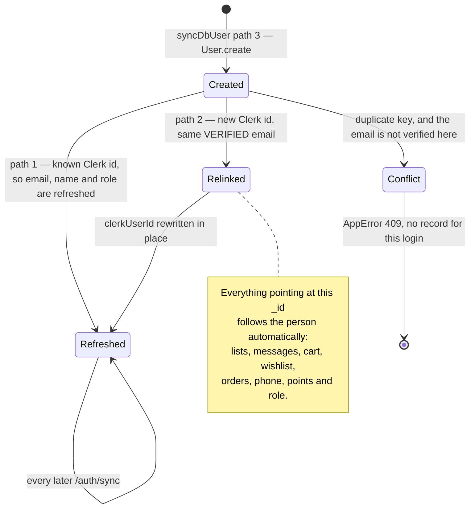

# `users` {#users}

`server/src/models/User.ts` · model `User` · **32 live documents**
(2026-09-19).

## Purpose

One record per person, customer or shopkeeper. Clerk owns authentication and
the identity fields; this record owns everything the shop needs and Clerk does
not hold — the phone number, the role, points, addresses and push tokens. The
two are joined by `clerkUserId`, and `syncDbUser` in
`server/src/services/user-sync.ts` is what keeps them together.

Unusually for this folder the schema is untyped, so `User` documents come back
loosely typed. `UserRole` is exported for callers that need to name a role.

## Fields

| Field | Type | Default | Required | Meaning |
|---|---|---|---|---|
| `clerkUserId` | String | — | yes, **unique** | Clerk's id for this person. It is per Clerk **instance** — see [the re-link trap](#relink) |
| `name` | String | — | no | Display name. Customer-editable through `PATCH /customer/profile`. `null` on some live documents |
| `email` | String | — | no, but **unique** | Lower-cased and trimmed by the schema. The re-link key after a Clerk instance change |
| `phone` | String | `""` | no | A ten-digit Indian mobile, normalised by `normalizeMobile` in `server/src/utils/phone.ts`. Collected once, the first time the customer sends a list |
| `role` | String enum | `"user"` | no | `user` or `admin` |
| `points` | Number | `0` | no, `min: 0` | Store credit, 1:1 with rupees |
| `addresses` | `[addressSchema]` | `[]` | no | Embedded; see below |
| `pushTokens` | `[String]` | `[]` | no | Expo push tokens, one per mobile device |
| `webPushTokens` | `[String]` | `[]` | no | Firebase web-push tokens, for admin browsers |
| `createdAt` and `updatedAt` | Date | auto | — | `{ timestamps: true }` |

## Enums

`UserRole` is `"user"` or `"admin"`. There is no finer permission — `admin`
unlocks the whole admin panel.

## Sub-documents: `addresses[]` {#addresses}

`addressSchema`, declared with `timestamps: false` because an address is
replaced rather than tracked. `_id` is **not** disabled, so each address has
its own `_id`, which the address routes use as the handle.

| Field | Type | Default | Required | Meaning |
|---|---|---|---|---|
| `fullName` | String | — | yes | The name on the delivery |
| `address` | String | — | yes | The street line |
| `state` | String | — | yes | |
| `postalCode` | String | — | yes | Not checked against any postcode format |
| `isDefault` | Boolean | `false` | no | Marks the one offered first. Nothing in the schema enforces that only one carries it |

These are used by catalogue orders, which are delivered. A grocery list is
collected from the shop, so it does not touch them.

## Push tokens {#push-tokens}

There is no `PushToken` model and no `pushtokens` collection. Two string arrays
on this document, deliberately kept apart because they hold different kinds of
token for different recipients:

| Array | Holds | Written by | Read by |
|---|---|---|---|
| `pushTokens` | Expo tokens, one per mobile device | `customerPushTokenRouter` in `server/src/routes/customer/push-token.routes.ts`, with `$addToSet` and `$pull` | `notifyUser` in `server/src/utils/push.ts` |
| `webPushTokens` | Firebase Cloud Messaging web-push tokens, one per admin browser | `adminPushTokenRouter` in `server/src/routes/admin/push-token.routes.ts` | `notifyAdmins` in `server/src/utils/webPush.ts` |

`webPushTokens` is **self-pruning**: any token Firebase reports as permanently
dead is `$pull`ed from *every* admin record after a send, so the list cannot go
stale as the shop's browsers come and go.

`pushTokens` is not pruned. Expo's per-ticket results are not inspected, so a
token the service has retired stays in the array. It costs nothing, because
`isExpoPushToken` filters anything that does not begin `ExponentPushToken[` or
`ExpoPushToken[` before the send.

## Indexes {#indexes}

**Declared** in `server/src/models/User.ts`:

| Index | Note |
|---|---|
| `clerkUserId` unique | Declared twice — `unique: true` plus `index: true` — which still yields one index |
| `email` unique | |

**Live**, as checked on 2026-09-19: `_id_`, `clerkUserId_1` (unique) and
`email_1` (unique). No mismatch.

???+ warning "`email_1` is neither sparse nor partial"
    At most **one** document may lack an email. Right now all 32 have one — 0
    null or empty, 0 missing — so nothing collides, but phone-only sign-up
    would break on the second such user. Read the note on the `email` field in
    the schema before making either index sparse.

The historical case is recorded in the schema itself: `email_1` existed in the
database as a legacy unique index *before* anything in the code declared it,
which is why the Clerk instance move produced "User is not found in the DB" —
a second record with the same email could not be inserted. It is now declared,
so the code says what the database enforces.

Other live facts from the same read: 28 users have a phone, 23 have at least
one `pushToken`, and **0 have a `webPushToken`** — so admin browser alerts
currently reach nobody, because `notifyAdmins` returns early when it finds no
tokens.

## Invariants enforced in routes, not the schema {#invariants}

| Invariant | Where |
|---|---|
| `role: "admin"` is derived from the `ADMIN_EMAILS` environment variable at every sync, never set by hand. The list is read fresh on each call, so it can be changed by editing the environment and restarting | `adminEmails` and `syncDbUser` in `server/src/services/user-sync.ts` |
| **Only granting, never demoting.** Removing an email from `ADMIN_EMAILS` does not demote an existing admin record; that takes a database edit | `syncDbUser`, same file |
| A record may only be re-linked by a **verified** email, otherwise anyone could claim another person's record by typing their address | `syncDbUser`, same file |
| Email matching is case-insensitive, with `collation({ locale: "en", strength: 2 })`, because Clerk lowercases but older records may not | `syncDbUser`, same file |
| Exactly one address is the default whenever the list is non-empty: the first is promoted automatically, promoting another demotes the rest, and deleting the default hands the flag to the first survivor | `customerAddressRouter` in `server/src/routes/customer/address.routes.ts` |
| `isDefault: false` is never honoured — the routes can set the flag but never clear it | same file |
| `name` is cleaned to 50 characters through the grocery allowlist, and a name that cleans down to nothing is rejected | `customerProfileRouter` `PATCH /profile` in `server/src/routes/customer/profile.routes.ts` |
| `phone` must normalise to a ten-digit Indian mobile. On the profile route an invalid number is a 400; on the grocery-list send it is silently ignored | `normalizeMobile` in `server/src/utils/phone.ts`, used by `profile.routes.ts` and `customer/grocery-list.routes.ts` |
| `points` are debited by a **conditional** `updateOne` matching `points: { $gte: total }`, with a compensating credit if any later step throws — the closest thing to a transaction in the codebase | `customerCheckoutWithPointsRouter` `POST /checkout/pay-with-points` in `server/src/routes/customer/checkout-with-points.routes.ts` |
| `points` are credited only by returning a delivered order, and only within seven days of `deliveredAt` | `customerOrderRouter` `PATCH /orders/:orderId/return` in `server/src/routes/customer/orders.routes.ts` |

## The re-link, as a lifecycle {#relink}

A record is created once and then follows the person across Clerk instances.
Nothing ever deletes one — a customer who stops using the app simply stops
appearing.

Concurrency is handled by retry, not by locking. Two requests from the same
login can both reach the create path; the loser catches the duplicate-key error
and returns the record the winner created.

## Where a `users` document is read and written

| Route or helper | Reads | Writes |
|---|---|---|
| `getDbUserFromReq` in `server/src/middleware/auth.ts` | every authenticated request | may insert or re-link, on the create-on-demand path |
| `requireAdmin`, same file | every admin request | same |
| `POST /auth/sync` and `GET /auth/me` | yes | see above |
| `GET` and `PATCH /customer/profile` | yes | `name` and `phone` |
| `POST /customer/grocery-lists` | yes | `phone`, on first capture |
| The four `/customer/addresses` routes | yes | `addresses` |
| `POST` and `DELETE /customer/push-token` | yes | `pushTokens` |
| `POST` and `DELETE /admin/push-token` | yes | `webPushTokens` |
| `notifyUser` in `server/src/utils/push.ts` | `pushTokens` | — |
| `notifyAdmins` in `server/src/utils/webPush.ts` | `webPushTokens` of every admin | `$pull` of dead tokens from every admin |
| `GET /customer/checkout/points` | `points` | — |
| `POST /customer/checkout/pay-with-points` | `name`, `email` and `addresses` | `points` |
| `PATCH /customer/orders/:orderId/return` | — | `points` |

## Multi-tenant note

Classification only. `users` would **stay global** as an identity, because a
person is identified by their Clerk id and email, which are instance-wide, and
a customer may shop at several shops. But `role` is a single global flag and
admin-ness comes from one `ADMIN_EMAILS` list, so that would have to become a
per-shop membership join. `webPushTokens` already broadcasts to *every* admin,
so it needs the same join. `addresses` and `pushTokens` stay global — an
address belongs to the person, and a token identifies a device.
