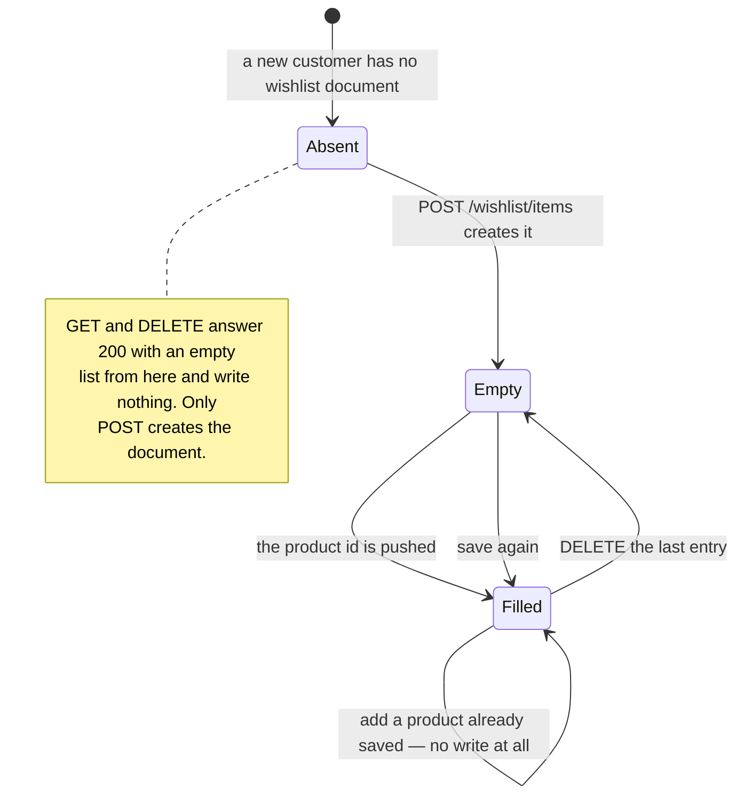

# `wishlists` {#wishlists}

`server/src/models/Wishlist.ts` · model `Wishlist` · **4 live documents**
(2026-09-19).

## Purpose

Products a customer has saved for later. One wishlist per customer, alongside
their [cart](carts.md), and handled in the same router.

Unlike the cart, this one **is** reached by the shipped mobile app, through the
Wishlist screen mounted in `mobile/src/navigation/RootNavigator.tsx`. It is the
only part of `cart-wishlist.routes.ts` that a client uses.

## Fields

| Field | Type | Default | Required | Meaning |
|---|---|---|---|---|
| `user` | ObjectId to `User` | — | yes, **unique** | The owner. A customer has at most one wishlist |
| `products` | `[ObjectId to Product]` | `[]` | no | A flat array of ids |
| `createdAt` and `updatedAt` | Date | auto | — | `{ timestamps: true }` |

## Sub-documents

None. `products` is a plain array of references, not a sub-document array — so
there are no per-entry fields at all.

## Enums

None.

## Why there is no quantity or variant

A wishlist records **interest, not an intention to buy a particular one**. So
unlike a [cart line](carts.md#line-identity), an entry carries no `quantity`,
no `color` and no `size`: the same product in two colours is one entry, and
`POST /customer/wishlist/items` neither reads nor stores those fields.

## Indexes {#indexes}

**Declared:** `user` unique, through `unique: true` on the field.

**Live**, as checked on 2026-09-19: `user_1` (unique) plus `_id_`. No mismatch.

That one index is all a lookup needs — a wishlist is only ever fetched by its
owner.

## Invariants enforced in routes, not the schema {#invariants}

All in `server/src/routes/customer/cart-wishlist.routes.ts`.

| Invariant | Where |
|---|---|
| **De-duplication happens in the route, not the schema.** Nothing stops the same product id appearing twice in the array; the add route checks with a `some` first and writes nothing when the product is already there | `POST /wishlist/items` |
| Adding a product already on the list is therefore a **no-op that still answers 200** with the list, so the route is safe to repeat | same |
| Only a product with `status: "active"` can be **added**. Anything else answers 404 `Product not found` | same |
| The **remove** route is the one endpoint in the file that does not look the product up, so an id for a product since deleted or archived is still removed cleanly | `DELETE /wishlist/items/:productId` |
| Removing something that is not on the list is not an error either — the filter matches nothing and the document is saved unchanged | same |
| A caller with no wishlist document gets `{ items: [] }` from `GET` and `DELETE`, not a 404, and nothing is written | `GET /wishlist`, `DELETE /wishlist/items/:productId` |
| Entries whose product has been deleted are dropped **silently** at read time by a `flatMap`, never returned as `null` | `getWishlistResponse` |
| The document is the caller's own in every handler; no route accepts a user id | the whole router, under `requireAuth` |

## Lifecycle {#lifecycle}



The document itself is never deleted. Nothing in the server removes a
`Wishlist`.

## Cascades {#cascades}

| Reference | On delete of the target |
|---|---|
| `products[]` to `products` | **No cascade.** The dangling id stays in the array; `populate` yields `null` and the entry is dropped at read time, so it is invisible rather than broken |
| `user` to `users` | Nothing deletes a user |

Deleting a product therefore silently shrinks every wishlist that held it, and
leaves the stale id on disk for ever — because the remove route is the only
thing that would take it out, and it needs the customer to ask. That is part of
why [products](products.md#lifecycle) recommends deactivating rather than
deleting.

Note the asymmetry: an **inactive** product cannot be added but is still
returned by `GET /customer/wishlist`, because `getWishlistResponse` filters on
nothing but the populate result. Only a **deleted** product disappears.

## Where a wishlist document is read and written

| Route | Reads | Writes |
|---|---|---|
| [`GET /customer/wishlist`](../api/legacy-cart-checkout-orders.md#get-wishlist) | by `user`, `products` populated to `title brand images` | — |
| [`POST /customer/wishlist/items`](../api/legacy-cart-checkout-orders.md#post-wishlist-items) | by `user` | create if absent, then `save` only when the product was not already present |
| [`DELETE /customer/wishlist/items/:productId`](../api/legacy-cart-checkout-orders.md#delete-wishlist-item) | by `user` | `save`, except on the no-wishlist path |

Nothing else in the server touches this collection — not the checkout routes,
not the dashboard, not the admin surface.

## The wire shape

`formatProduct` shapes each entry, the same as a cart row minus `quantity`,
`color` and `size`:

```json
{
  "productId": "68e2223344556677889900bb",
  "title": "Aashirvaad Multigrain Atta",
  "brand": "Aashirvaad",
  "image": "https://res.cloudinary.com/demo/image/upload/f_webp,q_auto,c_limit,w_500/v1/ecommerce-monster-video/products/atta.jpg"
}
```

`images` collapses to one `image` string: the cover, else the first, else `""`.
Price, stock, `colors`, `sizes`, `status` and the description are all omitted.

## Multi-tenant note

Classification only. `wishlists` would **stay global**. It is a flat list of
product ids, and each product already carries its own shop, so a single
per-user wishlist spanning shops reads correctly with no new field. The `user`
unique index stays valid.
