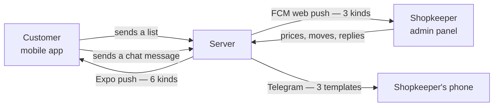

# Outbound messages {#messages}

Everything this system sends outward: to a customer's phone, to the shop's
browser, and to the shopkeeper's Telegram. Written from
`server/src/utils/push.ts`, `server/src/utils/webPush.ts`,
`server/src/utils/telegram.ts` and the routes that call them.

There are **three channels**, and they never overlap by accident — each is
addressed at one audience.

| Channel | Transport | Who receives it | Configured by |
|---|---|---|---|
| [Expo push](#expo) | Expo's public push API | the **customer's** phone | nothing; token-based |
| [Firebase web push](#fcm) | Firebase Cloud Messaging | the **shop's** browser | `FIREBASE_PROJECT_ID`, `FIREBASE_CLIENT_EMAIL`, `FIREBASE_PRIVATE_KEY` |
| [Telegram](#telegram) | the Telegram Bot API | the **shopkeeper's** phone | `TELEGRAM_BOT_TOKEN`, `TELEGRAM_CHAT_ID` |



Nothing here is an email. The server sends no email at all — Clerk owns
everything to do with sign-in.

---

## Three rules that apply to all of them {#rules}

**None of them can fail a request.** A notification is a side effect of
somebody else's action, usually the shopkeeper moving an order along, so it
must never turn their request into an error. `sendPushNotifications`,
`notifyUser`, `notifyAdmins` and `sendTelegram` each catch and swallow
everything, including a missing configuration.

**All of them are awaited anyway.** On Vercel the serverless function freezes
the moment the response is written, which would kill an un-awaited push
mid-flight. So every call site awaits — and because the helpers never throw,
awaiting costs nothing but latency.

**The code is the list id.** Every notification that concerns one order quotes
`#CODE`, which is the last eight characters of the list `_id`, upper-cased. It
is not stored anywhere; it is derived at each call site and is the reference
the shop and the customer quote at each other.

---

## Expo push, to the customer {#expo}

`server/src/utils/push.ts`. `notifyUser(userId, title, body, data)` reads
`pushTokens` off the user record — one entry per device that user has signed in
on — and hands them to `sendPushNotifications`.

### Transport

One batch is POSTed to `https://exp.host/--/api/v2/push/send`. Every message
carries `sound: "default"`.

Tokens that do not begin `ExponentPushToken[` or `ExpoPushToken[` are dropped
first, because Expo rejects a whole batch if any address is malformed.
Duplicates are collapsed, so passing the same device twice sends one
notification. If nothing valid is left the call returns without any network
traffic.

Expo's per-ticket results are **not** inspected, so a token the service has
since retired is never pruned. Only a thrown network error is logged.

### The six notifications

Every one is sent by `adminGroceryListRouter` in
`server/src/routes/admin/grocery-list.routes.ts`. **The customer is never
notified of anything they did themselves** — only of what the shop did.

| Trigger | Title | Body | `data` |
|---|---|---|---|
| [`PATCH .../prices`](api/grocery-lists-admin.md#patch-prices) | `Your list is priced` | `List #CODE — total ₹260. Tap to view.` | `{ listId }` |
| [`PATCH .../status`](api/grocery-lists-admin.md#patch-status) | `Order #CODE` | one of [the five status bodies](#status-bodies) | `{ listId }` |
| [`PATCH .../mark-paid`](api/grocery-lists-admin.md#patch-mark-paid) | `Payment received` | `The shop confirmed payment for order #CODE.` | `{ listId }` |
| [`PATCH .../items/:index/availability`](api/grocery-lists-admin.md#patch-availability), **only** when marking unavailable | `Item not available · #CODE` | `"Atta" is out of stock. The rest of your order is unaffected.` | `{ listId, type: "item_unavailable" }` |
| [`POST .../items`](api/grocery-lists-admin.md#post-items) | `Item added · #CODE` | `The shop added "Atta" to your order.` | `{ listId, type: "item_added" }` |
| [`POST .../messages`](api/grocery-lists-admin.md#post-messages) | `Message from the shop · #CODE` | **the message text, verbatim** | `{ listId, type: "new_message" }` |

### The five status bodies {#status-bodies}

From the `statusNotification` table in
`server/src/routes/admin/grocery-list.routes.ts`. The `Record` type makes
leaving one out a compile error if a status is ever added. There is no entry
for `received` or `priced`, because neither is settable through the status
route.

| `status` | Body, sent verbatim |
|---|---|
| `packing` | `The shop has started packing your order.` |
| `packed` | `Your order is packed.` |
| `ready` | `Your order is ready — come and collect it!` |
| `completed` | `Your order is complete. Thank you!` |
| `cancelled` | `Your order was cancelled by the shop.` |

This wording is customer-facing and is sent as written, so a change to that
table changes what the customer reads on their lock screen.

### What the `data` payload actually does

???+ warning "The shipped app ignores `data` entirely"
    `notifyUser`'s contract says `data` "travels with the notification and
    reaches the app when the customer taps it, so it is what routes the tap to
    the right screen". The shipped app does not do that.

    `usePushNotifications` in
    `mobile/src/features/customer/push/use-push-notifications.ts` registers two
    listeners — `addNotificationReceivedListener` and
    `addNotificationResponseReceivedListener` — and **both do the same thing**:
    call `loadLists()`. Neither reads `listId` or `type`. A notification means
    the shop changed something, so the app pulls fresh statuses, whether the
    alert arrived in the foreground or was tapped from the tray.

    So `listId` and `type` are sent and stored on the notification, but nothing
    in the shipped client branches on them. They are useful for a future
    deep-link, not load-bearing today.

### Where the shop is silent

Four things the shop does produce **no** customer notification:

| Action | Why it matters |
|---|---|
| [`PATCH .../items/:index`](api/grocery-lists-admin.md#patch-item) — editing a name or quantity | The customer sees the correction only the next time they open the list. This is the only admin mutation that notifies nobody |
| The same availability route, when marking a line back **in** stock | Only the bad news is pushed |
| `PATCH /admin/orders/:orderId/status` | The legacy order flow notifies nobody, in either direction |
| Any repeat of `mark-paid` on an already-paid list | It short-circuits before the push |

---

## Firebase web push, to the shop {#fcm}

`server/src/utils/webPush.ts`. `notifyAdmins(title, body, data)` collects
`webPushTokens` from **every** user whose `role` is `admin` and sends one
multicast.

### Transport and configuration

Firebase Admin is initialised lazily by `getApp` from three environment
variables. If any is missing, `getApp` caches `null` and **every notification
in the file quietly does nothing** — so an unconfigured server does not
re-check on every order.

`FIREBASE_PRIVATE_KEY` is stored with literal `\n` sequences, which the code
converts to real newlines.

Every message is sent with a fixed presentation:

| Property | Value |
|---|---|
| `webpush.notification.icon` | `/icon-192.png` |
| `webpush.fcmOptions.link` | `/admin/grocery-lists` — so the shopkeeper lands on the orders screen |

The browser side is `client/public/firebase-messaging-sw.js`, which shows the
notification with `tag: "skirana-order"` so duplicates collapse, and
`renotify: true`. Its `notificationclick` handler focuses an existing `/admin`
tab if one is open, and otherwise opens `/admin/grocery-lists`.

**Observation, unverified:** the service worker references `/icon-192.png` for
both `icon` and `badge`, and `client/public/` contains only `favicon.svg`,
`icons.svg` and `skirana-logo.png`. If that file is not produced at build time
the icon will not load.

### Self-pruning

After each send, any token Firebase reported as **permanently** dead —
`registration-token-not-registered`, `invalid-argument` or
`invalid-registration-token` — is `$pull`ed from *every* admin record. A token
that merely failed once is not reported, so a transient outage never costs an
admin their notifications.

### The three notifications

All three are sent by `customerGroceryListRouter` in
`server/src/routes/customer/grocery-list.routes.ts` — the shop is alerted only
by something the **customer** did.

| Trigger | Title | Body | `data` |
|---|---|---|---|
| [`POST /customer/grocery-lists`](api/grocery-lists-customer.md#post-grocery-lists), a new list | `New grocery list` | `Asha Kumari sent 7 items` | `{ listId, type: "new_list" }` |
| The same route, a **merge** into an open list | `List updated` | `Asha Kumari added 3 more items` | `{ listId, type: "list_updated" }` |
| [`POST .../messages`](api/grocery-lists-customer.md#post-messages) | `New message · #CODE` | `Asha Kumari: Is the 5 kg pack available?` — **the sender's name and the message text, verbatim** | `{ listId, type: "new_message" }` |

The customer's identity in the first two is `name`, falling back to `email`,
falling back to the literal `"A customer"`. The item count is pluralised —
`item` or `items`.

???+ info "Today this channel reaches nobody"
    As of the 2026-09-19 read of the live database, **0 of the 32 users have a
    `webPushToken`** — see [users](database/users.md#indexes). `notifyAdmins`
    finds no tokens and returns early, so every web push is currently a no-op.
    Telegram is what actually reaches the shop.

---

## Telegram, to the shopkeeper {#telegram}

`server/src/utils/telegram.ts`. `sendTelegram(text)` POSTs to
`https://api.telegram.org/bot<token>/sendMessage`.

A free, reliable "new order" alert that reaches the shopkeeper's phone even
when the admin laptop is closed.

### Transport and configuration

| Variable | Meaning |
|---|---|
| `TELEGRAM_BOT_TOKEN` | from @BotFather |
| `TELEGRAM_CHAT_ID` | one or more chat ids, **comma-separated** — the shop may be several people |

Unconfigured is a silent no-op: if either variable is missing, or the id list
is empty after splitting and trimming, the function returns without sending.

One message is sent **per chat id**, all at once through `Promise.all`, and
each send swallows its own failure — so one bad chat id does not stop the
others.

Every message is sent with `parse_mode: "HTML"` and
`disable_web_page_preview: true`.

???+ warning "HTML mode, with no escaping at the call site"
    `parse_mode: "HTML"` means Telegram's small tag set works — `<b>`, `<i>`,
    `<code>`. It also means **any raw `<` or `&` in customer text must be
    escaped by the caller**, or Telegram rejects the whole message.

    No call site escapes anything. In practice the grocery allowlist in
    `server/src/utils/sanitizeItem.ts` strips `<`, `>` and `&` from item names,
    so a list alert is safe — but **chat text is deliberately not cleaned**
    (see [messages](database/messages.md)), so a customer who types
    `A & B` or `5 < 6` in a chat message can make that Telegram alert fail to
    send. It fails silently, so the shop simply does not get that one alert.

### The three templates

All three are sent by `customerGroceryListRouter` in
`server/src/routes/customer/grocery-list.routes.ts`, alongside the matching web
push. `\n` is a real newline in the sent message.

**A new list** — `POST /customer/grocery-lists`, no merge target:

```
🛒 <b>New order</b>
From: Asha Kumari (📞 9876543210)
7 items · #00AABBCCDD
```

The phone segment, ` (📞 …)`, is present **only** when a number is stored. The
name is `name`, else `email`, else `"A customer"`. `items` is pluralised.

**A merge** — the same route, into a list open within the last six hours:

```
🛒 <b>Order updated</b>
Asha Kumari added 3 more items (now 10).
```

`(now 10)` is the list's `totalItems` after the merge. Note that this template
carries **no phone number and no code**, unlike the other two.

**A chat message** — `POST /customer/grocery-lists/:listId/messages`:

```
💬 <b>New message</b> · #00AABBCCDD
From: Asha Kumari
Is the 5 kg pack available?
```

---

## What customer data leaves the database {#privacy}

This matters, so it is stated plainly. Each row is what the **external
service** receives.

| Channel | Customer name | Phone number | Email | Order code | Item names | Full chat text |
|---|---|---|---|---|---|---|
| Expo push — priced, status, mark-paid | no | no | no | **yes** | no | no |
| Expo push — item unavailable, item added | no | no | no | **yes** | **yes**, the one item | no |
| Expo push — message from the shop | no | no | no | **yes** | no | **yes**, the shop's own text |
| FCM web push — new list, list updated | **yes** | no | **yes**, as the fallback when no name is stored | no | no | no |
| FCM web push — new message | **yes** | no | **yes**, same fallback | **yes** | no | **yes** |
| Telegram — new order | **yes** | **yes** | **yes**, same fallback | **yes** | no | no |
| Telegram — order updated | **yes** | no | **yes**, same fallback | no | no | no |
| Telegram — new message | **yes** | no | **yes**, same fallback | **yes** | no | **yes** |

Three things follow.

**The customer's phone number leaves the database exactly once** — in the
Telegram "New order" template, which is the alert the shopkeeper needs in order
to ring them back.

**An email address can leak into a name slot.** Every "customer name" above is
`dbUser.name || dbUser.email || "A customer"`. A customer who has never set a
name has their **email address** printed in the shop's browser notification and
in the Telegram alert.

**Chat is copied out in full, in both directions, and the copy outlives the
original.** A customer's message reaches the shop's browser and Telegram; the
shop's reply reaches the customer's lock screen. The
[30-day TTL](database/messages.md#retention) on `messages` deletes the database
row and reaches **none** of those copies — a Telegram chat keeps them for ever.

**What never leaves:** a password, because Clerk owns authentication; a card
number or any payment instrument, because Razorpay holds them; a delivery
address; a points balance; and a photograph of a handwritten list, which is
never stored anywhere in the first place. See
[what is never stored](database/index.md#never-stored).

---

## Failure modes, all together {#failures}

| Condition | What happens |
|---|---|
| The customer has no `pushTokens` | `sendPushNotifications` finds nothing valid and returns with no network traffic |
| A stored token is not an Expo token | dropped before the send; stored for ever, never used |
| Expo itself is unreachable | the thrown error is logged as `"Failed to send push notification"`; the request still succeeds |
| Expo rejects one ticket | **not noticed** — per-ticket results are never inspected |
| Firebase is not configured | `getApp` caches `null`; every web push is a silent no-op |
| No admin has a `webPushToken` | `notifyAdmins` returns early. **This is the situation today** |
| A web-push token is permanently dead | pruned from every admin record after the send |
| `sendEachForMulticast` throws | swallowed; an empty dead-token list is returned |
| Telegram is not configured | silent no-op |
| One Telegram chat id is bad | that one send fails silently; the others still go |
| Customer chat text contains `<` or `&` | Telegram rejects **that** message; it fails silently |
| Anything at all throws | the customer's or shopkeeper's request still succeeds |

There is no retry, no queue and no dead-letter anywhere. A notification that
fails is simply gone — which is why the shop's real safety net is the poll:
[`GET /admin/grocery-lists`](api/grocery-lists-admin.md#get-grocery-lists) is
the source of truth, and the notifications only make it timely.
