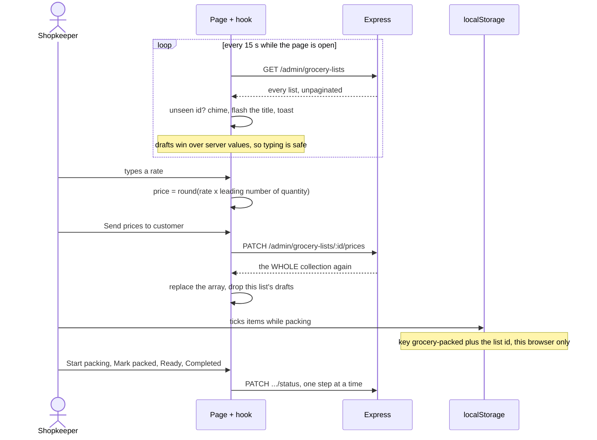

# Admin panel

The shopkeeper's screen. A React and Vite single-page app served at
`www.skirana.com/admin`, alongside a static marketing homepage on the same
domain. One page matters daily — the grocery-lists screen, where orders arrive,
get priced and get packed — and the rest of the panel exists to keep the
catalogue, the home banners and the numbers in order. This module covers the
panel as a place to work: the shell, the polling, the drafts, the checklist and
the sharing.

## Capabilities

- Serves two HTML entry points from one Vite build (`client/vite.config.ts`):
  `index.html`, a hand-written zero-JavaScript marketing homepage, and
  `app.html`, the React shell. `client/vercel.json` rewrites `/(.*)` to
  `app.html`, and because Vercel checks the filesystem first, `/` still serves
  the static page. A dev-server plugin mimics that, exempting `/`,
  `/index.html`, anything with a file extension and Vite's internal prefixes.
- Routes only what is listed in `client/src/router.tsx`: `/privacy`, `/terms`,
  `/delete-account`, `/sign-in/*`, `/sign-up/*` and `/admin/*`. Both `/` and
  the catch-all redirect to `/admin`, and `/admin` redirects to
  `/admin/grocery-lists` — the comment says why: it is the shop's most-used
  page.
- Wraps every page in `AdminLayout`: a 280 px sidebar on `lg+`, a slide-over
  sheet below that, and a sticky header holding `AdminPushBell` and Clerk's
  `UserButton`. Nav order is deliberately grocery lists first.
- Polls the orders every `POLL_MS` = 15 s (`use-admin-grocery-lists.ts`). A
  background poll is silent — it does not touch the loading flag, so the page
  never flickers — and a failed poll leaves the previous list on screen with no
  error surfaced.
- Announces a new order without any push setup: a ref holds every list id seen
  so far, the first poll only seeds it, and from the second poll an
  unrecognised id calls `notifyNewOrders` — a two-tone Web Audio chime, a
  flashing tab title until the tab regains focus, and an eight-second toast.
  The audio context is unlocked on the first pointer or key event, because
  browsers block audio until a gesture.
- Filters in three composing layers: the status tab (`active` is the five open
  statuses), then the "Payment received?" amount matcher, which narrows to
  **unpaid** orders whose total rounds to the figure the shopkeeper just
  received on UPI, then a text search over code, name, email and phone.
- Keeps typed prices as drafts in the hook, keyed by list id, stored as strings
  so a half-typed entry survives. The draft getters prefer a draft over the
  server value, which is precisely what stops the 15-second poll wiping out
  half-typed prices. Drafts are in memory only.
- Auto-fills a line total from a rate: `round(rate × leadingNumberOf(quantity))`,
  falling back to `×1` when the free-text quantity has no number.
- Offers a per-row calculator popover (`price-calculator.tsx`) — a hand-written
  precedence parser, not `eval` — pre-seeded with the quantity's leading number
  and `×`, so "9 items at ₹30" opens as `9×` and typing 30 gives 270.
- Shows only the immediate next step as a clickable status button; earlier
  steps render as `✓ <label>` and later ones are disabled. The comment records
  that this replaced buttons which "looked like they toggled".
- Keeps a packing checklist per order in `localStorage` under
  `grocery-packed:<listId>`: a `Set<number>` of ticked rows, line-through
  styling and an `n/total packed` counter.
- Toggles a per-card Hindi + English view, translating each item name through
  `lib/translate.ts` — Google's free endpoint called straight from the browser,
  auto-detecting the source language, memoised in a module-level `Map`, falling
  back to the original text on any failure.
- Shares an order as text (`lib/share-list.ts`): `navigator.share` where
  available, else a `wa.me` link, with a `🛒 Order #code` header, the customer
  line, numbered items with quantity and price, and the total. With the
  translation toggle on, it shares the translated names.
- Gathers every conversation in one place at `/admin/messages`: one
  `GET /admin/grocery-lists/conversations` on mount then a 15-second poll, with
  a "reply" pill when the last message came from the customer, and the same
  chat component expanded inline with `startOpen`.
- Shows six counters and a seven-day chart at `/admin/dashboard`, fetched
  **once per browser session** — `hasLoaded` short-circuits every refetch and
  there is no refresh button.
- Manages home banners at `/admin/settings`: drag-and-drop upload, a local
  status computation (`hidden | scheduled | ended | live | overLimit`), the
  one optimistic mutation in the app (reorder, rolled back on failure), an edit
  dialog for title, link target and schedule, and a phone preview of what the
  app will show.

## Boundary

- Does not define what an order *is*, or what pricing and the status flow are
  allowed to do. Those rules live on the server and belong to
  [grocery lists](grocery-lists.md); this module owns the controls that invoke
  them.
- Does not decide who may open it. `RoleGuardLayout` and the server's
  `requireAdmin` belong to [accounts and auth](accounts-and-auth.md).
- Does not own product or category data, only the pages that edit it: see
  [catalogue](catalogue.md).
- Does not compress or upload pictures; that is [images](images.md). The image
  picker and the banner uploader are this module's UI over it.
- Does not deliver browser push. Registering the service worker and the token
  lives here, but the send, the tokens and the pruning belong to
  [notifications](notifications.md). The in-page chime is *not* push and needs
  no Firebase.
- Does not serve the customer storefront. Every `client/src/**/customer/**`
  file is unreachable; see [legacy e-commerce](legacy-ecommerce.md).
- Has no mobile-app code in it. The customer's screens belong to
  [mobile shell](mobile-shell.md).

## What it needs

| File | What it is |
|---|---|
| [`client/src/router.tsx`](../reference/admin-pages/router.md) | The authority on which pages exist |
| [`client/src/components/layout/AdminLayout.tsx`](../reference/admin-components/components-layout-admin-layout.md) | Sidebar, mobile sheet, sticky header |
| [`client/src/components/admin/common/sidebar.tsx`](../reference/admin-components/components-admin-common-sidebar.md) | The six nav entries, grocery lists first |
| [`client/src/pages/admin/GroceryLists.tsx`](../reference/admin-pages/pages-admin-grocery-lists.md) | The daily screen: tabs, amount matcher, search |
| [`client/src/features/admin/grocery-lists/use-admin-grocery-lists.ts`](../reference/admin-features/features-admin-grocery-lists-use-admin-grocery-lists.md) | The 15 s poll, the filters, the drafts, every mutation |
| [`client/src/components/admin/grocery-lists/grocery-list-card.tsx`](../reference/admin-components/components-admin-grocery-lists-grocery-list-card.md) | One order: pricing rows, availability, flow, checklist, share |
| [`client/src/components/admin/grocery-lists/price-calculator.tsx`](../reference/admin-components/components-admin-grocery-lists-price-calculator.md) | The per-row calculator, a real parser rather than `eval` |
| [`client/src/components/admin/grocery-lists/grocery-list-chat.tsx`](../reference/admin-components/components-admin-grocery-lists-grocery-list-chat.md) | The embedded chat, polled every 5 s while open |
| [`client/src/pages/admin/Messages.tsx`](../reference/admin-pages/pages-admin-messages.md) | Every conversation in one place |
| [`client/src/pages/admin/Dashboard.tsx`](../reference/admin-pages/pages-admin-dashboard.md) | Six counters plus the charts |
| [`client/src/features/admin/dashboard/store.ts`](../reference/admin-features/features-admin-dashboard-store.md) | The one-shot `hasLoaded` guard, and zeroed stats on error |
| [`client/src/pages/admin/Settings.tsx`](../reference/admin-pages/pages-admin-settings.md) | Home banners |
| [`client/src/features/admin/settings/use-admin-banners.ts`](../reference/admin-features/features-admin-settings-use-admin-banners.md) | Banner list, limit, optimistic reorder |
| [`client/src/lib/order-alert.ts`](../reference/admin-lib/lib-order-alert.md) | Chime, tab-title flash, toast |
| [`client/src/lib/share-list.ts`](../reference/admin-lib/lib-share-list.md) | The WhatsApp-friendly order text |
| [`client/src/lib/translate.ts`](../reference/admin-lib/lib-translate.md) | The Hindi and English toggle, fail-soft |
| [`client/src/lib/api.ts`](../reference/admin-lib/lib-api.md) | axios, the Clerk bearer, envelope unwrapping |
| [`server/src/routes/admin/dashboard.routes.ts`](../reference/server-routes-admin/routes-admin-dashboard-routes.md) | The counters — computed from grocery lists, not orders |

Collections read or written: through the API only — `grocerylists`,
`messages`, `products`, `categories`, `banners`, `promos`,
`users.webPushTokens`. Plus one store the server never sees: `localStorage`,
for the packing checklist.

External services called: Clerk (sign-in and the `UserButton`), Firebase Cloud
Messaging (browser push), and `translate.googleapis.com` directly from the
browser.

## How it behaves

Rules that are not obvious from the code:

- **Nothing is optimistic except the banner reorder.** Every other mutation
  awaits the server and replaces the whole array with what comes back, so the
  screen lags a keystroke behind the truth but can never show a change the
  server refused.
- **Seven of the ten list endpoints answer with the entire collection**, not
  the record you changed. The hook substitutes wholesale; there is no per-item
  patching.
- **The three filters compose**, so a search can return nothing because a
  figure is still sitting in the amount matcher.
- **`/app` is not a meaningful URL.** It is the build artefact's name; the
  front door is `/admin`.
- **Two nav labels do not match their targets,** and `sidebar.tsx` says so:
  "Coupons" points at `/admin/coupons`, whose page heading reads "Promos"; and
  "Home banners" points at `/admin/settings` and controls the picture strip in
  the *mobile app*, not any setting of this web app.
- **The dashboard's "orders" are grocery lists**, and `pendingOrders` counts
  only `status: "received"` — lists still waiting to be priced, not every open
  order.
- **The carousel `limit` is advisory.** The server returns
  `HOME_BANNER_LIMIT` = 8 with every banner response but does not enforce it on
  insert; that is what the `overLimit` status is for.
- **`GET /admin/settings/banners` writes.** When two banners share a
  `sortOrder` it renumbers the whole collection with a `bulkWrite` and re-reads
  — a read request that mutates, deliberately and self-limiting.
- **The chat box pins its own scroll, not the page.** A note records that the
  old `scrollIntoView` scrolled the whole admin page on every five-second poll.

## Failure modes

**"Couldn't reach the shop server" on every page.** Bootstrap failed. In
practice this is CORS: `CORS_ORIGINS` must list the exact origin including the
`www.` form, and the server project must be redeployed after it changes. The
`cors` package does not reject — it omits the header, the browser discards the
response, and axios surfaces the opaque string "Network Error". The guard
deliberately does not redirect, because `/sign-in` would send a signed-in user
straight back.

**The page looks stale and no error is shown.** A failed poll leaves the
previous list in place by design, in both the grocery-lists hook and the
Messages page. A server outage therefore looks like a quiet shop. Check the
network tab, not the screen.

**Half-typed prices disappeared.** Drafts live only in the hook. A reload, a
navigation away, or a successful save of that same list clears them. Nothing is
persisted, and there is no warning before leaving.

**The packing checklist shows `0/n` on the shop's second device.** It is
`localStorage` under `grocery-packed:<listId>`, never sent to the server, so it
is invisible on any other device or browser and two staff packing the same
order see different checklists. Write failures (private mode, storage full) are
swallowed, so the tick simply stops persisting with no message. Entries are
never cleaned up, so they accumulate for every order that device has handled.

**Prices were sent but the order fell back to `priced`.** "Update prices" stays
enabled for any list that is not closed, and the server sets `priced`
unconditionally. See [grocery lists](grocery-lists.md).

**A rate was never typed but `0` was saved.** `savePrices` sends
`rate: Number(rate[i]) || 0` for every line, so an untouched rate field
persists as `0` rather than staying absent, even though `rate` is optional in
the type.

**The Hindi + English toggle shows nothing extra.** `translate.ts` calls a
third-party Google endpoint per item name on every toggle and falls back to the
original text silently on any failure — rate limiting, being offline, a CORS
change. The in-memory cache dies on reload. There is no error anywhere.
**Unverified:** whether that endpoint is rate-limited at this volume.

**All six dashboard numbers are 0.** Either the shop is genuinely empty or the
fetch failed — the store swallows errors into zeroed stats, so the two are
indistinguishable in the UI. And `hasLoaded` short-circuits every refetch, so
navigating away and back shows the same numbers until a full reload.

**A new static page renders the SPA in development but works in production.**
The Vercel rewrite is applied after the filesystem check; the dev server's
`adminAppFallback` plugin hard-codes only the `/` and `/index.html`
exemptions. A new page needs an entry in the Vite `input` map *and* a matching
exemption there.

**A third-party request on every admin page load.** `client/app.html` still
loads Razorpay's `checkout.js`; only dead customer code touches
`window.Razorpay`. It will be flagged by a CSP or an ad-blocker.
