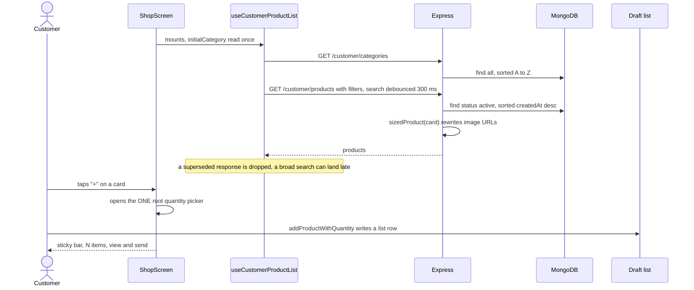

# Catalogue

The shop's products and the categories they sit in. Because prices are never
published, the catalogue is not a price list and not a route to a purchase: it
is a way for a customer to find the name of something and tap "+" to put it on
their grocery list. The shop maintains it from the admin panel; the app reads
it on Home and on the Shop tab, and it also supplies the targets a home banner
can point at.

## Capabilities

- Serves three public endpoints with no authentication at all
  (`routes/customer/product.routes.ts`): `GET /customer/categories`,
  `GET /customer/products` and `GET /customer/products/:id`. Every query is
  pinned to `status: "active"`, so an inactive product is invisible to the
  public.
- Filters products by `category`, `brand`, `color` and `size`, and searches
  `title` with a case-insensitive regex escaped by `escapeRegex`, so `(`, `*`
  and `+` are matched literally.
- Returns one product with up to four other active products from the same
  category, newest first.
- Sizes images on the way out: `sizedProduct(product, "card")` for lists and
  `"detail"` for a product's own page. Only the URL changes; see
  [images](images.md).
- Shows the catalogue in the app through `useCustomerProductList` — a hook, not
  a store, so the filters live and die with the Shop screen. Categories load
  once; products reload whenever the filter, sort or search changes, with
  search debounced 300 ms and superseded responses dropped.
- Draws the Shop screen as a vertical category rail plus a two-column grid
  (`ShopScreen.tsx`), with a sticky "N items in your list — view and send" bar
  when the draft is not empty.
- Puts a product on the grocery list from the card's "+", which opens the
  app's single root quantity picker; the details screen adds with an exact
  quantity.
- Carries unit information for that quantity: `unit`
  (`kg | g | litre | ml | piece | dozen | pack`) and `unitValue`, which decides
  whether "+" writes "10 kg", "1 kg" or "1".
- Lets the shop manage products at `/admin/products`
  (`routes/admin/product.routes.ts`): list any status with an optional `search`,
  create with 1–10 images, update with `existingImages` plus
  `coverImagePublicId`, and delete.
- Validates on the client first (`use-product-form.ts` `validate`) so the
  shopkeeper gets an instant toast rather than a round-trip 400: title,
  description, category, brand, a numeric stock and at least one image. Server
  search on the admin list is debounced 250 ms.
- Manages categories in their own dialog, with an optional image, and refuses
  to delete a category while any product still points at it — the 400 message
  names the count and the dialog shows it verbatim.
- Feeds the banner link picker: choosing a `category` or `product` target runs
  a 300 ms debounced `GET /admin/products?search=` and shows the top eight
  (`banner-edit-dialog.tsx`).
- Supplies Home's four newest active products through `GET /customer/home`.

## Boundary

- Does not appear on a grocery list. A list item is free text with no reference
  to a product document; the catalogue only helps the customer write the name.
  See [grocery lists](grocery-lists.md).
- Does not upload, resize or deliver pictures. It stores a URL and a
  `publicId`; everything about the bytes belongs to [images](images.md).
- Does not sell anything. There is no price on a product document — the two
  checkout routes that look for `price` and `salePercentage` are dead code, and
  belong to [legacy e-commerce](legacy-ecommerce.md).
- Does not own the wishlist. The heart on a product card writes to
  `wishlists`, an inherited collection that is still live; see
  [legacy e-commerce](legacy-ecommerce.md).
- Does not own the banners themselves, only the targets they can point at.
  Banners belong to [admin panel](admin-panel.md) for editing and
  [images](images.md) for delivery.
- Does not check who is asking on the public routes. The admin routes' gate
  belongs to [accounts and auth](accounts-and-auth.md).

## What it needs

| File | What it is |
|---|---|
| [`server/src/models/Product.ts`](../reference/server-models/models-product.md) | Title, category, brand, stock, images, unit, status, indexes |
| [`server/src/models/Category.ts`](../reference/server-models/models-category.md) | Name (bilingual in production) and its image |
| [`server/src/routes/customer/product.routes.ts`](../reference/server-routes-customer/routes-customer-product-routes.md) | The three public reads |
| [`server/src/routes/admin/product.routes.ts`](../reference/server-routes-admin/routes-admin-product-routes.md) | Product and category CRUD, with the multipart uploads |
| [`server/src/routes/customer/home.routes.ts`](../reference/server-routes-customer/routes-customer-home-routes.md) | The Home payload: banners, categories, four newest products, coupons |
| [`server/src/utils/regex.ts`](../reference/server-support/utils-regex.md) | Escapes a search string before it becomes a `$regex` |
| [`server/src/utils/productImages.ts`](../reference/server-support/utils-product-images.md) | `sizedProduct` — the product shape that leaves the server |
| [`mobile/src/features/customer/products/use-customer-collections.ts`](../reference/mobile-features/features-customer-products-use-customer-collections.md) | The Shop screen's data, filters, sort and debounce |
| [`mobile/src/features/customer/products/api.ts`](../reference/mobile-features/features-customer-products-api.md) | The three public calls, with a hand-built escaped query string |
| [`mobile/src/screens/ShopScreen.tsx`](../reference/mobile-screens/screens-shop-screen.md) | The rail, the grid, the sticky bar, the one-shot tab params |
| [`mobile/src/components/ProductCard.tsx`](../reference/mobile-components/components-product-card.md) | One card: memoised, its own wishlist subscription, the "+" |
| [`mobile/src/screens/ProductDetailsScreen.tsx`](../reference/mobile-screens/screens-product-details-screen.md) | Gallery, stock, related products, add to list |
| [`client/src/features/admin/products/use-admin-products.ts`](../reference/admin-features/features-admin-products-use-admin-products.md) | The panel's product and category list, with a 250 ms search |
| [`client/src/features/admin/products/use-product-form.ts`](../reference/admin-features/features-admin-products-use-product-form.md) | Form state, image gate, validation, save and delete |
| [`client/src/components/admin/products/products-table.tsx`](../reference/admin-components/components-admin-products-products-table.md) | The table: cover, title, brand, category, unit, status, stock |
| [`client/src/components/admin/products/category-dialog.tsx`](../reference/admin-components/components-admin-products-category-dialog.md) | Category create, rename, re-image, delete with its guard |

Collections read or written: `products` (read and write), `categories` (read
and write), `users` (read only, as `createdBy` on a new product).

External services called: Cloudinary, for product and category images — through
[images](images.md).

## How it behaves

Rules that are not obvious from the code:

- **The `sort` query parameter does nothing.** It is typed on the customer
  route and then ignored; `sortOption` is hard-coded to `{ createdAt: -1 }`.
  The app's sort chips currently offer only `recent`, which matches.
- **The filter machinery is ahead of the UI.** `brand`, `color` and `size` are
  implemented on both the server and the hook, but no screen exposes them.
  `colors` and `sizes` are apparel leftovers.
- **`/customer/categories` returns raw documents**, including `imagePublicId`
  and `__v`, and its `imageUrl` is **not** CDN-resized — unlike the same
  categories inside `/customer/home`, which are asked for at 200 px.
- **Nothing is paginated.** `GET /customer/products` and `GET /admin/products`
  return every match. With Vercel's roughly 4.5 MB response cap this becomes a
  real limit at a few thousand products.
- **The Shop tab stays mounted** (`freezeOnBlur`), so the hook's initial
  category is read only once; later hand-offs from Home go through
  `startFresh` and then clear their own navigation param.
- **A malformed `category` id is a 500, not a 400.** It reaches Mongoose as a
  `CastError` and the error handler turns anything that is not an `AppError`
  into `Internal server error`.
- **Category names are not unique**, in the schema or the database. Duplicates
  are prevented only by the seed script skipping names it has seen and by the
  shopkeeper not typing one twice.

## Failure modes

**"This category still has N product(s). Move or delete them first."** The
delete guard, working as intended. The count comes from the server and the
dialog shows the message verbatim, so the number is live.

**A product was saved but its picture is missing in the app.** Check whether
the response came from `POST /admin/products` or `PUT`. Create returns the
product **without** `sizedProduct`, so its image URLs come back at full
Cloudinary size, while update returns the `card` variant — the same resource
has two URL shapes depending on the verb. The stored URL is correct either way;
it is the immediate response that differs.

**Editing a product destroys its images and then fails with "Atleast one img
is needed".** The Cloudinary deletes run before the "at least one image" check,
so a request that removes every image deletes the assets and *then* 400s,
leaving the product pointing at dead URLs. Re-upload is the only fix.

**Uploading an eleventh image gives "Internal server error".** The product and
category routes do not wrap multer's own errors, so a `MulterError` is not an
`AppError` and becomes a 500. The banner upload does translate them, which is
why it behaves better.

**Deleting a product leaves its pictures behind.** There is no Cloudinary
clean-up on product or category delete (banners do clean up). The orphans cost
storage quietly. Cart and wishlist rows keep the dangling id and are filtered
out at read time, so nothing visibly breaks.

**The Shop grid is blank after a search.** Neither fetch in
`useCustomerProductList` throws: a failed category load leaves an empty rail
and a failed product load an empty grid, with no error shown. Check the network
before assuming the query matched nothing.

**Images vanish when scrolling back up the grid.** Not a catalogue problem —
`expo-image`'s `transition` blanks a picture whose source changes mid-fade on
Android. `ProductCard` passes no `transition` and sets
`cachePolicy="memory-disk"` and `recyclingKey` for exactly this. See
[images](images.md).

**A product added today does not appear.** It was saved as `inactive`, or the
app is showing a cached Home payload — Home refreshes on focus but is
rate-limited to once a minute and does not blank the screen while it does.
