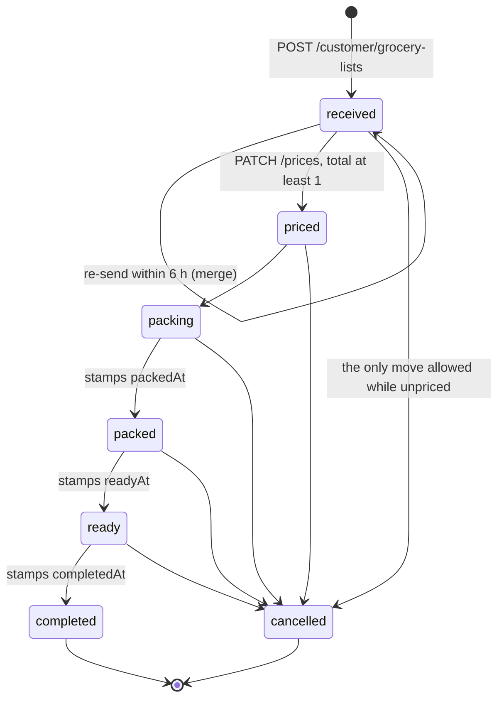

# Grocery lists

The heart of sKirana. A customer writes items and quantities on a paper-styled
list, sends it to the one shop, and waits. The shop prices every line, marks
anything it does not have, and moves the order along until the customer can
collect it. There are no published prices and no checkout: the list *is* the
order, and money changes hands at the counter or over a UPI deep link. This
module owns that object from the first keystroke on the phone to the moment the
shop marks it complete.

## Capabilities

- Keeps an unsent draft on the phone in `useDraftListStore`
  (`draft-list/store.ts`), written to AsyncStorage under
  `draft_grocery_list_rows`, debounced 500 ms, and flushed immediately by an
  `AppState` listener when the app leaves the foreground.
- Grows the paper by itself: every mutation runs `withTrailingBlank`, so there
  is always one blank line and no item limit on the phone. `ensureRows(count)`
  tops it up to fill a tall screen.
- Counts items in exactly one place — `isSendableRow` (a row with a non-empty
  name) and `countSendableRows` back the tab badge, the centre-button badge,
  the Shop sticky bar, the sheet header and Send.
- Adds a catalogue product to the same draft: `addProduct` bumps a leading
  integer quantity and leaves free text like "half kg" alone;
  `addProductWithQuantity` **sets** the quantity outright.
- Restores a saved draft only if at least one row has writing on it
  (`hydrate`); otherwise it starts fresh at `INITIAL_ROWS` = 8.
- Sends through one flow, `useSendDraft`: at least one named row, every name at
  least `MIN_NAME_LEN` = 2 characters, a signed-in account, and a mobile number
  the first time (the `PhonePrompt` sheet). A `useRef` guard, not the store's
  `submitting`, stops a double tap sending twice.
- Accepts the send at `POST /customer/grocery-lists`
  (`routes/customer/grocery-list.routes.ts`), cleaning every field through
  `cleanItems`/`cleanField`: name at most 60 characters, quantity 12, note 300;
  more than 500 raw rows rejected outright; more than
  `MAX_ITEMS_PER_SUBMIT` = 50 surviving rows rejected; rows under two
  characters dropped silently.
- Merges a second send into the order already open: the target must be the same
  customer's list with `status: "received"`, `paymentStatus: "pending"` and
  `updatedAt` inside a six-hour window. The merged list is capped at
  `MAX_ITEMS_PER_LIST` = 100, notes are joined with `" | "`, and the response
  carries `merged: true` with HTTP 200 instead of 201.
- Gives every list a human reference: `code` is the last eight characters of
  `_id`, upper-cased, built by `mapGroceryList` on both the customer and the
  admin side.
- Prices a list at `PATCH /admin/grocery-lists/:listId/prices`. The `items`
  array length must equal the stored item count; only `price` and `rate` are
  read, matched **by array position**; an unavailable line is forced to `0`;
  the computed `totalAmount` must be at least 1.
- Moves a list along at `PATCH /admin/grocery-lists/:listId/status`, whose
  `ALLOWED_STATUSES` are `packing`, `packed`, `ready`, `completed` and
  `cancelled`. `received` and `priced` are not settable there. An unpriced list
  can only be cancelled. `packedAt`, `readyAt` and `completedAt` are stamped
  the first time each is reached.
- Marks one line out of stock at
  `PATCH /admin/grocery-lists/:listId/items/:index/availability`. The line
  stays on the list, its price is forced to zero, and the total is recomputed
  from the available lines only.
- Lets the shop correct or add a line (`PATCH .../items/:index`,
  `POST .../items`) using the same allowlist as the customer's own text. Both
  refuse a `completed` or `cancelled` list.
- Lets the customer remove one line (`PATCH .../:listId/remove-item`) while the
  status is `received` or `priced`, while unpaid, and never down to zero items.
- Carries a chat per list in its own `messages` collection, 1000 characters per
  message, deleted by MongoDB's TTL index 30 days after writing. `ChatSheet`
  polls every 5 s **only while open** and sends optimistically with rollback.
- Settles payment without a gateway: `payAtShop` calls
  `PATCH .../pay-at-shop`; `payViaUpi` builds a `upi://pay?...` link with
  `buildUpiUrl` and hands it to `openUpiPayment`. The shop confirms with
  `PATCH .../mark-paid`, which also rewrites `paymentMethod` from `at_shop`
  to `upi`.
- Drives the unread badge: every shop-side write sets `seenByCustomer: false`;
  `GET /customer/grocery-lists` returns `unseenCount`; the app clears one list
  with `PATCH .../:listId/seen`, and only while the tab is focused.
- Decides what Home leads with: `journeyStage` picks an unsent draft first,
  then any `ready` order, then the newest active order.

## Boundary

- Does not read photographs of paper lists: that belongs to
  [photo reading](photo-reading.md). By the time a list is sent, the photo is
  long gone and only text remains.
- Does not decide who the customer is, or who may price a list: that belongs to
  [accounts and auth](accounts-and-auth.md).
- Does not own products. A list item is free text and holds no reference to a
  product document; the catalogue only feeds the "add to list" button. That
  belongs to [catalogue](catalogue.md).
- Does not deliver notifications. This module decides *when* the shop and the
  customer should be told; how a message reaches a phone, a browser or Telegram
  belongs to [notifications](notifications.md).
- Does not draw the shop's screen. Polling, the status tabs, the amount
  matcher, the price drafts, the packing checklist and Share belong to
  [admin panel](admin-panel.md); this module owns the rules those controls
  obey.
- Does not own the sheet, the navigator or the translations the list screens sit
  in: that belongs to [mobile shell](mobile-shell.md).
- Does not touch the `orders`, `carts` or `promos` collections. Nothing here
  reads or writes them; see [legacy e-commerce](legacy-ecommerce.md).
- The online-card path (`POST .../pay-online`, `POST .../confirm-payment`) is
  part of this router but no shipped client calls it — grepping `mobile/src`
  and `client/src` finds no reference. Treat it as live but unused.

## What it needs

| File | What it is |
|---|---|
| [`server/src/models/GroceryList.ts`](../reference/server-models/models-grocery-list.md) | The order document: items, totals, status, payment, timestamps |
| [`server/src/models/Message.ts`](../reference/server-models/models-message.md) | One chat message, with the 30-day TTL index |
| [`server/src/routes/customer/grocery-list.routes.ts`](../reference/server-routes-customer/routes-customer-grocery-list-routes.md) | Send, read back, mark seen, remove an item, pay, chat |
| [`server/src/routes/admin/grocery-list.routes.ts`](../reference/server-routes-admin/routes-admin-grocery-list-routes.md) | Price, advance, mark paid, availability, edit and add lines, reply |
| [`server/src/utils/sanitizeItem.ts`](../reference/server-support/utils-sanitize-item.md) | The allowlist and every length cap the list obeys |
| [`server/src/utils/phone.ts`](../reference/server-support/utils-phone.md) | Normalises the mobile number captured at the first send |
| [`mobile/src/features/customer/draft-list/store.ts`](../reference/mobile-features/features-customer-draft-list-store.md) | The unsent list, and the only persisted state in the app |
| [`mobile/src/features/customer/draft-list/use-send-draft.ts`](../reference/mobile-features/features-customer-draft-list-use-send-draft.md) | The one send flow, shared by both Send buttons |
| [`mobile/src/features/customer/grocery-list/store.ts`](../reference/mobile-features/features-customer-grocery-list-store.md) | Sent lists, unseen count, UPI details, pay actions |
| [`mobile/src/features/customer/grocery-list/api.ts`](../reference/mobile-features/features-customer-grocery-list-api.md) | Every call the list screens make |
| [`mobile/src/features/customer/grocery-list/journey-stage.ts`](../reference/mobile-features/features-customer-grocery-list-journey-stage.md) | Which stage the Home card shows |
| [`mobile/src/components/GroceryListEditor.tsx`](../reference/mobile-components/components-grocery-list-editor.md) | The paper itself: rows, Next-key order, scroll-into-view maths |
| [`mobile/src/components/SendListButton.tsx`](../reference/mobile-components/components-send-list-button.md) | Both shapes of Send, and the phone prompt they own |
| [`mobile/src/components/ChatSheet.tsx`](../reference/mobile-components/components-chat-sheet.md) | Per-order chat, polled while open |
| [`mobile/src/lib/upi.ts`](../reference/mobile-lib/lib-upi.md) | The `upi://pay` deep link, and why `canOpenURL` is not consulted |
| [`client/src/components/admin/grocery-lists/grocery-list-card.tsx`](../reference/admin-components/components-admin-grocery-lists-grocery-list-card.md) | One order on the shop's screen: pricing, flow buttons, chat |
| [`client/src/features/admin/grocery-lists/api.ts`](../reference/admin-features/features-admin-grocery-lists-api.md) | The ten admin calls for lists and chat |

Collections read or written: `grocerylists` (read and write), `messages` (read
and write), `users` (read; `phone` written at the first send).

External services called: Expo push for the customer, Firebase Cloud Messaging
for the shop's browser and Telegram for the shop's phone — all through
[notifications](notifications.md). Razorpay is reached only by the unused
online-payment routes.

## How it behaves

```mermaid
sequenceDiagram
    actor C as Customer
    participant D as useDraftListStore
    participant S as useSendDraft
    participant API as Express
    participant DB as MongoDB
    participant K as Shopkeeper

    C->>D: types items; rows persist after 500 ms
    C->>S: taps Send
    S->>S: at least one named row, every name 2+ chars
    S->>API: POST /customer/grocery-lists
    API->>API: cleanItems, caps 60 / 12 / 300, drops short names
    API->>DB: find received + pending list touched under 6 h ago
    alt a recent unpriced list exists
        API->>DB: append items, cap at 100, join notes
        API-->>S: 200, merged true
    else none
        API->>DB: create list, status received, total 0
        API-->>S: 201, merged false
    end
    S->>D: clearDraft, close the sheet, go to Lists
    K->>API: PATCH /admin/grocery-lists/:id/prices
    API->>API: item count must match, unavailable lines forced to 0
    API->>DB: status priced, pricedAt, seenByCustomer false
    API-->>C: Expo push, your list is priced
    K->>API: PATCH .../status, packing then packed then ready
    C->>API: PATCH .../pay-at-shop, or opens a upi link
    K->>API: PATCH .../mark-paid
```



Rules the code does not make obvious:

- **The arrows above are intent, not enforcement.** The status route accepts
  any of its five values from any state; the only guard is a total of at least
  1 unless you are cancelling. A list can jump from `packing` to `completed`.
- **There is no route back to `received` or `priced` through the status
  route** — but pricing again does set `priced` unconditionally, which is how a
  packed order falls backwards (see Failure modes).
- **The customer's words are the source of truth.** The pricing route declares
  `name` and `quantity` on its incoming items and then ignores both.
- **An out-of-stock line is not deleted.** It stays visible so the customer can
  see it was asked for, priced at zero and excluded from the total.
- **The merge window is measured from `updatedAt`**, which is why the admin
  list sorts by `updatedAt` rather than `createdAt`: a list that absorbed a
  merge bubbles to the top. No index covers that sort.
- **`totalItems` is a cached copy of `items.length`,** kept in step by hand on
  every add and remove. Where an old record disagrees, trust `items.length`.
- **Notifications are awaited, not fired and forgotten,** because Vercel
  freezes the function the moment the response is written. None of them can
  throw, so none can fail the request.
- **A customer removing an item tells the shop nothing** — no push, no
  Telegram. The shopkeeper finds out on their next 15-second poll.

## Failure modes

**"I sent two lists and the shop only sees one."** Correct behaviour, not a
bug. The second send landed inside the six-hour window and was appended. The
response said `merged: true` and the app said "added to your list". Check
`updatedAt` on the list, and the `" | "` in `note` — a merged note is two notes
joined.

**"This list already has too many items (max 100)."** Repeated sends into one
six-hour window hit `MAX_ITEMS_PER_LIST`. The customer cannot clear it
themselves: the shop must price or cancel the open list, which ends the merge
window, or the customer waits six hours.

**An item the customer typed is missing from the order.** Two silent drops
explain almost all of these. A name under two characters after cleaning is
dropped by `cleanItems` without an error, and any character outside the grocery
allowlist is stripped first — so a name written entirely in blocked characters
becomes empty and disappears. `useSendDraft` catches the short-name case on the
phone and names the offending row, so a missing item usually means an older
build, or text that the allowlist removed.

**The shopkeeper presses "Update prices" and the order jumps back to
`priced`.** The pricing route sets `status = "priced"` unconditionally, and the
admin button stays enabled for any list that is not closed. The flow buttons
reset and the customer gets a second "your list is priced" push. Compare
`pricedAt` with `packedAt` to confirm.

**"Total must be greater than 0" when pricing.** Every line was priced at zero,
or every line is marked unavailable. The route refuses a list whose computed
total is below 1, and the status route then refuses to move it anywhere but
`cancelled`.

**"Item count does not match the customer's list."** The shop's page is stale:
the customer removed an item, or another browser added one, since the card was
drawn. The prices array is matched by position and must be exactly as long as
the stored list. A refresh fixes it, and the price drafts in the hook are lost
with it.

**Chat on an old order is empty.** The TTL index on `messages` is a hard delete
performed by MongoDB itself — no cron, no code, no audit trail. Anything older
than 30 days is gone while the list it belonged to remains. The same expiry is
why a conversation disappears from the admin Messages page.

**A customer paid over UPI and the order still says unpaid.** There is no
callback and no reconciliation: `payViaUpi` opens someone else's app and
changes no state at all. Only `PATCH .../mark-paid` moves `paymentStatus`. The
amount matcher on the admin page exists for exactly this.

**"Internal server error" on a list URL.** A malformed `listId` reaches
Mongoose as a `CastError`, which the error handler turns into a 500 rather than
a 404. Check the id in the request path before reading further into the logs.

**The unread badge clears without the customer seeing anything.**
`freezeOnBlur` keeps the Lists tab mounted, so a background card would mark
lists seen. The guard is `useIsFocused` in `MyListsScreen.tsx`; a new card
added without it will clear the badge silently again.
