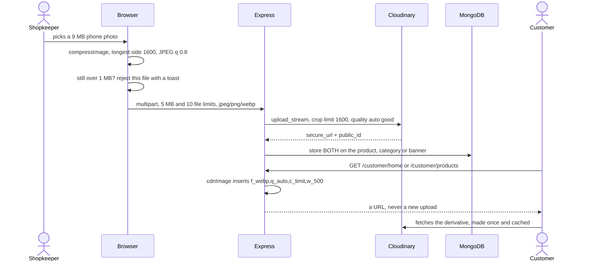

# Images

Every picture in the shop: the product photos and category icons the shopkeeper
uploads, and the banner strip at the top of the app's Home screen. The database
stores one original per picture and the *delivery URL* is rewritten per request,
so the same upload is served small in a grid, larger on a product page and
full-width as a banner — without a second upload or a migration. This matters
commercially: the shop runs on Cloudinary's free tier, where bandwidth is the
metered resource.

## Capabilities

- Shrinks a picture in the shopkeeper's browser before it reaches the network
  (`client/src/lib/image.ts` `compressImage`): `createImageBitmap` onto a
  canvas, longest side capped at `MAX_DIMENSION` = 1600 px, re-encoded as JPEG
  at `JPEG_QUALITY` = 0.8, extension rewritten to `.jpg`.
- Keeps the original whenever compression would make it bigger, and returns the
  original file rather than throwing on any failure — a format the browser
  cannot decode, no 2D context, `toBlob` producing nothing. Non-images and GIFs
  are passed through untouched.
- Applies a hard gate after compression: `MAX_IMAGE_BYTES` = 1 MB. A product
  image over it is rejected per file with a toast and the rest are still
  accepted; a category image over it is rejected inline and cleared.
- Accepts uploads server-side through `multer.memoryStorage` — nothing touches
  disk, which matters on a read-only serverless filesystem. Products and
  categories: 5 MB per file, at most 10 files, JPEG/PNG/WebP only, checked on
  the declared MIME type. Banners: the same limits, with multer's errors
  translated into clean 400s.
- Caps what is *stored*: `uploadSingleBufferToCloudinary` applies
  `MAX_STORED_DIMENSION` = 1600 with `crop: "limit"` (only ever shrinks) and
  `quality: "auto:good"`. What comes back is therefore never byte-identical to
  what the shopkeeper chose.
- Files uploads into three Cloudinary folders:
  `ecommerce-monster-video/products`, `.../categories` and `.../banners`.
- Stores both the `secure_url` and the `public_id`. The id is the only handle
  that can later delete the picture.
- Rewrites the delivery URL per request with `cdnImage(url, variant)`, which
  inserts `f_webp,q_auto,c_limit,w_<width>` straight after `/image/upload/`.
  The four variants are `thumb` 200 px (category chips), `card` 500 px (product
  grid and home rails), `detail` 900 px (a product's own page) and `banner`
  1200 px.
- Leaves two kinds of URL untouched: anything that is not a Cloudinary upload,
  and anything that already carries an `f_auto` or `f_webp` transformation — so
  calling it twice is harmless.
- Deletes best-effort with `deleteFromCloudinary`, which destroys every id in
  parallel and swallows each failure, so a failed clean-up never blocks the
  shopkeeper's save.
- Shows images in the app through `expo-image` with `cachePolicy="memory-disk"`
  and a `recyclingKey`, and deliberately **no** `transition` on list cells.
- Validates banner uploads in the browser before sending
  (`banner-uploader.tsx`): wrong type or over 5 MB is a blocking error; the
  wrong aspect ratio or a width under 1000 px is only a warning, because the
  app crops to fit. The target shape is 1600 × 736.

## Boundary

- Does not decide *which* picture is shown. The cover image, the gallery order
  and the category rail belong to [catalogue](catalogue.md); the banner
  carousel's contents, order and schedule belong to
  [admin panel](admin-panel.md).
- Does not handle photographs of grocery lists. Those never reach Cloudinary
  and are never stored; see [photo reading](photo-reading.md).
- Does not own the admin file pickers as UI. The dialogs and the
  `capture="environment"` camera button belong to
  [admin panel](admin-panel.md); this module owns what happens to the bytes.
- Does not serve images itself. Cloudinary does; the server only writes the
  URL.
- Does not authenticate an upload. `requireAdmin` belongs to
  [accounts and auth](accounts-and-auth.md).

## What it needs

| File | What it is |
|---|---|
| [`server/src/utils/cloudinary.ts`](../reference/server-support/utils-cloudinary.md) | Upload, the 1600 px store cap, `cdnImage`, delete |
| [`server/src/utils/productImages.ts`](../reference/server-support/utils-product-images.md) | `sizedProduct` — rewrites a product's image URLs for the wire |
| [`server/src/routes/admin/product.routes.ts`](../reference/server-routes-admin/routes-admin-product-routes.md) | The product and category multipart uploads and their multer limits |
| [`server/src/routes/admin/settings.routes.ts`](../reference/server-routes-admin/routes-admin-settings-routes.md) | The banner upload, and the only delete that also removes the asset |
| [`server/src/routes/customer/home.routes.ts`](../reference/server-routes-customer/routes-customer-home-routes.md) | Where `thumb`, `card` and `banner` variants are chosen |
| [`client/src/lib/image.ts`](../reference/admin-lib/lib-image.md) | Browser-side compression and the 1 MB gate |
| [`client/src/components/admin/products/image-picker.tsx`](../reference/admin-components/components-admin-products-image-picker.md) | Gallery or rear camera, with object URLs revoked on unmount |
| [`client/src/components/admin/settings/banner-uploader.tsx`](../reference/admin-components/components-admin-settings-banner-uploader.md) | Drag and drop, type and size errors, shape warnings |
| [`mobile/src/components/ProductCard.tsx`](../reference/mobile-components/components-product-card.md) | The load-bearing `expo-image` props |
| [`mobile/src/components/BannerCarousel.tsx`](../reference/mobile-components/components-banner-carousel.md) | Drops a banner whose image fails, and retries on the next fetch |

Collections read or written: `products.images[]` (`url`, `publicId`,
`isCover`), `categories.imageUrl` / `imagePublicId`, `banners.imageUrl` /
`imagePublicId`.

External services called: Cloudinary, cloud `dnlqyxhpg`, configured by
`CLOUDINARY_CLOUD_NAME`, `CLOUDINARY_API_KEY` and `CLOUDINARY_API_SECRET`.
Missing values do **not** stop the server booting — uploads simply fail when
first attempted.

## How it behaves

Rules that are not obvious from the code:

- **`f_webp` is named outright rather than left to `f_auto`, and that is the
  point.** `f_auto` picks the format from the browser's `Accept` header — and
  the app is not a browser. Measured on a real product picture, the app's HTTP
  clients (OkHttp/Glide on Android, SDWebImage on iOS) send no WebP in
  `Accept`, so Cloudinary fell back to JPEG and served 33.7 KB where WebP is
  22.8 KB. A third of the bytes, wasted, on every card.
- **There is deliberately no `dpr_auto`.** It would make a separate derivative
  per screen density, tripling the transformations billed for one picture. The
  variant widths are already generous enough for a 2× screen.
- **`card` is 500 px, not 400.** A card is about 163–188 dp wide in a
  two-column grid and Android phones run at 2.6–3×, so roughly 490 real pixels;
  400 was visibly soft on a 1080p screen, and in WebP the extra width costs
  about what the old JPEG did.
- **The database is the source of truth; only the address changes.** Sizes can
  be re-tuned without touching a single record.
- **The client-side compression is best-effort, never a guarantee.** All three
  fallback paths return an uncompressed file, GIFs bypass it entirely, and it
  always re-encodes to lossy JPEG — a PNG loses its transparency.
- **Banners do not go through the compressor at all.** `BannerUploader`
  validates but does not compress; the 5 MB server limit is what bounds them.
- **`expo-image` defaults to a disk-only cache.** Without
  `cachePolicy="memory-disk"` every picture is re-read and re-decoded from
  storage each time it scrolls back into view, which is what made the grid feel
  slow on a cheap phone.

## Failure modes

**"Network Error" when the shopkeeper uploads from a phone.** A phone-camera
photo is often 3–12 MB, which passes the platform's roughly 4.5 MB request-body
limit only after compression. When the edge rejects it, the 413 carries no CORS
headers, so the browser reports a bare "Network Error" with no status. This is
the exact problem `client/src/lib/image.ts` exists to solve; if it fails open
(an undecodable format, a missing `createImageBitmap`), the original goes up
and the upload dies at the edge.

**A picture looks soft or over-compressed.** It has been shrunk twice: once in
the browser to 1600 px at JPEG 0.8, then again by Cloudinary to a 1600 px box
at `auto:good`, then delivered as WebP at `q_auto`. Nothing enlarges, so a
small original stays small.

**A picture is blank in the app's grid but fine on the product page.** The
Android `expo-image` bug: a cross-fade still running when the source changes
leaves the picture blank (expo/expo#35664, fixed in expo-image 56.0.11; SDK 54
pins 3.0.11). Do not add `transition` to a list cell. Other screens still use
`transition={150…200}` on images that are not in a recycling list.

**A recycled cell briefly shows the previous product's photo.** `recyclingKey`
is missing on that image.

**Cloudinary storage grows and nobody knows why.** Three known leaks: replacing
a category image does not delete the old asset, deleting a product does not
delete its images, and a failed multi-image upload leaves the successful ones
unreferenced (`Promise.all` rejects the batch). Banner delete is the one path
that does clean up, best-effort.

**The shop hits its Cloudinary credits.** One credit is roughly 1 GB of
bandwidth or 1,000 transformations on the free plan. The variant scheme keeps
both down; a change that adds a width, or that serves originals, multiplies
transformations rather than bandwidth. Check what widths appear in the served
URLs before assuming traffic grew.

**A banner image 404s in the app.** `BannerCarousel` drops a banner whose image
fails to load and retries it on the next fetch, so a broken banner is invisible
rather than an error. Check the stored `imageUrl` directly.

**An uploaded file of the wrong type reaches Cloudinary.** The MIME check reads
the client-declared `file.mimetype`, with no magic-byte sniffing, on every
upload path including banners. A renamed file with a forged content type gets
through to Cloudinary, which then refuses it — the shopkeeper sees a 500.
