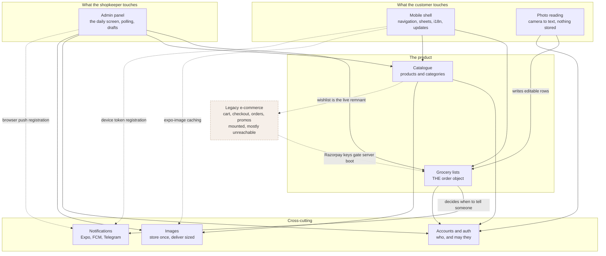

# Modules

sKirana split into nine parts, each with a clear edge. The split is by *what a
part is responsible for*, not by which package it lives in — the heart of the
product spans the mobile app, the server and the shop's panel, and saying so is
more useful than three separate tours. Each page names the capabilities, the
boundary that keeps it from overlapping its neighbours, the files it is made
of, the behaviour that is not obvious from the code, and what goes wrong in
production.

Read [The system](../explain/system.md) first for the shape of the whole
thing. These pages assume it.

| Module | What it is responsible for |
|---|---|
| [Grocery lists](grocery-lists.md) | The order itself: writing a list, sending it, the six-hour merge, pricing, the status flow, chat, payment and collection |
| [Photo reading](photo-reading.md) | Turning a photograph of a handwritten list into editable text, and throwing the photo away |
| [Accounts and auth](accounts-and-auth.md) | Clerk sign-in, the database user record and its re-linking, admin rights, and pending sessions |
| [Catalogue](catalogue.md) | Products, categories, search, the app's Shop screen and the shop's product pages |
| [Images](images.md) | Upload, the 1600 px store cap, per-request delivery sizing, and image caching in the app |
| [Notifications](notifications.md) | Expo push to customers, Firebase web push to the shop, Telegram alerts, and token lifecycle |
| [Admin panel](admin-panel.md) | The shop's daily screen and the rest of the panel: polling, price drafts, the packing checklist, sharing |
| [Mobile shell](mobile-shell.md) | Navigation, the one bottom sheet, the two languages, the update prompts, splash and language gate |
| [Legacy e-commerce](legacy-ecommerce.md) | The inherited cart, checkout, orders and promos — what is live, what is dead, the evidence, and why not to extend it |

## How they relate

Solid arrows are live dependencies. Dashed arrows are weaker ties: a shared
library, a registration path, or an inherited remnant.

## Where the boundaries actually sit

Three splits are easy to get wrong, so they are stated once here and repeated
on the pages themselves:

- **Grocery lists versus admin panel.** The rules — what pricing may do, which
  status changes are allowed, what closes a list — live on the server and
  belong to grocery lists. The screen that invokes them, its 15-second poll,
  its price drafts, its packing checklist and its Share button belong to the
  admin panel.
- **Grocery lists versus notifications.** Grocery lists decides *that* the
  customer should be told their order is priced, and what the sentence says.
  Notifications is the delivery: Expo, FCM, Telegram, and the tokens.
- **Photo reading versus images.** They never meet. A list photograph is held
  in memory for one request and discarded; nothing about it reaches Cloudinary
  or the database. Images is about pictures the shop *keeps*.

## A note on the reference links

Each page's "What it needs" table links its files into the code reference at
`../reference/<group>/<file>.md` — groups such as `server-routes-customer`,
`server-support`, `mobile-features`, `mobile-lib`, `admin-components` and
`admin-pages`. That reference is generated from the TSDoc comments in the
source — see [Code reference](../reference/index.md) for how it is built.

Two files are named without a link, because the reference has no page for
them: `client/public/firebase-messaging-sw.js`, which is plain JavaScript, and
the dead customer storefront under `client/src/**/customer/**`, which
`client/typedoc.json` excludes.
