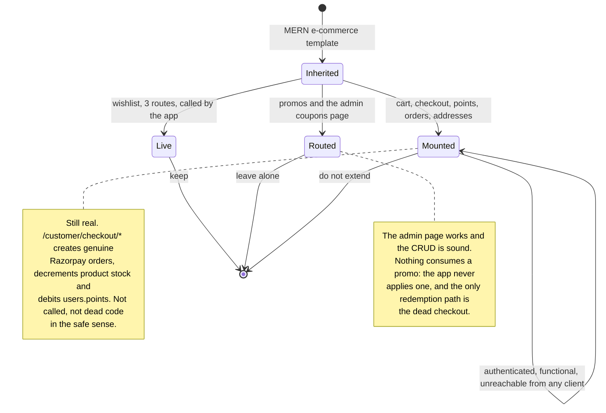

# Legacy e-commerce

sKirana grew out of a generic MERN e-commerce template, and a working cart,
Razorpay checkout, promo codes, an order collection and a delivery-address book
are all still on disk, still compiled, still mounted and still authenticated.
Almost none of it is reachable from any shipped client, because the product it
became has no checkout at all. One piece is genuinely live — the wishlist. This
page exists so that nobody mistakes the rest for load-bearing code, and so that
nobody extends it.

## Capabilities

What still works if you call it directly:

- A per-user cart with variant-aware lines (`carts`, unique on `user`; identity
  of a line is `(product, color, size)`): `GET /customer/cart`,
  `POST /customer/cart/items`, increase, decrease, delete and
  `POST /customer/cart/sync`.
- A Razorpay checkout: `POST /customer/checkout/create-session` prices the cart
  server-side, validates a promo, creates a Razorpay order and an `orders`
  document; `POST /customer/checkout/confirm` verifies an HMAC-SHA256 signature,
  decrements stock conditionally (`stock: {$gte: qty}`, so two checkouts cannot
  oversell), decrements the promo and empties the cart.
- A points checkout: `GET /customer/checkout/points` and
  `POST /customer/checkout/pay-with-points`, which debits `users.points`
  conditionally and credits them back in a `catch` if a later step throws — the
  closest thing to a transaction in the codebase.
- Orders: `GET /customer/orders`, `PATCH /customer/orders/:orderId/return`
  (only a `delivered` order, only within 7 days of `deliveredAt`, restores
  stock and credits `users.points` by the full total), plus the admin twins
  `GET /admin/orders` and `PATCH /admin/orders/:orderId/status`.
- Promo codes: `promos` with a unique `code`, a percentage, a remaining `count`
  and a window; validated by `POST /customer/promos/apply`, redeemed at
  checkout with `$inc: { count: -1 }`, and fully editable at `/admin/coupons`.
- A delivery address book embedded on `users`, with four routes under
  `/customer/addresses`.
- **The wishlist, which is live.** `wishlists` (unique on `user`, a flat array
  of product ids) is read and written by the mobile app: the heart on a product
  card and on the details screen call `GET /customer/wishlist`,
  `POST /customer/wishlist/items` and `DELETE /customer/wishlist/items/:id`,
  and the Wishlist screen lists them.

## Boundary

- Does not carry any real order. The order object is the grocery list; see
  [grocery lists](grocery-lists.md). The admin dashboard counts grocery lists,
  not `orders` — the server comment says "Orders are grocery lists now".
- Does not own products or stock as a concept. The catalogue is live and
  belongs to [catalogue](catalogue.md); these routes only read and decrement
  it.
- Does not own the wishlist's *presentation*. The heart on a card and the
  Wishlist screen belong to [catalogue](catalogue.md) and
  [mobile shell](mobile-shell.md); this page records only that the collection
  and its three routes are inherited and live.
- Does not include the grocery list's own payment routes. `pay-at-shop`,
  `mark-paid` and the UPI deep link are current design and belong to [grocery
  lists](grocery-lists.md), even though the unused
  `pay-online`/`confirm-payment` pair on that same router shares Razorpay with
  this module.
- Does not include `/admin/coupons` as a *page*. That page is routed and works;
  see [admin panel](admin-panel.md). It is the lack of any consumer that puts
  promos here.

## What it needs

| File | What it is |
|---|---|
| [`server/src/models/Cart.ts`](../reference/server-models/models-cart.md) | One cart per user, variant-aware lines |
| [`server/src/models/Order.ts`](../reference/server-models/models-order.md) | The classic cart-to-delivery order |
| [`server/src/models/Promo.ts`](../reference/server-models/models-promo.md) | Discount codes |
| [`server/src/models/Wishlist.ts`](../reference/server-models/models-wishlist.md) | **Live** — saved products, one document per user |
| [`server/src/routes/customer/cart-wishlist.routes.ts`](../reference/server-routes-customer/routes-customer-cart-wishlist-routes.md) | Cart (dead) and wishlist (live) in one router |
| [`server/src/routes/customer/checkout.routes.ts`](../reference/server-routes-customer/routes-customer-checkout-routes.md) | Razorpay cart checkout |
| [`server/src/routes/customer/checkout-with-points.routes.ts`](../reference/server-routes-customer/routes-customer-checkout-with-points-routes.md) | Paying entirely from `users.points` |
| [`server/src/routes/customer/orders.routes.ts`](../reference/server-routes-customer/routes-customer-orders-routes.md) | A customer's orders and the 7-day return |
| [`server/src/routes/admin/orders.routes.ts`](../reference/server-routes-admin/routes-admin-orders-routes.md) | The admin order list and status change |
| [`server/src/routes/customer/promo.routes.ts`](../reference/server-routes-customer/routes-customer-promo-routes.md) | Validating a promo code |
| [`server/src/routes/admin/promo.routes.ts`](../reference/server-routes-admin/routes-admin-promo-routes.md) | Promo CRUD — the live admin page's backend |
| [`server/src/routes/customer/address.routes.ts`](../reference/server-routes-customer/routes-customer-address-routes.md) | The delivery address book |
| [`server/src/utils/razorpay.ts`](../reference/server-support/utils-razorpay.md) | The shared client — and the reason the server needs its keys to boot |
| [`client/src/pages/admin/Orders.tsx`](../reference/admin-pages/pages-admin-orders.md) | A complete admin order table that no route renders |
| [`client/src/features/admin/orders/store.ts`](../reference/admin-features/features-admin-orders-store.md) | Its store, with the app's only per-row optimistic update |
| `client/src/features/customer/**`, `client/src/pages/customer/**`, `client/src/components/customer/**` | The whole customer storefront: cart drawer, checkout, navbars, product pages. Excluded from the generated reference by `client/typedoc.json`, so these have no page |

Collections read or written: `carts`, `orders`, `promos`, `wishlists`,
`users.addresses`, `users.points`, and `products.stock` on checkout and
return.

External services called: Razorpay, for order creation and signature
verification.

## How it behaves

### The evidence

Seven independent checks, all repeatable:

1. **The web router reaches no customer page.** `client/src/router.tsx` lists
   `/`, `/privacy`, `/terms`, `/delete-account`, `/sign-in/*`, `/sign-up/*` and
   `/admin/*`, and nothing else. `CustomerLayout.tsx` is exported and imported
   by nothing.
2. **The mobile app calls a short, closed set of endpoints.** Grepping
   `mobile/src` for quoted paths yields exactly `/app-version`, `/auth/me`,
   `/auth/sync`, `/customer/categories`, `/customer/home`,
   `/customer/profile`, `/customer/push-token`, `/customer/grocery-lists`,
   `/customer/grocery-lists/read-photo`, `/customer/wishlist` and
   `/customer/wishlist/items`; `features/customer/products/api.ts` adds
   `/customer/products` and `/customer/products/:id`, built as template
   strings. No cart, no checkout, no addresses, no promos, no orders.
3. **`Orders.tsx` has no route and no sidebar entry.** It is complete and it
   typechecks; `client/src/components/admin/common/sidebar.tsx` lists six
   entries and orders is not one of them.
4. **The dashboard counts grocery lists.** `routes/admin/dashboard.routes.ts`
   computes `totalOrders`, `pendingOrders`, `completedOrders` and `totalSales`
   from `grocerylists`.
5. **Product prices do not exist.** Both checkout routes price a cart from
   `price` and `salePercentage`; neither field is in `models/Product.ts`, and
   DATA-MODEL.md records that neither is present on any of the 84 live product
   documents. The computed subtotal is therefore `NaN`.
6. **The live counts agree.** As of the 2026-09-19 read recorded in
   DATA-MODEL.md: 1 order, 2 carts, 3 promos, 4 wishlists — against 130 grocery
   lists.
7. **The mobile app receives coupons and never shows them.**
   `GET /customer/home` returns four live coupons, `CustomerHomeData` types
   them and the home store initialises `coupons: []` — but no component reads
   the field. This resolves the "[unverified]" mark in ADMIN-WEB.md § 1: the
   app does not apply promo codes.

### Rules that are not obvious from the code

- **Razorpay gates the whole server's boot.** `utils/razorpay.ts` throws at
  import when `RAZORPAY_KEY_ID` or `RAZORPAY_KEY_SECRET` is missing, so an
  unused feature can stop the server starting.
- **The mounting order in `server.ts` puts these routers on `/customer`
  alongside the live ones**, so they are indistinguishable from the outside.
  Anyone with a valid customer token can still call them.
- **`orders.paymentStatus` has a `failed` value that nothing ever writes.**
- **The promo `count` schema says `min: 1`, but redemption uses `updateOne`
  with `$inc`,** which runs no validators. `count: 0` in the database is the
  intended "used up" state; `count: { $gt: 0 }` is the real gate.
- **Nothing deletes a `Cart`, `Order` or `Wishlist`.** The only deletes in the
  whole server are category, product, promo and banner.
- **A deleted product leaves dangling ids** in carts, wishlists and orders.
  `populate` yields `null` and the row is dropped at read time, so nothing
  visibly breaks.
- **`customlists` exists in the database with 0 documents, no model and no
  reference anywhere in the repo.** Origin unverified; safe to ignore.

### Do not extend this

If a feature needs a cart, a coupon or a delivery order, that is a product
decision, not a refactor. Reviving this code means fixing the defects listed
below first, and every one of them is in a path no test and no client
exercises. The wishlist is the exception: it is live, it is small, and it
belongs with the catalogue.

## Failure modes

These are the known defects, recorded so nobody rediscovers them the hard way.
Nothing here has been changed.

**Adding the first cart row twice duplicates it.** `cart-wishlist.routes.ts`
tests `if (itemIndex > 0)` where every comparable check uses `>= 0`, so
re-adding the product at index 0 falls into the `else` branch and pushes a
second identical row. `carts.items` can therefore hold two rows with the same
`(product, color, size)`.

**`POST /customer/cart/sync` cannot work as written.** With no existing cart it
calls `cart.create(...)` on the `null` it has just tested for — a `TypeError`,
so a 500. And `await cart.save` and `res.json(...)` both sit **inside** the
per-item loop: a two-item sync writes the response twice
(`ERR_HTTP_HEADERS_SENT`), and an empty `items` array writes no response at all
until the client times out.

**Checkout is not transactional.** `/checkout/confirm` decrements stock item by
item and throws mid-loop on the first shortfall, leaving earlier items
decremented and the order still `pending`. `pay-with-points` refunds the points
on failure but not the stock.

**The points pre-check is dead.** `pay-with-points` selects
`"name email addresses"` and then reads `foundUser.points`, which is
`undefined`, so `totalAmount > undefined` is always false. The atomic
`updateOne({ points: { $gte: totalAmount } })` still protects the balance, so
the outcome is correct — only the friendly 400 is unreachable.

**Two promo validation messages are wrong.** "Percentage must be between 1 and
10" guards a 1–100 range, and "Promo count must be atleast 0 or more" is
actually the `minimumOrderValue` message.

**`/customer/home` sorts coupons by a field that does not exist.** It sorts by
`createAt` (missing "e"); the schema field is `createdAt`. Which four coupons
come back is unspecified. The same typo appears as an output key on
`recentProducts`.

**A returned order credits points twice as generously as expected.** The
customer's own return credits `users.points` by the **full `totalAmount`**; the
admin's `PATCH /admin/orders/:id/status` to `returned` restores stock but
credits nothing. Two paths, two outcomes, no notification from either.

**A delivery address has no length limit and no sanitiser.** The four address
fields are checked only for being non-empty.
