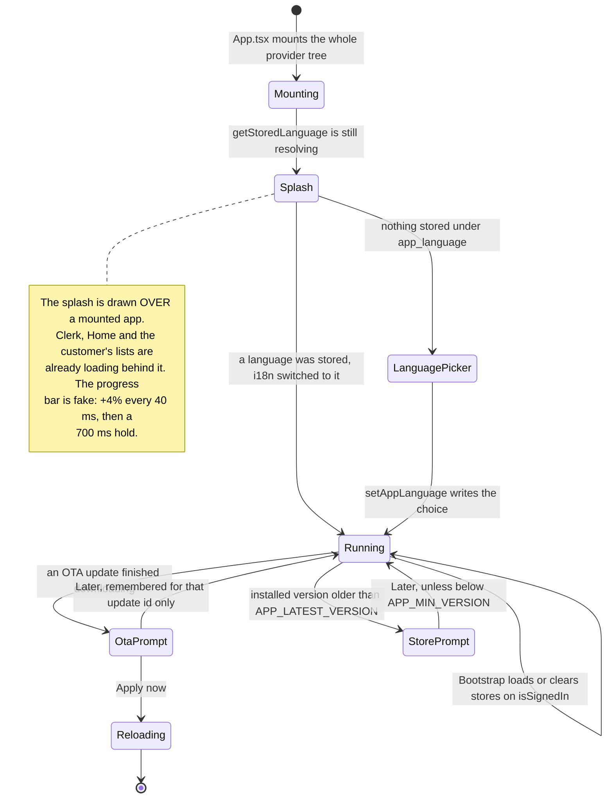

# Mobile shell

Everything the customer's app is made of that is not a feature: the provider
tree, the navigator, the one bottom sheet every panel is built from, the two
languages, the toaster, and the prompts that ask the customer to update. It is
the furniture the grocery list sits in — and several pieces of it are
hand-written rather than borrowed, for reasons that are load-bearing and should
not be "simplified".

## Capabilities

- Mounts a provider tree whose order matters (`mobile/App.tsx`):
  `GestureHandlerRootView` → `ClerkProvider` (SecureStore token cache) →
  `SafeAreaProvider` → `NavigationContainer` → `PortalProvider`, with the
  navigator, the list sheet, the quantity-sheet host and both update prompts
  inside it, and the `Toaster` outside it.
- Puts `PortalProvider` **inside** `NavigationContainer`, because sheet
  contents are ordinary screen code that calls `useNavigation` — Send inside
  the list sheet navigates to the Lists tab. Outside the container that call
  throws and takes the tree down.
- Puts `Toaster` **outside** the portal, so a message the customer must read is
  not drawn behind an open sheet.
- Runs startup work in a `<Bootstrap/>` component that renders `null`, so
  Clerk loading and a list arriving re-render one empty node rather than the
  whole provider tree.
- Hydrates the draft list unconditionally, and loads or clears the lists,
  wishlist and profile on Clerk's `isSignedIn` — which is what stops a shared
  phone leaking the previous customer's data.
- Navigates with a native stack (`RootNavigator`: `Tabs`, `ProductDetails`,
  `Wishlist`, `SignIn` as a modal, `Legal`) over bottom tabs (`TabNavigator`:
  `Home`, `Shop`, `Lists`, `Account`) drawn by a custom bar with a centre
  button that opens the list sheet.
- Has **no route guard**. Each surface decides for itself: the Lists and
  Account tabs render `<AuthView>` in place of their content when signed out,
  the Wishlist screen shows an empty state instead, and sending a list toasts,
  closes the sheet and navigates to `SignIn`.
- Uses one-shot tab params as hand-offs — `category`, `openSearch`,
  `browseAll`, `tab` — each cleared by the receiving screen once applied, so
  tapping the same shortcut twice works.
- Keeps off-screen tabs mounted with `freezeOnBlur: true`: they stop
  re-rendering but still run effects, which is why several screens guard on
  `useIsFocused`.
- Provides the app's single bottom sheet (`components/ui/Sheet.tsx`): the list
  paper, the phone prompt, chat, the quantity picker and profile editing are
  all this one component with different children.
- Closes a sheet by dragging: a `Gesture.Pan` built fresh per detector, running
  on the UI thread, clamped at 0 so dragging up does nothing, closing past
  `CLOSE_DISTANCE` = 110 px or a flick faster than `CLOSE_VELOCITY` = 900, with
  the backdrop opacity tracking the drag. A tall sheet attaches the gesture to
  the grab bar only, so a scroll and a drag cannot fight.
- Rides the keyboard: the sheet's `bottom` follows it, using
  `keyboardWillShow/Hide` on iOS and `keyboardDidShow/Hide` on Android, and a
  tall sheet is pinned top *and* bottom so the keyboard eats height off the
  bottom rather than pushing Send off the top.
- Closes the top sheet on Android's hardware back, and stays mounted until the
  closing slide finishes so it slides out instead of vanishing.
- Wraps every sheet's contents in `SheetContentGuard`, an error boundary, so a
  render-time exception shows a message instead of a black screen.
- Ships two languages, Hindi first. `lib/i18n/index.ts` initialises i18next
  with `lng: "hi"`, `fallbackLng: "en"`, `compatibilityJSON: "v4"` and
  `returnNull: false`, and persists the choice to AsyncStorage under
  `app_language` (`LANGUAGE_KEY`).
- Enforces that `hi.ts` mirrors `en.ts` **with a type**:
  `export type Translations = typeof en` and `export const hi: Translations`,
  so a key in one file and not the other is a TypeScript error.
  `npx tsc --noEmit` is what catches it; there is no lint rule and no test.
- Shows a bilingual language picker on the very first launch (nothing stored
  under `app_language`), and a decorative splash over an already-mounted app
  while the stored language resolves.
- Prompts for an over-the-air update (`UpdatePrompt`): re-checks on every
  return to the foreground, keys the "Later" dismissal on the pending update's
  id so a different update asks again, and is inert where
  `Updates.isEnabled` is false.
- Prompts for a new Play Store build (`StoreUpdatePrompt`, Android only) by
  comparing `Updates.runtimeVersion` — which equals the installed binary's
  version under `runtimeVersion.policy: "appVersion"` — against
  `GET /app-version`. Below the server's `minVersion` there is no "Later".
- Offers toasts from anywhere, including non-React code, through
  `toast.success/error/info`, auto-dismissed after 2500 ms.
- Draws the tab bar as one SVG path with a cradle for the centre button, and
  places its Devanagari caption akshara by akshara with `CurvedCaption`.

## Boundary

- Does not own any list, product or order data. Every store and API module it
  mounts belongs to [grocery lists](grocery-lists.md),
  [catalogue](catalogue.md) or [legacy e-commerce](legacy-ecommerce.md).
- Does not own the login itself. `AuthPanel`, the session guard and the token
  cache belong to [accounts and auth](accounts-and-auth.md); this module
  provides the modal screen and the keyboard-aware page they sit in.
- Does not own push registration, even though it mounts the hook that does it:
  see [notifications](notifications.md).
- Does not own the text of the translations, only the machinery. A new string
  is added by the module that needs it, in both files.
- Does not own the release process for the server or the admin panel — those
  deploy from a push to `main`; see ARCHITECTURE.md § 6. This module owns only
  the in-app prompts that result.
- Does not exist in the admin panel. The panel's shell, sidebar and header
  belong to [admin panel](admin-panel.md), and the two apps share no code.

## What it needs

| File | What it is |
|---|---|
| [`mobile/App.tsx`](../reference/mobile-navigation/app.md) | The provider tree, the startup effects, splash and language gate |
| [`mobile/src/navigation/RootNavigator.tsx`](../reference/mobile-navigation/navigation-root-navigator.md) | The native stack, including the SignIn modal |
| [`mobile/src/navigation/TabNavigator.tsx`](../reference/mobile-navigation/navigation-tab-navigator.md) | The four tabs, `freezeOnBlur`, the custom bar |
| [`mobile/src/navigation/types.ts`](../reference/mobile-navigation/navigation-types.md) | Param lists, and the one-shot hand-off params |
| [`mobile/src/components/ui/Sheet.tsx`](../reference/mobile-components/components-ui-sheet.md) | The one sheet, its gesture, its keyboard maths, its error boundary |
| [`mobile/src/components/CustomTabBar.tsx`](../reference/mobile-components/components-custom-tab-bar.md) | The SVG bar and the centre button that opens the list |
| [`mobile/src/components/CurvedCaption.tsx`](../reference/mobile-components/components-curved-caption.md) | Devanagari along an arc, akshara by akshara |
| [`mobile/src/components/Toaster.tsx`](../reference/mobile-components/components-toaster.md) | The toast surface, mounted outside the portal |
| [`mobile/src/lib/toast.ts`](../reference/mobile-lib/lib-toast.md) | The store and the `toast.*` helpers callable from anywhere |
| [`mobile/src/lib/i18n/index.ts`](../reference/mobile-lib/lib-i18n-index.md) | i18next setup, `LANGUAGE_KEY`, `setAppLanguage` |
| [`mobile/src/lib/i18n/en.ts`](../reference/mobile-lib/lib-i18n-en.md) | English, and the `Translations` type derived from it |
| [`mobile/src/lib/i18n/hi.ts`](../reference/mobile-lib/lib-i18n-hi.md) | Hindi, typed as `Translations` so it cannot drift |
| [`mobile/src/screens/LanguagePicker.tsx`](../reference/mobile-screens/screens-language-picker.md) | The first-launch gate, deliberately bilingual |
| [`mobile/src/screens/SplashScreen.tsx`](../reference/mobile-screens/screens-splash-screen.md) | The decorative loading screen drawn over a mounted app |
| [`mobile/src/components/UpdatePrompt.tsx`](../reference/mobile-components/components-update-prompt.md) | The OTA prompt |
| [`mobile/src/components/StoreUpdatePrompt.tsx`](../reference/mobile-components/components-store-update-prompt.md) | The Play Store prompt, mandatory below `minVersion` |
| [`mobile/src/lib/api.ts`](../reference/mobile-lib/lib-api.md) | One axios instance, the 20 s and 8 s timeouts, envelope unwrapping |
| [`mobile/src/lib/use-keyboard-height.ts`](../reference/mobile-lib/lib-use-keyboard-height.md) | The Android edge-to-edge keyboard correction |

Collections read or written: none directly. It persists two things locally —
the chosen language under `app_language`, and (through the draft store) the
unsent list under `draft_grocery_list_rows`.

External services called: `GET /app-version` on the sKirana server, which is
entirely env-driven (`APP_LATEST_VERSION`, `APP_MIN_VERSION`,
`ANDROID_PACKAGE`), and the Play Store through a `Linking` URL.

## How it behaves

Rules that are not obvious from the code:

- **`@gorhom/bottom-sheet` does not work here.** It is written for Reanimated
  3, and on Reanimated 4 — which Expo SDK 54 requires — its sheets simply never
  open. That is why `Sheet.tsx` exists. Do not reach for the library.
- **A `<Modal>` inside a `<Modal>` was unreliable on Android**, which is why
  sheets render through a portal and one can sit on top of another — Send
  inside the list sheet opens the phone prompt.
- **Never put a `<Sheet>` inside a list cell.** A sheet is not free even while
  closed: it measures the window, reads the safe area, creates shared values
  and a gesture. Twenty of those in the Shop grid is paid for exactly while the
  customer scrolls, which is why there is one quantity picker, mounted at the
  root, opened through a store.
- **Android's keyboard height is reported with the navigation bar
  subtracted.** The window draws behind that bar (edge-to-edge, the RN 0.81
  default), so the keyboard really covers `reported + insets.bottom`. Both the
  sheet and `use-keyboard-height` add the inset back; without edge-to-edge the
  inset is 0, so the correction is self-cancelling.
- **Close the sheet before navigating on Android**, because it is drawn over
  the whole app and the login would open behind it and look like nothing
  happened.
- **Android's `ScrollView` already scrolls the focused field into view.** Doing
  it again from JavaScript made two scrollers fight, so
  `SCROLL_FOCUSED_LINE_FROM_JS` is iOS-only and the related handlers are wired
  only there.
- **The app is light-only** (`userInterfaceStyle: "light"`), and the theme has
  no dark variants — `dark:` classes will not work.
- **`runtimeVersion.policy: "appVersion"` is the most important line for
  releases.** An OTA only reaches installs whose app version matches, so
  bumping `version` cuts off every phone still on the old binary. It is also
  what makes the Play Store prompt shippable over the air with no native
  module.
- **An OTA applies on the second launch.** The first downloads it in the
  background.

## Failure modes

**A black screen.** A render-time exception took the React tree down. The known
case was sheet contents calling `useNavigation` while the portal host sat
outside `NavigationContainer`; `SheetContentGuard` now shows a message inside
the sheet instead. A black screen today means an exception *outside* a sheet.

**Sheets do not open at all.** Somebody swapped `Sheet.tsx` for
`@gorhom/bottom-sheet`. See above.

**A field is hidden behind the keyboard on Android.** The inset correction was
removed, or a new sheet uses `keyboardWillShow` (iOS-only semantics) rather
than `keyboardDidShow`.

**A background tab does something it should not** — clearing a badge, hijacking
Clerk's single sign-in attempt, swallowing the Android back press.
`freezeOnBlur` keeps tabs mounted; the fix is always a `useIsFocused` guard,
and all three known cases already carry one.

**An OTA did not reach a phone.** Three causes, in order: it applies on the
second launch; the build's `runtimeVersion` must match the update's, so a build
of 1.0.3 never receives a 1.0.4 update; and the channel must be `production`.

**Customers are prompted to install a version they cannot get.**
`APP_LATEST_VERSION` was raised on the server before the Play rollout reached
100%. Set it after.

**A build shipped with a test Clerk key.** Expo reads `.env.local` before
`.env` even for a production bundle. `npm run ota` runs
`scripts/preflight-ota.cjs`, which resolves the env exactly as `expo export`
will and exits non-zero unless the key starts `pk_live_`. Publishing any other
way skips that check.

**The language picker appears again for an existing customer.** Nothing is
stored under `app_language` — the app was reinstalled, or storage was cleared.
There is no server-side copy of the choice.

**A new string shows as its key.** It was added to `en.ts` and not to `hi.ts`,
or the reverse. This is a compile error, not a runtime one, so it means the
build skipped `npx tsc --noEmit`. For a countable thing, both `_one` and
`_other` are needed in both files, always called as `t("key", { count })`.

**The tab caption's Devanagari looks broken.** SVG `TextPath` advances one code
point at a time, so the ि matra detaches and the स्ट conjunct falls apart —
verified on device, and no amount of letter-spacing fixes it. `CurvedCaption`
splits into aksharas and places whole clusters; bypassing it reintroduces the
bug.

**Everything spins for ever after launch.** `useBootstrapAuth` sets
`isBootstrapped` to `true` even when `/auth/sync` fails, precisely so the app
is never stuck "loading" — so a permanent spinner is a different problem,
usually an unresolved `getStoredLanguage` keeping the splash up.
