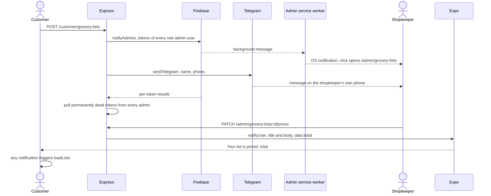

# Notifications

Telling somebody that something happened, when they are not looking at the
screen. Three separate channels, none of which share any code: Expo push to the
customer's phone when the shop moves their order along, Firebase web push to the
shop's browser when a customer sends a list, and a Telegram message to the
shopkeeper's own phone for the same event — because the laptop at the counter is
often closed. Every channel is best-effort and silent on failure: a notification
is a side-effect of somebody else's request and must never turn it into an
error.

## Capabilities

- Pushes to the customer over Expo (`utils/push.ts`). `notifyUser(userId, …)`
  reads `users.pushTokens`, and `sendPushNotifications` posts one batch to
  `https://exp.host/--/api/v2/push/send` with `sound: "default"`.
- Filters and de-duplicates tokens before sending: anything not starting
  `ExponentPushToken[` or `ExpoPushToken[` is dropped, because Expo rejects a
  whole batch for one malformed address. With nothing valid left there is no
  network traffic at all.
- Sends six distinct customer notifications, all from
  `routes/admin/grocery-list.routes.ts`: `"Your list is priced"` with the code
  and total; `"Order #CODE"` with per-status wording from `statusNotification`;
  `"Payment received"`; `"Item not available · #CODE"`; `"Item added · #CODE"`;
  and `"Message from the shop · #CODE"` carrying the message text as the body.
- Attaches `{ listId, type? }` as the notification's `data`, which is what
  routes a tap to the right order.
- Registers a device once per session (`use-push-notifications.ts`): only when
  signed in, only when the registry does not already hold a token, then
  `POST /customer/push-token` with `$addToSet` onto `users.pushTokens`.
- Refreshes the customer's lists whenever a notification arrives **or** is
  tapped, because a notification means the shop changed something.
- Hands the token back before signing out (`push/registry.ts`
  `releasePushToken` → `DELETE /customer/push-token`, `$pull`). The token lives
  in a module variable rather than a ref, because sign-out runs from a screen
  that is about to unmount.
- Pushes to the shop's browser over FCM (`utils/webPush.ts`). `notifyAdmins`
  collects `webPushTokens` from every user with `role: "admin"`, sends one
  multicast with a fixed icon and a click target of `/admin/grocery-lists`, and
  then `$pull`s any token FCM reported as permanently dead from **every** admin
  record.
- Initialises Firebase Admin lazily from `FIREBASE_PROJECT_ID`,
  `FIREBASE_CLIENT_EMAIL` and `FIREBASE_PRIVATE_KEY` (literal `\n` converted
  to newlines), caching `null` when they are not all set so an unconfigured
  server does not re-check on every order.
- Registers the shop's browser through `useAdminPush`, which registers
  `public/firebase-messaging-sw.js` with the public Firebase config passed in
  the registration query string, asks permission, gets an FCM token and
  `POST`s it to `/admin/push-token`.
- Turns a foreground FCM message into a toast, and a background one into an OS
  notification whose click focuses an open `/admin` tab or opens
  `/admin/grocery-lists`, collapsed under the tag `skirana-order`.
- Sends Telegram alerts (`utils/telegram.ts`) with `parse_mode: "HTML"` to
  every comma-separated id in `TELEGRAM_CHAT_ID`, one message per chat, each
  swallowing its own failure so one bad id does not stop the others.
- Alerts the shop twice on a send, from
  `routes/customer/grocery-list.routes.ts`: `notifyAdmins("New grocery list",
  …)` or `("List updated", …)`, and a Telegram message carrying the customer's
  name, phone and the order code.
- Shows a banner and plays a sound even when the app is already in the
  foreground (`Notifications.setNotificationHandler` in `mobile/src/lib/push.ts`),
  and creates Android's `default` channel before the first notification
  arrives.

## Boundary

- Does not decide when to notify. The events, the wording and the
  `statusNotification` table live with the order rules in
  [grocery lists](grocery-lists.md); this module is the delivery.
- Does not own the in-page "new order" chime. The beep, the flashing tab title
  and the toast are `lib/order-alert.ts`, driven by the 15-second poll — no
  Firebase, no permission, works only while the tab is open. That belongs to
  [admin panel](admin-panel.md).
- Does not own the `users` record. Tokens are arrays on it, but creating and
  finding the record belongs to [accounts and auth](accounts-and-auth.md).
- Does not notify for photo reads, catalogue edits, banner changes or promo
  changes. Nothing in those paths calls any function here.
- Does not tell the shop that a customer removed an item, or that an online
  payment was confirmed. Neither route sends anything.
- Does not own the OTA or Play Store prompts, which are in-app dialogs, not
  notifications: see [mobile shell](mobile-shell.md).

## What it needs

| File | What it is |
|---|---|
| [`server/src/utils/push.ts`](../reference/server-support/utils-push.md) | Expo push: token validation, the batch send, `notifyUser` |
| [`server/src/utils/webPush.ts`](../reference/server-support/utils-web-push.md) | FCM web push, lazy Firebase Admin, dead-token pruning |
| [`server/src/utils/telegram.ts`](../reference/server-support/utils-telegram.md) | The shopkeeper's out-of-band alert |
| [`server/src/routes/customer/push-token.routes.ts`](../reference/server-routes-customer/routes-customer-push-token-routes.md) | Register and unregister a customer device |
| [`server/src/routes/admin/push-token.routes.ts`](../reference/server-routes-admin/routes-admin-push-token-routes.md) | Register and unregister an admin browser |
| [`server/src/models/User.ts`](../reference/server-models/models-user.md) | `pushTokens` and `webPushTokens` — there is no token collection |
| [`mobile/src/lib/push.ts`](../reference/mobile-lib/lib-push.md) | Permission, Expo token, Android channel, foreground handler |
| [`mobile/src/features/customer/push/use-push-notifications.ts`](../reference/mobile-features/features-customer-push-use-push-notifications.md) | Register once per session; refresh lists on any notification |
| [`mobile/src/features/customer/push/registry.ts`](../reference/mobile-features/features-customer-push-registry.md) | The module-level token, and handing it back at sign-out |
| [`mobile/src/features/customer/push/api.ts`](../reference/mobile-features/features-customer-push-api.md) | `savePushToken` and `removePushToken` |
| [`client/src/lib/firebase.ts`](../reference/admin-lib/lib-firebase.md) | FCM setup, `isPushConfigured`, foreground messages |
| [`client/src/features/admin/notifications/use-admin-push.ts`](../reference/admin-features/features-admin-notifications-use-admin-push.md) | Service worker, permission, token registration |
| [`client/src/components/admin/AdminPushBell.tsx`](../reference/admin-components/components-admin-admin-push-bell.md) | The header bell, which renders nothing when push is unconfigured |
| `client/public/firebase-messaging-sw.js` | The background handler; plain JavaScript outside the TypeScript sources, so the reference has no page for it |

Collections read or written: `users.pushTokens` and `users.webPushTokens`
(`$addToSet` and `$pull` only).

External services called: Expo's push API, Firebase Cloud Messaging through
`firebase-admin`, and the Telegram Bot API.

## How it behaves

Rules that are not obvious from the code:

- **Everything here is awaited at the call site**, because Vercel freezes the
  function the moment the response is written and an un-awaited push would be
  killed mid-flight. None of these functions throws, so awaiting cannot fail
  the customer's request.
- **Expo's per-ticket results are not inspected**, so a token Expo has since
  retired stays on the user record for ever. Only a thrown network error is
  logged. FCM is the opposite: dead tokens are pruned automatically.
- **Dead FCM tokens are pulled from every admin, not just the one they came
  from.** With one shop that is correct and cheap; with several shops it would
  be wrong.
- **Both `DELETE` push-token endpoints read the token from a JSON request
  body.** axios sends it; many HTTP clients, proxies and `fetch`
  implementations drop a DELETE body, and such a caller gets
  400 `"Push token is required"`.
- **There is no `pushtokens` collection.** Both kinds of token are plain string
  arrays on `users`.
- **Push is registered only after sign-in**, so the OS permission dialog is
  never the first thing a new customer sees.
- **The shop has two independent alerts for a new order** — FCM push and the
  in-page chime from the 15-second poll — and both can fire for the same order.

## Failure modes

**The shop's browser never gets a notification.** The most likely cause is that
nobody is registered: as documented in DATA-MODEL.md, the live `users`
collection had **zero** `webPushTokens` when it was last read, so
`notifyAdmins` returns before sending anything. Check
`users.find({ role: "admin" }, "webPushTokens")` first. After that, check that
all six `VITE_FIREBASE_*` values are present in the deployed admin bundle.

**The notification bell is missing from the admin header, with no error.** Any
missing `VITE_FIREBASE_*` value makes `isPushConfigured` false and the bell
renders `null`. Nothing is logged and nothing is shown anywhere. Note the check
tests five of the six values — `authDomain` is not tested, so a build missing
only that reports as configured and fails later. Being `VITE_` values, adding
them requires a redeploy of the admin project, not just an env edit.

**The browser notification appears without its icon.** The service worker
points `icon` and `badge` at `/icon-192.png`, and `client/public/` contains only
`favicon.svg`, `icons.svg`, `skirana-logo.png` and the worker itself — the icon
404s.

**A customer gets someone else's order alerts on a shared phone.** The previous
customer signed out without the token being handed back. `releasePushToken`
must run **before** `signOut`, because the server needs that customer's own
token to authorise the removal. If the network call fails the local record is
still cleared first, so the next customer registers their own token.

**Nothing at all reaches a customer's phone.** Registration is silent by
design: an emulator, a refused permission, Expo Go or a missing EAS project id
are all logged as `Push registration failed:` and ignored, with no toast,
because a message on every launch would be noise. Check the device console, not
the UI.

**Telegram alerts stop, or one goes missing.** Unconfigured is a silent no-op
(`TELEGRAM_BOT_TOKEN` or `TELEGRAM_CHAT_ID` missing), and every send failure is
swallowed, so there is nothing to see but the absence. One trap worth knowing:
the messages are sent with `parse_mode: "HTML"`, and the doc comment on
`sendTelegram` states that a raw `<` or `&` in customer text must be escaped by
the caller or Telegram rejects the message. The grocery allowlist strips `<`
and `>` but **keeps `&`**, and the interpolated customer name is not escaped
anywhere — so a customer whose name contains `&` is the case to test.
**Unverified:** no such message has been sent against the live API to confirm
the rejection.

**A customer is told their list was priced twice.** The pricing route sets
`priced` unconditionally, so pressing "Update prices" on an already-packed
order pushes again. See [grocery lists](grocery-lists.md).

**The customer's phone shows a notification but the list looks unchanged.**
Both listeners call `loadLists`, and a failed refresh deliberately keeps the
previous items rather than emptying the screen — so a network failure at that
moment looks like a notification about nothing.
