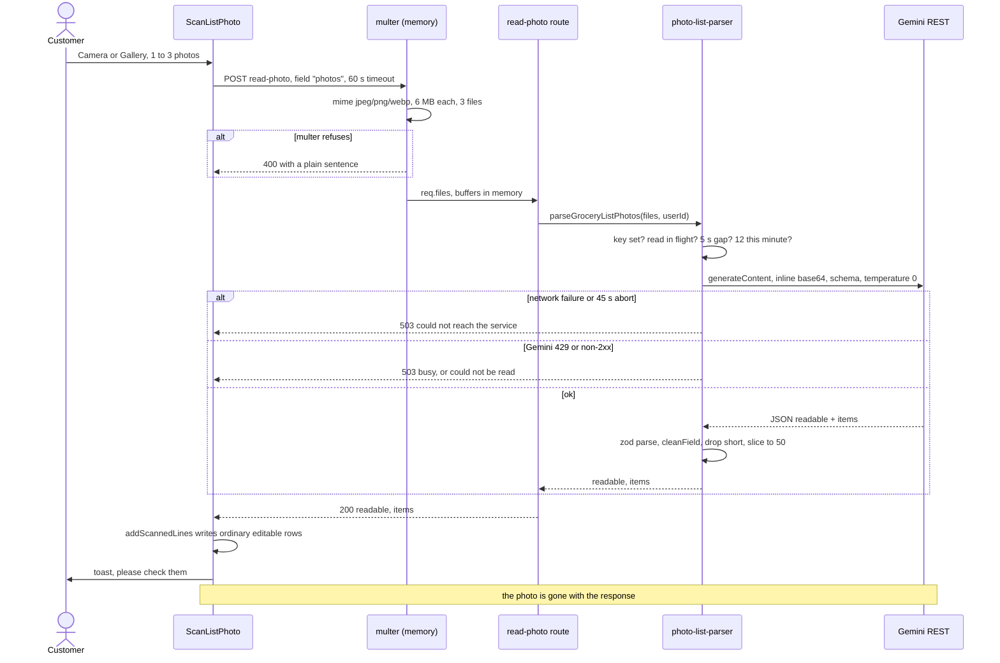

# Photo reading

Many customers already keep a shopping list on paper. This module lets them
photograph it instead of typing it out: the app sends up to three photos, the
server has a vision model read them, and the items come back as text that is
written onto the customer's ordinary editable list. The photo itself is never
stored anywhere. What the customer keeps is the text — which they can correct
before the shop ever sees it, because a misread item becomes a wrong bill.

## Capabilities

- Offers Camera or Gallery from one icon beside Send (`ScanListPhoto.tsx`),
  using `expo-image-picker` at `quality: 0.6`, `mediaTypes: ["images"]`, and
  `selectionLimit: MAX_PHOTOS_PER_SCAN` = 3 for the gallery.
- Asks for the camera permission only; the system gallery picker needs none on
  modern Android, because it hands over only the chosen photo.
- Routes a permanently denied camera permission to the OS settings
  (`Linking.openSettings`) rather than leaving the customer tapping a dead
  button — Android stops showing the dialog after one or two refusals.
- Uploads to `POST /customer/grocery-lists/read-photo` as
  `multipart/form-data` under the repeated field `photos`: 1–3 files, each at
  most `MAX_PHOTO_BYTES` = 6 MB, declared as `image/jpeg`, `image/png` or
  `image/webp`. All the photos of one list go in a single request, so a list
  that runs onto a second page is read as one list and costs one quota unit.
- Raises the client timeout for this one call to
  `READ_PHOTO_TIMEOUT_MS` = 60 s (`grocery-list/api.ts`), three times the app's
  20 s default.
- Holds the bytes in memory only (`multer.memoryStorage`), and translates
  multer's own limit errors into plain 400s in `acceptPhotos` — "Each photo
  must be under 6 MB" for `LIMIT_FILE_SIZE`, "Send at most 3 photos at a time"
  for everything else.
- Calls Google Gemini over plain REST, no SDK:
  `POST {model}:generateContent` with `x-goog-api-key`, the images
  base64-encoded inline, `temperature: 0`, a fixed `SYSTEM_INSTRUCTION` and an
  OpenAPI `responseSchema` so the reply is JSON of a known shape. Model is
  `GEMINI_MODEL` or `gemini-3.6-flash`.
- Instructs the model to keep the customer's own script and wording, never to
  translate, never to invent items, and to ignore prices, totals, phone numbers
  and doodles.
- Brakes three ways, all in `photo-list-parser.ts`: one read at a time per
  customer (`readingNow`), a `USER_GAP_MS` = 5 s gap measured from when the
  previous read **finished**, and a whole-server ceiling of
  `GLOBAL_LIMIT_PER_MIN` = 12 reads per rolling minute. `finishedAtByUser` is
  pruned once it passes 500 entries.
- Abandons the model call after `MODEL_TIMEOUT_MS` = 45 s via
  `AbortSignal.timeout`.
- Validates the model's output with a zod schema capped at 200 items, then puts
  every name and quantity through the **same** `cleanField` allowlist as
  hand-typed items, drops rows under `MIN_NAME_LEN` = 2 characters, and slices
  to `MAX_ITEMS_PER_SUBMIT` = 50.
- Returns `readable` as `parsed.readable && items.length > 0`, so an unreadable
  photo is HTTP **200** with `{ readable: false, items: [] }`, not an error.
- Writes the result into the draft with `addScannedLines`, which does not
  duplicate an item already on the list — it fills in a missing quantity and
  otherwise leaves the line alone — and returns the count of **new** lines for
  the toast.
- Always toasts "please check them" on success, because this is the one moment
  when fixing a misread costs nothing.
- Logs one line per successful read with model, photo count, item count,
  `readable` and elapsed milliseconds, prefixed `[photo-parser]`.

## Boundary

- Does not create or change any list. The endpoint writes nothing: the items
  are a suggestion until the customer sends them through
  [grocery lists](grocery-lists.md).
- Does not store, upload or reference the image. Nothing reaches Cloudinary and
  no field on `grocerylists` points at a photo; picture storage belongs to
  [images](images.md), which this module never touches.
- Does not own the allowlist or the length caps. Those live in
  `utils/sanitizeItem.ts` and belong to [grocery lists](grocery-lists.md); this
  module reuses them so the model's text is cleaned exactly like typed text.
- Does not authenticate the caller. `requireAuth` and the DB user lookup belong
  to [accounts and auth](accounts-and-auth.md); this module only uses the
  resolved user id as the brake key.
- Does not notify anybody. Reading a photo sends no push and no Telegram
  message; see [notifications](notifications.md).
- Does not read product photos for the catalogue, and has nothing to do with
  the admin image picker.

## What it needs

| File | What it is |
|---|---|
| [`mobile/src/components/ScanListPhoto.tsx`](../reference/mobile-components/components-scan-list-photo.md) | The camera icon: pick, permission, upload, write the lines |
| [`mobile/src/features/customer/grocery-list/api.ts`](../reference/mobile-features/features-customer-grocery-list-api.md) | `readListPhotos` — the multipart body and the 60 s timeout |
| [`mobile/src/features/customer/draft-list/store.ts`](../reference/mobile-features/features-customer-draft-list-store.md) | `addScannedLines` and `MAX_PHOTOS_PER_SCAN` |
| [`server/src/routes/customer/grocery-list.routes.ts`](../reference/server-routes-customer/routes-customer-grocery-list-routes.md) | The `read-photo` route, its multer config and `acceptPhotos` |
| [`server/src/services/photo-list-parser.ts`](../reference/server-services/services-photo-list-parser.md) | Admission control, the model call, zod validation, sanitising |
| [`server/src/utils/sanitizeItem.ts`](../reference/server-support/utils-sanitize-item.md) | `cleanField` and the caps reused on the model's output |
| [`server/src/utils/AppError.ts`](../reference/server-support/utils-app-error.md) | The 429 and 503 messages the customer actually reads |

Collections read or written: **none by this module**. It resolves the caller's
`users` record only to key the per-customer brake.

External services called: Google Gemini (`generativelanguage.googleapis.com`),
configured by `GEMINI_API_KEY` and optionally `GEMINI_MODEL`.

## How it behaves

Rules that are not obvious from the code:

- **The five-second gap is measured from the end of the previous read, not the
  start.** A read takes roughly ten seconds, so a start-relative gap would
  already have elapsed by the time the customer could tap again, and would
  brake nothing.
- **The brakes are per process.** Vercel runs several instances, each with its
  own copy of the counters, so the effective ceiling is 12 multiplied by the
  number of instances. The code says so itself: a brake on cost, never a
  security boundary.
- **Every Gemini failure becomes a 503 with a customer-facing sentence**, and
  the real cause — HTTP status, Gemini's body, unusable output — is logged
  truncated to 300 characters. The asymmetry is deliberate.
- **`readable: false` is a success.** A caller must check the flag, not the
  status code.
- **The MIME check reads the declared content type, not the bytes.** A renamed
  file with a forged type passes the filter and is refused by Gemini instead.
- **Scanned lines are ordinary lines.** Nothing marks a row as having come from
  a photo, and `confidence` is returned by the API but not persisted anywhere —
  the correction step is the customer's, not the app's.

## Failure modes

**"Reading photos isn't switched on yet. Please type the items instead."**
`GEMINI_API_KEY` is unset on the server project. This is the only 503 that
does not mean a transient problem; adding the variable needs a redeploy.

**"Just a moment before the next photo." / "Your photo is still being read."**
The per-customer brakes. Normal after an impatient double tap. If a customer
reports being stuck on this, remember the counters are per instance and reset
with the instance — it cannot persist.

**"A lot of lists are being read right now."** Twelve reads landed on one
instance inside a minute. Raising `GLOBAL_LIMIT_PER_MIN` spends Gemini free-tier
quota (roughly 10–15 requests a minute) faster than it recovers.

**Every read times out.** The route allows Gemini 45 s and the app waits 60 s,
but a Vercel function's Max Duration defaults to well under that. If reads fail
with a platform 504 rather than a 503 envelope, the duration is the cause —
raise it on the server project. There is no `vercel.json` for the server, so
the setting lives only in the dashboard.

**A large photo fails before any of our messages appear.** Vercel caps a
request body at about 4.5 MB, below the route's own 6 MB per-photo limit, and
rejects it at the edge with an HTML 413 that carries no CORS headers. "Each
photo must be under 6 MB" can therefore never fire in production for a single
large photo, and three 2 MB photos also exceed the platform cap. The app picks
at `quality: 0.6`, which is what normally keeps it under.

**The reader returns nothing for a list that is clearly legible.** Check the
`[photo-parser]` log line: if `items` is far below what is on the paper, the
allowlist may be stripping the writing — `cleanField` keeps letters of any
script, combining marks, digits and a short punctuation set, and removes
everything else. If `readable` was true but `items` is 0, every row was under
two characters after cleaning.

**"The photo could not be read just now."** Two different causes share this
sentence: a non-2xx from Gemini, and output that failed zod validation. Only
the log distinguishes them.

**The camera button does nothing on Android.** The permission was refused
permanently, so the OS no longer shows a dialog. The code detects this via
`canAskAgain` and offers Settings; if the alert does not appear either, the
picker itself threw and the toast is the generic "something went wrong".
