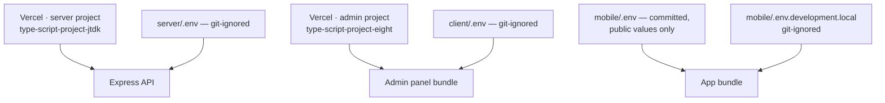
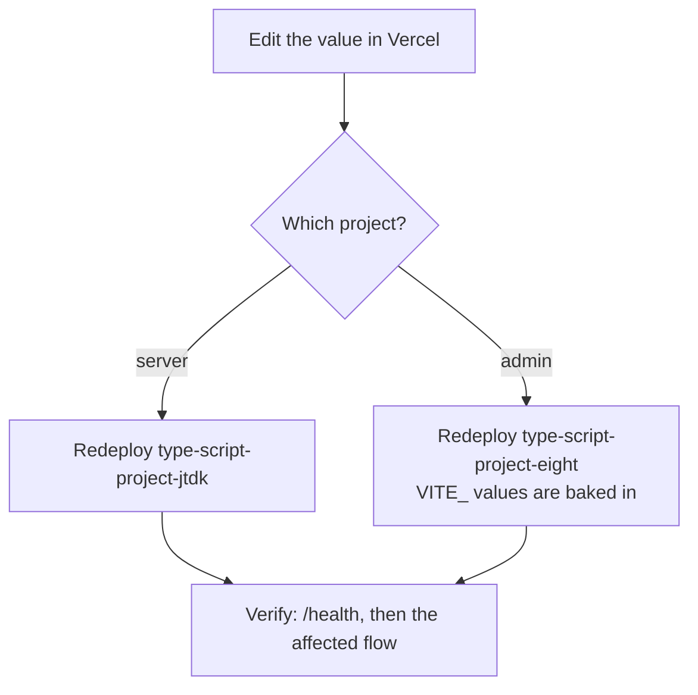

# Configuration

Every environment variable this system reads, what holds it, what it does, and
what happens when it is missing or wrong.

!!! danger "Names only"
    No value appears on this page, and none ever should. Secrets live in three
    places: Vercel's two projects, and the local env files on a developer's own
    machine. Never commit one, never paste one into a chat, never put one in a
    screenshot.

    If a secret key leaks: issue a new one at the provider, set it in Vercel,
    **redeploy**, then delete the old one — in that order.

The lists below are every variable actually read by the code, found with
`grep -rho "process\.env\.[A-Z_]*" server/src` and the `import.meta.env` and
`EXPO_PUBLIC_` equivalents. If you add one, add it here.

## Where each set lives

Three rules that have each cost time once:

- **A Vercel value applies only after a redeploy of that project.** Saving it
  changes nothing on its own.
- **`VITE_` values are baked into the bundle at build time.** Nothing reads
  them at runtime, so a change needs a rebuild, not a restart.
- **`EXPO_PUBLIC_` values are baked in at export time.** They cannot change on
  a running phone.

---

## Server — Vercel project `type-script-project-jtdk`

Read directly by the code unless noted.

| Name | Does | Missing or wrong |
|---|---|---|
| `MONGO_URI` | The Atlas connection string. `connectDB()` is awaited before the listener opens. | **The process exits with code 1.** The server never accepts traffic without a database. |
| `RAZORPAY_KEY_ID` | Publishable Razorpay key; also returned to the client to open the checkout sheet | **The server does not boot.** `utils/razorpay` builds its client at module scope and throws `Missing env: RAZORPAY_KEY_ID` — this stops everything, not just the payment routes. |
| `RAZORPAY_KEY_SECRET` | Signs and verifies payments | As above, and a wrong value makes every signature verification fail with "Invalid payment signature" |
| `CLERK_SECRET_KEY` | Verifies tokens and calls Clerk's API. Read by `@clerk/express`, not by our code. | Every signed-in route answers 401; `syncDbUser` cannot read identities |
| `CLERK_PUBLISHABLE_KEY` | The instance's public key. Read by the Clerk SDK. | Token verification fails |
| `CORS_ORIGINS` | Comma-separated exact allowlist of browser origins. Defaults to `http://localhost:3000`. | The admin panel shows **"Couldn't reach the shop server"** with the message `"Network Error"`. No server-side error and nothing in the logs. Must list the `www.` form as well; matching is exact on scheme, host and port, no wildcards, no trailing slash. |
| `ADMIN_EMAILS` | Comma-separated, lowercased. Grants the admin role during `POST /auth/sync`. Read fresh on every call. | Nobody can reach the panel — "Admin access only". It **only ever grants**; removing an email does not demote an existing admin. |
| `CLOUDINARY_CLOUD_NAME` | The delivery and upload account | Uploads fail. Existing image URLs keep working — they are absolute. |
| `CLOUDINARY_API_KEY` | Upload and delete authentication | Uploads and deletions fail |
| `CLOUDINARY_API_SECRET` | As above | As above |
| `GEMINI_API_KEY` | Reads photographs of handwritten lists | The endpoint answers **503 "Reading photos isn't switched on yet. Please type the items instead."** Nothing else breaks; customers type. |
| `GEMINI_MODEL` | Overrides the model id | Falls back to the built-in default. A wrong id fails every read with a generic 503. |
| `SHOP_NAME` | The name shown beside the UPI payee. Defaults to `"sKirana"`. | The default |
| `SHOP_UPI_ID` | The shop's UPI address, handed to the app | The id comes back as an empty string and the app is expected to hide the UPI option rather than build a broken deep link |
| `TELEGRAM_BOT_TOKEN` | The bot that alerts the shopkeeper's phone | Silent no-op. No order alerts on Telegram; everything else works. |
| `TELEGRAM_CHAT_ID` | One or more chat ids, comma-separated | Silent no-op. One bad id does not stop the others. |
| `FIREBASE_PROJECT_ID` | Admin browser push (FCM) | **Silent** no-op, cached after the first check. Nothing is logged and nothing throws. |
| `FIREBASE_CLIENT_EMAIL` | Service-account identity | As above |
| `FIREBASE_PRIVATE_KEY` | Service-account key. Stored with literal `\n`, converted to real newlines at load. | As above. A key stored with real newlines, or with the escaping mangled, fails at initialisation. |
| `APP_LATEST_VERSION` | The version now live on Play, returned by `GET /app-version` | Empty is the **quiet** case: the app has nothing to compare against and shows no prompt. Set too early, it prompts people to fetch a version they cannot get yet. |
| `APP_MIN_VERSION` | Below this the app's update dialog is **mandatory**, with no "Later" | Empty means no mandatory prompt. Set wrongly high, it locks people out of a working app. |
| `ANDROID_PACKAGE` | The package the update prompt opens. Defaults to `com.skirana.app`. | The default |
| `PORT` | Local listen port. Defaults to 5000. | The default. Vercel sets its own. |

---

## Admin panel — Vercel project `type-script-project-eight`

Every one is substituted textually into the bundle at build time.

| Name | Does | Missing or wrong |
|---|---|---|
| `VITE_BACKEND_URL` | The API base URL | Falls back to `http://localhost:5000` **silently, with no warning**, so a production build calls a machine that is not there and every request fails |
| `VITE_CLERK_PUBLISHABLE_KEY` | Clerk for the panel | A blank page with no requests. Must be from the same Clerk instance as the server's keys. |
| `VITE_FIREBASE_API_KEY` | Browser push | The bell renders nothing |
| `VITE_FIREBASE_AUTH_DOMAIN` | Browser push | **`isPushConfigured()` does not test this one.** A build missing only `authDomain` reports itself configured and then fails later. |
| `VITE_FIREBASE_PROJECT_ID` | Browser push | The bell renders nothing |
| `VITE_FIREBASE_MESSAGING_SENDER_ID` | Browser push | The bell renders nothing |
| `VITE_FIREBASE_APP_ID` | Browser push | The bell renders nothing |
| `VITE_FIREBASE_VAPID_KEY` | Web-push subscription key | The bell renders nothing |

`client/.env` locally defines only `VITE_BACKEND_URL` and
`VITE_CLERK_PUBLISHABLE_KEY`, so **browser push does not work in local
development** — the bell simply is not there, with no message.

---

## Mobile app

Only the `EXPO_PUBLIC_` prefix reaches the bundle. `mobile/.env` **is
committed** and holds public production values.

| Name | Does | Missing or wrong |
|---|---|---|
| `EXPO_PUBLIC_BACKEND_URL` | The API base URL | Falls back to `http://localhost:5000`. A release built without it starts and then fails every request, rather than refusing to start — deliberately. On a phone, `localhost` means the phone. |
| `EXPO_PUBLIC_CLERK_PUBLISHABLE_KEY` | Clerk for the app | Falls back to `""`, which Clerk rejects at startup. A production bundle must carry a `pk_live_` key. |
| `EXPO_PUBLIC_SHOP_WHATSAPP` | The shop's WhatsApp number in international form | Unset hides the Help row on the Account screen. Not set in `mobile/.env`. |

There is **no validation** in `mobile/src/lib/env.ts` — only `??` defaults. The
real guard is `mobile/scripts/preflight-ota.cjs`, which refuses to publish an
OTA unless the resolved Clerk key starts with `pk_live_`.

!!! danger "`.env.development.local`, never `.env.local`"
    Expo reads `.env.local` **before** `.env`, even for a production bundle. A
    test key there ships to every customer, and it has happened once. Test keys
    belong in `mobile/.env.development.local`, which is git-ignored.

---

## Which variable belongs to which deployment

| Concern | Server project | Admin project | Mobile |
|---|---|---|---|
| Database | `MONGO_URI` | — | — |
| Auth | `CLERK_SECRET_KEY`, `CLERK_PUBLISHABLE_KEY`, `ADMIN_EMAILS` | `VITE_CLERK_PUBLISHABLE_KEY` | `EXPO_PUBLIC_CLERK_PUBLISHABLE_KEY` |
| Where the API is | `CORS_ORIGINS` (the other direction) | `VITE_BACKEND_URL` | `EXPO_PUBLIC_BACKEND_URL` |
| Images | `CLOUDINARY_CLOUD_NAME`, `CLOUDINARY_API_KEY`, `CLOUDINARY_API_SECRET` | — | — |
| Photo reading | `GEMINI_API_KEY`, `GEMINI_MODEL` | — | — |
| Shop alerts | `TELEGRAM_BOT_TOKEN`, `TELEGRAM_CHAT_ID`, `FIREBASE_PROJECT_ID`, `FIREBASE_CLIENT_EMAIL`, `FIREBASE_PRIVATE_KEY` | `VITE_FIREBASE_API_KEY`, `VITE_FIREBASE_AUTH_DOMAIN`, `VITE_FIREBASE_PROJECT_ID`, `VITE_FIREBASE_MESSAGING_SENDER_ID`, `VITE_FIREBASE_APP_ID`, `VITE_FIREBASE_VAPID_KEY` | — |
| Customer alerts | — (Expo needs no key) | — | — |
| Payment | `RAZORPAY_KEY_ID`, `RAZORPAY_KEY_SECRET`, `SHOP_UPI_ID`, `SHOP_NAME` | — | — |
| Update prompt | `APP_LATEST_VERSION`, `APP_MIN_VERSION`, `ANDROID_PACKAGE` | — | — |
| Help link | — | — | `EXPO_PUBLIC_SHOP_WHATSAPP` |

**Clerk keys must be switched together.** App, panel and server all have to
come from the same instance, and a key change in the app means bumping the app
version in the same commit — an OTA only reaches installs of the same version.

## Changing a value, safely

For a mobile value: edit the env file, **bump `version` in `app.json` if the
Clerk key changed**, and build or publish. There is no way to change a value on
an installed app without shipping.

## Related

- The one-time setup of the domain, Clerk and Google sign-in:
  `PRODUCTION-SETUP.md`.
- What happens when a provider's free allowance runs out:
  [Limits](limits.md).
