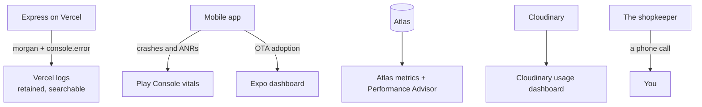

# Monitoring

What can be watched, where, and what cannot.

!!! warning "There is no error tracking"
    No Sentry, no Crashlytics, no Bugsnag, no Datadog, no analytics of any
    kind. Verified by search across `server/src`, `client/src` and
    `mobile/src`: the only matches for "analytics" in the whole codebase are
    the legal pages, saying there are none.

    The practical consequence: **a server exception exists only as a line in
    Vercel's log stream, and a mobile crash exists only in Play Console's
    aggregate vitals.** Nobody is paged. Nobody is emailed. If the shopkeeper
    does not ring, you do not know.

    What it would take to change that is at the [bottom of this page](#adding-error-tracking).

## What exists today



---

## Vercel logs

**Where** Vercel → the project → Logs. Two projects:
`type-script-project-jtdk` (the API) and `type-script-project-eight` (the panel
and homepage). The API one is the useful one.

**What is in there**

| Source | Line |
|---|---|
| `morgan("dev")` | One line per request: method, path, status, duration |
| `errorhandler` | The literal string `error` followed by the full stack, for anything that was **not** an `AppError` |
| `user-sync` | `[user-sync] re-linked user <id> from <old> to <new>` |
| `push.ts` | `Failed to send push notification` / `Failed to notify user` |
| `photo-list-parser` | One line per successful read |

**What is not**

- An `AppError` is **not** logged. It is a handled outcome — a 400 or a 404 —
  and it goes to the caller, not to the log. A rise in 400s is invisible unless
  you read the morgan lines.
- Request and response **bodies** are never logged.
- `webPush.ts` logs **nothing** when Firebase is unconfigured. It caches the
  null app and no-ops silently.

**Worth searching for**

| Search | Finds |
|---|---|
| `error` | Every unplanned throw — the 500s |
| `E11000` | A unique-index conflict, almost always the `email` index |
| `[user-sync]` | Customers re-linked after a Clerk change |
| `POST /customer/grocery-lists` | Orders arriving, and at what rate |
| `500` | The same as the first, by status code |

**Retention** is whatever the plan gives; logs are not archived anywhere else.
There is no alerting on them.

---

## Play Console vitals

**Where** Play Console → `com.skirana.app` → Quality → Android vitals.

**What to watch**

| Metric | Why here |
|---|---|
| Crash rate, per release | The only signal that a native build is bad |
| ANR rate | Slow startup and blocked main threads |
| Crashes by Android version and device | The customers are on cheap phones; a device-specific crash will not reproduce on yours |

**When it matters most** During a staged rollout. The whole point of starting
at 20 % is that the crash rate is visible before the other 80 % get it. Do not
increase the rollout without looking.

**What it will not show you** A JavaScript exception caught by an error
boundary. The `SheetContentGuard` boundary turns what used to be a black screen
into a message — which is better for the customer and means the failure never
reaches vitals. It is logged to the device console and nowhere else.

---

## Expo dashboard

**Where** expo.dev → the `mobile` project → Updates.

**What to watch**

| Thing | Why |
|---|---|
| The `production` branch's most recent update | Confirms an OTA actually published, and from which runtime version |
| Runtime version on each update | The commonest reason an OTA "did not arrive" is a runtime-version mismatch |
| Builds | Which `.aab` went to Play, and its version code |

```bash
eas update:list --branch production
```

**What it will not show you** Whether a given phone received it. There is no
per-device delivery report. An OTA applies on the **second** launch, which is
the other commonest reason for "it did not arrive".

---

## MongoDB Atlas

**Where** Atlas → the cluster → Metrics, and → Performance Advisor.

**What to watch**

| Thing | Why |
|---|---|
| Operation execution times | An M0 is shared CPU; a slow query is felt by everyone at once |
| Performance Advisor's index suggestions | This is how the missing `Product` indexes would have been caught |
| Storage | 512 MB. Not close, but it is a hard stop. |
| Connections | Serverless functions open connections per instance |

**One check worth doing by hand** after adding an index:

```
db.products.getIndexes()
```

A declared index exists in the database only once a process carrying that model
has connected and `autoIndex` has run. Reading the model file proves nothing.

---

## Cloudinary

**Where** Cloudinary → the `dnlqyxhpg` cloud → Dashboard.

**What to watch**

| Thing | Why |
|---|---|
| Credits used this month | 25 free. At zero, **every** product image goes blank at once. |
| The split between bandwidth, transformations and storage | Tells you which decision to revisit |
| Derivative count | A variant-width change bills a fresh derivative for every image |

**This is the least-watched number in the system.** Nothing in the code
measures it, and there is no alert. The failure mode — all images blank at once
across both clients, with URLs that still look correct — is distinctive, so at
least it is diagnosable after the fact.

---

## What nobody is watching

Stated plainly, because each of these has a real failure mode:

| Not watched | Failure it hides |
|---|---|
| Server exceptions, as they happen | A 500 is discovered when a customer complains |
| Push delivery | Every send swallows its own failure. The absence of an error proves nothing. |
| Telegram delivery | Same. A message rejected for an unescaped `<` in customer text fails silently. |
| Firebase web push configuration | A silent no-op with nothing logged |
| The admin panel's background poll | A failed poll shows **no** error and leaves stale data on screen. A server outage looks like a quiet shop. |
| Gemini spend | Only the in-process brake, which several Vercel instances each have their own copy of |
| Cloudinary credits | Nothing, until images go blank |
| Uptime | No external probe hits `/health` on a schedule |

---

## The cheapest improvements, in order {#adding-error-tracking}

Rough effort, not a plan. Each is independent.

**1. An uptime probe on `/health`** — minutes.
Any free monitor, hitting the endpoint every few minutes, alerting on a
non-200. It catches the total outage, which is the failure the shop notices
first and you notice last.

**2. Error tracking on the server** — an hour or two.
A Sentry (or equivalent) SDK initialised in `server/src/server.ts`, and the
capture call added in **one** place:
`server/src/middleware/errorhandler.ts`, in the branch that already logs
`console.error` for a non-`AppError`. That single branch is every unplanned
throw in the system — the architecture is unusually friendly to this. Add the
DSN as an environment variable on the server project and redeploy.

Decide deliberately whether to capture `AppError`s too. They are handled
outcomes, and capturing them would bury the real failures.

**3. Error tracking in the mobile app** — half a day, plus a native build.
The SDK is a native module, so it cannot ship over the air — it needs an
`eas build` and a Play release. Wire it to the existing `SheetContentGuard`
boundary so the failures that boundary already catches stop being invisible.

**4. Alerting on log patterns** — depends on the platform.
Vercel's log drains can feed a service that alerts on `E11000` and on the 500
rate.

**5. A billing alert at each provider** — minutes each.
Cloudinary, Google Cloud (Gemini) and Atlas each support one. This is the
cheapest protection against the failure that looks like a bug but is an
invoice.

## When something is wrong

Go to the [runbook](runbook.md). It is organised by symptom, and each entry
starts with the evidence to collect before changing anything.
